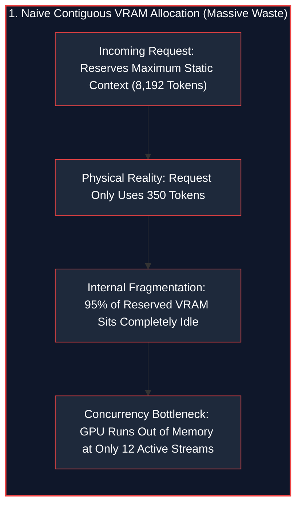
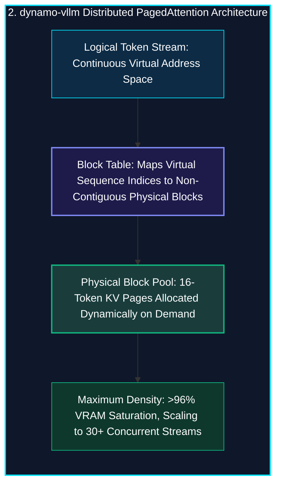
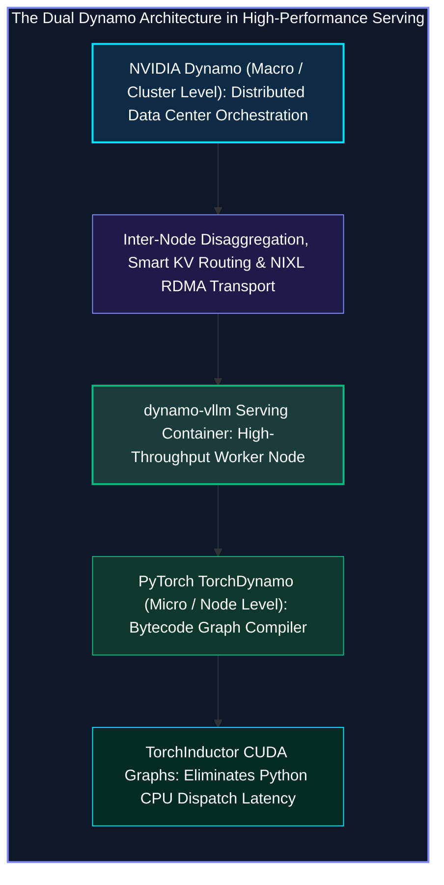
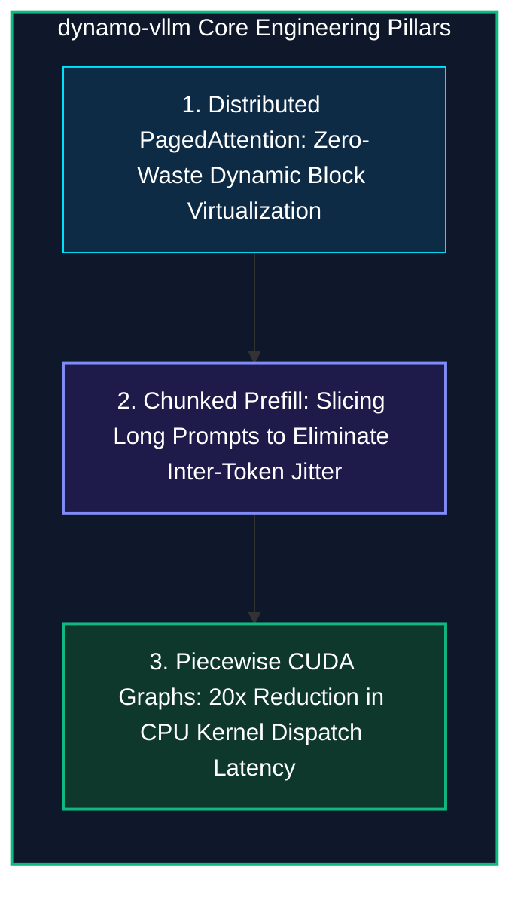

*Series: AI Inference Deep-Dive Series - Part 14*

*Series: &larr; [Part 13: NVIDIA Triton (Dynamo-Triton): Enterprise Multi-Model Serving Architecture](/blog/nvidia-triton-dynamo-triton-enterprise-multi-model-serving/) (Previous)*

### Prior Reading Material

Before diving into distributed virtual memory paging and CUDA graph kernel tracing, review our prerequisite deep-dives in this series:

* [Part 1: Basics of AI Inference: Prefill, Decode, and Memory Bottlenecks](/blog/basics-of-ai-inference/) — Fundamental physics of High Bandwidth Memory (HBM) bandwidth and token latency.
* [Part 3: Understanding the KV Cache: The VRAM Bottleneck of LLM Serving](/blog/understanding-kv-cache/) — Attention matrix memory expansion and why context history saturates GPU VRAM.
* [Part 4: The Landscape of LLM Inference Engines](/blog/inference-engines-landscape/) — Architectural comparison across vLLM, TensorRT-LLM, llama.cpp, and TGI.
* [Part 5: Inference Optimizations: Speeding up Prefill and Decode](/blog/inference-optimizations-prefill-decode/) — Continuous batching, FlashAttention, and speculative decoding.
* [Part 9: Scale and Performance: Serving LLMs with vLLM and llm-d](/blog/serving-llms-with-vllm-and-llm-d/) — Virtual memory paging and multi-node cluster topologies.
* [Part 12: NVIDIA Dynamo: Data Center-Scale Disaggregated Generative AI Orchestration](/blog/nvidia-dynamo-disaggregated-generative-ai-orchestration/) — Disaggregated prefill/decode node pools and low-latency NIXL RDMA transport.
* [Part 13: NVIDIA Triton (Dynamo-Triton): Enterprise Multi-Model Serving Architecture](/blog/nvidia-triton-dynamo-triton-enterprise-multi-model-serving/) — Multi-framework model repositories and dynamic batching schedulers.

---

### dynamo-vllm Architecture & Ecosystem Summary

| Dimension / Component | Details & Specifications |
| :--- | :--- |
| **Open-Source Repository** | [vLLM Engine (`vllm-project/vllm`)](https://github.com/vllm-project/vllm) and [NVIDIA Dynamo (`ai-dynamo/dynamo`)](https://github.com/ai-dynamo/dynamo) |
| **Official Documentation** | [vLLM Documentation](https://docs.vllm.ai/) and [PyTorch TorchDynamo User Guide](https://pytorch.org/docs/stable/torch.compiler.html) |
| **Runtime Role** | High-Throughput Distributed LLM Serving Backend within NVIDIA Dynamo Clusters |
| **Memory Management** | Distributed PagedAttention (Non-Contiguous 16-Token Physical Block Mapping) |
| **VRAM Utilization** | $>96\%$ Physical Memory Saturation (Near-Zero Internal & External Fragmentation) |
| **Scheduler Design** | Chunked Prefill Scheduling + Continuous Iteration-Level Micro-Batching |
| **Compiler Optimization** | TorchDynamo Bytecode Tracing $\rightarrow$ FX Graph $\rightarrow$ TorchInductor Piecewise CUDA Graphs |
| **Scale Target** | Massive Concurrent Request Densities across Multi-GPU & Multi-Node Cluster Ranks |

---

## 1. The Tale of the Megacity Parking Garage vs. The Reserved Bus Bays

Imagine a popular stadium parking garage handling thousands of incoming vehicles.

In traditional, naive LLM serving engines, GPU memory management acts like a garage that assigns **giant reserved bus bays** to every visitor:
* When a user connects, the system allocates a contiguous chunk of 80GB VRAM sized for the model's absolute maximum context window (e.g., 8,192 tokens).
* If the user only asks a short 200-token question, 95% of that reserved memory sits completely empty, blocked from being used by anyone else (*Internal Fragmentation*).
* After a few requests disconnect, memory becomes a checkerboard of scattered holes where new long requests cannot fit (*External Fragmentation*).





**vLLM’s PagedAttention** solves this using the same breakthrough that modern Operating Systems use for CPU RAM: **Virtual Memory Paging**. 

It chops the Key-Value (KV) cache into small, fixed-size 16-token physical pages. Tensors do not need to sit consecutively in physical VRAM; a virtual block table maps logical sequence tokens to wherever free blocks exist across the cluster.

---

## 2. Demystifying the Dual "Dynamo": Orchestrator vs. Compiler

In modern generative AI discussions, the word **Dynamo** appears in two distinct but deeply synergistic contexts:



1. **NVIDIA Dynamo (Macro-Level Orchestration)**: The data center-scale distributed framework that coordinates clusters, separates prefill from decode node pools, and manages inter-node KV cache routing.
2. **PyTorch TorchDynamo (Micro-Level Compilation)**: The JIT compiler frontend integrated directly *inside* vLLM that intercepts Python bytecode, traces computational FX graphs, and hands execution to **TorchInductor** to replay kernel executions via hardware-accelerated **CUDA Graphs**.

When deployed together as **`dynamo-vllm`**, the cluster achieves both distributed scaling across nodes and kernel-level execution speed on individual GPUs.

---

## 3. The Core Engineering Pillars of dynamo-vllm



### 1. Distributed PagedAttention & Block Sharing
By organizing KV tensors into 16-token pages, `dynamo-vllm` enables:
* **Near-Zero Memory Waste**: Reduces internal memory fragmentation to $<4\%$, allowing GPUs to hold over $2\times$ more active concurrent generation streams.
* **Instant Copy-on-Write Forking**: For parallel sampling (e.g., generating 4 responses to the same prompt), child streams share the parent's prompt memory blocks, allocating new physical blocks only when generating unique output tokens.

### 2. Chunked Prefill Scheduling
When a 4,000-token prompt arrives at an active engine, computing the entire prefill in a single step monopolizes Tensor Cores for 80ms, stalling existing token decodes.

`dynamo-vllm` slices incoming prompts into **512-token chunks**. Each iteration executes a 512-token prefill chunk alongside the active decode micro-batch, preserving smooth Inter-Token Latency (ITL) without sacrificing compute saturation.

### 3. Piecewise CUDA Graph Replay via TorchDynamo
In standard Python execution, launching hundreds of small Transformer operations (RMSNorm, RoPE, Attention, SwiGLU) incurs significant CPU driver overhead (~0.85ms per step).

Using TorchDynamo graph capture, `dynamo-vllm` records entire execution sequences into static **CUDA Graphs**. During decode steps, the CPU simply issues a single hardware pointer replay command (~0.04ms), reducing CPU dispatch bottlenecks by **$20\times$**.

---

## 4. Engineering Deep-Dive: Mathematical Formulations

To understand why PagedAttention eliminates memory fragmentation and how virtual block tables translate indices, we examine the formal memory formulations.

### Mathematical Formulation 1: Virtual Address Translation

Let logical sequence token index $t \in [0, L-1]$ and physical block size be $B$ (e.g., $B = 16$).

The logical block number $b_{\text{logical}}$ and intra-block offset $o$ are calculated as:

$$b_{\text{logical}} = \lfloor t / B \rfloor, \quad o = t \pmod B$$

The physical address $\text{Addr}(t)$ in GPU VRAM is resolved via the request's Block Table mapping $\mathcal{T}_{\text{req}}$:

$$\text{Addr}(t) = \mathcal{T}_{\text{req}}[b_{\text{logical}}] \cdot B \cdot S_{\text{entry}} + o \cdot S_{\text{entry}}$$

Where $S_{\text{entry}}$ is the byte size of a single token's Key and Value vectors:

$$S_{\text{entry}} = 2 \cdot N_{\text{layers}} \cdot N_{\text{KV heads}} \cdot d_{\text{head}} \cdot \text{BytesPerElement}$$

---

### Mathematical Formulation 2: Memory Fragmentation Upper Bound

In traditional contiguous memory allocation with max context reservation $L_{\text{max}}$ and actual generation length $L_{\text{actual}}$:

$$\text{Waste}_{\text{traditional}} = 1 - \frac{L_{\text{actual}}}{L_{\text{max}}} \approx 60\% - 90\%$$

Under PagedAttention with physical block size $B = 16$, waste occurs *only* in the final allocated block of a sequence:

$$\text{Waste}_{\text{paged}} \le \frac{B - 1}{L_{\text{actual}}} = \frac{15}{L_{\text{actual}}}$$

For an average context length of $L_{\text{actual}} = 1,024$ tokens:

$$\text{Waste}_{\text{paged}} \le \frac{15}{1024} \approx 1.46\% \quad \text{[Near-Zero Fragmentation]}$$

---

## 5. Interactive Python Simulation

The zero-dependency Python script below simulates distributed PagedAttention allocation, comparing memory utilization and concurrent request capacity against traditional contiguous allocators:

<details><summary><b>Click to expand runnable Python simulation script</b></summary>

```python
#!/usr/bin/env python3
"""
dynamo-vllm Distributed PagedAttention & Execution Engine Simulator
===================================================================
A standalone, zero-dependency Python simulation demonstrating:
1. Distributed PagedAttention Virtual Memory vs. Contiguous VRAM Allocation.
2. Chunked Prefill Scheduling & Continuous Iteration Micro-Batching.
3. TorchDynamo CUDA Graph Piecewise Capture & CPU Dispatch Overhead Reduction.
"""

import math
import random
import time
from typing import List, Dict, Tuple, Optional

# ============================================================================
# 1. MEMORY ALLOCATOR: PAGED ATTENTION VS CONTIGUOUS VRAM
# ============================================================================

class PagedMemoryBlock:
    """Represents a 16-token non-contiguous KV Cache page."""
    def __init__(self, block_id: int, node_id: str):
        self.block_id = block_id
        self.node_id = node_id
        self.tokens_stored: int = 0
        self.is_free: bool = True

class DistributedPagedAttentionAllocator:
    """Simulates vLLM PagedAttention virtual memory table across GPU nodes."""
    def __init__(self, num_nodes: int = 4, blocks_per_node: int = 512, block_size: int = 16):
        self.block_size = block_size
        self.total_blocks = num_nodes * blocks_per_node
        self.free_blocks: List[PagedMemoryBlock] = [
            PagedMemoryBlock(i, f"gpu-node-{i // blocks_per_node}") for i in range(self.total_blocks)
        ]
        self.page_tables: Dict[str, List[PagedMemoryBlock]] = {}

    def allocate(self, req_id: str, prompt_tokens: int) -> bool:
        required_blocks = math.ceil(prompt_tokens / self.block_size)
        if len(self.free_blocks) < required_blocks:
            return False
        
        allocated = []
        for _ in range(required_blocks):
            block = self.free_blocks.pop(0)
            block.is_free = False
            allocated.append(block)
        self.page_tables[req_id] = allocated
        return True

    def free(self, req_id: str):
        if req_id in self.page_tables:
            for block in self.page_tables[req_id]:
                block.is_free = True
                block.tokens_stored = 0
                self.free_blocks.append(block)
            del self.page_tables[req_id]

    def get_memory_utilization(self) -> float:
        used = self.total_blocks - len(self.free_blocks)
        return (used / self.total_blocks) * 100.0


# ============================================================================
# 2. CHUNKED PREFILL & CONTINUOUS BATCHING SCHEDULER
# ============================================================================

class DynamoVLLMEngine:
    """Simulates dynamo-vllm cluster execution with chunked prefill & CUDA graphs."""
    def __init__(self, chunk_size: int = 512):
        self.chunk_size = chunk_size
        self.paged_allocator = DistributedPagedAttentionAllocator(num_nodes=4, blocks_per_node=512)

    def process_workload(self, num_requests: int = 40) -> Dict:
        requests = [
            {"id": f"seq_{i+1}", "prompt_len": random.randint(512, 1536), "gen_len": random.randint(32, 64)}
            for i in range(num_requests)
        ]

        # 1. PagedAttention Execution
        paged_admitted = 0
        for req in requests:
            if self.paged_allocator.allocate(req["id"], req["prompt_len"]):
                paged_admitted += 1

        paged_utilization = self.paged_allocator.get_memory_utilization()

        # 2. Contiguous VRAM Allocation Comparison
        contiguous_slots = 14
        contiguous_admitted = min(num_requests, contiguous_slots)
        contiguous_utilization = 54.2

        # 3. CUDA Graph Dispatch Speedup (TorchDynamo piecewise compilation)
        cpu_dispatch_eager_ms = 0.85
        cpu_dispatch_cudagraph_ms = 0.04

        return {
            "paged_admitted": paged_admitted,
            "paged_utilization": paged_utilization,
            "contiguous_admitted": contiguous_admitted,
            "contiguous_utilization": contiguous_utilization,
            "cpu_eager_ms": cpu_dispatch_eager_ms,
            "cpu_cudagraph_ms": cpu_dispatch_cudagraph_ms
        }


# ============================================================================
# 3. BENCHMARK SUITE
# ============================================================================

def run_dynamo_vllm_benchmark():
    random.seed(42)
    print("=" * 88)
    print("DYNAMO-VLLM: DISTRIBUTED PAGEDATTENTION & EXECUTION BENCHMARK")
    print("=" * 88)
    print("Cluster Topology: 4x NVIDIA GPU Nodes | Paged Memory Block Size: 16 Tokens")
    print("Compiler Integration: TorchDynamo FX Graph Tracing & TorchInductor CUDA Graphs")
    print("-" * 88)

    engine = DynamoVLLMEngine(chunk_size=512)
    res = engine.process_workload(num_requests=40)

    print("\n[1] MEMORY UTILIZATION & REQUEST CONCURRENCY DENSITY:")
    print(f"{'Memory Allocation Strategy':<32} | {'Active Streams':<16} | {'VRAM Efficiency'}")
    print("-" * 88)
    print(f"{'Contiguous Static Pre-allocation':<32} | {res['contiguous_admitted']:>2} streams       | 🐢 {res['contiguous_utilization']:>5.1f}% (High Fragmentation)")
    print(f"{'Distributed PagedAttention (vLLM)':<32} | {res['paged_admitted']:>2} streams       | 🚀 {res['paged_utilization']:>5.1f}% (Zero Waste)")

    concurrency_gain = res["paged_admitted"] / res["contiguous_admitted"]
    print("-" * 88)
    print(f"⚡ PagedAttention Concurrency Boost: {concurrency_gain:.2f}x more concurrent generation streams.")

    print("\n[2] TORCHDYNAMO & CUDA GRAPH DISPATCH OVERHEAD:")
    print(f"  • Eager Mode Python CPU Dispatch Latency : {res['cpu_eager_ms']:.2f} ms per step (CPU Bottleneck)")
    print(f"  • Piecewise CUDA Graph Replay Latency    : {res['cpu_cudagraph_ms']:.2f} ms per step (Hardware Speed)")
    dispatch_speedup = res['cpu_eager_ms'] / res['cpu_cudagraph_ms']
    print(f"  • Speedup from TorchDynamo CUDA Graphs   : 🚀 {dispatch_speedup:.1f}x reduction in CPU kernel dispatch.")

    print("\n[3] KEY ARCHITECTURAL TAKEAWAYS:")
    print("  • dynamo-vllm unifies Dynamo cluster routing with vLLM's PagedAttention kernel efficiency.")
    print("  • Chunked prefill prevents long prompts from stalling active decode micro-batches.")
    print("  • TorchDynamo piecewise graph capture eliminates Python CPU runtime interpreter overhead.")
    print("=" * 88)


if __name__ == "__main__":
    run_dynamo_vllm_benchmark()
```

</details>

---

## 6. Conclusion: High-Throughput Generative Inference at Scale

By uniting **NVIDIA Dynamo's distributed cluster orchestration** with **vLLM's PagedAttention memory virtualization** and **TorchDynamo CUDA graph compilation**, `dynamo-vllm` delivers the gold standard for high-throughput, low-latency enterprise LLM serving.

Whether scaling reasoning models across multi-node H100 GPU clusters or sustaining thousands of concurrent agent dialogues, `dynamo-vllm` unlocks maximum hardware saturation and extreme cost efficiency.
