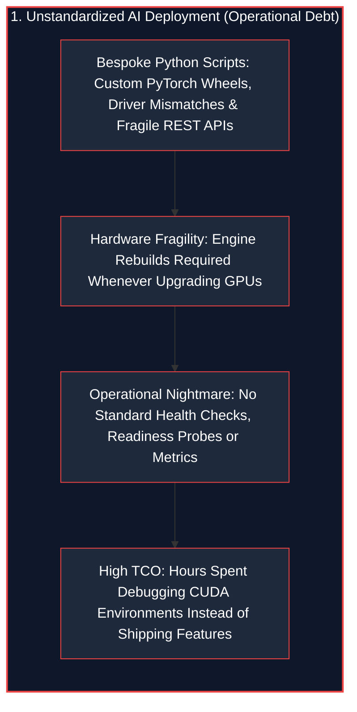
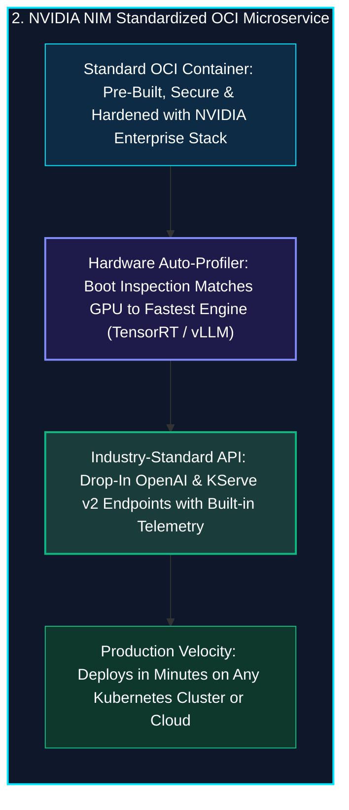
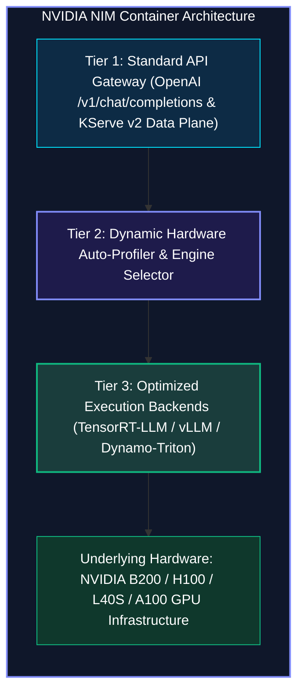
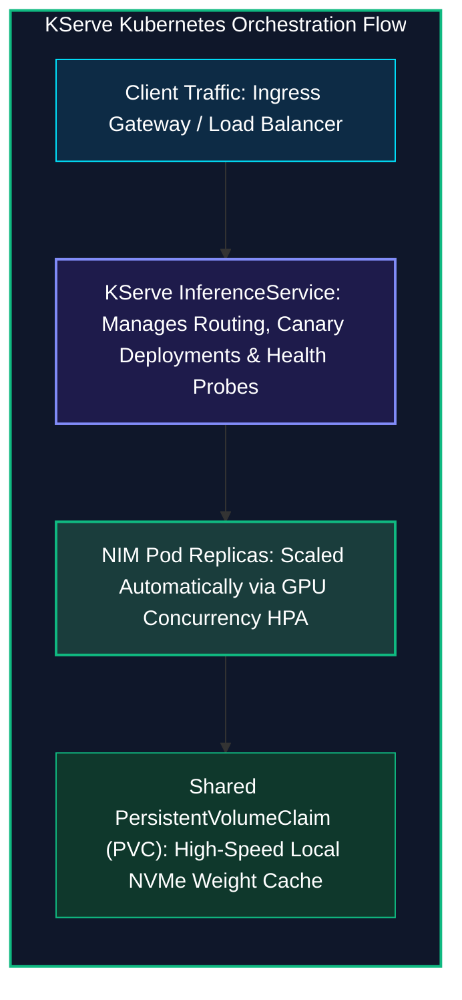

*Series: AI Inference Deep-Dive Series - Part 15*

*Series: &larr; [Part 14: dynamo-vllm: High-Throughput Distributed PagedAttention at Scale](/blog/dynamo-vllm-high-throughput-distributed-pagedattention/) (Previous)*

### Prior Reading Material

Before exploring containerized microservice architectures and Kubernetes KServe autoscaling, inspect our prerequisite deep-dives in this series:

* [Part 1: Basics of AI Inference: Prefill, Decode, and Memory Bottlenecks](/blog/basics-of-ai-inference/) — Core hardware bottlenecks and serving metrics.
* [Part 4: The Landscape of LLM Inference Engines](/blog/inference-engines-landscape/) — Contrasting TensorRT-LLM, vLLM, llama.cpp, and TGI.
* [Part 9: Scale and Performance: Serving LLMs with vLLM and llm-d](/blog/serving-llms-with-vllm-and-llm-d/) — Virtual memory paging and multi-node cluster topologies.
* [Part 12: NVIDIA Dynamo: Data Center-Scale Disaggregated Generative AI Orchestration](/blog/nvidia-dynamo-disaggregated-generative-ai-orchestration/) — Disaggregated prefill/decode node pools and low-latency NIXL RDMA transport.
* [Part 13: NVIDIA Triton (Dynamo-Triton): Enterprise Multi-Model Serving Architecture](/blog/nvidia-triton-dynamo-triton-enterprise-multi-model-serving/) — Multi-framework model repositories and dynamic batching schedulers.
* [Part 14: dynamo-vllm: High-Throughput Distributed PagedAttention at Scale](/blog/dynamo-vllm-high-throughput-distributed-pagedattention/) — Distributed PagedAttention, chunked prefill, and TorchDynamo CUDA graphs.

---

### NVIDIA NIM (Inference Microservices) Platform Summary

| Dimension / Component | Details & Specifications |
| :--- | :--- |
| **Official Documentation** | [NVIDIA NIM Developer Portal](https://developer.nvidia.com/nim) and [NVIDIA NIM Documentation](https://docs.nvidia.com/nim/) |
| **Container Registry** | [NVIDIA NGC Catalog (`catalog.ngc.nvidia.com`)](https://catalog.ngc.nvidia.com/) |
| **Container Packaging** | Standardized OCI Container Images with Built-In Engine Runtimes & Health Probes |
| **Encapsulated Runtimes** | [TensorRT-LLM](https://github.com/NVIDIA/TensorRT-LLM), [vLLM](https://github.com/vllm-project/vllm), and [Dynamo-Triton](https://developer.nvidia.com/dynamo-triton) |
| **Standard Protocol APIs** | OpenAI-Compatible (`/v1/chat/completions`, `/v1/embeddings`), [KServe v2 Data Plane](https://kserve.github.io/website/) |
| **Hardware Auto-Profiling** | Dynamic GPU architecture detection (Blackwell FP4, Hopper FP8, Ada INT8, Ampere FP16) |
| **Kubernetes Integration** | KServe `InferenceService`, `ClusterServingRuntime`, and Prometheus Metrics Exporters |
| **Storage & Caching** | PersistentVolumeClaim (PVC) local NVMe cache for sub-15s cold-start weight staging |

---

## 1. The Tale of the Bespoke Laboratory Rig vs. The Standardized Shipping Container

Before the 1950s, cargo shipping was chaotic. Barrels, sacks, and wooden crates of varying sizes had to be manually loaded by longshoremen onto cargo ships, taking days of labor. The invention of the **standardized steel intermodal shipping container** revolutionized global commerce by allowing any crane, train, or truck to transport any cargo seamlessly.

In enterprise AI, deploying large language models without containerization resembles those chaotic pre-1950s docks:
* Engineers write custom Python launch scripts with brittle CUDA driver dependencies, PyTorch wheel conflicts, and unstandardized REST endpoints.
* Moving from an NVIDIA A100 to an H100 or B200 requires manually rebuilding TensorRT engines and re-tuning compilation parameters.
* Kubernetes platform operators struggle to manage custom health checks, readiness probes, and token streaming proxies across different development teams.





**NVIDIA NIM (Inference Microservices)** provides the **standardized shipping container** for enterprise Generative AI. It packages model weights, optimized inference engines, hardware auto-profilers, and industry-standard APIs into self-contained, enterprise-grade OCI containers.

---

## 2. The 3-Tier Anatomy of an NVIDIA NIM Container

Inside every NIM container runs a sophisticated, three-tier software architecture:



### 1. Tier 1: Standard API Gateway & Streaming Proxy
Exposes standard OpenAI-compatible REST endpoints (`/v1/chat/completions`, `/v1/models`, `/v1/embeddings`) with Server-Sent Events (SSE) token streaming, alongside KServe v2 gRPC protocols and Prometheus metrics exporters (`/metrics`).

### 2. Tier 2: Dynamic Hardware Auto-Profiler
When the container boots, it queries the local GPU architecture via CUDA Driver APIs:
* **Blackwell (B200 / GB200)**: Automatically activates native **FP4 Tensor Cores** and TensorRT-LLM microscaling engines.
* **Hopper (H100 / H200)**: Automatically loads **FP8 W8A8** TensorRT-LLM optimized kernels.
* **Ada / Ampere (L40S / A100)**: Selects vLLM or AWQ/INT8 quantizations for maximum cost-performance efficiency.

### 3. Tier 3: Enterprise Execution Engine & Model Weight Staging
Executes inference using pre-compiled TensorRT-LLM binaries or vLLM runtimes, mounting model weights from a shared Kubernetes `PersistentVolumeClaim` (PVC) to avoid downloading gigabytes of weights over the internet on pod restarts.

---

## 3. Kubernetes & KServe Orchestration

Deploying an NVIDIA NIM on Kubernetes uses declarative manifests via **KServe**:



---

## 4. Engineering Deep-Dive: Mathematical Formulations

To evaluate container cold-start dynamics and autoscaling elasticity, we examine the formal latency models.

### Mathematical Formulation 1: Pod Initialization and Cold-Start Breakdown

The total pod initialization time $T_{\text{init}}$ for an LLM container with weight size $S_{\text{weights}}$ is:

$$T_{\text{init}} = T_{\text{boot}} + T_{\text{weights}} + T_{\text{warmup}}$$

Where weight staging time $T_{\text{weights}}$ depends on the storage tier:

$$T_{\text{weights}} = \begin{cases} \dfrac{S_{\text{weights}}}{\text{BW}_{\text{WAN}}} + \dfrac{S_{\text{weights}}}{\text{BW}_{\text{NVMe-Write}}} & \text{(Cold Remote Registry Download)} \\[8pt] \dfrac{S_{\text{weights}}}{\text{BW}_{\text{NVMe-Read}}} & \text{(Warm PVC Mount)} \end{cases}$$

For a 70B parameter model ($S_{\text{weights}} = 70\ \text{GB}$ in FP8):
* Remote download ($1\ \text{Gbps}$ pipe): $T_{\text{weights}} \approx 560\ \text{s} + 23\ \text{s} = 583\ \text{s}$ ($\approx 9.7\ \text{minutes}$).
* Warm PVC mount ($6.2\ \text{GB/s}$ NVMe PCIe 5.0): $T_{\text{weights}} \approx 11.3\ \text{s}$.

By utilizing a local `PersistentVolumeClaim` (PVC), NIM slashes container startup latency by **$36\times$**.

---

### Mathematical Formulation 2: GPU Concurrency-Driven Horizontal Pod Autoscaling (HPA)

Let $Q(t)$ be the aggregate incoming query rate and $C_{\text{target}}$ be the target concurrency threshold per NIM pod:

$$N_{\text{pods}}(t) = \min\left( N_{\text{max}}, \max\left( N_{\text{min}}, \left\lceil \frac{Q(t) \cdot \mathbb{E}[\text{Latency}]}{C_{\text{target}}} \right\rceil \right) \right)$$

By driving autoscaling decisions on active GPU queue depth rather than raw CPU utilization, KServe scales NIM pods proactively before request queues breach tail latency SLAs.

---

## 5. Interactive Python Simulation

The zero-dependency Python script below simulates NVIDIA NIM's hardware auto-profiling engine, cold vs warm PVC container startup latencies, and KServe Horizontal Pod Autoscaler dynamics:

<details><summary><b>Click to expand runnable Python simulation script</b></summary>

```python
#!/usr/bin/env python3
"""
NVIDIA NIM (Inference Microservices) Container Runtime & KServe Simulator
========================================================================
A standalone, zero-dependency Python simulation demonstrating:
1. Dynamic Hardware Auto-Profiler (Hopper H100 vs Ada L40S -> Engine Selection).
2. Cold Startup vs PersistentVolumeClaim (PVC) Warm Model Cache Staging.
3. KServe Autoscaling (Scale-to-Zero & Horizontal Pod Autoscaling under Traffic).
"""

import math
import random
import time
from typing import List, Dict, Tuple, Optional

# ============================================================================
# 1. HARDWARE AUTO-PROFILER & BACKEND SELECTION ENGINE
# ============================================================================

class HardwareProfile:
    """Represents detected GPU hardware capabilities inside the NIM container."""
    def __init__(self, gpu_name: str, compute_cap: str, vram_gb: int, has_fp8: bool, has_fp4: bool):
        self.gpu_name = gpu_name
        self.compute_cap = compute_cap
        self.vram_gb = vram_gb
        self.has_fp8 = has_fp8
        self.has_fp4 = has_fp4

class NIMRuntimeAutoProfiler:
    """Simulates NIM's automatic backend runtime and quantization selector."""
    @staticmethod
    def select_optimal_backend(hardware: HardwareProfile, model_family: str) -> Dict:
        if hardware.has_fp4 and hardware.vram_gb >= 192:
            return {
                "engine": "TensorRT-LLM (Blackwell Native)",
                "quantization": "FP4 Microscaling",
                "throughput_multiplier": 3.8,
                "recommended_tp": 2
            }
        elif hardware.has_fp8 and hardware.vram_gb >= 80:
            return {
                "engine": "TensorRT-LLM (Hopper Optimized)",
                "quantization": "FP8 W8A8",
                "throughput_multiplier": 2.4,
                "recommended_tp": 1
            }
        else:
            return {
                "engine": "vLLM (General-Purpose)",
                "quantization": "AWQ 4-bit / INT8",
                "throughput_multiplier": 1.5,
                "recommended_tp": 1
            }


# ============================================================================
# 2. CONTAINER STARTUP: REMOTE DOWNLOAD VS LOCAL PVC CACHE
# ============================================================================

class NIMContainerStartupManager:
    """Simulates NIM container initialization phases."""
    @staticmethod
    def simulate_startup(model_size_gb: float = 140.0, use_pvc_cache: bool = True) -> Dict:
        container_init_time = 1.8
        
        if use_pvc_cache:
            weight_load_time = model_size_gb / 6.2
            network_download_time = 0.0
        else:
            network_download_time = model_size_gb / 0.125
            weight_load_time = model_size_gb / 3.0

        hardware_profiling_time = 0.6
        engine_build_warmup_time = 2.5

        total_startup_sec = (container_init_time + 
                             network_download_time + 
                             weight_load_time + 
                             hardware_profiling_time + 
                             engine_build_warmup_time)

        return {
            "mode": "PersistentVolume (PVC) Warm Cache" if use_pvc_cache else "Cold Remote Download (NGC/HF)",
            "download_sec": network_download_time,
            "weight_load_sec": weight_load_time,
            "total_startup_sec": total_startup_sec
        }


# ============================================================================
# 3. KSERVE AUTOSCALING CONTROLLER SIMULATOR
# ============================================================================

class KServeAutoscaler:
    """Simulates Kubernetes KServe Horizontal Pod Autoscaler for NIM pods."""
    def __init__(self, target_concurrency_per_pod: int = 15, max_pods: int = 4):
        self.target_concurrency = target_concurrency_per_pod
        self.max_pods = max_pods
        self.active_pods = 1

    def evaluate_scaling(self, incoming_qps: int) -> int:
        needed_pods = math.ceil(incoming_qps / self.target_concurrency)
        self.active_pods = max(1, min(needed_pods, self.max_pods))
        return self.active_pods


# ============================================================================
# 4. BENCHMARK SUITE
# ============================================================================

def run_nim_benchmark():
    random.seed(42)
    print("=" * 88)
    print("NVIDIA NIM (INFERENCE MICROSERVICES) RUNTIME & KSERVE BENCHMARK")
    print("=" * 88)
    print("Target Model: Llama-3-70B-Instruct (140 GB FP16 / 70 GB FP8)")
    print("Container Standard: OCI Container | API: OpenAI-Compatible /v1/chat/completions")
    print("-" * 88)

    h100 = HardwareProfile("NVIDIA H100 SXM5", "sm_90", 80, has_fp8=True, has_fp4=False)
    b200 = HardwareProfile("NVIDIA B200 NVL", "sm_100", 192, has_fp8=True, has_fp4=True)
    l40s = HardwareProfile("NVIDIA L40S PCIe", "sm_89", 48, has_fp8=True, has_fp4=False)

    print("\n[1] HARDWARE AUTO-PROFILING & BACKEND SELECTION:")
    for hw in [b200, h100, l40s]:
        config = NIMRuntimeAutoProfiler.select_optimal_backend(hw, "Llama-3-70B")
        print(f"  • GPU: {hw.gpu_name:<18} -> Engine: {config['engine']:<30} | Quant: {config['quantization']:<18} (⚡ {config['throughput_multiplier']}x)")

    cold_start = NIMContainerStartupManager.simulate_startup(model_size_gb=70.0, use_pvc_cache=False)
    warm_start = NIMContainerStartupManager.simulate_startup(model_size_gb=70.0, use_pvc_cache=True)

    print("\n[2] NIM CONTAINER STARTUP & MODEL STAGING LATENCY (70 GB FP8 WEIGHTS):")
    print(f"{'Container Staging Strategy':<34} | {'Network Download':<18} | {'Weight Staging':<16} | {'Total Ready Time'}")
    print("-" * 88)
    print(f"{cold_start['mode']:<34} | {cold_start['download_sec']:>7.1f} s          | {cold_start['weight_load_sec']:>7.1f} s        | 🐢 {cold_start['total_startup_sec']:>7.1f} s")
    print(f"{warm_start['mode']:<34} | {warm_start['download_sec']:>7.1f} s          | {warm_start['weight_load_sec']:>7.1f} s        | 🚀 {warm_start['total_startup_sec']:>7.1f} s")

    startup_speedup = cold_start['total_startup_sec'] / warm_start['total_startup_sec']
    print("-" * 88)
    print(f"⚡ PersistentVolume Warm Startup Gain: {startup_speedup:.1f}x faster pod initialization.")

    scaler = KServeAutoscaler(target_concurrency_per_pod=15, max_pods=4)
    print("\n[3] KSERVE HORIZONTAL POD AUTOSCALING (HPA) DYNAMICS:")
    for qps in [10, 28, 55]:
        pods = scaler.evaluate_scaling(qps)
        print(f"  • Incoming Load: {qps:>2} QPS -> Scaled to: {pods} NIM Pods (Capacity: {pods * 15} concurrent requests)")

    print("\n[4] KEY ARCHITECTURAL TAKEAWAYS:")
    print("  • NVIDIA NIM packages engine binaries, optimal kernels, and weights into standardized OCI containers.")
    print("  • Auto-profiler detects GPU architecture at boot to select the fastest inference backend.")
    print("  • Standard OpenAI API allows plug-and-play drop-in replacement across enterprise applications.")
    print("=" * 88)


if __name__ == "__main__":
    run_nim_benchmark()
```

</details>

---

## 6. Conclusion: The Container Standard for Enterprise AI

By encapsulating **state-of-the-art inference engines (TensorRT-LLM, vLLM)**, **dynamic hardware auto-profiling**, and **standardized OpenAI/KServe APIs** within self-contained OCI containers, **NVIDIA NIM** bridges the gap between raw AI research and enterprise cloud-native production.

Deployable in minutes across private data centers, hybrid clouds, and managed Kubernetes clusters, NIM provides the standard building block for modern generative AI and enterprise agent fleets.
