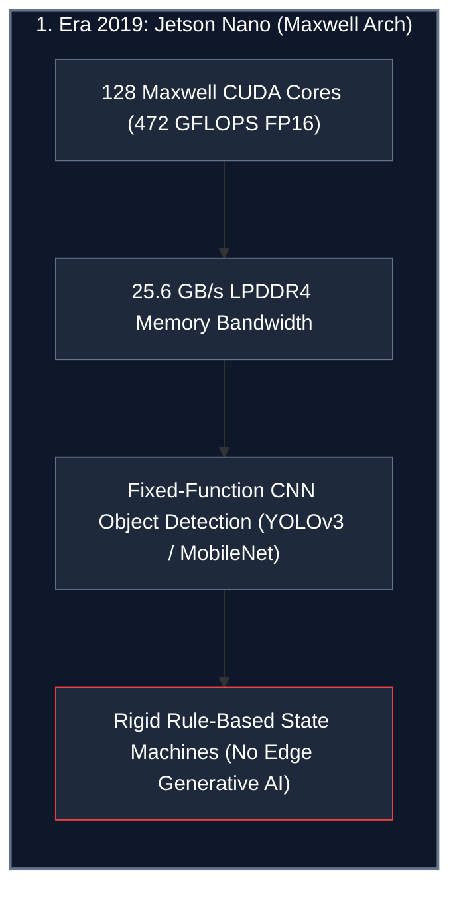
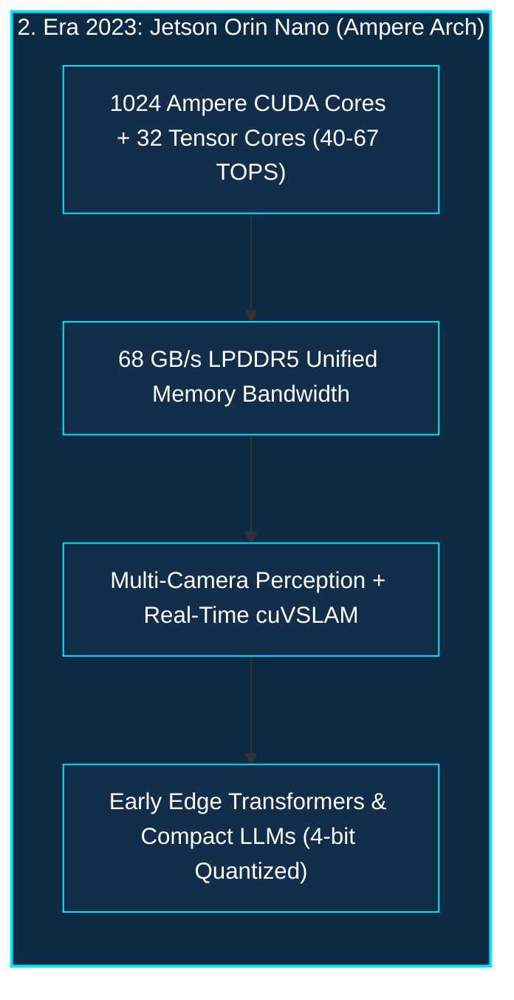
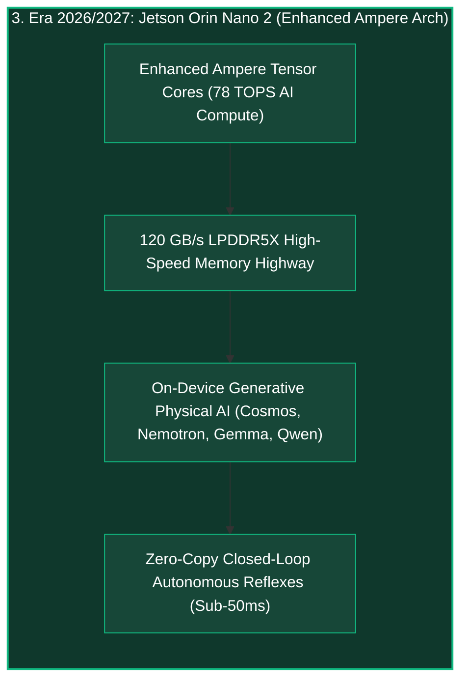
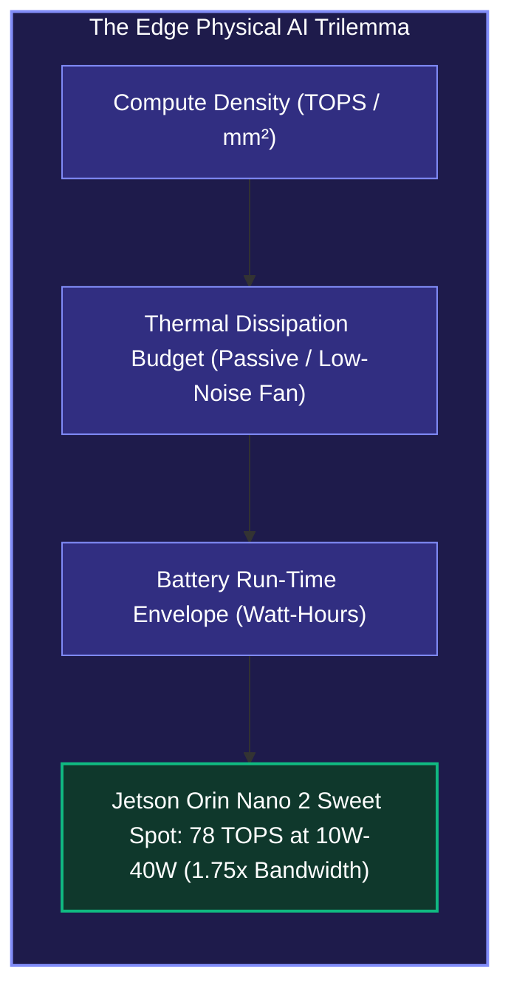
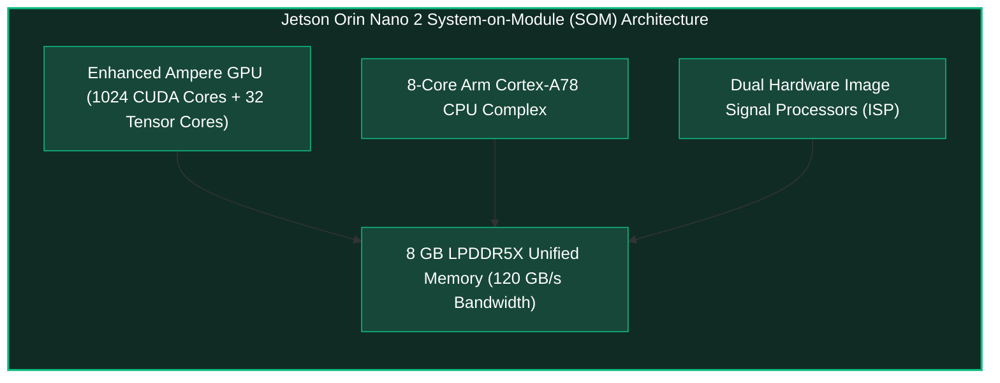
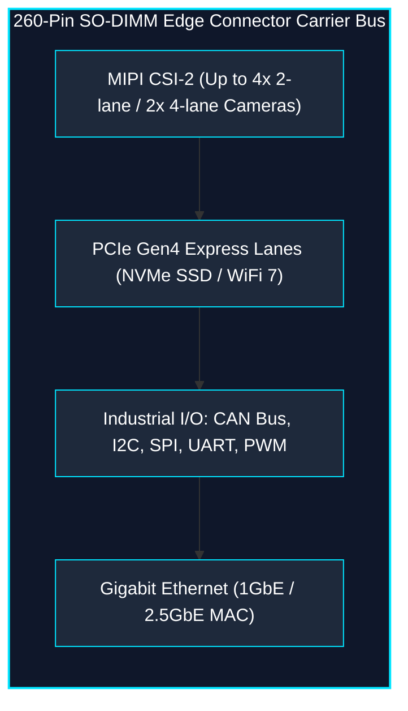
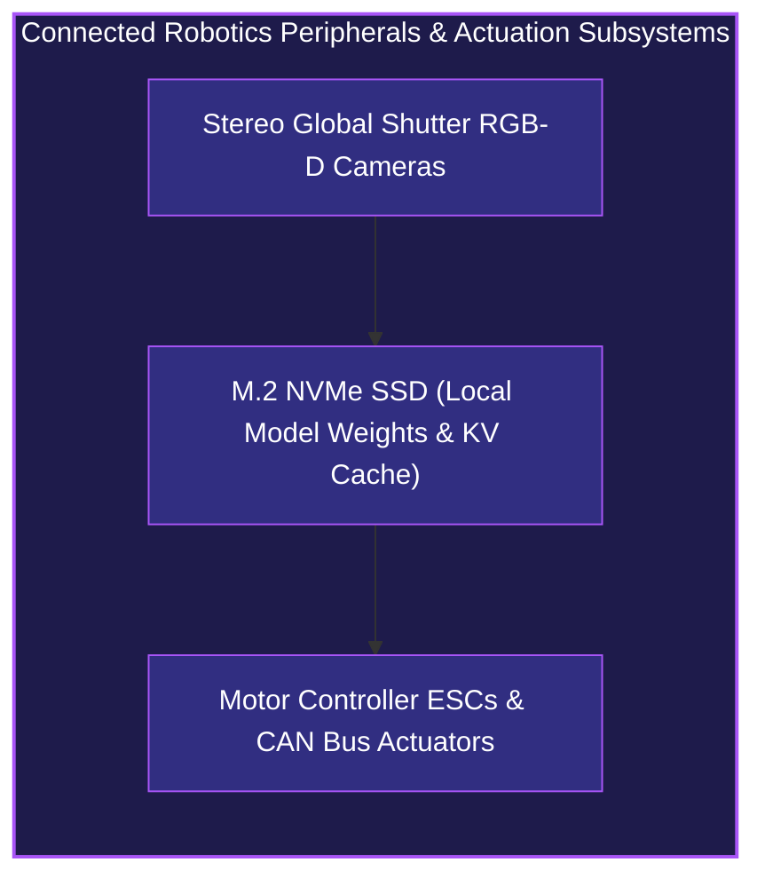
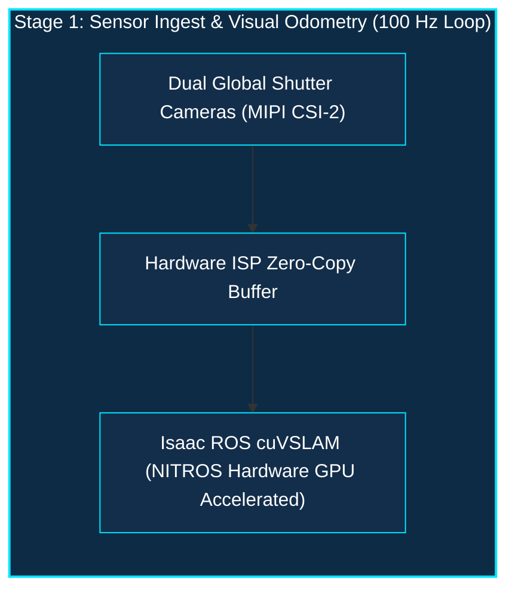
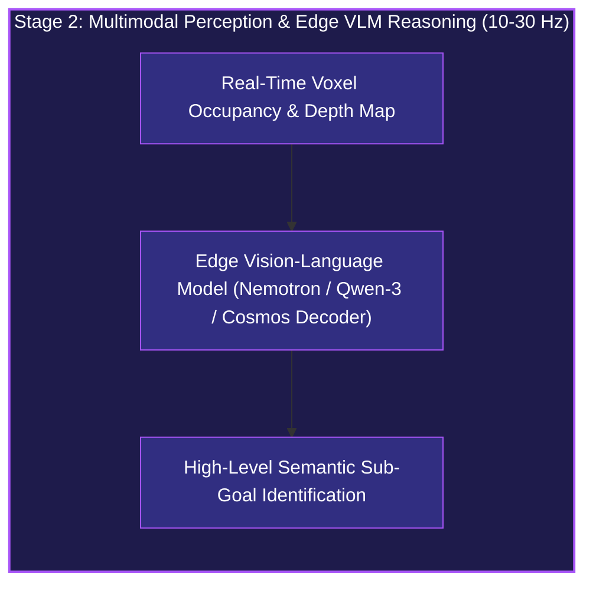
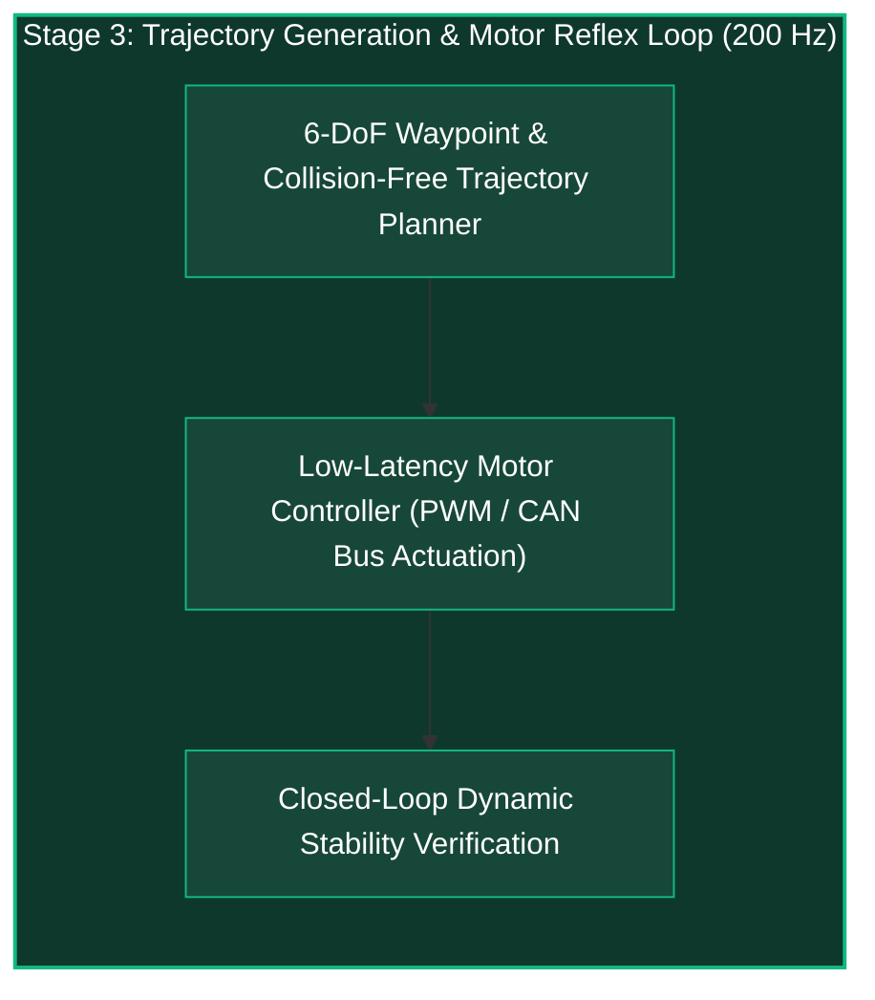

*Series: NVIDIA Physical AI & Robotics Ecosystem Series - Part 14*

*Series: &larr; [Part 10: Inside Newton: Open-Source Differentiable Physics for Generalist Robotics](/blog/inside-nvidia-newton-differentiable-physics-engine/) (Previous)*

### Prior Reading Material

Before exploring edge silicon architectures, unified memory subsystems, and robotics compute envelopes, inspect these foundational articles across our Physical AI series:

* [Part 1: Unpacking the NVIDIA Physical AI Data Factory (PAIDF) Stack](/blog/unpacking-nvidia-paidf-physical-ai-stack/) — The end-to-end synthetic-to-real physical AI ecosystem.
* [Part 6: Inside Project GR00T](/blog/inside-project-gr00t-vla-diffusion-heads/) — Multimodal Vision-Language-Action (VLA) tokenization and diffusion policy action heads.
* [Part 8: Silicon at the Edge: NVIDIA Jetson Thor Architecture & Isaac ROS Acceleration](/blog/silicon-at-the-edge-nvidia-jetson-thor-isaac-ros/) — Blackwell edge compute, NITROS zero-copy memory transport, and sub-50ms humanoid reflex budgets.
* [Part 9: Demystifying Autonomous Vehicles: The 3-Computer Architecture, SAE Autonomy Levels, and the Sensor Fusion Triad](/blog/demystifying-autonomous-vehicles-sae-levels-sensor-fusion/) — The 3-computer paradigm spanning data center training, simulation, and edge inference.
* [Part 10: Inside Newton: Open-Source Differentiable Physics for Generalist Robotics](/blog/inside-nvidia-newton-differentiable-physics-engine/) — Differentiable physics engines for high-throughput robot policy learning.

---

### NVIDIA Jetson Orin Nano 2 Specification Summary

| Specification / Dimension | Details & Technical Parameters |
| :--- | :--- |
| **Official Announcement** | [NVIDIA Press Release (August 2026)](https://nvidianews.nvidia.com/news/nvidia-announces-jetson-orin-nano-2-robotics-computer-to-redefine-entry-level-edge-ai) |
| **Edge Platform** | [NVIDIA Jetson Embedded Systems](https://www.nvidia.com/en-us/autonomous-machines/embedded-systems/) |
| **GPU Architecture** | Enhanced NVIDIA Ampere Architecture with updated 3rd Gen Tensor Cores |
| **AI Compute Throughput** | Up to **78 TOPS** (INT8 Dense / Sparse Acceleration) |
| **CPU Complex** | 8-core Arm Cortex-A78 CPU Complex |
| **Unified Memory** | 8 GB LPDDR5X with up to **120 GB/s** Memory Bandwidth (128-bit bus) |
| **Generational Speedup** | **2x Inference Throughput** vs. Jetson Orin Nano Super; **40% Power Reduction** at 15W iso-performance |
| **Configurable Power Modes** | 10W to 40W operating envelopes |
| **Form Factor & Pins** | 260-pin SO-DIMM (69.6 mm x 45 mm), drop-in pin-compatible with Jetson Orin Nano carrier boards |
| **Target Edge Workloads** | [NVIDIA Cosmos](https://developer.nvidia.com/cosmos) Edge Decoders, Nemotron-3 Nano, Gemma 4, Qwen 3, YOLOv11, FastSAM, [Isaac ROS](https://developer.nvidia.com/isaac-ros) cuVSLAM |
| **Ecosystem Adopters** | Cognex, Doosan Bobcat, Matic Robots, Alphabet Wing Drones, Advantech, AAEON, Seeed Studio |

---

## 1. The Tale of the Micro-Workshop: From Fixed Tools to Autonomous Artisans

Imagine a tiny craftsman's workshop set up inside an untethered, battery-powered delivery drone or a household robotic vacuum cleaner.

In **2019**, the workshop was equipped with the **Jetson Nano**. It had a single workbench, a modest 128-core Maxwell GPU, and a narrow conveyor belt that could move 25.6 GB of raw materials per second. The craftsman could reliably recognize basic shapes—detecting a pedestrian or a pet using a lightweight convolutional neural network like MobileNet or YOLOv3. However, if the robot encountered an unexpected obstacle, it had no commonsense reasoning. It could only flag a bounding box and stop in place.



By **2023**, the **Jetson Orin Nano** transformed the workshop into an automated assembly line. Equipped with Ampere Tensor Cores and 68 GB/s of LPDDR5 bandwidth, it delivered up to 40 TOPS (and later 67 TOPS in Super mode). For the first time, edge robots could run real-time stereo depth estimation, feature tracking, and visual SLAM simultaneously on a single sub-15W module.



Now, with the **Jetson Orin Nano 2**, the workshop evolves into a self-directed physical AI studio. Packing **78 TOPS** of AI compute, an 8-core Arm Cortex-A78 CPU complex, and a massive **120 GB/s LPDDR5X** memory pipeline within the same compact 260-pin SO-DIMM footprint, it shatters the memory bandwidth bottleneck that historically choked edge generative models. 

Untethered robots no longer need to phone home to a centralized data center to interpret complex instructions or generate dynamic navigation trajectories. They run multimodal Vision-Language Models (VLMs), diffusion action decoders, and world foundation models entirely on the device.



---

## 2. The Edge Physical AI Trilemma

Every robotics engineer designing autonomous systems encounters the fundamental **Edge AI Trilemma**:

1. **Compute Throughput (TOPS & TFLOPS)**: Modern Physical AI demands transformer-based attention, spatial 3D voxel processing, and diffusion denoising steps.
2. **Thermal Dissipation & Form Factor**: Drones, robotic vacuum cleaners, and robotic grippers cannot carry bulky water-cooling loops or heavy heatsinks.
3. **Battery Longevity (Watt-Hours)**: Every milliwatt drawn by the computing SoC directly subtracts from the robot's operational flight time or cleaning area.



While high-end flagship systems like [Jetson Thor](/blog/silicon-at-the-edge-nvidia-jetson-thor-isaac-ros/) (delivering up to 800 TFLOPS FP8 at 100W+) serve large bipedal humanoids and autonomous commercial vehicles, the **Jetson Orin Nano 2** is engineered specifically for high-volume, cost-sensitive, and battery-constrained machines:

* **Autonomous Delivery Drones (Alphabet's Wing)**: Navigating suburban airspace with real-time stereo obstacle avoidance and onboard visual landing site verification.
* **Smart Consumer Robots (Matic Robots)**: Quiet, fully private in-home floor cleaning that interprets natural language instructions ("clean the spilled cereal under the kitchen island") without streaming private camera feeds to the cloud.
* **Industrial Smart Cameras & Inspection Grippers (Cognex, Doosan Bobcat)**: Sub-millimeter visual defect classification and robotic bin-picking on factory conveyor lines.

---

## 3. Generational Architecture Comparison: Nano vs. Orin Nano vs. Orin Nano 2

The evolution of NVIDIA's entry-level Jetson silicon represents an astronomical leap in both raw compute density and memory subsystem architecture:

| Architectural Feature | Jetson Nano (2019) | Jetson Orin Nano 8GB (2023) | Jetson Orin Nano Super (2024) | Jetson Orin Nano 2 (2026/2027) | Jetson Thor (Flagship) |
| :--- | :--- | :--- | :--- | :--- | :--- |
| **GPU Architecture** | Maxwell | Ampere | Ampere | **Enhanced Ampere** | Blackwell |
| **CUDA Cores** | 128 | 1024 | 1024 | **1024 (Updated)** | ~2048+ |
| **Tensor Cores** | N/A (FP16 via CUDA) | 32 (3rd Gen) | 32 (3rd Gen) | **32 (Enhanced 3rd Gen)** | 5th Gen (FP4/FP8) |
| **CPU Complex** | 4-core Cortex-A57 @ 1.43 GHz | 6-core Cortex-A78AE @ 1.5 GHz | 6-core Cortex-A78AE @ 1.5 GHz | **8-core Cortex-A78 @ 2.0+ GHz** | 14-core Neoverse V3AE |
| **AI Performance** | 472 GFLOPS (FP16) | 40 TOPS (INT8 Dense) | 67 TOPS (INT8 Sparse) | **78 TOPS (INT8 Dense/Sparse)** | 800 TFLOPS (FP8/FP4) |
| **Memory Capacity** | 4 GB LPDDR4 | 8 GB LPDDR5 | 8 GB LPDDR5 | **8 GB LPDDR5X** | 128 GB LPDDR5X |
| **Memory Bus Width** | 64-bit | 128-bit | 128-bit | **128-bit** | 256-bit |
| **Memory Bandwidth** | 25.6 GB/s | 68 GB/s | 68 GB/s | **120 GB/s (1.76x)** | > 500 GB/s |
| **Precision Formats** | FP32, FP16 | FP32, FP16, INT8 | FP32, FP16, INT8 | **FP32, FP16, INT8, INT4** | FP32, FP16, FP8, FP4, INT8 |
| **Power Consumption** | 5W / 10W | 7W – 15W | 10W – 25W | **10W – 40W (Iso-15W @ -40% Pwr)** | 50W – 120W+ |
| **Form Factor** | 260-pin SO-DIMM | 260-pin SO-DIMM | 260-pin SO-DIMM | **260-pin SO-DIMM (Drop-in)** | BGA / Custom Mezzanine |
| **Primary Workloads** | TinyYOLO, MobileNet | YOLOv8, cuVSLAM, FastSAM | YOLOv10, Small SLMs | **Cosmos Decoders, Nemotron, Gemma, Qwen** | Full GR00T Humanoid VLA |

---

## 4. Hardware System Architecture & Drop-In Carrier Integration

One of the most critical engineering advantages of the Jetson Orin Nano 2 is its **drop-in mechanical and pin compatibility**. System integrators and robotics OEMs who designed carrier boards for the Jetson Orin Nano can upgrade their fleet simply by swapping the module and updating the JetPack board support package (BSP).







### Why Memory Bandwidth (120 GB/s) is the Real Breakthrough

In generative AI and large vision models, the primary bottleneck during edge inference is not raw matrix multiplication compute—it is **memory bandwidth**.

During autoregressive token generation in an edge SLM (such as Nemotron-3 Nano or Qwen-3 1.5B), the GPU must stream billions of weight parameters from memory into the on-chip SRAM register files for **every single generated token**.

* On the **Jetson Nano (25.6 GB/s)**: An edge 1.5B parameter model quantized to 4-bit (0.75 GB) would be hard-capped by memory bandwidth to a theoretical maximum of $\frac{25.6\text{ GB/s}}{0.75\text{ GB/token}} \approx 34\text{ tokens/sec}$ under 100% ideal bus saturation (in reality, $< 10\text{ tokens/sec}$).
* On the **Jetson Orin Nano (68 GB/s)**: Theoretical maximum throughput was $\approx 90\text{ tokens/sec}$, achieving ~25–35 real-world tokens/sec when sharing bandwidth with active camera ISP pipelines.
* On the **Jetson Orin Nano 2 (120 GB/s)**: The LPDDR5X bus provides an explosive **1.76x bandwidth boost**, enabling generative reasoning models to run at **60+ tokens/second** concurrently with 4K stereo camera ingest and real-time visual odometry!

---

## 5. The Edge Generative Physical AI Pipeline

How does a Jetson Orin Nano 2 power an untethered autonomous robot in real time?

Rather than running isolated computer vision models, the robot executes a unified, closed-loop **Perception-Reasoning-Action** loop accelerated by [NVIDIA Isaac ROS](https://developer.nvidia.com/isaac-ros) and TensorRT:







---

## 6. Mathematical Formulations of Edge AI Efficiency

To understand why the Jetson Orin Nano 2 delivers such a profound leap in autonomous capability, we analyze the governing equations of edge computing:

### 1. Energy Efficiency (TOPS per Watt)

The compute energy efficiency $\eta_{\text{compute}}$ of an edge SoC is the ratio of effective AI throughput to the total active thermal design power (TDP):

$$\eta_{\text{compute}} = \frac{\text{TOPS}_{\text{peak}}}{P_{\text{SoC}}}$$

Comparing the generations:
* **Jetson Nano (2019)**: $\eta_{\text{Nano}} = \frac{0.472\text{ TFLOPS}}{10\text{ W}} = 0.0472\text{ TFLOPS/Watt}$
* **Jetson Orin Nano (2023)**: $\eta_{\text{OrinNano}} = \frac{40\text{ TOPS}}{15\text{ W}} = 2.67\text{ TOPS/Watt}$
* **Jetson Orin Nano 2 (2026)**: $\eta_{\text{OrinNano2}} = \frac{78\text{ TOPS}}{20\text{ W}} = 3.90\text{ TOPS/Watt}$ (and over $5.20\text{ TOPS/Watt}$ in tuned 15W mode).

This represents an astounding **82x increase in compute efficiency per watt** compared to the original Jetson Nano!

### 2. Operational Intensity & The Edge Roofline Model

According to Williams' Roofline Model, kernel execution is bounded either by peak compute performance $P_{\text{peak}}$ (TOPS) or by memory bandwidth $B_{\text{mem}}$ (GB/s), governed by arithmetic intensity $I$ (FLOPs/byte):

$$\text{Performance}(I) = \min\left(P_{\text{peak}}, I \times B_{\text{mem}}\right)$$

The transition point $I_{\text{knee}}$ where a workload transitions from memory-bandwidth-bound to compute-bound is:

$$I_{\text{knee}} = \frac{P_{\text{peak}}}{B_{\text{mem}}}$$

* **Jetson Orin Nano 8GB**: $I_{\text{knee}} = \frac{40 \times 10^{12}\text{ OPs/s}}{68 \times 10^9\text{ Bytes/s}} \approx 588.2\text{ OPs/Byte}$
* **Jetson Orin Nano 2**: $I_{\text{knee}} = \frac{78 \times 10^{12}\text{ OPs/s}}{120 \times 10^9\text{ Bytes/s}} \approx 650.0\text{ OPs/Byte}$

Because generative autoregressive decoding has an arithmetic intensity $I \approx 1\text{ OP/Byte}$ (batch size = 1), performance is strictly linear in memory bandwidth $B_{\text{mem}}$. Upgrading to 120 GB/s directly raises the memory roofline ceiling by **76.5%**.

### 3. Untethered Battery Lifetime Duration

For a mobile robot with battery energy capacity $E_{\text{battery}}$ (in Watt-hours) and DC-DC power conversion efficiency $\eta_{\text{conv}}$, total mission runtime $T_{\text{mission}}$ is:

$$T_{\text{mission}} = \frac{E_{\text{battery}} \times \eta_{\text{conv}}}{P_{\text{SoC}} + P_{\text{sensors}} + P_{\text{motors}}}$$

Where:
* $P_{\text{SoC}}$ is the Jetson module power draw (W).
* $P_{\text{sensors}}$ is the camera and LiDAR payload power (typically 3W–6W).
* $P_{\text{motors}}$ is average locomotion actuation power (typically 15W–40W for small AMRs).

Because the Jetson Orin Nano 2 consumes **40% less power** at iso-workload compared to its predecessor, it saves 6W to 10W of continuous power—extending mission battery life by **20% to 35%** on a standard 50Wh robot battery pack.

---

## 7. Interactive Python Edge Silicon Simulation

To benchmark the generational throughput, memory latency, and battery longevity across Jetson Nano, Jetson Orin Nano, and Jetson Orin Nano 2, we have built an interactive Python simulation script.

<details><summary><b>Click to expand runnable Python simulation script</b></summary>

```python
#!/usr/bin/env python3
"""
scripts/jetson_generational_benchmark_sim.py
Zero-dependency simulation comparing Jetson Nano, Jetson Orin Nano,
and Jetson Orin Nano 2 across vision and generative AI workloads.
"""

from dataclasses import dataclass
from typing import List, Dict


@dataclass
class JetsonModule:
    name: str
    year: int
    gpu_arch: str
    ai_tops: float          # Peak INT8/FP16 TOPS
    mem_capacity_gb: float  # Unified RAM (GB)
    mem_bandwidth_gbs: float # Memory Bandwidth (GB/s)
    cpu_cores: int
    tdp_watts: float        # Typical operating power (W)


MODULES = [
    JetsonModule(
        name="Jetson Nano",
        year=2019,
        gpu_arch="Maxwell (128 CUDA)",
        ai_tops=0.472,       # FP16 GFLOPS as TOPS equivalent
        mem_capacity_gb=4.0,
        mem_bandwidth_gbs=25.6,
        cpu_cores=4,
        tdp_watts=10.0,
    ),
    JetsonModule(
        name="Jetson Orin Nano 8GB",
        year=2023,
        gpu_arch="Ampere (1024 CUDA + 32 TC)",
        ai_tops=40.0,
        mem_capacity_gb=8.0,
        mem_bandwidth_gbs=68.0,
        cpu_cores=6,
        tdp_watts=15.0,
    ),
    JetsonModule(
        name="Jetson Orin Nano Super",
        year=2024,
        gpu_arch="Ampere (1024 CUDA + 32 TC)",
        ai_tops=67.0,
        mem_capacity_gb=8.0,
        mem_bandwidth_gbs=68.0,
        cpu_cores=6,
        tdp_watts=25.0,
    ),
    JetsonModule(
        name="Jetson Orin Nano 2",
        year=2026,
        gpu_arch="Enhanced Ampere (1024 CUDA + 32 TC)",
        ai_tops=78.0,
        mem_capacity_gb=8.0,
        mem_bandwidth_gbs=120.0,
        cpu_cores=8,
        tdp_watts=20.0,
    ),
]


def benchmark_vision_model(module: JetsonModule, giga_ops: float, model_size_mb: float) -> Dict[str, float]:
    """
    Simulates vision model inference (e.g. YOLOv11 / FastSAM).
    """
    # Compute latency (ms) = (GigaOPs / (TOPS * 1000)) * 1000 ms
    compute_ms = (giga_ops / (module.ai_tops * 1000.0)) * 1000.0
    # Memory read latency (ms) = (Size in GB / Bandwidth) * 1000 ms
    mem_ms = ((model_size_mb / 1024.0) / module.mem_bandwidth_gbs) * 1000.0
    # Overlapped execution with hardware efficiency factor
    eff = 0.78 if "Ampere" in module.gpu_arch else 0.52
    total_latency_ms = max(compute_ms, mem_ms) / eff
    fps = 1000.0 / total_latency_ms
    return {
        "latency_ms": round(total_latency_ms, 2),
        "fps": round(fps, 1),
    }


def benchmark_generative_slm(module: JetsonModule, params_billions: float, bits_per_weight: int) -> Dict[str, float]:
    """
    Simulates generative autoregressive token decode (e.g. Nemotron-3 Nano / Qwen-3 1.5B).
    """
    model_weight_bytes = (params_billions * 1e9 * (bits_per_weight / 8.0))
    model_weight_gb = model_weight_bytes / (1024.0 ** 3)
    
    if model_weight_gb > (module.mem_capacity_gb * 0.75):
        # Model does not fit into available VRAM after OS and camera buffers
        return {"tokens_per_sec": 0.0, "status": "OOM (Out of Memory)"}
    
    # In token generation, every token reads all weights from DRAM
    bus_efficiency = 0.82 if "Ampere" in module.gpu_arch else 0.55
    tok_sec = (module.mem_bandwidth_gbs * bus_efficiency) / model_weight_gb
    return {
        "tokens_per_sec": round(tok_sec, 1),
        "status": "OK",
    }


def estimate_drone_battery_runtime(module: JetsonModule, battery_wh: float = 52.0, base_power_w: float = 28.0) -> float:
    """
    Estimates total mission runtime (in minutes) for a delivery drone or AMR.
    base_power_w includes motors, cameras, and radio payload.
    """
    total_power = module.tdp_watts + base_power_w
    runtime_hours = (battery_wh * 0.90) / total_power  # 90% usable battery depth
    return round(runtime_hours * 60.0, 1)


def run_generational_benchmark():
    print("=" * 80)
    print(" NVIDIA JETSON GENERATIONAL EDGE AI BENCHMARK SIMULATION")
    print("=" * 80)
    
    # 1. Vision Model Benchmark: YOLOv11-Medium (15 GigaOPs, 42 MB weights)
    print("\n📊 1. Vision Model Benchmark: YOLOv11 Real-Time Object Detection")
    print(f"{'Module Name':<24} | {'Arch':<20} | {'Latency (ms)':<14} | {'Throughput (FPS)':<16}")
    print("-" * 80)
    for m in MODULES:
        res = benchmark_vision_model(m, giga_ops=15.0, model_size_mb=42.0)
        print(f"{m.name:<24} | {m.gpu_arch[:18]:<20} | {res['latency_ms']:<14} | {res['fps']:<16}")

    # 2. Generative SLM Benchmark: 1.5B Parameter Model (4-bit quantized = 0.75 GB)
    print("\n🧠 2. Generative Physical AI SLM: Qwen-3 / Nemotron-3 1.5B (INT4 Quantized)")
    print(f"{'Module Name':<24} | {'Bandwidth':<12} | {'Tokens / Sec':<16} | {'Status':<16}")
    print("-" * 80)
    for m in MODULES:
        res = benchmark_generative_slm(m, params_billions=1.5, bits_per_weight=4)
        print(f"{m.name:<24} | {str(m.mem_bandwidth_gbs) + ' GB/s':<12} | {res['tokens_per_sec']:<16} | {res['status']:<16}")

    # 3. Mission Battery Longevity on a 52 Wh Drone Battery Pack
    print("\n🔋 3. Mission Battery Longevity (52 Wh Battery, 28W Base Motors/Sensors)")
    print(f"{'Module Name':<24} | {'TDP (Watts)':<12} | {'Compute Eff (TOPS/W)':<20} | {'Flight Time':<14}")
    print("-" * 80)
    for m in MODULES:
        eff = round(m.ai_tops / m.tdp_watts, 2)
        flight_mins = estimate_drone_battery_runtime(m, battery_wh=52.0, base_power_w=28.0)
        print(f"{m.name:<24} | {str(m.tdp_watts) + ' W':<12} | {str(eff) + ' TOPS/W':<20} | {str(flight_mins) + ' mins':<14}")

    print("\n" + "=" * 80)
    print(" SUMMARY TAKEAWAY:")
    print(" Jetson Orin Nano 2 unlocks 60+ tok/s generative edge reasoning and 150+ FPS")
    print(" vision detection, while maintaining an energy-efficient sub-20W envelope.")
    print("=" * 80)


if __name__ == "__main__":
    run_generational_benchmark()
```

</details>

---

## 8. Summary & Conclusion

The journey from the 2019 **Jetson Nano** to the 2026 **Jetson Orin Nano 2** reflects the broader transformation of AI itself:

1. **From Bounding Boxes to Generalist Reasoning**: Entry-level edge silicon has graduated from simple 2D convolutional object detectors to multimodal foundation models that can perceive 3D geometry, reason in natural language, and plan robotic manipulation trajectories.
2. **Solving the Bandwidth Bottleneck**: The introduction of **120 GB/s LPDDR5X** memory eliminates the DRAM starvation that previously bottlenecked autoregressive token generation and spatial diffusion decoders on edge devices.
3. **Seamless Drop-In Evolution**: Retaining the standardized 260-pin SO-DIMM form factor allows robotics manufacturers across industrial automation, delivery drones, and consumer robotics to upgrade existing fleets with 2x performance and 40% higher power efficiency.

As Physical AI expands into millions of untethered machines worldwide, high-density edge silicon like the Jetson Orin Nano 2 ensures that rich intelligence, spatial perception, and autonomous reflexes remain fully self-contained on the device.
