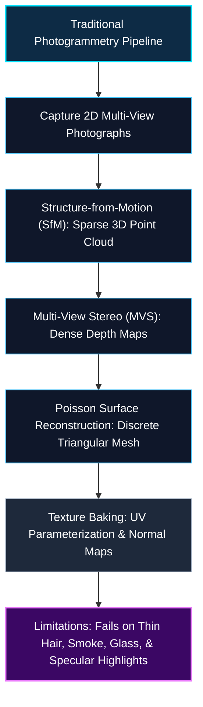
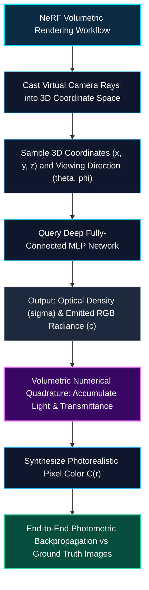
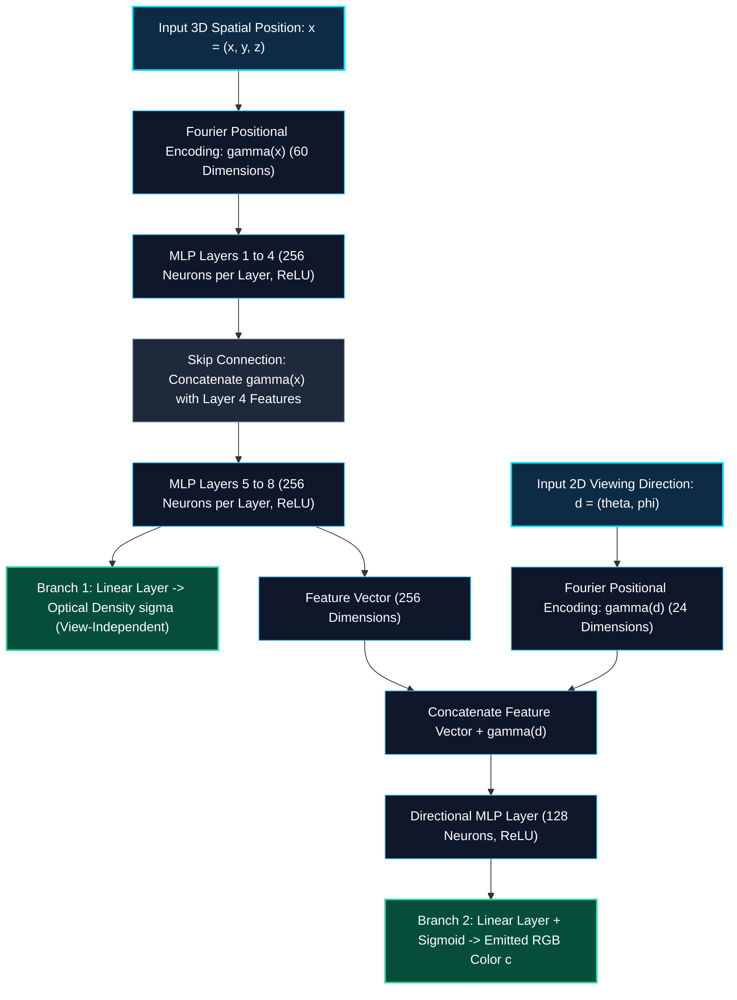
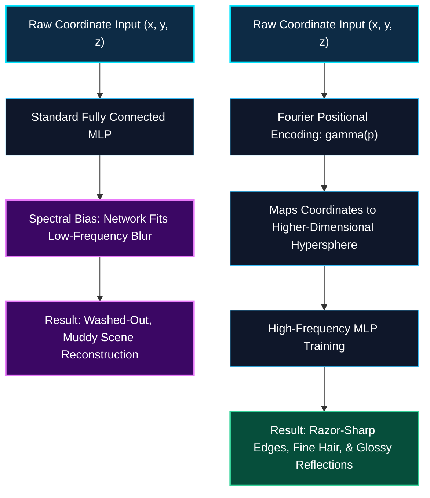
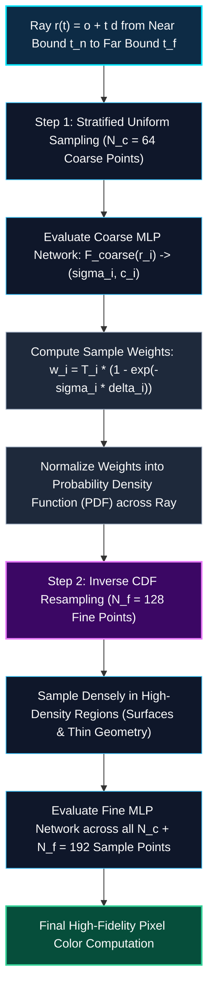
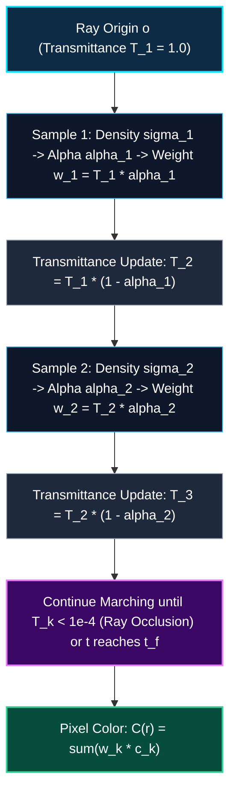

*Series: NVIDIA Physical AI & Robotics Ecosystem Series - Part 12*

*Series: &larr; [Part 11: NVIDIA Drive Cosmos & Cosmos-Drive-Dreams: Scalable Synthetic Driving Data Generation with World Foundation Models](/blog/nvidia-drive-cosmos-cosmos-drive-dreams-world-foundation-models/) (Previous)*
*Series: [Part 13: Accelerating Implicit Fields: Instant-NGP & Multiresolution Hash Grids](/blog/accelerating-implicit-fields-instant-ngp-multiresolution-hash-grids/) (Next) &rarr;*

### Prior Reading Material

Before exploring implicit neural representations and volumetric ray marching, inspect these foundational articles from our Physical AI and Computer Vision series:

* [Part 1: Unpacking the NVIDIA Physical AI Data Factory (PAIDF) Stack](/blog/unpacking-nvidia-paidf-physical-ai-stack/) — The complete end-to-end synthetic data and physical intelligence pipeline.
* [Part 2: Inside NVIDIA Cosmos: World Foundation Models for Physical Commonsense](/blog/inside-nvidia-cosmos-world-foundation-models/) — Physics-conditioned video generation and 3D spatiotemporal tokenizers.
* [Part 3: Unlocking NVIDIA Omniverse: Architecture, OpenUSD, RTX Rendering, and the Industrial Metaverse Ecosystem](/blog/unlocking-nvidia-omniverse-architecture/) — Real-time ray tracing, path tracing, and universal 3D scene representation.
* [Part 4: Demystifying OpenUSD: Architecture, Composition Arcs, usdview, and Simulation Assets](/blog/demystifying-openusd-architecture-and-tools/) — Core geometric and asset composition principles in spatial workflows.
* [Part 5: Scaling Physics with Isaac Sim & Omniverse Replicator](/blog/scaling-physics-isaac-sim-omniverse-replicator/) — Ray-traced sensor synthesis (LiDAR, RGB, depth) and automated domain randomization.
* [Part 9: The Evolutionary Arc of Computer Vision: From LeNet-5 and ResNet to ConvNeXt and 3D Video Models](/blog/evolutionary-arc-computer-vision-lenet-resnet-convnext-3d-video/) — From 2D spatial convolutions to spatiotemporal 3D vision.
* [Part 11: NVIDIA Drive Cosmos & Cosmos-Drive-Dreams: Scalable Synthetic Driving Data Generation with World Foundation Models](/blog/nvidia-drive-cosmos-cosmos-drive-dreams-world-foundation-models/) — Scalable multi-view synthetic sensor generation for autonomous physical agents.

---

### Official Research & Project Summary

| Milestone / Paradigm | Key Research Papers | Primary Open-Source Implementations | Representation Type | 1080p Novel View Synthesis Speed |
| :--- | :--- | :--- | :--- | :--- |
| **Vanilla NeRF** | [Mildenhall et al., ECCV 2020](https://arxiv.org/abs/2003.08934) | [nerf-pytorch](https://github.com/yenchenlin/nerf-pytorch), [nerfstudio](https://github.com/nerfstudio-project/nerfstudio) | Implicit Continuous MLP: $F_\Theta(\mathbf{x}, \mathbf{d}) \to (\mathbf{c}, \sigma)$ | ❌ Very Slow (~0.1 FPS) |
| **Mip-NeRF** | [Barron et al., ICCV 2021](https://arxiv.org/abs/2103.13415) | [google-research/multinerf](https://github.com/google-research/multinerf) | Anti-Aliased Cone Frustum Tracing MLP | ❌ Very Slow (~0.08 FPS) |
| **RawNeRF** | [Mildenhall et al., CVPR 2022](https://arxiv.org/abs/2111.13679) | [google-research/multinerf](https://github.com/google-research/multinerf) | Linear HDR Sensor Radiance Field | ❌ Very Slow (~0.05 FPS) |
| **Instant-NGP** | [Müller et al., SIGGRAPH 2022](https://arxiv.org/abs/2201.05989) | [NVlabs/instant-ngp](https://github.com/NVlabs/instant-ngp) | Hybrid: Multiresolution Hash Grid + Tiny MLP | ⚠️ Near Real-Time (~15–30 FPS) |
| **Plenoxels** | [Fridovich-Keil et al., CVPR 2022](https://arxiv.org/abs/2112.05131) | [sxyu/svox2](https://github.com/sxyu/svox2) | Explicit Sparse Voxel Grid (No Neural Networks) | ⚠️ Interactive (~15 FPS) |
| **3D Gaussian Splatting** | [Kerbl et al., SIGGRAPH 2023](https://arxiv.org/abs/2308.04079) | [graphdeco-inria/gaussian-splatting](https://github.com/graphdeco-inria/gaussian-splatting) | Explicit Differentiable 3D Gaussians | ✅ Real-Time (100+ FPS) |

---

## 1. The Tale of the Invisible Sculpture: Polygons vs. Continuous Neural Fog

Imagine standing inside a darkened room with an invisible glass sculpture suspended in mid-air. 

You are handed a digital camera and captured photographs of the sculpture from fifty different angles. Your objective is to reconstruct the 3D scene so an observer can walk around it and view it seamlessly from any vantage point.

How does a computer represent this 3D world?

### The Traditional Paradigm: Rigid Polygonal Meshes

For over four decades, 3D computer graphics and photogrammetry relied on **polygonal meshes** — collections of discrete 3D vertices $(x, y, z)$ connected by triangular faces and wrapped in 2D bitmap textures.



While polygonal meshes are exceptional for hard-surface objects like furniture and buildings, they face steep fundamental limits:
1. **Geometric Topology Restrictions**: Meshes assume sharp, watertight surfaces. They cannot easily model semi-transparent media, volumetric smoke, delicate foliage, or wisps of human hair.
2. **View-Dependent Reflections**: Standard texture maps assume an object's color is static regardless of where you stand. Capturing dynamic gloss, metallic highlights, and Fresnel refraction requires handcrafted shaders.
3. **Discontinuous Optimization**: Refining a mesh directly using gradient descent is notoriously difficult because adding, deleting, or moving discrete vertices introduces topological discontinuities.

### The NeRF Paradigm: The Flashlight in the Fog

In 2020, Ben Mildenhall, Pratul Srinivasan, and their collaborators introduced **NeRF (Neural Radiance Fields)**. 

NeRF discarded polygonal meshes entirely. Instead of storing discrete triangles or point clouds, NeRF treats the entire 3D universe as a **continuous, glowing volumetric fog** encapsulated within the weights of a deep neural network.



When you render a pixel from a virtual camera, you shine a virtual ray through that pixel into the 3D volume. As the ray marches through space, it queries the neural network at discrete sample points:
* *"Is there matter here?"* $\to$ The network outputs an **optical density** $\sigma$ (how opaque the fog is at this location).
* *"What color does this particle radiate toward the camera?"* $\to$ The network outputs an **emitted RGB color** $\mathbf{c}$.

By numerically accumulating the light emitted along the ray and factoring in how much light earlier particles block (transmittance), NeRF synthesizes novel views with lifelike reflections, realistic depth of field, and sub-millimeter geometric fidelity.

---

## 2. The 5D Continuous Plenoptic Function & Coordinate MLPs

At its mathematical core, NeRF represents a continuous scene as a 5D vector function:

$$
F_\Theta: (\mathbf{x}, \mathbf{d}) \to (\mathbf{c}, \sigma)
$$

Where:
* $\mathbf{x} = (x, y, z) \in \mathbb{R}^3$ denotes the 3D spatial position within the scene bounding volume.
* $\mathbf{d} = (\theta, \phi)$ denotes the 2D viewing direction unit vector $\mathbf{d} = (d_x, d_y, d_z) \in \mathbb{S}^2$.
* $\mathbf{c} = (r, g, b) \in [0, 1]^3$ denotes the emitted RGB radiance.
* $\sigma \in [0, \infty)$ denotes the differential optical volume density.



### Why Density $\sigma$ Must Be View-Independent

A critical architectural design decision in NeRF is enforcing that **optical density $\sigma$ depends strictly on 3D position $\mathbf{x}$**, while **emitted color $\mathbf{c}$ depends on both position $\mathbf{x}$ and viewing direction $\mathbf{d}$**:

1. **Multi-View Geometric Consistency**: If $\sigma$ were allowed to vary with the viewing angle $\mathbf{d}$, the network could "cheat" by creating view-dependent geometric hallucinations (phantom floating walls or transparent surfaces that only exist from one camera angle). Forcing $\sigma(\mathbf{x})$ to be purely spatial guarantees that the underlying 3D geometry is physically static and consistent across all cameras.
2. **Specular Radiance & Reflections**: In contrast, real-world surfaces change appearance depending on observation angle (e.g., a car windshield reflecting sunlight into your eyes at specific angles). Conditioning $\mathbf{c}(\mathbf{x}, \mathbf{d})$ on $\mathbf{d}$ allows the network to model specular highlights, anisotropic sheen, and reflections without altering underlying geometry.

---

## 3. Overcoming Spectral Bias: Fourier Positional Encodings

If you feed raw $(x, y, z)$ coordinates directly into standard fully connected neural networks, the reconstructed scenes appear blurry and muddy. Why?

### The Spectral Bias of Neural Networks

Deep networks parameterized with standard activation functions (ReLU, Sigmoid) exhibit a mathematical phenomenon known as **spectral bias** (or low-frequency bias): they prioritize learning low-frequency functions and struggle to fit high-frequency variations.

In computer vision, high frequencies represent the most visually important details: sharp object boundaries, fine textures, fabric weaves, and crisp specular glints.



### The Positional Encoding Mapping $\gamma(p)$

To overcome spectral bias, NeRF applies a deterministic Fourier feature mapping $\gamma(\cdot)$ to transform coordinates into a higher-dimensional space before entering the network:

$$
\gamma(p) = \left( \sin(2^0 \pi p), \cos(2^0 \pi p), \sin(2^1 \pi p), \cos(2^1 \pi p), \dots, \sin(2^{L-1} \pi p), \cos(2^{L-1} \pi p) \right)
$$

For 3D spatial coordinates $\mathbf{x} = (x, y, z)$, NeRF sets $L = 10$:
* Each coordinate is mapped to $2 \times 10 = 20$ dimensions.
* The 3D coordinate vector is expanded into $3 \times 20 = 60$ input dimensions.

For 2D viewing directions $\mathbf{d} = (d_x, d_y, d_z)$, NeRF sets $L = 4$:
* The 3D unit vector is expanded into $3 \times (2 \times 4) = 24$ input dimensions.

By projecting coordinates through exponentially increasing octaves of sinusoidal frequencies ($2^0, 2^1, \dots, 2^{L-1}$), the MLP can easily compute high-frequency stationary kernels, allowing it to synthesize razor-sharp geometry and subtle micro-textures.

---

## 4. Hierarchical Volume Sampling (Coarse vs. Fine Networks)

Marching a camera ray through 3D space presents an efficiency dilemma: most of the scene volume is completely empty air or solid opaque interior where light does not contribute to the final pixel color.

Evaluating an 8-layer MLP at hundreds of equidistant points across empty space wastes massive computational power.



NeRF solves this using a two-stage **Hierarchical Volume Sampling** strategy:

### Stage 1: Coarse Stratified Sampling
1. The ray span $[t_n, t_f]$ is partitioned into $N_c = 64$ uniform bins.
2. A single sample point $t_i$ is drawn uniformly at random within each bin $i$:
   $$t_i \sim \mathcal{U}\left[ t_n + \frac{i-1}{N_c}(t_f - t_n), \; t_n + \frac{i}{N_c}(t_f - t_n) \right]$$
3. The coarse network evaluates these $N_c$ points to compute initial weights $w_i = T_i (1 - \exp(-\sigma_i \delta_i))$.

### Stage 2: Fine Inverse-CDF Resampling
1. The coarse weights are normalized to form a piecewise-constant probability density function (PDF) along the ray:
   $$\hat{w}_i = \frac{w_i}{\sum_{j=1}^{N_c} w_j}$$
2. Using Inverse Transform Sampling on the Cumulative Distribution Function (CDF), an additional $N_f = 128$ points are drawn specifically where the coarse network detected matter ($\hat{w}_i > 0$).
3. The fine network is evaluated across all $N_c + N_f = 192$ points, dedicating the vast majority of neural capacity to resolving intricate surface geometry.

---

## 5. Mathematical Formulations: Continuous Ray Integrals & Discrete Quadrature

### Continuous Volumetric Rendering Integral

A virtual camera ray is defined parametrically by its origin $\mathbf{o} \in \mathbb{R}^3$ and unit direction $\mathbf{d} \in \mathbb{S}^2$:

$$
\mathbf{r}(t) = \mathbf{o} + t \mathbf{d}, \quad t \in [t_n, t_f]
$$

Under classical emission-absorption volume rendering (Beer-Lambert optical model), the expected color $C(\mathbf{r})$ captured by a camera pixel is the continuous integral:

$$
C(\mathbf{r}) = \int_{t_n}^{t_f} T(t) \sigma(\mathbf{r}(t)) \mathbf{c}(\mathbf{r}(t), \mathbf{d}) dt
$$

Where the continuous transmittance function $T(t)$ represents the probability that the ray travels from near clipping plane $t_n$ to distance $t$ without colliding with any absorbing particle:

$$
T(t) = \exp\left( -\int_{t_n}^t \sigma(\mathbf{r}(s)) ds \right)
$$

### Numerical Volumetric Quadrature

Because neural networks cannot evaluate continuous integrals analytically, we approximate $C(\mathbf{r})$ using numerical quadrature over $K$ sorted sample points $t_1 < t_2 < \dots < t_K$:

$$
\hat{C}(\mathbf{r}) = \sum_{k=1}^K T_k \left( 1 - \exp(-\sigma_k \delta_k) \right) \mathbf{c}_k
$$

Where:
* $\delta_k = t_{k+1} - t_k$ is the spatial step distance between adjacent samples.
* $\alpha_k = 1 - \exp(-\sigma_k \delta_k)$ is the discrete opacity (alpha) of sample $k$.
* $T_k$ is the discrete accumulated transmittance from the camera to sample $k$:

$$
T_k = \exp\left( -\sum_{j=1}^{k-1} \sigma_j \delta_j \right) = \prod_{j=1}^{k-1} (1 - \alpha_j)
$$

With boundary condition $T_1 = 1.0$ (no occlusion between the camera sensor and the first sample point).



### End-to-End Photometric Loss & Training

NeRF optimizes all network parameters $\Theta$ purely from multi-view photographs without requiring 3D scans, depth sensors, or ground truth point clouds. 

For a batch of rays $\mathcal{R}$ sampled across training images, the network minimizes the total squared photometric error:

$$
\mathcal{L} = \sum_{\mathbf{r} \in \mathcal{R}} \left[ \|\hat{C}_c(\mathbf{r}) - C_{gt}(\mathbf{r})\|_2^2 + \|\hat{C}_f(\mathbf{r}) - C_{gt}(\mathbf{r})\|_2^2 \right]
$$

Where:
* $\hat{C}_c(\mathbf{r})$ is the RGB color predicted by the Coarse network.
* $\hat{C}_f(\mathbf{r})$ is the RGB color predicted by the Fine network.
* $C_{gt}(\mathbf{r})$ is the true ground truth pixel color extracted from the training image.

Because the volumetric quadrature formula is fully differentiable with respect to $\sigma$ and $\mathbf{c}$, gradients backpropagate smoothly through the quadrature sum directly into the MLP weights $\Theta$.

---

## 6. Interactive Python Simulation: Stratified Ray Marching & Hierarchical Resampling

To inspect the exact mathematical progression of numerical quadrature, continuous transmittance decay, and hierarchical inverse CDF sampling, execute the self-contained Python simulation below.

<details><summary><b>Click to expand runnable Python simulation script</b></summary>

```python
#!/usr/bin/env python3
"""
Demystifying NeRF: Standalone Volumetric Ray Marching & Hierarchical Sampling Simulation.
Pure Python standard library (no third-party dependencies required).
"""

import math
import random

class NeRFRayMarcher:
    """Simulates stratified sampling, positional encoding, and numerical volumetric quadrature."""
    def __init__(self, near: float = 1.0, far: float = 6.0):
        self.near = near
        self.far = far

    def positional_encoding(self, val: float, num_frequencies: int = 4) -> list:
        """Computes Fourier positional features gamma(p) = [sin(2^k pi p), cos(2^k pi p)...]"""
        features = []
        for k in range(num_frequencies):
            freq = (2.0 ** k) * math.pi * val
            features.append(round(math.sin(freq), 4))
            features.append(round(math.cos(freq), 4))
        return features

    def synthetic_mlp_query(self, t: float, viewing_angle_rad: float = 0.0) -> tuple:
        """
        Simulates an 8-layer NeRF MLP outputting (density sigma, RGB color).
        Ground truth object is a dense sphere located between t=2.6 and t=4.2 with peak at t=3.4.
        """
        if 2.6 <= t <= 4.2:
            dist_to_center = abs(t - 3.4)
            # Density sigma is strictly view-independent
            sigma = max(0.0, 4.0 * (1.0 - dist_to_center / 0.8))
            
            # Base diffuse color (electric cyan to vibrant magenta)
            base_r = min(1.0, 0.1 + 0.9 * (t - 2.6) / 1.6)
            base_g = max(0.1, 0.8 - 0.6 * (t - 2.6) / 1.6)
            base_b = max(0.2, 0.9 - 0.7 * (t - 2.6) / 1.6)
            
            # View-dependent specular highlight (simulating angle conditioning)
            specular_glint = max(0.0, math.cos(viewing_angle_rad - 0.2)) ** 8
            r = min(1.0, base_r + 0.4 * specular_glint)
            g = min(1.0, base_g + 0.4 * specular_glint)
            b = min(1.0, base_b + 0.4 * specular_glint)
            return sigma, (round(r, 3), round(g, 3), round(b, 3))
        else:
            # Empty free space
            return 0.0, (0.02, 0.02, 0.05)

    def coarse_stratified_sampling(self, num_bins: int = 8) -> list:
        """Divides [near, far] into uniform bins and draws 1 stratified random sample per bin."""
        bin_size = (self.far - self.near) / num_bins
        samples = []
        for i in range(num_bins):
            bin_start = self.near + i * bin_size
            # Stratified random offset within bin
            t = bin_start + random.random() * bin_size
            samples.append(t)
        return sorted(samples)

    def render_ray(self, sample_ts: list, viewing_angle_rad: float = 0.0) -> dict:
        """Evaluates numerical volumetric quadrature along sorted sample distances t."""
        accumulated_rgb = [0.0, 0.0, 0.0]
        transmittance = 1.0  # T_1 = 1.0
        steps = []

        for i in range(len(sample_ts)):
            t = sample_ts[i]
            # Determine delta step size to next sample point
            if i < len(sample_ts) - 1:
                delta = sample_ts[i + 1] - t
            else:
                delta = (self.far - self.near) / len(sample_ts)

            sigma, (r, g, b) = self.synthetic_mlp_query(t, viewing_angle_rad)
            
            # Discrete opacity: alpha_k = 1 - exp(-sigma * delta)
            alpha = 1.0 - math.exp(-sigma * delta)
            
            # Quadrature sample weight: w_k = T_k * alpha_k
            weight = transmittance * alpha
            
            # Color accumulation
            accumulated_rgb[0] += weight * r
            accumulated_rgb[1] += weight * g
            accumulated_rgb[2] += weight * b
            
            steps.append({
                "index": i + 1,
                "t": round(t, 3),
                "delta": round(delta, 3),
                "sigma": round(sigma, 3),
                "alpha": round(alpha, 3),
                "transmittance": round(transmittance, 4),
                "weight": round(weight, 4),
                "color_rgb": (r, g, b),
            })
            
            # Update transmittance: T_{k+1} = T_k * (1 - alpha_k)
            transmittance *= (1.0 - alpha)
            if transmittance < 1e-4:
                break

        return {
            "rendered_rgb": [round(c, 4) for c in accumulated_rgb],
            "remaining_transmittance": round(transmittance, 4),
            "steps": steps,
            "weights": [s["weight"] for s in steps]
        }

    def inverse_cdf_resampling(self, coarse_ts: list, coarse_weights: list, num_fine_samples: int = 8) -> list:
        """Performs inverse CDF sampling to draw fine points focused in high-density regions."""
        total_weight = sum(coarse_weights)
        if total_weight < 1e-6:
            # Fallback uniform sampling if all weights are zero
            return self.coarse_stratified_sampling(num_fine_samples)

        # Compute normalized PDF and CDF
        pdf = [w / total_weight for w in coarse_weights]
        cdf = [0.0]
        for p in pdf:
            cdf.append(cdf[-1] + p)
        cdf[-1] = 1.0

        fine_samples = []
        for _ in range(num_fine_samples):
            u = random.random()
            # Binary search / interval search on CDF
            for j in range(len(cdf) - 1):
                if cdf[j] <= u <= cdf[j + 1]:
                    denom = cdf[j + 1] - cdf[j]
                    t_val = coarse_ts[j] if denom < 1e-6 else coarse_ts[j] + ((u - cdf[j]) / denom) * (0.3)
                    fine_samples.append(t_val)
                    break

        return sorted(fine_samples)


def main():
    random.seed(42)
    print("=" * 80)
    print("1. NEURAL RADIANCE FIELDS: FOURIER POSITIONAL ENCODING DEMO")
    print("=" * 80)
    ray_marcher = NeRFRayMarcher(near=1.0, far=6.0)
    test_coord = 2.75
    encoded_features = ray_marcher.positional_encoding(test_coord, num_frequencies=4)
    print(f"Original 1D Coordinate p       : {test_coord}")
    print(f"Positional Encoding gamma(p)   : {encoded_features}")
    print(f"Dimension Expansion Factor     : 1 coordinate -> {len(encoded_features)} Fourier dimensions\n")

    print("=" * 80)
    print("2. COARSE STRATIFIED RAY MARCHING (8 UNIFORM SAMPLES)")
    print("=" * 80)
    coarse_samples = ray_marcher.coarse_stratified_sampling(num_bins=8)
    coarse_res = ray_marcher.render_ray(coarse_samples, viewing_angle_rad=0.0)
    
    print(f"{'Sample':<8}{'Ray-t':<10}{'Delta':<8}{'Density':<10}{'Alpha':<8}{'Transmittance':<16}{'Sample Weight'}")
    print("-" * 75)
    for s in coarse_res["steps"]:
        print(f"{s['index']:<8}{s['t']:<10}{s['delta']:<8}{s['sigma']:<10}{s['alpha']:<8}{s['transmittance']:<16}{s['weight']}")
    print("-" * 75)
    print(f"Coarse Rendered RGB Color       : {coarse_res['rendered_rgb']}")
    print(f"Unabsorbed Ray Transmittance   : {coarse_res['remaining_transmittance']}\n")

    print("=" * 80)
    print("3. HIERARCHICAL FINE INVERSE CDF RESAMPLING (SURFACE FOCUS)")
    print("=" * 80)
    fine_samples = ray_marcher.inverse_cdf_resampling(coarse_samples, coarse_res["weights"], num_fine_samples=8)
    combined_samples = sorted(coarse_samples + fine_samples)
    fine_res = ray_marcher.render_ray(combined_samples, viewing_angle_rad=0.0)
    
    print(f"Generated Fine Sample Positions: {[round(t, 3) for t in fine_samples]}")
    print(f"Combined Sample Pool Size       : {len(combined_samples)} samples along ray")
    print(f"Final Fine Rendered RGB Color   : {fine_res['rendered_rgb']}")
    print(f"Final Unabsorbed Transmittance  : {fine_res['remaining_transmittance']}")
    print("=" * 80)

if __name__ == "__main__":
    main()
```

</details>

---

## 7. Summary & The Road Ahead: The Latency Bottleneck

The introduction of Neural Radiance Fields in 2020 transformed 3D computer vision by proving that continuous coordinate neural networks could solve complex novel view synthesis without hand-crafted polygonal geometry:

1. **Continuous 5D Coordinate Mapping**: Parameterizing space as $(\mathbf{x}, \mathbf{d}) \to (\mathbf{c}, \sigma)$ allows capturing volumetric clouds, translucent refractions, and view-dependent sheen.
2. **Fourier Positional Encodings**: Mapping raw spatial coordinates to high-dimensional sinusoidal bands overcomes the spectral bias of deep MLPs, resolving razor-sharp geometric edges and high-frequency textures.
3. **Hierarchical Sampling & Quadrature**: Stratified uniform sampling paired with inverse-CDF resampling directs neural evaluation to solid surfaces, making numerical volume quadrature differentiable.

### The Rendering Bottleneck

Despite NeRF's visual beauty, it harbored a crippling computational flaw: **extreme inference latency**. 

Rendering a single $1920 \times 1080$ frame required shooting over 2 million camera rays. With $192$ sample points per ray, the system had to execute **over 380 million neural network forward passes per frame**. A single second of 60 FPS video took hours to render on high-end GPUs.

In **Part 13**, we explore how NVIDIA Research tackled this bottleneck with **Instant-NGP (Instant Neural Graphics Primitives)**, replacing deep MLPs with **multiresolution spatial hash tables** and tiny CUDA neural kernels to slash training times from days to seconds.

---

### Series Navigation

*Series: &larr; [Part 11: NVIDIA Drive Cosmos & Cosmos-Drive-Dreams: Scalable Synthetic Driving Data Generation with World Foundation Models](/blog/nvidia-drive-cosmos-cosmos-drive-dreams-world-foundation-models/) (Previous)*
*Series: [Part 13: Accelerating Implicit Fields: Instant-NGP & Multiresolution Hash Grids](/blog/accelerating-implicit-fields-instant-ngp-multiresolution-hash-grids/) (Next) &rarr;*
