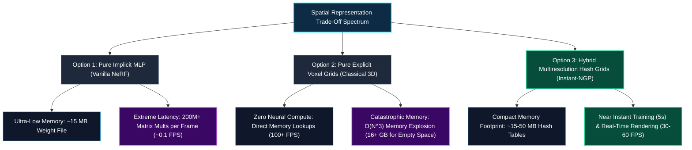
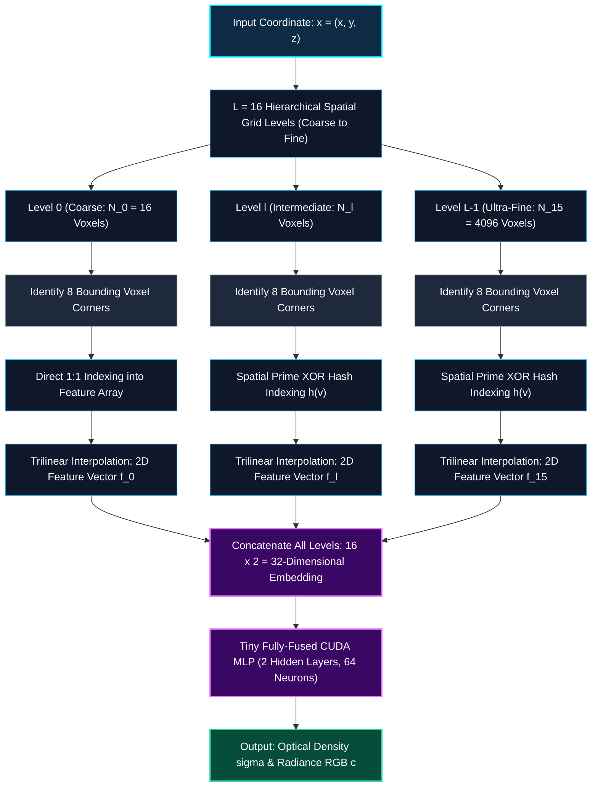
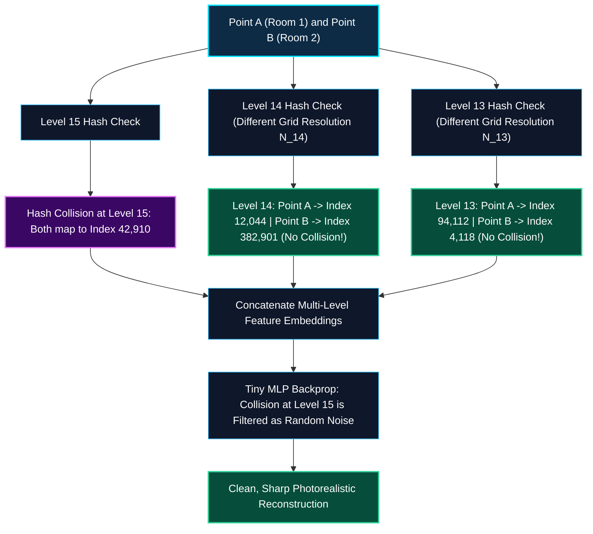
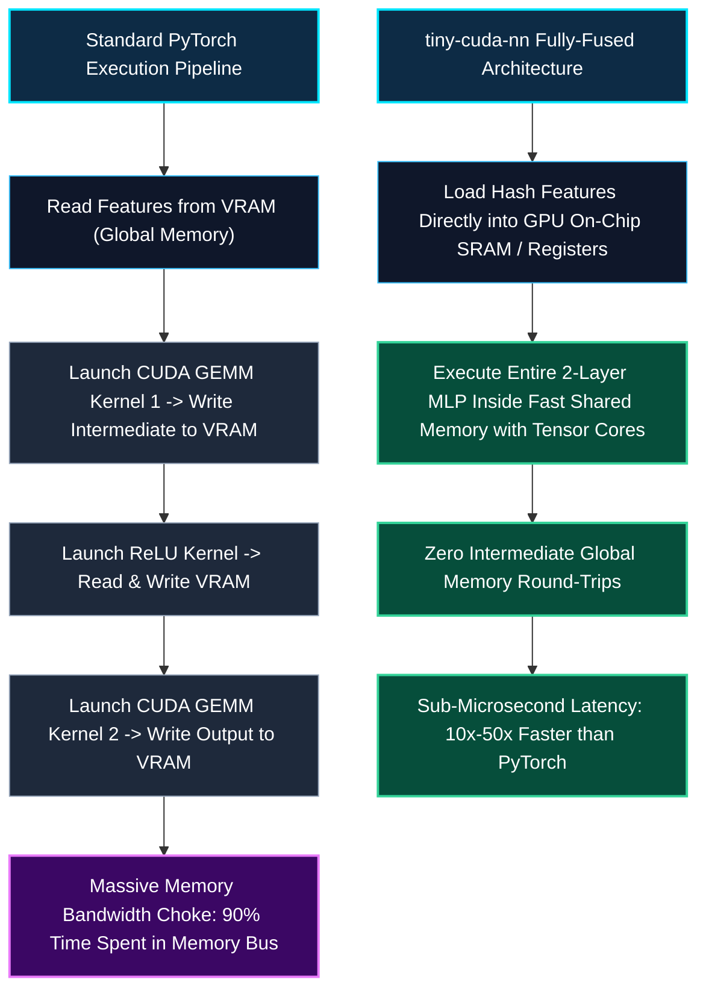
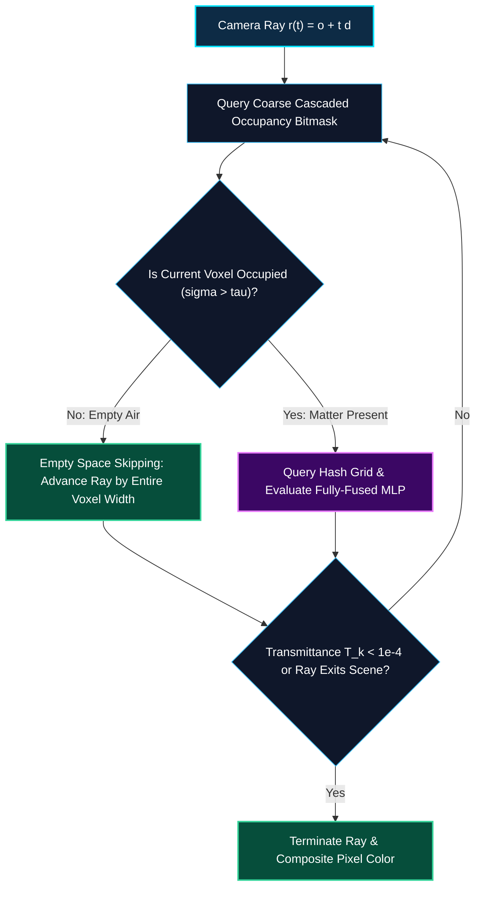

*Series: NVIDIA Physical AI & Robotics Ecosystem Series - Part 13*

*Series: &larr; [Part 12: Demystifying NeRFs: Volumetric Rendering & Implicit Coordinate Networks](/blog/demystifying-nerfs-volumetric-rendering-implicit-coordinate-networks/) (Previous)*
*Series: [Part 14: The 3D Gaussian Splatting Revolution: Real-Time Differentiable Primitives](/blog/3d-gaussian-splatting-revolution-real-time-differentiable-primitives/) (Next) &rarr;*

### Prior Reading Material

Before exploring multiresolution hash encodings and hardware-accelerated neural primitives, inspect these foundational articles from our series:

* [Part 1: Unpacking the NVIDIA Physical AI Data Factory (PAIDF) Stack](/blog/unpacking-nvidia-paidf-physical-ai-stack/) — Synthetic data generation and spatial computing pipelines.
* [Part 3: Unlocking NVIDIA Omniverse: Architecture, OpenUSD, RTX Rendering, and the Industrial Metaverse Ecosystem](/blog/unlocking-nvidia-omniverse-architecture/) — GPU path tracing and real-time volumetric scene composition.
* [Part 5: Scaling Physics with Isaac Sim & Omniverse Replicator](/blog/scaling-physics-isaac-sim-omniverse-replicator/) — Ray-traced sensor synthesis and GPU-accelerated domain randomization.
* [Part 9: The Evolutionary Arc of Computer Vision: From LeNet-5 and ResNet to ConvNeXt and 3D Video Models](/blog/evolutionary-arc-computer-vision-lenet-resnet-convnext-3d-video/) — From 2D spatial convolutions to spatiotemporal 3D coordinate representations.
* [Part 12: Demystifying NeRFs: Volumetric Rendering & Implicit Coordinate Networks](/blog/demystifying-nerfs-volumetric-rendering-implicit-coordinate-networks/) — Continuous 5D coordinate networks, Fourier positional encodings, and numerical volumetric quadrature.

---

### Official Research & Project Summary

| Milestone / Architecture | Key Research Papers | Primary Open-Source Repositories | Spatial Representation Type | Training Duration (1080p Scene) |
| :--- | :--- | :--- | :--- | :--- |
| **Vanilla NeRF** | [Mildenhall et al., ECCV 2020](https://arxiv.org/abs/2003.08934) | [nerf-pytorch](https://github.com/yenchenlin/nerf-pytorch), [nerfstudio](https://github.com/nerfstudio-project/nerfstudio) | Implicit: 8-Layer Deep MLP ($256$ Neurons) | 🐢 12–24 Hours |
| **Instant-NGP** | [Müller et al., SIGGRAPH 2022](https://arxiv.org/abs/2201.05989) | [NVlabs/instant-ngp](https://github.com/NVlabs/instant-ngp), [tiny-cuda-nn](https://github.com/NVlabs/tiny-cuda-nn) | Hybrid: Multiresolution Spatial Hash Table + Tiny 2-Layer MLP | ⚡ **5–15 Seconds** |
| **TensoRF** | [Chen et al., ECCV 2022](https://arxiv.org/abs/2203.09517) | [apchenstu/TensoRF](https://github.com/apchenstu/TensoRF) | Hybrid: Low-Rank Tensor Decomposition (CP/VM) | ⚡ ~10–25 Minutes |
| **Plenoxels** | [Fridovich-Keil et al., CVPR 2022](https://arxiv.org/abs/2112.05131) | [sxyu/svox2](https://github.com/sxyu/svox2) | Explicit: Sparse Trilinear Voxel Grid (No Neural Networks) | ⚡ ~10–15 Minutes |
| **3D Gaussian Splatting** | [Kerbl et al., SIGGRAPH 2023](https://arxiv.org/abs/2308.04079) | [graphdeco-inria/gaussian-splatting](https://github.com/graphdeco-inria/gaussian-splatting) | Explicit: Parametric Differentiable 3D Gaussians | ⚡ ~15–30 Minutes |

---

## 1. The Memory-Compute Dilemma: Deep MLPs vs. Dense Voxel Grids

When [Neural Radiance Fields (NeRF)](/blog/demystifying-nerfs-volumetric-rendering-implicit-coordinate-networks/) emerged in 2020, they unlocked photorealistic view synthesis by storing entire 3D scenes within the weights of an 8-layer Multilayer Perceptron (MLP).

Yet, NeRF was paralyzed by a crushing computational paradox.



### The Two Extremes

1. **The Pure Implicit Approach (Vanilla NeRF)**: 
   - A single 8-layer MLP with 256 neurons per layer stores the whole world in roughly $5 \text{ MB}$ of FP32 parameters.
   - However, every camera ray requires evaluating $192$ points along its path. Rendering a $1920 \times 1080$ frame demands **over 380 million forward passes**, bringing GPU hardware to its knees (~0.1 FPS).
2. **The Pure Explicit Approach (Dense Voxel Grids)**: 
   - To bypass neural computation, graphics engines can allocate a uniform 3D grid of voxels and store RGB and density values at every grid corner.
   - However, 3D space scales with cubic complexity: a high-resolution $1024 \times 1024 \times 1024$ voxel grid contains over **$1.07 \text{ billion voxels}$**. At 16 bytes per voxel, this consumes **$17.1 \text{ GB}$ of VRAM**—with $99\%$ of the memory completely wasted allocating empty air or occluded interior stone.

In 2022, Thomas Müller, Alex Evans, Christoph Schied, and Alexander Keller at NVIDIA Research published **Instant-NGP (Instant Neural Graphics Primitives)**. 

Instant-NGP dissolved the memory-compute dilemma by creating a **hierarchical multiresolution spatial hash table** coupled with a **tiny 2-layer CUDA neural network**. The result? NeRF models that train in **5 seconds** and render interactively at **30–60 FPS**.

---

## 2. The Multiresolution Spatial Hash Grid Architecture

Instead of forcing a giant neural network to memorize the entire spatial function, Instant-NGP offloads spatial indexing into **memory lookups**, leaving the neural network with only a trivial decoding task.



### 1. Geometric Resolution Scaling

Instant-NGP arranges $L$ independent grid levels (typically $L = 16$) geometrically spanning from a coarse base resolution $N_{\min} = 16$ to a fine resolution $N_{\max} = 4096$:

$$
N_l = \left\lfloor N_{\min} \cdot b^l \right\rfloor, \quad l \in [0, L-1]
$$

Where the geometric scale factor $b$ is computed as:

$$
b = \exp\left( \frac{\ln N_{\max} - \ln N_{\min}}{L - 1} \right)
$$

### 2. Spatial Hash Mapping

For coarse levels where the total number of grid vertices $(N_l + 1)^3$ is smaller than the maximum hash table capacity $T$ (e.g. $T = 2^{19} = 524,288$ entries), each vertex maps 1-to-1 to an array entry with zero hash collisions.

For fine levels where $(N_l + 1)^3 > T$, vertex coordinates $\mathbf{v} = (v_x, v_y, v_z) \in \mathbb{Z}^3$ are mapped into the hash table using a spatial prime XOR hash function:

$$
h(\mathbf{v}) = \left( \bigoplus_{i=1}^3 v_i \cdot \pi_i \right) \bmod T
$$

Where $\pi_1 = 1$, $\pi_2 = 2{,}654{,}435{,}761$, and $\pi_3 = 805{,}459{,}861$ are large prime integers that scatter 3D spatial points uniformly across the hash table.

---

## 3. Disambiguating Hash Collisions: Multi-Level Statistical Wisdom

A natural question arises: *If multiple distant points in the 3D scene hash to the exact same memory index, why doesn't the rendered image become corrupted with repeating ghost artifacts?*

The brilliance of Instant-NGP lies in **multi-level statistical disambiguation**:



Because each of the $L = 16$ levels uses a different grid resolution $N_l$, two points that collide at level $l$ will **never collide at levels $l-1$, $l-2$, or $l+1$**. 

During gradient descent, the shared hash entry at level $l$ receives conflicting gradient signals from both points, effectively averaging to zero or acting as pseudo-random noise. Meanwhile, the non-colliding levels provide consistent geometric signals. The tiny MLP easily learns to weigh the reliable levels, completely eliminating visual artifacts.

---

## 4. Hardware Optimization: `tiny-cuda-nn` & Fully-Fused MLPs

Accelerating spatial lookups is only half the battle. If you feed the resulting feature vectors into PyTorch or TensorFlow, you immediately hit GPU memory bandwidth bottlenecks.

### Why Standard PyTorch Fails for Micro-MLPs

In standard deep learning frameworks, executing a linear layer involves:
1. Reading activations from High-Bandwidth Memory (HBM/VRAM).
2. Launching a CUDA GEMM kernel.
3. Writing the output activations back to HBM.
4. Launching an activation kernel (e.g. ReLU) to read from HBM and write back.

For large language models with billions of parameters, compute time dwarfs memory transfer time. But for a tiny 2-layer MLP with 64 neurons, **GPU kernel launch latency and memory round-trips consume $90\%$ of total execution time**.



### The Fully-Fused CUDA Kernel

NVIDIA engineered the open-source [`tiny-cuda-nn`](https://github.com/NVlabs/tiny-cuda-nn) framework. 

`tiny-cuda-nn` fuses the entire 2-layer MLP into a single CUDA kernel. Weight matrices and activations are retained entirely within **on-chip fast SRAM (shared memory) and GPU registers**, leveraging FP16 Tensor Cores. Intermediate activation tensors are never written to global VRAM, enabling sub-microsecond inference throughput.

---

## 5. Occupancy Grids: Empty Space Skipping

In vanilla NeRF, the ray marcher steps uniformly through empty air, querying the network at every step.

Instant-NGP introduces a **cascaded binary occupancy grid** (a coarse $128^3$ bitmask) that tracks whether a region contains geometry ($\sigma > \tau$).



During ray marching:
1. The ray advances in large leaps across bitmask cells marked `0` (empty space).
2. The hash table and MLP are queried **only** when the ray strikes a cell marked `1` (matter).
3. This skips up to **$95\%$ of sample queries**, allowing Instant-NGP to render complex scenes in real time.

---

## 6. Formal Mathematical Formulations

### Trilinear Spatial Feature Interpolation

For a given 3D coordinate $\mathbf{x} \in \mathbb{R}^3$ at grid resolution level $l$, the scaled position within the grid is $\mathbf{x}_l = \mathbf{x} \cdot N_l$. 

Let $\mathbf{x}_{\lfloor \cdot \rfloor} = \lfloor \mathbf{x}_l \rfloor$ denote the base corner index, and $\mathbf{w} = \mathbf{x}_l - \mathbf{x}_{\lfloor \cdot \rfloor} \in [0, 1)^3$ denote the fractional offsets.

The interpolated feature vector $\mathbf{f}_l(\mathbf{x}) \in \mathbb{R}^F$ is computed via trilinear interpolation across the 8 bounding voxel corners:

$$
\mathbf{f}_l(\mathbf{x}) = \sum_{c_x \in \{0, 1\}} \sum_{c_y \in \{0, 1\}} \sum_{c_z \in \{0, 1\}} \mathbf{\theta}_{h(\mathbf{x}_{\lfloor \cdot \rfloor} + \mathbf{c})} \cdot \prod_{i \in \{x, y, z\}} \left( c_i w_i + (1 - c_i)(1 - w_i) \right)
$$

Where:
* $\mathbf{c} = (c_x, c_y, c_z) \in \{0, 1\}^3$ identifies the 8 bounding corners.
* $\mathbf{\theta}_{h(\cdot)} \in \mathbb{R}^F$ is the $F$-dimensional learned feature vector retrieved from hash index $h(\cdot)$.

### Multi-Level Feature Concatenation & Forward Pass

The feature vectors from all $L$ levels are concatenated alongside spherical harmonics features of viewing direction $\mathbf{d}$:

$$
\mathbf{y}(\mathbf{x}) = \left[ \mathbf{f}_0(\mathbf{x}), \mathbf{f}_1(\mathbf{x}), \dots, \mathbf{f}_{L-1}(\mathbf{x}) \right] \in \mathbb{R}^{L \cdot F}
$$

The optical density $\sigma$ and color $\mathbf{c}$ are evaluated via two small MLPs:

$$
\sigma(\mathbf{x}) = \operatorname{MLP}_{\text{density}}(\mathbf{y}(\mathbf{x}))
$$

$$
\mathbf{c}(\mathbf{x}, \mathbf{d}) = \operatorname{MLP}_{\text{color}}\left(\mathbf{y}(\mathbf{x}), \operatorname{SH}(\mathbf{d})\right)
$$

### Gradient Backpropagation Directly into Hash Table

During training, gradients of the photometric loss $\mathcal{L}$ flow backward through the tiny MLP directly into the feature vectors stored in the hash table:

$$
\frac{\partial \mathcal{L}}{\partial \mathbf{\theta}_k} = \sum_{\mathbf{x}: h(\mathbf{x}) = k} \frac{\partial \mathcal{L}}{\partial \mathbf{f}_l(\mathbf{x})} \frac{\partial \mathbf{f}_l(\mathbf{x})}{\partial \mathbf{\theta}_k}
$$

Because hash lookups are piecewise multilinear, gradients update the spatial embedding table directly, allowing instantaneous geometric convergence.

---

## 7. Interactive Python Simulation: Spatial Hash Grids & Trilinear Interpolation

To inspect spatial prime XOR hash mapping, multi-level resolution scaling, and 3D trilinear interpolation, execute the standalone Python script below.

<details><summary><b>Click to expand runnable Python simulation script</b></summary>

```python
#!/usr/bin/env python3
"""
Instant-NGP Simulation: Multiresolution Spatial Hash Tables & Trilinear Interpolation.
Zero external dependencies (pure Python standard library).
"""

import math
import random

class MultiresolutionHashGrid:
    """Simulates Instant-NGP multiresolution spatial hash tables with trilinear interpolation."""
    def __init__(self, num_levels: int = 4, feature_dim: int = 2, hash_table_size: int = 64, 
                 n_min: int = 4, n_max: int = 32):
        self.num_levels = num_levels
        self.feature_dim = feature_dim
        self.hash_table_size = hash_table_size
        self.n_min = n_min
        self.n_max = n_max
        
        # Prime multipliers for spatial hashing
        self.primes = [1, 2654435761, 805459861]
        
        # Calculate geometric growth factor b
        self.growth_factor = math.exp((math.log(n_max) - math.log(n_min)) / max(1, num_levels - 1))
        
        # Initialize hash tables for each resolution level
        self.hash_tables = []
        for level in range(num_levels):
            # Deterministic pseudo-random learned feature weights
            table = {}
            for idx in range(hash_table_size):
                table[idx] = [round(random.uniform(-0.5, 0.5), 4) for _ in range(feature_dim)]
            self.hash_tables.append(table)

    def get_grid_resolution(self, level: int) -> int:
        """Computes grid resolution N_l for given level."""
        return int(math.floor(self.n_min * (self.growth_factor ** level)))

    def spatial_hash(self, vx: int, vy: int, vz: int) -> int:
        """Applies spatial prime XOR hash function."""
        h = (vx * self.primes[0]) ^ (vy * self.primes[1]) ^ (vz * self.primes[2])
        return abs(h) % self.hash_table_size

    def trilinear_interpolate(self, point: tuple, level: int) -> list:
        """Evaluates 3D trilinear interpolation across 8 bounding voxel vertices."""
        res = self.get_grid_resolution(level)
        table = self.hash_tables[level]
        
        px, py, pz = point
        # Scaled continuous coordinate
        gx = px * res
        gy = py * res
        gz = pz * res
        
        # Base integer corner
        bx = int(math.floor(gx))
        by = int(math.floor(gy))
        bz = int(math.floor(gz))
        
        # Fractional interpolation weights
        wx = gx - bx
        wy = gy - by
        wz = gz - bz
        
        interpolated_features = [0.0] * self.feature_dim
        
        # Iterate over 8 corners
        for cx in (0, 1):
            for cy in (0, 1):
                for cz in (0, 1):
                    corner_vx = bx + cx
                    corner_vy = by + cy
                    corner_vz = bz + cz
                    
                    hash_idx = self.spatial_hash(corner_vx, corner_vy, corner_vz)
                    feature_vector = table[hash_idx]
                    
                    weight = (cx * wx + (1 - cx) * (1 - wx)) * \
                             (cy * wy + (1 - cy) * (1 - wy)) * \
                             (cz * wz + (1 - cz) * (1 - wz))
                    
                    for f in range(self.feature_dim):
                        interpolated_features[f] += weight * feature_vector[f]
                        
        return [round(f, 4) for f in interpolated_features]

    def encode(self, point: tuple) -> list:
        """Extracts and concatenates multiresolution feature embedding across all levels."""
        multilevel_embedding = []
        for l in range(self.num_levels):
            level_features = self.trilinear_interpolate(point, l)
            multilevel_embedding.extend(level_features)
        return multilevel_embedding


class TinyCUDAEmulatorMLP:
    """Simulates a lightweight 2-layer fully-fused neural decoder."""
    def __init__(self, input_dim: int = 8, hidden_dim: int = 16):
        self.input_dim = input_dim
        self.hidden_dim = hidden_dim
        random.seed(42)
        self.w1 = [[round(random.uniform(-0.2, 0.2), 3) for _ in range(input_dim)] for _ in range(hidden_dim)]
        self.w2_density = [round(random.uniform(-0.3, 0.3), 3) for _ in range(hidden_dim)]

    def forward(self, embedding: list) -> tuple:
        # Layer 1: GEMM + ReLU
        hidden = []
        for i in range(self.hidden_dim):
            val = sum(self.w1[i][j] * embedding[j] for j in range(self.input_dim))
            hidden.append(max(0.0, val)) # ReLU activation
        
        # Layer 2: Density linear output
        raw_density = sum(self.w2_density[i] * hidden[i] for i in range(self.hidden_dim))
        sigma = max(0.0, raw_density * 8.0) # Truncated density
        return round(sigma, 4)


def main():
    random.seed(1337)
    print("=" * 80)
    print("1. INSTANT-NGP: MULTIRESOLUTION HASH GRID ENCODING SIMULATION")
    print("=" * 80)
    
    hash_grid = MultiresolutionHashGrid(num_levels=4, feature_dim=2, hash_table_size=64, n_min=4, n_max=32)
    test_point = (0.35, 0.72, 0.18)
    
    print(f"Query 3D Coordinate Point (x, y, z): {test_point}")
    print(f"Geometric Growth Factor b          : {round(hash_grid.growth_factor, 4)}\n")
    
    print(f"{'Level':<8}{'Resolution N_l':<18}{'Corner Voxels':<18}{'Interpolated Feature Vector'}")
    print("-" * 75)
    for l in range(hash_grid.num_levels):
        res = hash_grid.get_grid_resolution(l)
        features = hash_grid.trilinear_interpolate(test_point, l)
        print(f"{l:<8}{res:<18}{res**3:<18}{features}")
    print("-" * 75)
    
    full_embedding = hash_grid.encode(test_point)
    print(f"\nConcatenated Embedding (L x F)     : {full_embedding}")
    print(f"Total Embedding Dimensionality      : {len(full_embedding)} dimensions\n")
    
    print("=" * 80)
    print("2. TINY FULLY-FUSED MLP DECODING")
    print("=" * 80)
    tiny_mlp = TinyCUDAEmulatorMLP(input_dim=len(full_embedding), hidden_dim=16)
    density_sigma = tiny_mlp.forward(full_embedding)
    print(f"Decoded Optical Density sigma       : {density_sigma}")
    print("=" * 80)

if __name__ == "__main__":
    main()
```

</details>

---

## 8. Summary & The Bridge to 3D Gaussian Splatting

Instant-NGP revolutionized neural rendering by demonstrating that implicit neural fields could be accelerated by thousands of times:

1. **Multiresolution Hash Encoding**: Offloading spatial indexing into hierarchical hash tables eliminated deep MLPs, slashing training time from hours to **5 seconds**.
2. **`tiny-cuda-nn`**: Executing micro-MLPs directly within GPU on-chip shared memory bypassed global memory bandwidth limits.
3. **Empty Space Skipping**: Cascaded occupancy bitmasks allowed camera rays to skip over empty volumes.

### The Next Frontier: Explicit Real-Time Primitives

While Instant-NGP reduced training to seconds, rendering high-resolution novel views still required marching rays through space. 

In **Part 14**, we explore how the 2023 breakthrough of **3D Gaussian Splatting (3DGS)** discarded ray marching entirely, returning to **millions of explicit, differentiable 3D ellipsoidal primitives** to achieve photorealistic rendering at **100+ FPS**.

---

### Series Navigation

*Series: &larr; [Part 12: Demystifying NeRFs: Volumetric Rendering & Implicit Coordinate Networks](/blog/demystifying-nerfs-volumetric-rendering-implicit-coordinate-networks/) (Previous)*
*Series: [Part 14: The 3D Gaussian Splatting Revolution: Real-Time Differentiable Primitives](/blog/3d-gaussian-splatting-revolution-real-time-differentiable-primitives/) (Next) &rarr;*
