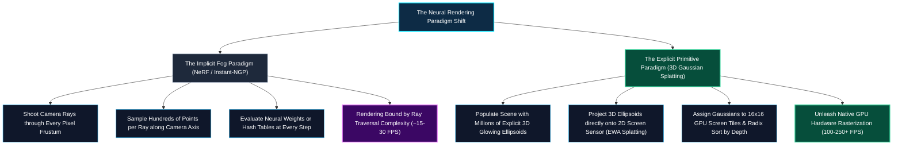
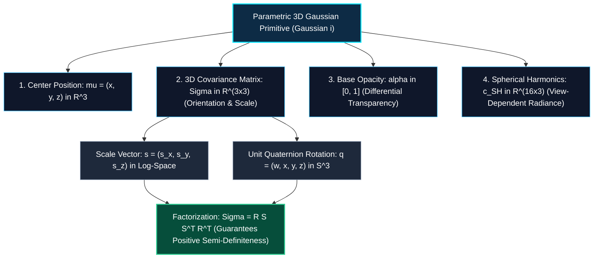
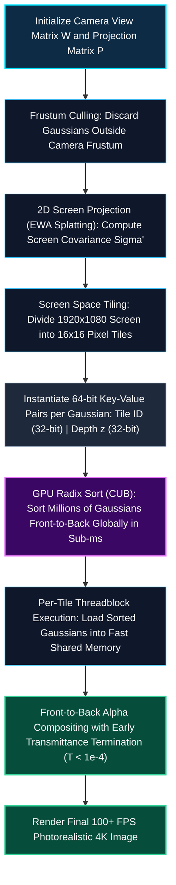
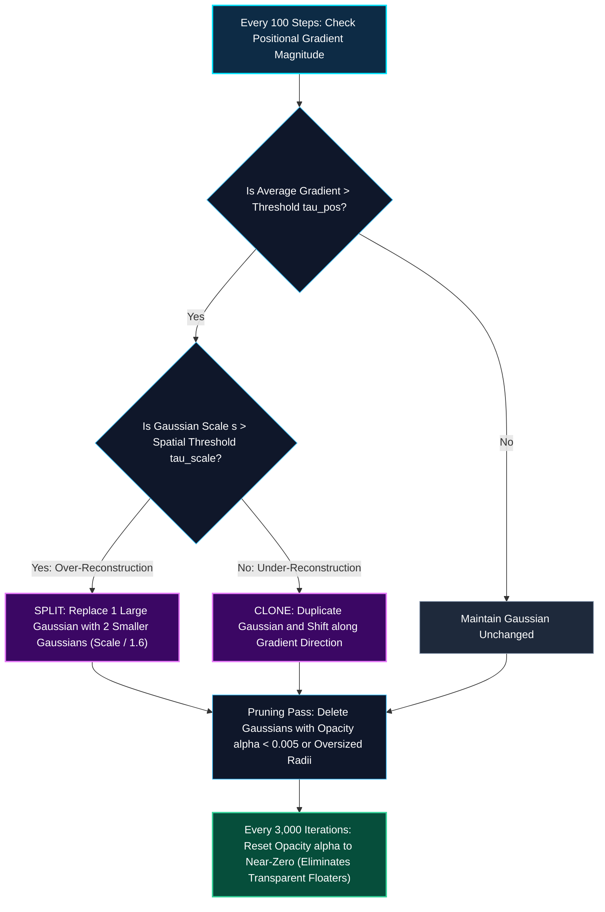

*Series: NVIDIA Physical AI & Robotics Ecosystem Series - Part 14*

*Series: &larr; [Part 13: Accelerating Implicit Fields: Instant-NGP & Multiresolution Hash Grids](/blog/accelerating-implicit-fields-instant-ngp-multiresolution-hash-grids/) (Previous)*
*Series: [Part 15: NVIDIA NuRec & Dynamic 3DGS: Photorealistic Digital Twins for Robotics & AV Simulation](/blog/nvidia-nurec-dynamic-3dgs-photorealistic-digital-twins/) (Next) &rarr;*

### Prior Reading Material

Before diving into differentiable rasterization and anisotropic Gaussian primitives, review these foundational articles across our Physical AI and Computer Vision series:

* [Part 1: Unpacking the NVIDIA Physical AI Data Factory (PAIDF) Stack](/blog/unpacking-nvidia-paidf-physical-ai-stack/) — Synthetic data generation and spatial computing pipelines.
* [Part 3: Unlocking NVIDIA Omniverse: Architecture, OpenUSD, RTX Rendering, and the Industrial Metaverse Ecosystem](/blog/unlocking-nvidia-omniverse-architecture/) — GPU path tracing and real-time volumetric scene composition.
* [Part 5: Scaling Physics with Isaac Sim & Omniverse Replicator](/blog/scaling-physics-isaac-sim-omniverse-replicator/) — Ray-traced sensor synthesis and GPU-accelerated domain randomization.
* [Part 12: Demystifying NeRFs: Volumetric Rendering & Implicit Coordinate Networks](/blog/demystifying-nerfs-volumetric-rendering-implicit-coordinate-networks/) — Continuous 5D coordinate networks, Fourier positional encodings, and numerical volumetric quadrature.
* [Part 13: Accelerating Implicit Fields: Instant-NGP & Multiresolution Hash Grids](/blog/accelerating-implicit-fields-instant-ngp-multiresolution-hash-grids/) — Multiresolution spatial hash tables, occupancy bitmasks, and tiny fully-fused CUDA MLPs.

---

### Official Research & Project Summary

| Dimension / Component | Specifications & Research Details |
| :--- | :--- |
| **Foundational Research Paper** | [3D Gaussian Splatting for Real-Time Radiance Field Rendering (Kerbl et al., SIGGRAPH 2023)](https://arxiv.org/abs/2308.04079) |
| **Primary Open-Source Repositories** | [graphdeco-inria/gaussian-splatting](https://github.com/graphdeco-inria/gaussian-splatting), [nerfstudio-project/gsplat](https://github.com/nerfstudio-project/gsplat) |
| **Interactive Viewers & Runtimes** | [SIBR_viewers (Inria)](https://gitlab.inria.fr/sibr/sibr_core), [PlayCanvas WebGL Gaussian Viewer](https://github.com/playcanvas/playcanvas-viewer) |
| **Geometric Primitive Type** | Explicit Parameterized Anisotropic 3D Gaussians $(\boldsymbol{\mu}, \boldsymbol{\Sigma}, \alpha, \mathbf{c}_{SH})$ |
| **Rendering Primitive** | Tile-Based Differentiable GPU Radix Sort & Alpha-Blending Rasterization |
| **Inference Throughput (1080p / 4K)** | ⚡ **100–250+ FPS** (Sub-5ms per 4K frame on modern RTX GPUs) |
| **Training Duration (COLMAP Initialization)** | ⚡ **15–30 Minutes** (30,000 optimization iterations) |

---

## 1. The Paradigm Shift: From Volumetric Fog to Glowing Ellipsoids

For three years following the release of NeRF in 2020, neural rendering was dominated by **implicit continuous representations**: shooting virtual camera rays into space and integrating numerical optical densities through neural networks.

Even with the multi-thousand-fold acceleration of [Instant-NGP](/blog/accelerating-implicit-fields-instant-ngp-multiresolution-hash-grids/), the fundamental bottleneck remained: **ray marching**. Every pixel required stepping through 3D space, computing trilinear interpolation weights, and accumulating transmittance.



In 2023, Bernhard Kerbl, Georgios Kopanas, Thomas Leimkühler, and George Drettakis published **3D Gaussian Splatting (3DGS)**. 

3DGS inverted the rendering equation:
* Instead of casting rays *into* an invisible volume, 3DGS models the scene as **millions of explicit, translucent 3D ellipsoidal Gaussian paint droplets**.
* Modern GPUs project these ellipsoids directly onto the 2D camera plane and composite them in parallel using lightning-fast **tile-based GPU radix sorting**.
* The result is the exact visual photorealism of continuous NeRFs, rendered in real time at **over 100 frames per second** at 4K resolution.

---

## 2. The Anatomy of a 3D Gaussian Primitive

Every object in a 3DGS scene is composed of an ensemble of anisotropic (non-spherical) 3D Gaussians. Each individual Gaussian $i$ is parameterized by four distinct geometric and radiometric attributes:



### 1. Spatial Probability Density Function

A 3D Gaussian centered at mean position $\boldsymbol{\mu} \in \mathbb{R}^3$ evaluates the continuous spatial density:

$$
G(\mathbf{x}) = \exp\left( -\frac{1}{2} (\mathbf{x} - \boldsymbol{\mu})^T \boldsymbol{\Sigma}^{-1} (\mathbf{x} - \boldsymbol{\mu}) \right)
$$

Where $\boldsymbol{\Sigma} \in \mathbb{R}^{3 \times 3}$ is the 3D covariance matrix describing the ellipsoid's three-dimensional dimensions and spatial tilt.

### 2. Covariance Factorization: $\boldsymbol{\Sigma} = \mathbf{R} \mathbf{S} \mathbf{S}^T \mathbf{R}^T$

During gradient descent, optimizing a $3 \times 3$ covariance matrix directly is dangerous: covariance matrices must remain **positive semi-definite (PSD)** at all times ($\det(\boldsymbol{\Sigma}) > 0$). If optimization produces a non-PSD matrix, the Gaussian collapses or produces imaginary spatial radii.

To guarantee physical validity throughout optimization without complex constrained optimization, 3DGS factorizes $\boldsymbol{\Sigma}$ into scaling $\mathbf{S}$ and rotation $\mathbf{R}$:

$$
\boldsymbol{\Sigma} = \mathbf{R} \mathbf{S} \mathbf{S}^T \mathbf{R}^T
$$

Where:
* $\mathbf{S} = \operatorname{diag}(s_x, s_y, s_z)$ is stored as 3 unconstrained real numbers in log-space ($s_i = \exp(\ell_i)$), guaranteeing strictly positive scale axes.
* $\mathbf{R}$ is parameterized by a normalized 4D unit quaternion $\mathbf{q} = (w, x, y, z)$, which is converted into an orthogonal $3 \times 3$ rotation matrix during the forward pass.

### 3. View-Dependent Radiance with Spherical Harmonics (SH)

Just as NeRF conditions color on the camera viewing angle, 3D Gaussians capture glossy specular highlights, anisotropic reflections, and Fresnel sheen using **Spherical Harmonics (SH)** basis functions:

$$
\mathbf{c}(\mathbf{d}) = \sum_{\ell=0}^{L_{\max}} \sum_{m=-\ell}^{\ell} c_\ell^m Y_\ell^m(\mathbf{d})
$$

Where $Y_\ell^m(\mathbf{d})$ are the real spherical harmonic basis functions evaluated on viewing direction unit vector $\mathbf{d} \in \mathbb{S}^2$. 

By setting maximum degree $L_{\max} = 3$, each Gaussian stores $(3+1)^2 = 16$ coefficient vectors (48 floating-point numbers for RGB). Degree $0$ captures diffuse base color, while degrees $1, 2, 3$ synthesize metallic sheens that change dynamically as the camera moves.

---

## 3. Tile-Based Differentiable GPU Rasterization

The defining breakthrough of 3DGS is its **tile-based differentiable GPU rasterizer**, which bypasses ray marching entirely by leveraging modern GPU graphics hardware architectures.



### The 2D Projection: EWA Splatting

To project a 3D Gaussian onto the camera sensor plane, 3DGS applies Elliptical Weighted Average (EWA) splatting (Zwicker et al., 2001).

Given camera extrinsic viewing matrix $\mathbf{W}$ and projective transformation Jacobian $\mathbf{J}$, the 2D projected screen covariance $\boldsymbol{\Sigma}' \in \mathbb{R}^{2 \times 2}$ is:

$$
\boldsymbol{\Sigma}' = \mathbf{J} \mathbf{W} \boldsymbol{\Sigma} \mathbf{W}^T \mathbf{J}^T
$$

To prevent aliasing when a Gaussian projects smaller than a single pixel, a low-pass filtering term $+0.3 \mathbf{I}_{2 \times 2}$ is added to the diagonal of $\boldsymbol{\Sigma}'$.

### GPU Radix Sorting in One Pass

1. The screen is divided into uniform **$16 \times 16$ pixel tiles**.
2. For each Gaussian overlapping a tile, a 64-bit sorting key is created:
   $$\text{Key} = \left[ \text{Tile ID (Bits 32–63)} \; \vert \; \text{View-Space Depth } z \text{ (Bits 0–31)} \right]$$
3. A single call to NVIDIA's high-speed GPU Radix Sort (`cub::DeviceRadixSort`) sorts millions of Gaussians across all tiles simultaneously in **under 0.5 milliseconds**.
4. Each $16 \times 16$ tile launches a CUDA threadblock. Pixels in the tile load the pre-sorted Gaussians into fast on-chip shared memory (SRAM) and evaluate front-to-back alpha compositing in parallel.

---

## 4. Adaptive Density Control: Splitting, Cloning, and Pruning

Starting from a sparse point cloud generated by Structure-from-Motion (COLMAP), 3DGS must autonomously populate empty regions and refine complex geometry.

Every $100$ optimization steps, 3DGS inspects the average positional gradient norm $\|\nabla_{\boldsymbol{\mu}} \mathcal{L}\|_2$ for every Gaussian:



1. **Under-Reconstruction (Cloning)**: If an object region lacks geometric primitives (small scale $s < \tau_s$ but high gradient), the Gaussian is cloned and shifted along the gradient vector to fill the geometric void.
2. **Over-Reconstruction (Splitting)**: If a single large Gaussian covers an intricate geometric surface (large scale $s > \tau_s$ and high gradient), it is split into two smaller Gaussians whose scale is divided by $1.6$, dividing the representation into finer details.
3. **Opacity Resetting & Pruning**: Gaussians with opacity $\alpha < 0.005$ are pruned. Every $3{,}000$ steps, all opacities are reset to near-zero ($\alpha = 0.01$), forcing the optimizer to re-justify their existence and ruthlessly destroying transparent "floaters".

---

## 5. Formal Mathematical Formulations

### Alpha-Compositing of Projected 2D Gaussians

For a pixel coordinate $p \in \mathbb{R}^2$, let $\mathcal{N}$ denote the ordered set of $M$ overlapping Gaussians sorted front-to-back by camera depth ($z_1 \le z_2 \le \dots \le z_M$). The rendered pixel color $C(p)$ is computed as:

$$
C(p) = \sum_{i \in \mathcal{N}} \mathbf{c}_i \alpha_i(p) \prod_{j=1}^{i-1} \left( 1 - \alpha_j(p) \right)
$$

Where the pixel-specific opacity $\alpha_i(p)$ evaluates the 2D projected Gaussian profile multiplied by learned base opacity $o_i \in [0, 1]$:

$$
\alpha_i(p) = o_i \exp\left( -\frac{1}{2} (p - \boldsymbol{\mu}'_i)^T (\boldsymbol{\Sigma}'_i)^{-1} (p - \boldsymbol{\mu}'_i) \right)
$$

Where $\boldsymbol{\mu}'_i \in \mathbb{R}^2$ is the projected 2D screen center, and $\boldsymbol{\Sigma}'_i \in \mathbb{R}^{2 \times 2}$ is the 2D screen covariance.

### Composite Training Loss Function

3DGS is optimized end-to-end by minimizing a combined $\mathcal{L}_1$ pixel error and Structural Similarity (D-SSIM) metric:

$$
\mathcal{L} = (1 - \lambda) \mathcal{L}_1(\hat{C}, C_{gt}) + \lambda \mathcal{L}_{\text{D-SSIM}}(\hat{C}, C_{gt})
$$

Where:
* $\mathcal{L}_1(\hat{C}, C_{gt}) = \frac{1}{|P|} \sum_{p \in P} |\hat{C}(p) - C_{gt}(p)|$
* $\mathcal{L}_{\text{D-SSIM}}(\hat{C}, C_{gt}) = 1 - \operatorname{SSIM}(\hat{C}, C_{gt})$
* Standard weighting parameter $\lambda = 0.2$.

---

## 6. Interactive Python Simulation: 3DGS Projection, Radix Sorting & Alpha-Blending

To inspect quaternion covariance factorization, 2D screen projection, and depth-sorted tile rasterization, run the zero-dependency Python script below.

<details><summary><b>Click to expand runnable Python simulation script</b></summary>

```python
#!/usr/bin/env python3
"""
3D Gaussian Splatting Simulation: Covariance Factorization, EWA Screen Projection, & Tile Rasterization.
Zero external dependencies (pure Python standard library).
"""

import math
import random

class Gaussian3D:
    """Represents an anisotropic 3D Gaussian primitive."""
    def __init__(self, gid: str, mean: tuple, scales: tuple, quaternion: tuple, opacity: float, color: tuple):
        self.gid = gid
        self.mean = mean # (x, y, z)
        self.scales = scales # (sx, sy, sz)
        self.q = quaternion # (w, x, y, z)
        self.opacity = opacity
        self.color = color # (r, g, b)

    def compute_rotation_matrix(self) -> list:
        """Converts normalized unit quaternion (w, x, y, z) to 3x3 rotation matrix R."""
        w, x, y, z = self.q
        norm = math.sqrt(w*w + x*x + y*y + z*z)
        w, x, y, z = w/norm, x/norm, y/norm, z/norm
        
        return [
            [1 - 2*(y*y + z*z), 2*(x*y - w*z),     2*(x*z + w*y)],
            [2*(x*y + w*z),     1 - 2*(x*x + z*z), 2*(y*z - w*x)],
            [2*(x*z - w*y),     2*(y*z + w*x),     1 - 2*(x*x + y*y)]
        ]

    def compute_3d_covariance(self) -> list:
        """Factorizes Sigma = R * S * S^T * R^T to guarantee positive semi-definiteness."""
        R = self.compute_rotation_matrix()
        sx, sy, sz = self.scales
        
        # M = R * S
        M = [
            [R[0][0]*sx, R[0][1]*sy, R[0][2]*sz],
            [R[1][0]*sx, R[1][1]*sy, R[1][2]*sz],
            [R[2][0]*sx, R[2][1]*sy, R[2][2]*sz]
        ]
        
        # Sigma = M * M^T
        Sigma = [[0.0]*3 for _ in range(3)]
        for i in range(3):
            for j in range(3):
                Sigma[i][j] = round(sum(M[i][k] * M[j][k] for k in range(3)), 4)
        return Sigma

    def project_to_screen_ewa(self, focal_length: float = 500.0) -> dict:
        """Projects 3D Gaussian to 2D screen covariance Sigma' using EWA Splatting."""
        x, y, z = self.mean
        if z <= 0.1:
            return None # Behind camera
        
        # 2D Screen Center
        px = focal_length * (x / z) + 400.0 # 800x800 resolution center
        py = focal_length * (y / z) + 400.0
        
        # Approximate 2D covariance diagonal from scale and depth
        Sigma_3d = self.compute_3d_covariance()
        inv_z = 1.0 / z
        inv_z2 = inv_z * inv_z
        
        # Projected 2D covariance + 0.3 low-pass pixel filter
        sigma_xx = round(focal_length**2 * inv_z2 * (Sigma_3d[0][0] + (x/z)**2 * Sigma_3d[2][2]) + 0.3, 3)
        sigma_yy = round(focal_length**2 * inv_z2 * (Sigma_3d[1][1] + (y/z)**2 * Sigma_3d[2][2]) + 0.3, 3)
        sigma_xy = round(focal_length**2 * inv_z2 * (Sigma_3d[0][1]), 3)
        
        return {
            "gid": self.gid,
            "screen_pos": (round(px, 2), round(py, 2)),
            "depth_z": round(z, 3),
            "cov_2d": [[sigma_xx, sigma_xy], [sigma_xy, sigma_yy]],
            "opacity": self.opacity,
            "color": self.color
        }


class TileRasterizer:
    """Simulates 16x16 GPU tile binning, depth sorting, and alpha-blending."""
    def __init__(self, tile_size: int = 16):
        self.tile_size = tile_size

    def render_pixel(self, projected_gaussians: list, target_pixel: tuple) -> dict:
        px, py = target_pixel
        overlapping = []
        
        for g in projected_gaussians:
            gx, gy = g["screen_pos"]
            dx = px - gx
            dy = py - gy
            cov = g["cov_2d"]
            
            # Determinant of 2x2 covariance
            det = cov[0][0]*cov[1][1] - cov[0][1]*cov[1][0]
            if det <= 1e-4:
                continue
            
            # Inverse covariance
            inv_cov = [
                [cov[1][1] / det, -cov[0][1] / det],
                [-cov[1][0] / det, cov[0][0] / det]
            ]
            
            # Mahalanobis power: 0.5 * d^T * inv_cov * d
            power = 0.5 * (dx * (inv_cov[0][0]*dx + inv_cov[0][1]*dy) + dy * (inv_cov[1][0]*dx + inv_cov[1][1]*dy))
            
            if power <= 4.5: # Inside 3-sigma bounding ellipse
                gaussian_profile = math.exp(-power)
                alpha_sample = g["opacity"] * gaussian_profile
                overlapping.append({
                    "gid": g["gid"],
                    "depth_z": g["depth_z"],
                    "alpha": round(alpha_sample, 4),
                    "color": g["color"]
                })
        
        # GPU Radix Sort: Sort ascending by depth (front-to-back)
        overlapping.sort(key=lambda item: item["depth_z"])
        
        # Alpha compositing
        accumulated_rgb = [0.0, 0.0, 0.0]
        transmittance = 1.0
        blend_logs = []
        
        for item in overlapping:
            alpha = item["alpha"]
            weight = transmittance * alpha
            r, g, b = item["color"]
            
            accumulated_rgb[0] += weight * r
            accumulated_rgb[1] += weight * g
            accumulated_rgb[2] += weight * b
            
            blend_logs.append({
                "gid": item["gid"],
                "z": item["depth_z"],
                "alpha": alpha,
                "weight": round(weight, 4),
                "transmittance_left": round(transmittance * (1.0 - alpha), 4)
            })
            
            transmittance *= (1.0 - alpha)
            if transmittance < 1e-4:
                break
                
        return {
            "pixel": target_pixel,
            "rendered_rgb": [round(c, 4) for c in accumulated_rgb],
            "final_transmittance": round(transmittance, 4),
            "blending_steps": blend_logs
        }


def main():
    print("=" * 80)
    print("1. 3D GAUSSIAN SPLATTING: COVARIANCE FACTORIZATION & 2D PROJECTION")
    print("=" * 80)
    
    # 3 Synthetic Gaussians
    g1 = Gaussian3D("G_Amber", mean=(0.1, 0.1, 2.5), scales=(0.2, 0.08, 0.1), quaternion=(1.0, 0.2, 0.0, 0.1), opacity=0.9, color=(1.0, 0.6, 0.1))
    g2 = Gaussian3D("G_Cyan",  mean=(0.12, 0.08, 3.2), scales=(0.3, 0.15, 0.1), quaternion=(0.9, 0.0, 0.3, 0.0), opacity=0.85, color=(0.0, 0.9, 1.0))
    g3 = Gaussian3D("G_Magenta", mean=(0.08, 0.14, 1.8), scales=(0.15, 0.15, 0.15), quaternion=(1.0, 0.0, 0.0, 0.0), opacity=0.95, color=(1.0, 0.2, 0.8))
    
    gaussians = [g1, g2, g3]
    projected = [g.project_to_screen_ewa() for g in gaussians if g.project_to_screen_ewa() is not None]
    
    print(f"{'Gaussian ID':<12}{'World (x,y,z)':<20}{'Screen Center (px,py)':<24}{'Depth z':<10}{'2D Covariance'}")
    print("-" * 80)
    for g, p in zip(gaussians, projected):
        print(f"{g.gid:<12}{str(g.mean):<20}{str(p['screen_pos']):<24}{p['depth_z']:<10}{p['cov_2d']}")
    print("-" * 80)
    
    print("\n" + "=" * 80)
    print("2. GPU TILE RADIX SORT & PARALLEL ALPHA-COMPOSITING SIMULATION")
    print("=" * 80)
    
    target_pixel = (420.0, 420.0)
    rasterizer = TileRasterizer()
    res = rasterizer.render_pixel(projected, target_pixel)
    
    print(f"Target Screen Pixel Coordinate: {target_pixel}")
    print(f"{'Rank / ID':<14}{'Depth (z)':<12}{'Sample Alpha':<14}{'Blending Weight':<18}{'Transmittance Remaining'}")
    print("-" * 80)
    for step in res["blending_steps"]:
        print(f"{step['gid']:<14}{step['z']:<12}{step['alpha']:<14}{step['weight']:<18}{step['transmittance_left']}")
    print("-" * 80)
    print(f"Synthesized 3DGS Pixel Color RGB : {res['rendered_rgb']}")
    print(f"Unoccluded Background Visibility : {res['final_transmittance']}")
    print("=" * 80)

if __name__ == "__main__":
    main()
```

</details>

---

## 7. Summary & The Road to Robotics Digital Twins

3D Gaussian Splatting transformed computer graphics by proving that neural view synthesis could achieve real-time rendering:

1. **Explicit Differentiable Primitives**: Replacing continuous MLPs with parameterized 3D ellipsoids factorized via $\boldsymbol{\Sigma} = \mathbf{R}\mathbf{S}\mathbf{S}^T\mathbf{R}^T$ eliminates gradient collapse.
2. **Tile-Based GPU Radix Sorting**: Binning Gaussians into $16 \times 16$ pixel tiles enables 100+ FPS photorealistic rendering on modern GPUs.
3. **Adaptive Density Optimization**: Dynamically cloning under-reconstructed geometry, splitting over-reconstructed primitives, and pruning floaters generates sharp, photorealistic 3D worlds.

### The Next Frontier: Dynamic Physical AI Digital Twins

While static 3DGS accurately reconstructs stationary scenes, physical AI and autonomous vehicles require modeling **dynamic worlds** with moving vehicles, walking pedestrians, and deformable objects.

In **Part 15**, we explore **NVIDIA NuRec (Neural Reconstruction)**, showing how NVIDIA integrates dynamic 3DGS with multi-camera, LiDAR, and IMU drive logs inside NVIDIA Omniverse & DRIVE Sim to create reactive closed-loop simulation environments.

---

### Series Navigation

*Series: &larr; [Part 13: Accelerating Implicit Fields: Instant-NGP & Multiresolution Hash Grids](/blog/accelerating-implicit-fields-instant-ngp-multiresolution-hash-grids/) (Previous)*
*Series: [Part 15: NVIDIA NuRec & Dynamic 3DGS: Photorealistic Digital Twins for Robotics & AV Simulation](/blog/nvidia-nurec-dynamic-3dgs-photorealistic-digital-twins/) (Next) &rarr;*
