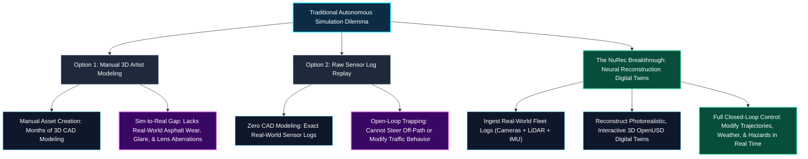
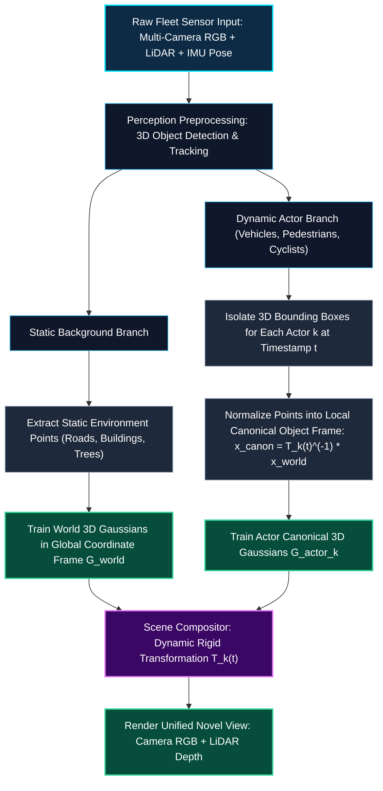
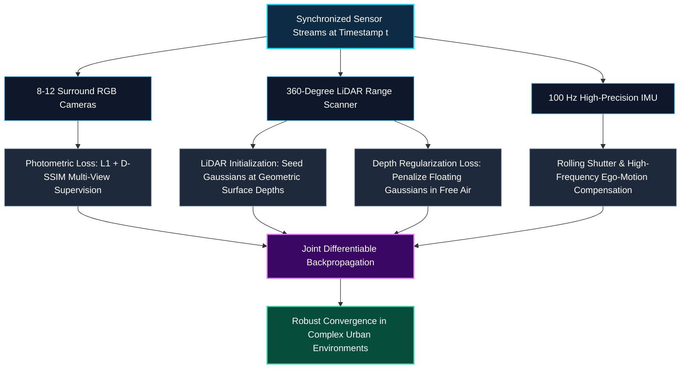
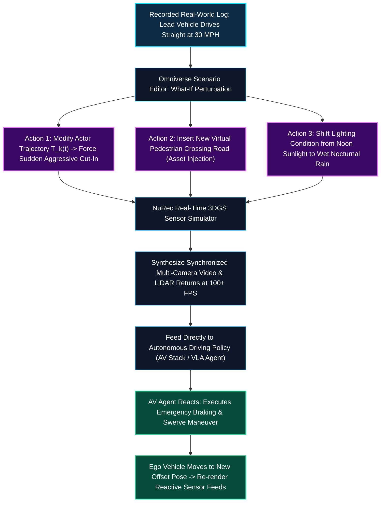

*Series: NVIDIA Physical AI & Robotics Ecosystem Series - Part 15*

*Series: &larr; [Part 14: The 3D Gaussian Splatting Revolution: Real-Time Differentiable Primitives](/blog/3d-gaussian-splatting-revolution-real-time-differentiable-primitives/) (Previous)*
*Series: [Part 16: The Neural Rendering Matrix: Comparing NeRFs, Instant-NGP, 3D Gaussian Splatting, and NuRec](/blog/neural-rendering-matrix-nerfs-instant-ngp-3dgs-nurec-comparison/) (Next) &rarr;*

### Prior Reading Material

Before exploring dynamic scene reconstruction and closed-loop robotics digital twins, review these foundational articles across our Physical AI series:

* [Part 1: Unpacking the NVIDIA Physical AI Data Factory (PAIDF) Stack](/blog/unpacking-nvidia-paidf-physical-ai-stack/) — End-to-end synthetic data pipelines for physical intelligence.
* [Part 3: Unlocking NVIDIA Omniverse: Architecture, OpenUSD, RTX Rendering, and the Industrial Metaverse Ecosystem](/blog/unlocking-nvidia-omniverse-architecture/) — Universal 3D scene description and RTX real-time simulation.
* [Part 5: Scaling Physics with Isaac Sim & Omniverse Replicator](/blog/scaling-physics-isaac-sim-omniverse-replicator/) — Ray-traced sensor synthesis and GPU-accelerated domain randomization.
* [Part 7: From Simulation to Streets: NVIDIA DRIVE & Alpamayo Autonomous Vehicle Architecture](/blog/from-simulation-to-streets-nvidia-drive-alpamayo-av-architecture/) — End-to-end AV perception stacks and centralized DRIVE Thor compute.
* [Part 11: NVIDIA Drive Cosmos & Cosmos-Drive-Dreams: Scalable Synthetic Driving Data Generation with World Foundation Models](/blog/nvidia-drive-cosmos-cosmos-drive-dreams-world-foundation-models/) — World foundation models for multi-view driving video generation.
* [Part 14: The 3D Gaussian Splatting Revolution: Real-Time Differentiable Primitives](/blog/3d-gaussian-splatting-revolution-real-time-differentiable-primitives/) — Explicit covariance parameterization, GPU radix sorting, and 100+ FPS differentiable rasterization.

---

### Official Research & Project Summary

| System / Component | Architecture & Specifications |
| :--- | :--- |
| **Official Platform** | [NVIDIA DRIVE Sim & Neural Reconstruction (NuRec)](https://developer.nvidia.com/drive/drive-sim) & [NVIDIA Technical Blog Announcement](https://developer.nvidia.com/blog/scale-av-perception-across-vehicle-platforms-with-nvidia-omniverse-nurec/) |
| **Underlying Framework** | [NVIDIA Omniverse](https://developer.nvidia.com/omniverse) & [OpenUSD (Universal Scene Description)](https://developer.nvidia.com/openusd) |
| **Public Datasets & Tools** | [Physical AI NuRec Dataset on Hugging Face](https://huggingface.co/datasets/nvidia/PhysicalAI-Autonomous-Vehicles-NuRec) & [NVIDIA Harmonizer](https://github.com/NVIDIA/harmonizer) |
| **Agent Automation Skills** | [NVIDIA NuRec Skills Repository](https://github.com/NVIDIA/nurec-skills) |
| **Input Sensor Modalities** | Synchronized Surround Multi-Camera (8–12 cams), 360° LiDAR Point Clouds, RTK-GPS, and 100Hz IMU Telemetry |
| **Neural Scene Representation** | Decoupled Dynamic 3D Gaussian Splatting (Static World + Deformable Canonical Actor Bounding Volumes) |
| **Sensor Synthesis Capabilities** | Photorealistic RGB Cameras, Depth Maps, Surface Normals, Multi-Carline Virtual Sensor Rigs, and Direct LiDAR Echoes |
| **Simulation Mode** | Interactive Closed-Loop Autonomous Driving Policy Verification, Counterfactual "What-If" Perturbation, & Cross-Carline Perception Adaptation |

---

## 1. The Sim-to-Real Bottleneck in Autonomous Robotics

Training and validating physical AI systems—such as autonomous delivery vehicles, robotaxis, and humanoid warehouse manipulators—demands billions of simulated test miles.

Historically, robotics simulation faced a severe dilemma:



### The Limitations of Manual 3D CAD vs. Open-Loop Log Replay

1. **Manual 3D Artists (Synthetic Worlds)**: Creating realistic digital cities in Unreal Engine or Unity takes teams of artists months. Furthermore, hand-modeled virtual worlds often lack the subtle physical micro-textures, lens flare, motion blur, and sensor noise present in real cameras, causing autonomous perception models to fail when deployed on physical streets (the Sim-to-Real gap).
2. **Raw Log Replay (Open-Loop Trapping)**: Replaying recorded camera videos from physical fleet drives provides 100% realism. However, it is strictly **open-loop**: if the autonomous driving model decides to brake earlier or turn left 1 meter sooner than the human driver did, the camera video cannot react. The car drives "blindly off the rails".

### The NuRec Paradigm: Real-World Drive Logs to Interactive Digital Twins

**NVIDIA NuRec (Neural Reconstruction)** bridges this gap. 

By ingesting raw multi-camera video, LiDAR point clouds, and IMU telemetry recorded during fleet drives, NuRec automatically reconstructs **complete, photorealistic 3D Gaussian digital twins** inside NVIDIA Omniverse. 

Robotics engineers can dynamically steer off the recorded path, inject hazardous "what-if" traffic scenarios, and re-simulate novel sensor feeds in real time.

---

## 2. Dynamic Scene Decomposition: Static World vs. Moving Actors

If you apply standard [3D Gaussian Splatting](/blog/3d-gaussian-splatting-revolution-real-time-differentiable-primitives/) to an urban drive log, the reconstruction fails catastrophically: moving cars and walking pedestrians produce elongated, transparent "ghost trails" across the road.

NuRec resolves this using **Dynamic Scene Decomposition**:



### 1. The Static World Representation
All stationary elements (asphalt roads, lane markings, sidewalks, buildings, traffic lights, and foliage) are mapped into a global static 3D Gaussian field $\mathcal{G}_{\text{static}}$. Planar surface regularizers ensure road surfaces remain flat and reflection-consistent.

### 2. The Canonical Actor Representation
For every moving entity $k$ (a sedan, delivery truck, or pedestrian), NuRec defines an independent **canonical 3D Gaussian model** $\mathcal{G}_{\text{actor}, k}$ centered at the vehicle's local origin $(0, 0, 0)$.

At any timestamp $t$, the actor's position and orientation in world space is governed by an $\mathrm{SE}(3)$ rigid transformation matrix $\mathbf{T}_k(t) \in \mathbb{R}^{4 \times 4}$:

$$
\mathbf{x}_{\text{world}}(t) = \mathbf{T}_k(t) \cdot \mathbf{x}_{\text{canonical}} = \mathbf{R}_k(t) \mathbf{x}_{\text{canonical}} + \mathbf{t}_k(t)
$$

Because the actor's 3D Gaussians are learned in a normalized canonical coordinate frame, the model pools photographic observations of the car across all frames, producing razor-sharp vehicle geometry free of motion blur.

---

## 3. Multimodal Sensor Supervision: Multi-Camera & LiDAR Fusion

Unlike academic neural rendering benchmarks that use clean synthetic images, real-world drive logs exhibit extreme lighting variations, direct solar glare, and sparse viewpoints.

NuRec fuses multi-camera RGB streams with synchronized 3D LiDAR point clouds:



1. **Geometric Initialization**: Rather than starting from sparse SfM points, NuRec initializes millions of 3D Gaussians directly along the calibrated LiDAR point cloud, ensuring millimeter-accurate initial geometry.
2. **LiDAR Depth Regularization**: For every camera ray, the rendered expected depth $\hat{D}(p)$ is constrained against the ground-truth LiDAR distance $D_{\text{lidar}}(p)$:
   $$\mathcal{L}_{\text{depth}} = \sum_{p \in \mathcal{P}_{\text{lidar}}} \left| \hat{D}(p) - D_{\text{lidar}}(p) \right|$$
   This prevents the neural optimizer from placing spurious transparent Gaussians in empty air.
3. **IMU Motion De-Warping**: Vehicle vibrations and rolling shutter distortions are compensated by interpolating high-frequency IMU poses along camera scanlines.

---

## 4. Closed-Loop "What-If" Simulation in NVIDIA DRIVE Sim & Omniverse

Because NuRec scenes are decoupled into static environments and independent canonical actors, they integrate natively into **NVIDIA Omniverse** as interactive **OpenUSD** stages.

Robotics test engineers can execute **closed-loop "what-if" counterfactual simulations**:



In closed-loop testing:
* The autonomous vehicle (AV) stack receives simulated camera and LiDAR frames generated on the fly.
* If the AV decides to brake harder, the simulated ego-vehicle slows down, generating novel camera perspectives that never existed in the original drive log.
* Long-tail safety hazards (near-miss collisions, pedestrian cut-ins) can be systematically tested across thousands of automated regression runs without risking physical hardware.

---

## 5. Cross-Platform Scaling: Carline Adaptation & Virtual Sensor Rigs with NVIDIA Harmonizer

A major bottleneck in commercial autonomous driving is **Carline Adaptation**. 

A perception stack is inextricably tied to the vehicle platform that carries it. Moving the exact same perception software from an SUV to a sedan, commercial van, or truck changes the physical environment perceived by the neural networks:
* **Mounting Heights**: Lowering camera height from 1.8 meters (SUV roof) to 1.2 meters (sedan windshield) alters pitch perspective, compression of road vanishing points, and ground-level curb visibility.
* **Fields of View (FOV) & Baselines**: Changes in camera lens focal lengths and stereo baselines shift object pixel sizes and multi-camera overlap margins.
* **Body Geometry & Blind Spots**: Different vehicle hood profiles and side mirrors create new occlusions.

```mermaid
flowchart TD
    C1["The Carline Adaptation Challenge"] --> C2["Traditional Bottleneck: Fleet Re-Collection"]
    C1 --> C3["The NuRec & Harmonizer Pipeline"]
    
    C2 --> C2a["Deploy Physical Fleet for Every Vehicle Variant (SUV, Sedan, Van)"]
    C2 --> C2b["Drive & Annotate Hundreds of Thousands of New Road Miles"]
    C2 --> C2c["Massive Costs, Months of Delays, High Hardware Dependency"]
    
    C3 --> C3a["Reconstruct Source Drive into OpenUSD USDZ Scene (NuRec 3DGS)"]
    C3 --> C3b["Define Target Carline Sensor Rig (New Intrinsics, Extrinsics, Mounting Heights)"]
    C3 --> C3c["Re-Render Synthetic Camera Streams from Target Rig Viewpoints"]
    C3 --> C3d["Apply NVIDIA Harmonizer: Temporal Consistency & Denoising Post-Processing"]
    C3 --> C3e["Fine-Tune Perception Models Before Target Vehicle Hardware Exists"]
    
    style C1 fill:#0d2b45,stroke:#00e5ff,stroke-width:2px,color:#ffffff
    style C2 fill:#1e293b,stroke:#94a3b8,stroke-width:1px,color:#ffffff
    style C3 fill:#064e3b,stroke:#34d399,stroke-width:2px,color:#ffffff
    style C2a fill:#0f172a,stroke:#38bdf8,stroke-width:1px,color:#ffffff
    style C2b fill:#0f172a,stroke:#38bdf8,stroke-width:1px,color:#ffffff
    style C2c fill:#3b0764,stroke:#e879f9,stroke-width:2px,color:#ffffff
    style C3a fill:#0f172a,stroke:#38bdf8,stroke-width:1px,color:#ffffff
    style C3b fill:#0f172a,stroke:#38bdf8,stroke-width:1px,color:#ffffff
    style C3c fill:#0f172a,stroke:#38bdf8,stroke-width:1px,color:#ffffff
    style C3d fill:#3b0764,stroke:#e879f9,stroke-width:2px,color:#ffffff
    style C3e fill:#064e3b,stroke:#34d399,stroke-width:2px,color:#ffffff
```



### The NuRec + Harmonizer Workflow

1. **Reconstruct USDZ Scene**: Real-world drive logs (e.g. from the [Physical AI NuRec Dataset on Hugging Face](https://huggingface.co/datasets/nvidia/PhysicalAI-Autonomous-Vehicles-NuRec) featuring 1,500+ neural reconstructed scenes across 6 camera views) are loaded as dynamic 3DGS stages.
2. **Target Sensor Rig Re-Rendering**: The target carline’s camera extrinsics ($\mathbf{T}_{\text{cam} \leftarrow \text{rig}}$) and intrinsics ($\mathbf{K}_{\text{target}}$) are instantiated in Omniverse. NuRec renders photorealistic camera streams from the target viewpoints.
3. **Sequence Refinement with NVIDIA Harmonizer**: Raw 3DGS novel view synthesis can contain subtle frame-to-frame high-frequency rasterization artifacts. **[NVIDIA Harmonizer](https://github.com/NVIDIA/harmonizer)** is applied as a temporal consistency post-processing model, smoothing lighting shifts and eliminating temporal shimmer across multi-camera streams.
4. **Automated Agent Skills**: The **[NVIDIA/nurec-skills](https://github.com/NVIDIA/nurec-skills)** repository packages this entire workflow into agent skills, automating scene downloading, virtual rig rendering, and Harmonizer processing.

In commercial AV validation, training on NuRec-rendered synthetic data yields massive relative precision and recall gains across target carlines compared to zero-shot transfer, bridging the fleet scaling gap before physical manufacturing begins.

---

## 6. Formal Mathematical Formulations

### Dynamic Scene Transformation

Let $\mathbf{x} \in \mathbb{R}^3$ be a point associated with dynamic actor $k$. The time-dependent mean position $\boldsymbol{\mu}_i(t)$ and 3D covariance $\boldsymbol{\Sigma}_i(t)$ of Gaussian primitive $i$ are transformed as:

$$
\boldsymbol{\mu}_i(t) = \mathbf{R}_k(t) \boldsymbol{\mu}_{i, \text{canonical}} + \mathbf{t}_k(t)
$$

$$
\boldsymbol{\Sigma}_i(t) = \mathbf{R}_k(t) \boldsymbol{\Sigma}_{i, \text{canonical}} \mathbf{R}_k(t)^T
$$

Where $\mathbf{R}_k(t) \in \mathrm{SO}(3)$ is the actor's orientation rotation matrix and $\mathbf{t}_k(t) \in \mathbb{R}^3$ is its translation vector at time $t$.

### Target Carline Virtual Rig Projection

When re-rendering a reconstructed scene point $\mathbf{x}_{\text{world}}$ for a target vehicle platform variant, the 2D projected pixel $\mathbf{p}_{\text{target}}$ is governed by the target vehicle's intrinsic calibration matrix $\mathbf{K}_{\text{target}}$ and extrinsic mounting pose $\mathbf{T}_{\text{cam} \leftarrow \text{rig}}^{\text{target}}$ relative to the vehicle coordinate center $\mathbf{T}_{\text{rig} \leftarrow \text{world}}$:

$$
\mathbf{p}_{\text{target}} \sim \mathbf{K}_{\text{target}} \cdot \mathbf{T}_{\text{cam} \leftarrow \text{rig}}^{\text{target}} \cdot \mathbf{T}_{\text{rig} \leftarrow \text{world}}(t) \cdot \begin{bmatrix} \mathbf{x}_{\text{world}} \\ 1 \end{bmatrix}
$$

### Temporal Consistency Refinement (NVIDIA Harmonizer)

To eliminate frame-to-frame high-frequency rendering artifacts during novel view re-rendering, **NVIDIA Harmonizer** $\mathcal{H}$ optimizes temporal sequence consistency by minimizing the warped photometric error across consecutive timeframes:

$$
\mathcal{L}_{\text{temporal}} = \sum_{t} \left\| \mathcal{H}(\hat{I}_t) - \mathcal{W}_{t \leftarrow t-1}\left(\mathcal{H}(\hat{I}_{t-1}), \mathbf{F}_{t \leftarrow t-1}\right) \right\|_1
$$

Where $\hat{I}_t$ is the raw rendered frame at time $t$, $\mathbf{F}_{t \leftarrow t-1}$ is the forward optical flow field, and $\mathcal{W}$ is the backward warping operator.

### Multi-Modal Training Objective

NuRec optimizes static Gaussians $\mathcal{G}_{\text{static}}$ and canonical actor Gaussians $\{\mathcal{G}_{\text{actor}, k}\}$ jointly:

$$
\mathcal{L}_{\text{total}} = \mathcal{L}_{\text{color}} + \lambda_{\text{depth}} \mathcal{L}_{\text{depth}} + \lambda_{\text{sky}} \mathcal{L}_{\text{sky}} + \lambda_{\text{reg}} \mathcal{L}_{\text{reg}}
$$

Where:
* $\mathcal{L}_{\text{color}} = (1 - \lambda)\mathcal{L}_1(\hat{C}, C_{gt}) + \lambda \mathcal{L}_{\text{D-SSIM}}(\hat{C}, C_{gt})$
* $\mathcal{L}_{\text{depth}} = \frac{1}{|\mathcal{P}_{\text{lidar}}|} \sum_{p \in \mathcal{P}_{\text{lidar}}} |\hat{D}(p) - D_{\text{lidar}}(p)|$
* $\mathcal{L}_{\text{sky}}$ enforces zero opacity ($\alpha \approx 0$) along camera rays pointing toward the sky dome.
* $\mathcal{L}_{\text{reg}}$ enforces scale isotropy and prevents degenerate needle-like Gaussians.

---

## 7. Interactive Python Simulation: Dynamic Actor Decomposition & Carline Sensor Rig Re-Rendering

To experience how dynamic actor decomposition, trajectory perturbation, and cross-carline sensor rig re-rendering function, run the self-contained Python simulation below.

<details><summary><b>Click to expand runnable Python simulation script</b></summary>

```python
#!/usr/bin/env python3
"""
NVIDIA NuRec Simulation: Dynamic 3DGS Scene Decomposition, Counterfactual Trajectory Editing,
and Cross-Carline Sensor Rig Re-Rendering (SUV vs Sedan).
Zero external dependencies (pure Python standard library).
"""

import math

class DynamicSceneSimulator:
    """Simulates static background Gaussians and dynamic actor canonical transformations."""
    def __init__(self):
        # 1. Static Environment: Road and Buildings
        self.static_gaussians = [
            {"id": "Road_Center", "pos": (0.0, -1.0, 15.0), "scale": (4.0, 0.1, 8.0), "color": (0.2, 0.2, 0.22), "opacity": 0.95},
            {"id": "Sidewalk_Left", "pos": (-3.5, -0.9, 15.0), "scale": (1.2, 0.2, 8.0), "color": (0.4, 0.4, 0.42), "opacity": 0.90},
            {"id": "Building_Right", "pos": (4.5, 1.5, 20.0), "scale": (2.0, 4.0, 6.0), "color": (0.6, 0.3, 0.2), "opacity": 0.85},
        ]
        
        # 2. Dynamic Actor: Canonical Sedan Centered at (0,0,0)
        self.actor_canonical_gaussians = [
            {"id": "Car_Chassis", "pos": (0.0, 0.0, 0.0), "scale": (1.8, 0.8, 3.5), "color": (0.9, 0.1, 0.1), "opacity": 0.98}, # Red sports car
            {"id": "Car_Windshield", "pos": (0.0, 0.5, 0.4), "scale": (1.5, 0.5, 1.2), "color": (0.1, 0.7, 0.9), "opacity": 0.75}, # Cyan glass
            {"id": "Car_Roof", "pos": (0.0, 0.8, -0.2), "scale": (1.4, 0.1, 1.8), "color": (0.9, 0.1, 0.1), "opacity": 0.95},
        ]

    def get_actor_pose_at_time(self, t: float, what_if_mode: bool = False) -> tuple:
        """
        Returns actor SE(3) pose (translation, yaw_angle_rad) at time t (seconds).
        If what_if_mode=True, injects an aggressive cut-in maneuver toward ego-lane.
        """
        if not what_if_mode:
            # Baseline: Car drives straight in adjacent lane at 10 m/s
            trans_x = 2.0
            trans_y = -0.5
            trans_z = 10.0 + 10.0 * t
            yaw = 0.0
        else:
            # What-If Perturbation: Car aggressively swerves left across lane boundary at t=1.0s
            progress = min(1.0, max(0.0, (t - 0.5) / 1.5))
            trans_x = 2.0 - 2.0 * progress # Swerves from x=2.0 (right lane) to x=0.0 (ego lane center)
            trans_y = -0.5
            trans_z = 10.0 + 8.0 * t
            yaw = -0.25 * math.sin(progress * math.pi) # Dynamic steering yaw
            
        return (round(trans_x, 3), round(trans_y, 3), round(trans_z, 3)), round(yaw, 3)

    def transform_actor_gaussians(self, translation: tuple, yaw: float) -> list:
        """Applies SE(3) transformation to canonical actor Gaussians."""
        tx, ty, tz = translation
        cos_y = math.cos(yaw)
        sin_y = math.sin(yaw)
        
        transformed = []
        for g in self.actor_canonical_gaussians:
            cx, cy, cz = g["pos"]
            # Rotate around Y-axis (Yaw)
            rx = cx * cos_y + cz * sin_y
            ry = cy
            rz = -cx * sin_y + cz * cos_y
            
            # Translate
            world_pos = (round(rx + tx, 3), round(ry + ty, 3), round(rz + tz, 3))
            transformed.append({
                "id": f"{g['id']}_world",
                "world_pos": world_pos,
                "color": g["color"],
                "opacity": g["opacity"]
            })
        return transformed

    def render_scene_snapshot(self, t: float, what_if: bool = False, camera_height_offset: float = 0.0, focal_length: float = 400.0) -> dict:
        """
        Renders scene through a parameterized camera sensor rig.
        camera_height_offset simulates varying vehicle mounting heights (e.g. SUV vs Sedan).
        """
        translation, yaw = self.get_actor_pose_at_time(t, what_if_mode=what_if)
        actor_world = self.transform_actor_gaussians(translation, yaw)
        
        all_objects = []
        # Project static
        for s in self.static_gaussians:
            x, y, z = s["pos"]
            cam_y = y - camera_height_offset
            px = round(focal_length * (x / z) + 400.0, 1)
            py = round(focal_length * (-cam_y / z) + 300.0, 1)
            all_objects.append({"id": s["id"], "type": "STATIC", "depth_z": z, "screen_px": (px, py), "color": s["color"]})
            
        # Project dynamic actor
        for a in actor_world:
            x, y, z = a["world_pos"]
            cam_y = y - camera_height_offset
            px = round(focal_length * (x / z) + 400.0, 1)
            py = round(focal_length * (-cam_y / z) + 300.0, 1)
            all_objects.append({"id": a["id"], "type": "DYNAMIC_ACTOR", "depth_z": z, "screen_px": (px, py), "color": a["color"]})
            
        all_objects.sort(key=lambda item: item["depth_z"])
        return {
            "timestamp": t,
            "what_if_active": what_if,
            "camera_height_offset": camera_height_offset,
            "actor_pose": {"pos": translation, "yaw_rad": yaw},
            "objects_rendered": all_objects
        }


def main():
    print("=" * 85)
    print("1. NUREC DYNAMIC SCENE DECOMPOSITION: BASELINE FLEET LOG REPLAY")
    print("=" * 85)
    sim = DynamicSceneSimulator()
    
    t_test = 1.2 # Timestamp 1.2 seconds into drive
    baseline = sim.render_scene_snapshot(t=t_test, what_if=False, camera_height_offset=0.0)
    
    print(f"Timestamp: {baseline['timestamp']}s | What-If Enabled: {baseline['what_if_active']}")
    print(f"Dynamic Actor Position: {baseline['actor_pose']['pos']} (Lane X=2.0, Ahead Z={baseline['actor_pose']['pos'][2]}m)\n")
    
    print(f"{'Object ID':<22}{'Category':<16}{'Depth (z)':<12}{'Screen Pixel (px, py)':<24}{'RGB Color'}")
    print("-" * 85)
    for obj in baseline["objects_rendered"]:
        print(f"{obj['id']:<22}{obj['type']:<16}{obj['depth_z']:<12}{str(obj['screen_px']):<24}{obj['color']}")
    print("-" * 85)
    
    print("\n" + "=" * 85)
    print("2. COUNTERFACTUAL 'WHAT-IF' SCENARIO: INJECTING AGGRESSIVE CUT-IN")
    print("=" * 85)
    
    whatif = sim.render_scene_snapshot(t=t_test, what_if=True, camera_height_offset=0.0)
    print(f"Timestamp: {whatif['timestamp']}s | What-If Enabled: {whatif['what_if_active']}")
    print(f"Modified Actor Pose   : Pos: {whatif['actor_pose']['pos']} | Yaw: {whatif['actor_pose']['yaw_rad']} rad")
    print(f"Safety Warning        : Lead vehicle cut into Ego Lane (X=0.93m)! Distance: {whatif['actor_pose']['pos'][2]}m\n")
    
    print(f"{'Object ID':<22}{'Category':<16}{'Depth (z)':<12}{'Screen Pixel (px, py)':<24}{'RGB Color'}")
    print("-" * 85)
    for obj in whatif["objects_rendered"]:
        print(f"{obj['id']:<22}{obj['type']:<16}{obj['depth_z']:<12}{str(obj['screen_px']):<24}{obj['color']}")
    print("-" * 85)

    print("\n" + "=" * 85)
    print("3. CROSS-CARLINE SENSOR RIG RE-RENDERING: SUV (Height +0.6m) vs SEDAN (Height 0.0m)")
    print("=" * 85)
    suv_render = sim.render_scene_snapshot(t=t_test, what_if=False, camera_height_offset=0.6, focal_length=380.0)
    sedan_render = sim.render_scene_snapshot(t=t_test, what_if=False, camera_height_offset=0.0, focal_length=420.0)

    print(f"Target Object: Lead Sedan Chassis (Depth Z={baseline['actor_pose']['pos'][2]}m)")
    suv_px = [obj["screen_px"] for obj in suv_render["objects_rendered"] if obj["id"] == "Car_Chassis_world"][0]
    sedan_px = [obj["screen_px"] for obj in sedan_render["objects_rendered"] if obj["id"] == "Car_Chassis_world"][0]
    print(f"  • Source SUV Rig   (Cam Height: 1.8m, Focal: 380px) -> Projected Screen Pixel: {suv_px}")
    print(f"  • Target Sedan Rig (Cam Height: 1.2m, Focal: 420px) -> Projected Screen Pixel: {sedan_px}")
    print(f"  • Vertical Pixel Delta: {abs(round(suv_px[1] - sedan_px[1], 1))}px shift | Pitch Perspective Adapted via NuRec")
    print("=" * 85)

if __name__ == "__main__":
    main()
```

</details>

---

## 8. Summary & The Full Neural Rendering Continuum

NVIDIA NuRec brings the mathematical elegance of Neural Rendering into the physical real world:

1. **Dynamic Scene Decomposition**: Decoupling the static world from canonical actor bounding frames allows modeling real-world traffic without motion artifacts.
2. **Multimodal Grounding**: Fusing multi-camera RGB with LiDAR range data ensures millimeter-accurate geometry and eliminates floating artifacts.
3. **Closed-Loop "What-If" Simulation**: Ingesting recorded drive logs into NVIDIA Omniverse enables interactive counterfactual stress-testing for autonomous driving and robotics policies.
4. **Cross-Carline Scaling with NVIDIA Harmonizer**: Re-rendering 3DGS scenes through target vehicle sensor rigs and refining frames with [NVIDIA Harmonizer](https://github.com/NVIDIA/harmonizer) enables zero-fleet data adaptation across diverse vehicle platforms.

### Up Next: The Neural Rendering Matrix

Now that we have traced the entire evolutionary arc—from foundational [NeRFs (Part 12)](/blog/demystifying-nerfs-volumetric-rendering-implicit-coordinate-networks/) and [Instant-NGP (Part 13)](/blog/accelerating-implicit-fields-instant-ngp-multiresolution-hash-grids/) to [3D Gaussian Splatting (Part 14)](/blog/3d-gaussian-splatting-revolution-real-time-differentiable-primitives/) and [NVIDIA NuRec (Part 15)](/blog/nvidia-nurec-dynamic-3dgs-photorealistic-digital-twins/)—how do these architectures compare side by side across memory, training time, rendering speed, and physical AI utility?

In **Part 16**, we present **The Neural Rendering Matrix**, an exhaustive architectural, mathematical, and benchmark comparison across all four paradigms.

---

### Series Navigation

*Series: &larr; [Part 14: The 3D Gaussian Splatting Revolution: Real-Time Differentiable Primitives](/blog/3d-gaussian-splatting-revolution-real-time-differentiable-primitives/) (Previous)*
*Series: [Part 16: The Neural Rendering Matrix: Comparing NeRFs, Instant-NGP, 3D Gaussian Splatting, and NuRec](/blog/neural-rendering-matrix-nerfs-instant-ngp-3dgs-nurec-comparison/) (Next) &rarr;*

