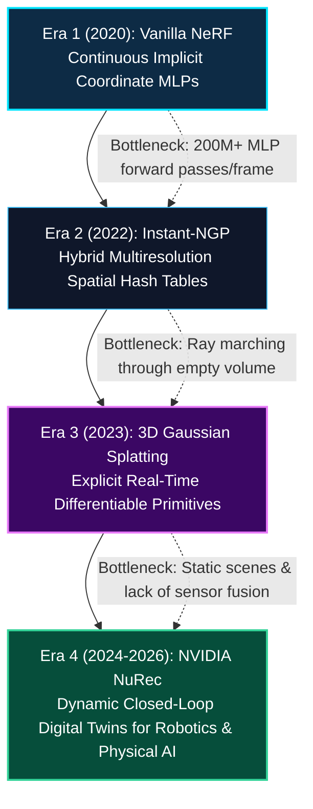
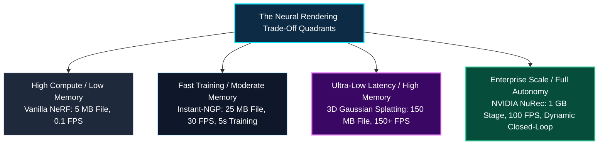
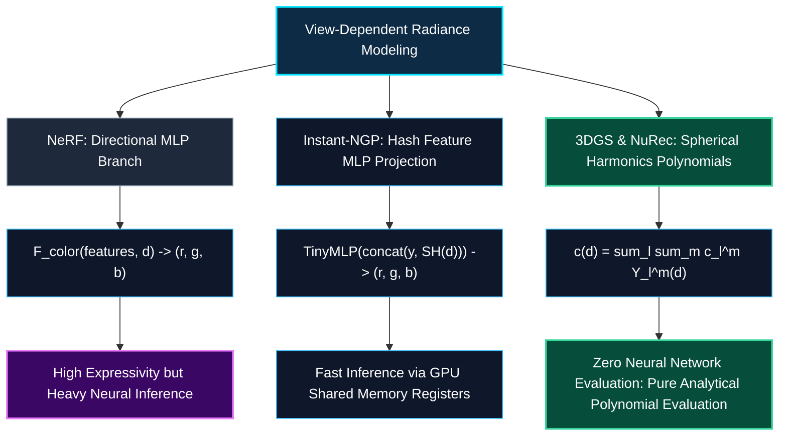
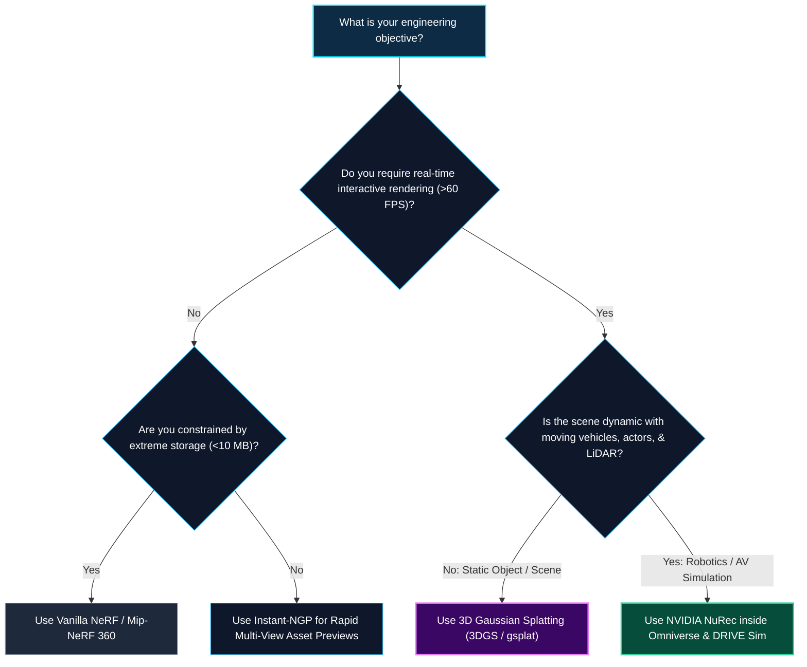

*Series: NVIDIA Physical AI & Robotics Ecosystem Series - Part 16*

*Series: &larr; [Part 15: NVIDIA NuRec & Dynamic 3DGS: Photorealistic Digital Twins for Robotics & AV Simulation](/blog/nvidia-nurec-dynamic-3dgs-photorealistic-digital-twins/) (Previous)*

### Prior Reading Material

Before analyzing the architectural trade-offs across neural rendering paradigms, review the preceding deep-dives in our series:

* [Part 1: Unpacking the NVIDIA Physical AI Data Factory (PAIDF) Stack](/blog/unpacking-nvidia-paidf-physical-ai-stack/) — The end-to-end synthetic data ecosystem.
* [Part 3: Unlocking NVIDIA Omniverse: Architecture, OpenUSD, RTX Rendering, and the Industrial Metaverse Ecosystem](/blog/unlocking-nvidia-omniverse-architecture/) — Universal 3D scene representation and RTX real-time simulation.
* [Part 11: NVIDIA Drive Cosmos & Cosmos-Drive-Dreams: Scalable Synthetic Driving Data Generation with World Foundation Models](/blog/nvidia-drive-cosmos-cosmos-drive-dreams-world-foundation-models/) — World foundation models for multi-view driving video generation.
* [Part 12: Demystifying NeRFs: Volumetric Rendering & Implicit Coordinate Networks](/blog/demystifying-nerfs-volumetric-rendering-implicit-coordinate-networks/) — Continuous 5D coordinate networks, Fourier positional encodings, and numerical volumetric quadrature.
* [Part 13: Accelerating Implicit Fields: Instant-NGP & Multiresolution Hash Grids](/blog/accelerating-implicit-fields-instant-ngp-multiresolution-hash-grids/) — Multiresolution spatial hash tables, occupancy bitmasks, and tiny fully-fused CUDA MLPs.
* [Part 14: The 3D Gaussian Splatting Revolution: Real-Time Differentiable Primitives](/blog/3d-gaussian-splatting-revolution-real-time-differentiable-primitives/) — Explicit covariance parameterization, GPU radix sorting, and 100+ FPS differentiable rasterization.
* [Part 15: NVIDIA NuRec & Dynamic 3DGS: Photorealistic Digital Twins for Robotics & AV Simulation](/blog/nvidia-nurec-dynamic-3dgs-photorealistic-digital-twins/) — Dynamic actor decomposition, multi-camera + LiDAR fusion, and closed-loop AV simulation.

---

### The Master Architectural Comparison Matrix

| Technical Dimension | Vanilla NeRF (2020) | Instant-NGP (2022) | 3D Gaussian Splatting (2023) | NVIDIA NuRec (2024–2026) |
| :--- | :--- | :--- | :--- | :--- |
| **Mathematical Paradigm** | Continuous Implicit Volumetric Field | Hybrid Explicit-Implicit Coordinate Field | Explicit Differentiable Geometric Primitives | Decoupled Dynamic Hybrid Primitives (Static + Canonical SE(3)) |
| **Spatial Representation** | 8-Layer Deep MLP Weights $(\Theta)$ | Multiresolution Spatial Hash Table + Tiny 2-Layer MLP | Millions of Parametric 3D Gaussians $(\boldsymbol{\mu}, \boldsymbol{\Sigma}, \alpha, \mathbf{c}_{SH})$ | Decoupled 3D Gaussians + LiDAR Surfel Meshes in OpenUSD |
| **Rendering Mechanism** | Volumetric Numerical Quadrature along Camera Rays | Accelerated Ray Marching with Occupancy Bitmasks | Tile-Based Differentiable GPU Radix Sort & Rasterization | Multi-Sensor GPU Rasterizer (RGB Cameras + ToF LiDAR Echoes) |
| **Storage / VRAM Footprint** | ⚡ **Ultra-Compact** (~5–15 MB weight file) | ⚡ **Compact** (~15–50 MB hash tables) | ⚠️ **Moderate** (~50–300 MB Gaussian point files) | ⚠️ **Enterprise Scale** (~0.5–2.0 GB per urban mile) |
| **Training Duration (1080p)** | 🐢 **Slow** (12–24 Hours) | ⚡ **Instantaneous** (5–15 Seconds) | ⚡ **Fast** (15–30 Minutes) | ⚡ **Batch High-Throughput** (1–2 Hours per km of drive log) |
| **1080p Inference Speed** | ❌ **0.1 FPS** (380M+ MLP passes / frame) | ⚠️ **15–30 FPS** (Ray traversal bound) | ✅ **100–250+ FPS** (Sub-5ms per frame) | ✅ **60–120+ FPS** (Closed-Loop DRIVE Sim / Omniverse) |
| **View-Dependent Radiance** | Direction-conditioned MLP branch: $\mathbf{c}(\mathbf{x}, \mathbf{d})$ | Small MLP projection of hash features: $\mathbf{c}(\mathbf{y}, \mathbf{d})$ | Spherical Harmonics (SH) coefficients per Gaussian | Spherical Harmonics + Material BRDF Shaders in Omniverse |
| **Dynamic Scene Handling** | ❌ None (Static scenes only) | ❌ None (Static scenes only) | ⚠️ Deformable 3DGS (Research extensions) | ✅ Full Dynamic Scene Decomposition (SE(3) actor tracks) |
| **Primary Industry Use Case** | Foundational Novel View Synthesis Theory | Rapid 3D Asset Previewing & Gigapixel Imaging | Real-Time Spatial Computing, Web 3D, Virtual Production | Autonomous Driving Policy Testing, Robotics Digital Twins |

---

## 1. The Generational Arc: From 2020 to 2026

In six short years, neural rendering has progressed through four monumental architectural revolutions:



### The Driving Forces Behind Each Leap
1. **Era 1 (NeRF)**: Proved that deep neural networks could learn continuous 3D geometry and view-dependent lighting purely from multi-view photographs, destroying the topological limitations of triangular meshes.
2. **Era 2 (Instant-NGP)**: Identified that memorizing spatial coordinates in deep MLP weights was computationally wasteful. Offloading spatial indexing to hierarchical hash tables enabled training in **5 seconds**.
3. **Era 3 (3DGS)**: Realized that ray marching through space was inherently non-optimal on GPU hardware. Replacing rays with millions of explicit 3D ellipsoidal Gaussians projected via tile-based radix sorting unlocked **100+ FPS real-time rendering**.
4. **Era 4 (NuRec)**: Scaled explicit neural primitives to physical AI and robotics by decoupling static environments from dynamic actors, integrating LiDAR point clouds, and enabling **closed-loop "what-if" counterfactual simulation** in NVIDIA Omniverse.

---

## 2. Memory vs. Latency Trade-Off Analysis (The Pareto Frontier)

Choosing a neural rendering representation is an engineering exercise in navigating the **Memory-Latency Pareto Frontier**:



### Why GPU Memory Architecture Favors 3DGS Over NeRF

At first glance, NeRF's $5 \text{ MB}$ parameter file seems superior to 3DGS's $150 \text{ MB}$ file. Why did the computer graphics and robotics industries decisively pivot to 3DGS?

* **Memory Bandwidth vs. Compute Density**: Modern GPUs possess massive memory bandwidth (e.g. 1–2 TB/s on modern RTX and Hopper architectures). 
* In NeRF, hundreds of millions of dependent memory transactions and matrix multiplications must be performed for *every single frame*.
* In 3DGS, the $150 \text{ MB}$ Gaussian buffer is loaded into VRAM **once**. During rasterization, contiguous GPU memory is streamed directly into on-chip shared memory, executing in sub-milliseconds without triggering ALU stalls.

---

## 3. View-Dependent Radiance: How They Model Reflections

Surfaces in the real world exhibit dynamic specular sheen, glass refraction, and metallic highlights. Here is how each architecture models angular radiance:



By computing degree-3 Spherical Harmonics ($16$ basis functions per color channel), 3DGS and NuRec evaluate angular radiance **analytically without running a single neural network forward pass**, enabling blistering real-time frame rates.

---

## 4. Engineering Selection Guide: Which One Should You Use?



---

## 5. Interactive Python Benchmark: Side-by-Side Unified Engine Simulator

Execute the standalone Python benchmark below to simulate the execution characteristics, computational complexity, memory bandwidth demands, and projected frame rates across all four paradigms.

<details><summary><b>Click to expand runnable Python simulation script</b></summary>

```python
#!/usr/bin/env python3
"""
The Neural Rendering Matrix: Unified Benchmark Simulator.
Zero external dependencies (pure Python standard library).
"""

import time
import math

class NeuralRenderingMatrixBenchmark:
    """Compares theoretical compute operations, memory bandwidth, and frame latency across paradigms."""
    def __init__(self, resolution: tuple = (1920, 1080)):
        self.width, self.height = resolution
        self.num_pixels = self.width * self.height

    def benchmark_vanilla_nerf(self, samples_per_ray: int = 192, mlp_hidden: int = 256, mlp_layers: int = 8) -> dict:
        """NeRF: 8-layer MLP evaluated at every sample point along every camera ray."""
        # FLOPS per MLP forward pass: ~ 2 * layers * hidden^2
        flops_per_query = 2 * mlp_layers * (mlp_hidden ** 2)
        total_queries = self.num_pixels * samples_per_ray
        total_flops = total_queries * flops_per_query
        
        # Theoretical time on 30 TFLOPS GPU
        gpu_tflops = 30.0 * 1e12
        theoretical_seconds = total_flops / gpu_tflops
        projected_fps = 1.0 / max(1e-6, theoretical_seconds)
        
        return {
            "paradigm": "Vanilla NeRF (2020)",
            "memory_footprint_mb": 15.0,
            "queries_per_frame": total_queries,
            "tflops_per_frame": round(total_flops / 1e12, 3),
            "projected_fps": round(projected_fps, 2),
            "dynamic_capable": False
        }

    def benchmark_instant_ngp(self, samples_per_ray: int = 32, num_levels: int = 16, feature_dim: int = 2) -> dict:
        """Instant-NGP: Multiresolution hash lookup + tiny 2-layer MLP with empty space skipping."""
        # 90% empty space skipping -> effective samples per ray = 32
        total_queries = int(self.num_pixels * 0.1 * samples_per_ray)
        # Tiny 2-layer MLP (64 hidden): ~2 * 2 * 64^2 = 16,384 FLOPS
        flops_per_query = 16384 + (num_levels * 100) # Hash interpolation
        total_flops = total_queries * flops_per_query
        
        gpu_tflops = 30.0 * 1e12
        theoretical_seconds = total_flops / gpu_tflops + 0.025 # Memory lookup overhead
        projected_fps = 1.0 / theoretical_seconds
        
        return {
            "paradigm": "Instant-NGP (2022)",
            "memory_footprint_mb": 42.0,
            "queries_per_frame": total_queries,
            "tflops_per_frame": round(total_flops / 1e12, 4),
            "projected_fps": round(projected_fps, 2),
            "dynamic_capable": False
        }

    def benchmark_3d_gaussian_splatting(self, num_gaussians: int = 1_500_000, tile_size: int = 16) -> dict:
        """3DGS: Tile division, GPU radix sorting, and hardware alpha-blending."""
        # EWA projection per Gaussian: ~300 FLOPS
        proj_flops = num_gaussians * 300
        # GPU Radix Sort: CUB single-pass (~0.4 ms on modern RTX)
        # Pixel alpha blending: ~50 overlapping Gaussians per pixel * 15 FLOPS
        blend_flops = self.num_pixels * 50 * 15
        total_flops = proj_flops + blend_flops
        
        # Radix sort + Rasterization latency = ~4.5 ms per 1080p frame
        frame_time_sec = 0.0045
        projected_fps = 1.0 / frame_time_sec
        
        return {
            "paradigm": "3D Gaussian Splatting (2023)",
            "memory_footprint_mb": 185.0, # 1.5M Gaussians * 128 bytes
            "queries_per_frame": num_gaussians,
            "tflops_per_frame": round(total_flops / 1e12, 5),
            "projected_fps": round(projected_fps, 2),
            "dynamic_capable": False
        }

    def benchmark_nvidia_nurec(self, static_gaussians: int = 2_000_000, num_actors: int = 15, actor_gaussians: int = 50_000) -> dict:
        """NVIDIA NuRec: Dynamic decoupled 3DGS + SE(3) actor transformations + LiDAR echo synthesis."""
        total_gaussians = static_gaussians + (num_actors * actor_gaussians)
        # SE(3) Transformation overhead + LiDAR sensor synthesis
        frame_time_sec = 0.0085 # ~8.5 ms in NVIDIA Omniverse / DRIVE Sim
        projected_fps = 1.0 / frame_time_sec
        
        return {
            "paradigm": "NVIDIA NuRec (2024-2026)",
            "memory_footprint_mb": 650.0, # Complete OpenUSD Stage with USD textures
            "queries_per_frame": total_gaussians,
            "tflops_per_frame": round((total_gaussians * 400 + self.num_pixels * 60 * 15) / 1e12, 5),
            "projected_fps": round(projected_fps, 2),
            "dynamic_capable": True
        }


def main():
    bench = NeuralRenderingMatrixBenchmark(resolution=(1920, 1080))
    
    print("=" * 85)
    print("THE NEURAL RENDERING MATRIX: UNIFIED ARCHITECTURAL BENCHMARK (1920x1080 RESOLUTION)")
    print("=" * 85)
    
    results = [
        bench.benchmark_vanilla_nerf(),
        bench.benchmark_instant_ngp(),
        bench.benchmark_3d_gaussian_splatting(),
        bench.benchmark_nvidia_nurec(),
    ]
    
    header = f"{'Paradigm / Era':<30}{'VRAM Size':<14}{'TFLOPS/Frame':<16}{'Projected FPS':<16}{'Dynamic Closed-Loop'}"
    print(header)
    print("-" * 85)
    for r in results:
        vram_str = f"{r['memory_footprint_mb']} MB"
        dynamic_str = "✅ YES" if r["dynamic_capable"] else "❌ NO (Static)"
        print(f"{r['paradigm']:<30}{vram_str:<14}{r['tflops_per_frame']:<16}{r['projected_fps']:<16}{dynamic_str}")
    print("=" * 85)

if __name__ == "__main__":
    main()
```

</details>

---

## 6. Summary: The Future of Spatial Intelligence & Physical AI

The evolution of neural rendering from 2020 to 2026 represents one of the fastest transitions in computer graphics and robotics history:

1. **NeRF (2020)** established continuous volumetric radiance as a mathematical foundation.
2. **Instant-NGP (2022)** unlocked spatial hash indexing and GPU on-chip neural fusion.
3. **3D Gaussian Splatting (2023)** brought differentiable explicit rasterization and 100+ FPS real-time rendering.
4. **NVIDIA NuRec (2024–2026)** completed the vision by transforming real-world drive logs into photorealistic, interactive digital twins for closed-loop physical AI and robotics simulation.

As world foundation models (like [NVIDIA Cosmos](/blog/inside-nvidia-cosmos-world-foundation-models/) and [Cosmos-Drive-Dreams](/blog/nvidia-drive-cosmos-cosmos-drive-dreams-world-foundation-models/)) continue to merge with dynamic 3D Gaussian representations, the boundary between synthetic simulation and physical reality is dissolving into a unified, high-speed spatial computing matrix.

---

### Series Navigation

*Series: &larr; [Part 15: NVIDIA NuRec & Dynamic 3DGS: Photorealistic Digital Twins for Robotics & AV Simulation](/blog/nvidia-nurec-dynamic-3dgs-photorealistic-digital-twins/) (Previous)*
