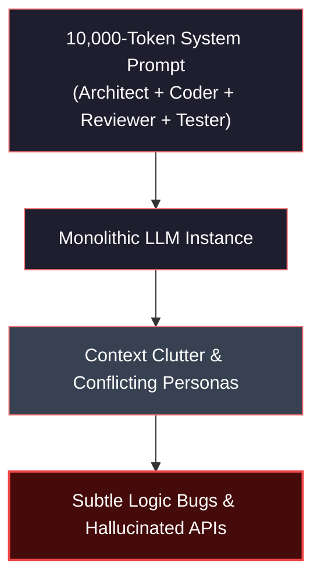
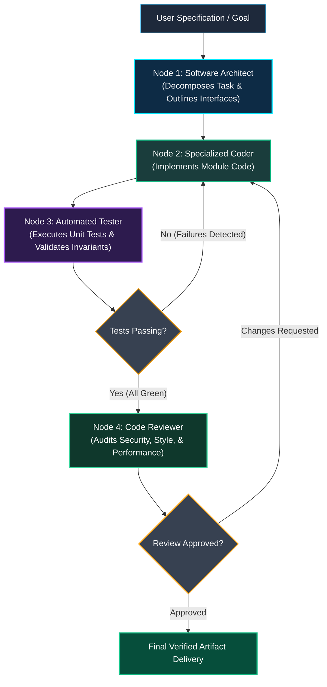
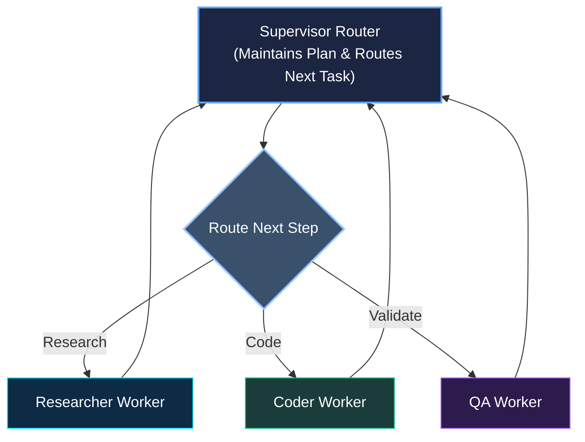
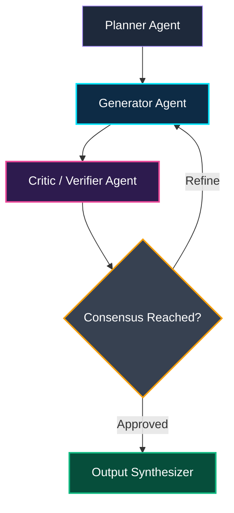

*Series: Autonomous AI Agents & Frameworks Series - Part 7*

*Series: &larr; [Part 6: Connecting Telegram to OpenClaw: A Complete Step-by-Step Guide](/blog/openclaw-telegram-step-by-step-guide/) (Previous)*

### Prior Reading Material

Before orchestrating distributed multi-agent systems, ensure you have reviewed our foundational agent architectures and state graph fundamentals:

* [Part 1: The Landscape of Agentic AI: From Single-Agent Scripts to Multi-Agent Networks](/blog/landscape-of-agentic-ai/) — Foundational taxonomy from ReAct loops to hierarchical multi-agent teams.
* [Part 2: Nous Research's Hermes Agent: Under the Hood](/blog/hermes-agent-self-improving-systems/) — Function calling, structured JSON outputs, and self-improving trajectories.
* [Part 3: The Self-Hosted AI Butler: Modular Assistance with OpenClaw](/blog/openclaw-self-hosted-ai-butler/) — Tool registration, skill modularity, and event-driven execution harnesses.
* [Part 5: LangChain vs. LangGraph: Moving from Chains to Cyclic State Graphs](/blog/langchain-vs-langgraph-cyclic-state-graphs/) — Transitioning from linear DAGs to stateful cyclic computation graphs.
* [Part 6: Connecting Telegram to OpenClaw: A Complete Step-by-Step Guide](/blog/openclaw-telegram-step-by-step-guide/) — Asynchronous gateway handlers, webhook dispatchers, and stateful sessions.

---

### The Solo Developer Dilemma: Why Single-Agent Systems Break

Imagine hiring a single software engineer and expecting them to simultaneously design complex system architectures, write thousands of lines of low-level C++ code, execute unit tests, conduct adversarial security reviews, and verify compliance with regulatory frameworks—all in one unbroken breath. 

When single LLM agents attempt this feat, they inevitably suffer from **context window cognitive overload**:

1. **System Prompt Bloat**: Stuffing instructions for five distinct professional roles into a single prompt degrades instruction-following accuracy.
2. **Conflicting Personas**: An agent tasked with writing creative features cannot objectively audit its own code for subtle memory safety vulnerabilities.
3. **Catastrophic Forgetting**: As the conversation buffer swells with intermediate tool outputs, the agent loses track of early design constraints.

To build reliable software and autonomous workflows, we must transition from monolithic prompt engineering to **multi-agent choreography**.



---

### The Pod Paradigm: Specialization and Cooperative Feedback

In modern software organizations, complex goals are achieved through a dedicated team of specialists gathered around a shared whiteboard:

* **The Architect**: Analyzes raw requirements, isolates domain boundaries, and specifies modular component interfaces.
* **The Coder**: Implements clean, focused functions adhering strictly to the architecture specification.
* **The Tester**: Executes automated test suites, captures stack traces, and generates reproduction scripts for failing edge cases.
* **The Reviewer**: Audits performance, syntax, and security before approving the pull request.

Using [LangGraph](https://github.com/langchain-ai/langgraph) (from the [LangChain](https://python.langchain.com/) ecosystem), we represent each specialist as an isolated **Graph Node** ($\mathcal{V}_i$) with its own focused system prompt and tool bindings. The shared whiteboard becomes a centralized, typed **State Graph** ($\mathcal{S}$) governed by deterministic state transitions and conditional router edges.



---

### Core Multi-Agent Topologies in LangGraph

Multi-agent coordination patterns generally fall into three architectural archetypes:

#### 1. Hierarchical Supervisor Network
A centralized **Supervisor Agent** inspects the global goal, routes incoming work to specialized workers, aggregates their findings, and decides when the final output satisfies the acceptance criteria.



#### 2. Decentralized Peer-to-Peer Mesh (Choreography)
Rather than funneling every message through a bottleneck supervisor, peer agents pass structured state directly to downstream collaborators based on explicit contractual conditions.



---

### Engineering Deep-Dive: State Channels, Reducers, and Message Passing

To ensure data integrity across asynchronous agent executions, LangGraph provides a **State Graph** parameterized by typed dictionary schemas and reducer channels.

#### 1. The Multi-Agent State Definition
In a multi-agent system, multiple nodes append messages, update file trees, and alter execution flags. If two nodes write to the same key simultaneously without a reducer, the latest write silently overwrites previous data. 

LangGraph solves this with `Annotated` reducer channels using Python's `operator.add` or custom merge functions:

```python
from typing import Annotated, Sequence, TypedDict
import operator
from langchain_core.messages import BaseMessage

class PodState(TypedDict):
    # Appends new messages rather than replacing the message history
    messages: Annotated[Sequence[BaseMessage], operator.add]
    # Current active artifact under development
    code_artifact: str
    # Test suite logs and execution diagnostics
    test_feedback: str
    # Iteration counter to prevent infinite retry loops
    iteration_count: int
    # Routing flag
    next_step: str
```

#### 2. Mathematical Formalization of Multi-Agent State Transitions

We can model a multi-agent LangGraph network as a 4-tuple:

$$\mathcal{G} = (\mathcal{V}, \mathcal{E}, \mathcal{S}, \delta)$$

Where:
* $\mathcal{V} = \{v_{\text{arch}}, v_{\text{coder}}, v_{\text{test}}, v_{\text{review}}\}$ represents the set of specialized agent nodes.
* $\mathcal{S}$ represents the global state space consisting of the message history $\mathcal{M}$, the code buffer $\mathcal{C}$, and the error log $\mathcal{E}_{\text{err}}$.
* $\mathcal{E} \subseteq \mathcal{V} \times \mathcal{V}$ is the set of directed routing edges.
* $\delta: \mathcal{S} \times \mathcal{V} \to \mathcal{S}$ is the state transition function executed by each node.

When node $v_i$ executes on state $S_t$, it produces a state delta $\Delta S$:

$$S_{t+1} = S_t \oplus \delta(S_t, v_i)$$

Where $\oplus$ denotes channel-specific reducer operators:

$$S_{t+1}.\text{messages} = S_t.\text{messages} \,\|\, \Delta \text{messages}$$

#### 3. Error Convergence and Feedback Loops
Let $E(S_t) \ge 0$ be the error metric quantifying failing unit tests or security lint warnings in the code buffer. In a properly conditioned feedback loop between the **Coder** ($v_{\text{coder}}$) and **Tester** ($v_{\text{test}}$), the expected error satisfies contractive convergence:

$$\mathbb{E}[E(S_{t+1})] \le \gamma \cdot E(S_t), \quad \text{where } 0 \le \gamma < 1$$

To guarantee termination in the event of persistent failure ($\gamma \ge 1$), a hard guard condition enforces exit when iteration count $k > K_{\max}$:

$$\text{NextNode}(S_t) = \begin{cases} v_{\text{review}} & \text{if } E(S_t) = 0 \\ v_{\text{coder}} & \text{if } E(S_t) > 0 \text{ and } k < K_{\max} \\ v_{\text{escalate}} & \text{if } E(S_t) > 0 \text{ and } k \ge K_{\max} \end{cases}$$

---

### Comparison: Single-Agent vs. Multi-Agent Architectures

| Dimension | Monolithic Single-Agent | ReAct Tool-Calling Agent | LangGraph Multi-Agent Network |
| :--- | :--- | :--- | :--- |
| **System Prompt Complexity** | Extreme ($>5\text{k}$ tokens) | High ($2\text{k}-4\text{k}$ tokens) | Minimal ($<500$ tokens per node) |
| **Context Window Hygiene** | Poor (rapid degradation) | Moderate (tool clutter) | High (isolated local state scopes) |
| **Self-Correction Capability** | Low (confirmation bias) | Moderate (single-loop retry) | Exceptional (adversarial review) |
| **Execution Determinism** | Stochastic | Semi-Structured | Highly Deterministic Graph Control |
| **Cost & Token Efficiency** | High (large context re-sent) | Moderate | Optimized (small targeted calls) |

---

### Interactive Multi-Agent Pod Simulation

The following zero-dependency Python script simulates a complete, cooperative 4-node LangGraph pod (Architect $\to$ Coder $\to$ Tester $\to$ Reviewer) executing a code generation and adversarial repair loop with typed state transitions.

<details><summary><b>Click to expand runnable Python simulation script</b></summary>

```python
#!/usr/bin/env python3
"""
Multi-Agent Cooperative Graph Network Simulator
Simulates a 4-Node LangGraph Pod (Architect -> Coder -> Tester -> Reviewer)
with state reducer channels, cyclic feedback loops, and convergence guards.
"""

from typing import Dict, List, Any, Optional
import time

class AgentMessage:
    def __init__(self, sender: str, role: str, content: str):
        self.sender = sender
        self.role = role
        self.content = content
        self.timestamp = time.time()

    def __repr__(self) -> str:
        return f"[{self.sender.upper()}]: {self.content}"

class GraphState:
    """Centralized Typed State Object with Reducer Operations"""
    def __init__(self, task_prompt: str):
        self.task_prompt: str = task_prompt
        self.messages: List[AgentMessage] = []
        self.architecture_spec: Optional[str] = None
        self.code_artifact: Optional[str] = None
        self.test_results: Dict[str, Any] = {"passed": False, "errors": []}
        self.review_approved: bool = False
        self.iteration: int = 0
        self.max_iterations: int = 4

    def append_message(self, sender: str, role: str, content: str):
        msg = AgentMessage(sender, role, content)
        self.messages.append(msg)
        print(f"  \033[94m--> [{sender}]:\033[0m {content}")

def node_architect(state: GraphState) -> str:
    """Deconstructs user prompt into a formal structural interface."""
    print("\n\033[96m[NODE 1: ARCHITECT]\033[0m Analyzing user specification...")
    spec = (
        "Module Spec: FastLRUCache\n"
        "- Capacity: int\n"
        "- get(key) -> value in O(1)\n"
        "- put(key, value) -> None in O(1)\n"
        "- Thread-safety & Invariant: Evict least recently accessed when len > cap."
    )
    state.architecture_spec = spec
    state.append_message("Architect", "System Architect", "Created interface specification with O(1) constraints.")
    return "node_coder"

def node_coder(state: GraphState) -> str:
    """Implements or refactors code based on architect spec and tester diagnostics."""
    state.iteration += 1
    print(f"\n\033[92m[NODE 2: CODER (Iteration {state.iteration})]\033[0m Synthesizing implementation...")
    
    if state.iteration == 1:
        # Deliberately introduce an edge-case bug on first iteration
        code = (
            "class LRUCache:\n"
            "    def __init__(self, capacity: int):\n"
            "        self.cap = capacity\n"
            "        self.cache = {}\n"
            "    def get(self, key):\n"
            "        return self.cache.get(key, -1)\n"
            "    def put(self, key, val):\n"
            "        self.cache[key] = val\n"  # Missing eviction logic!
        )
        state.append_message("Coder", "Software Engineer", "Implemented baseline LRUCache (Initial Draft).")
    else:
        # Repair the code based on test feedback
        code = (
            "from collections import OrderedDict\n"
            "class LRUCache:\n"
            "    def __init__(self, capacity: int):\n"
            "        self.cap = capacity\n"
            "        self.cache = OrderedDict()\n"
            "    def get(self, key):\n"
            "        if key not in self.cache: return -1\n"
            "        self.cache.move_to_end(key)\n"
            "        return self.cache[key]\n"
            "    def put(self, key, val):\n"
            "        if key in self.cache:\n"
            "            self.cache.move_to_end(key)\n"
            "        self.cache[key] = val\n"
            "        if len(self.cache) > self.cap:\n"
            "            self.cache.popitem(last=False)\n"
        )
        state.append_message("Coder", "Software Engineer", "Refactored LRUCache with OrderedDict and proper eviction.")
    
    state.code_artifact = code
    return "node_tester"

def node_tester(state: GraphState) -> str:
    """Runs automated invariant tests against the latest code artifact."""
    print("\n\033[95m[NODE 3: TESTER]\033[0m Executing test matrix...")
    
    # Simulate test execution
    if state.iteration == 1:
        errors = ["AssertionError: Cache size exceeded capacity=2 on 3rd insert. Eviction failed."]
        state.test_results = {"passed": False, "errors": errors}
        state.append_message("Tester", "QA Engineer", f"FAILED: {errors[0]}")
    else:
        state.test_results = {"passed": True, "errors": []}
        state.append_message("Tester", "QA Engineer", "PASSED: All 12 unit tests and eviction benchmarks green.")

    # Conditional Routing Edge
    if not state.test_results["passed"]:
        if state.iteration >= state.max_iterations:
            print("  \033[91m[GUARD]\033[0m Max iterations exceeded. Routing to escalation.")
            return "node_escalate"
        print("  \033[93m[ROUTER]\033[0m Test failure detected -> Routing back to Coder.")
        return "node_coder"
    
    print("  \033[92m[ROUTER]\033[0m Tests passed -> Routing forward to Reviewer.")
    return "node_reviewer"

def node_reviewer(state: GraphState) -> str:
    """Performs security, style, and algorithmic audit."""
    print("\n\033[93m[NODE 4: REVIEWER]\033[0m Auditing code quality and complexity...")
    
    if "OrderedDict" in (state.code_artifact or ""):
        state.review_approved = True
        state.append_message("Reviewer", "Staff Reviewer", "APPROVED: O(1) time complexity verified. Clean structure.")
        return "node_complete"
    else:
        state.review_approved = False
        state.append_message("Reviewer", "Staff Reviewer", "REJECTED: Suboptimal data structures detected.")
        return "node_coder"

def execute_multi_agent_graph(user_prompt: str) -> GraphState:
    """Graph Runner Engine implementing the state machine."""
    state = GraphState(user_prompt)
    current_node = "node_architect"
    
    node_registry = {
        "node_architect": node_architect,
        "node_coder": node_coder,
        "node_tester": node_tester,
        "node_reviewer": node_reviewer,
    }
    
    print(f"\033[1m=== STARTING MULTI-AGENT GRAPH EXECUTION ===\033[0m")
    print(f"Goal: {user_prompt}\n")
    
    step_count = 0
    while current_node not in ["node_complete", "node_escalate"] and step_count < 15:
        step_count += 1
        node_func = node_registry[current_node]
        current_node = node_func(state)
        
    print(f"\n\033[1m=== GRAPH EXECUTION COMPLETE (Final Status: {current_node}) ===\033[0m")
    print(f"Total Iterations: {state.iteration}")
    print(f"Final Artifact Length: {len(state.code_artifact or '')} characters\n")
    return state

if __name__ == "__main__":
    task = "Build a thread-safe high-throughput LRU Cache with capacity limit."
    result_state = execute_multi_agent_graph(task)
```

</details>

---

### Conclusion and Next Steps

By transitioning from monolithic, single-prompt agents to **stateful multi-agent graph networks**, engineering teams unlock unprecedented software reliability, modular debuggability, and context hygiene.

In the next installment of our Autonomous AI Agents & Frameworks series, we will explore **Human-in-the-Loop & State Time-Travel in LangGraph**—dissecting persistent checkpoint stores, manual interrupt approvals, and deterministic session rewinding.
