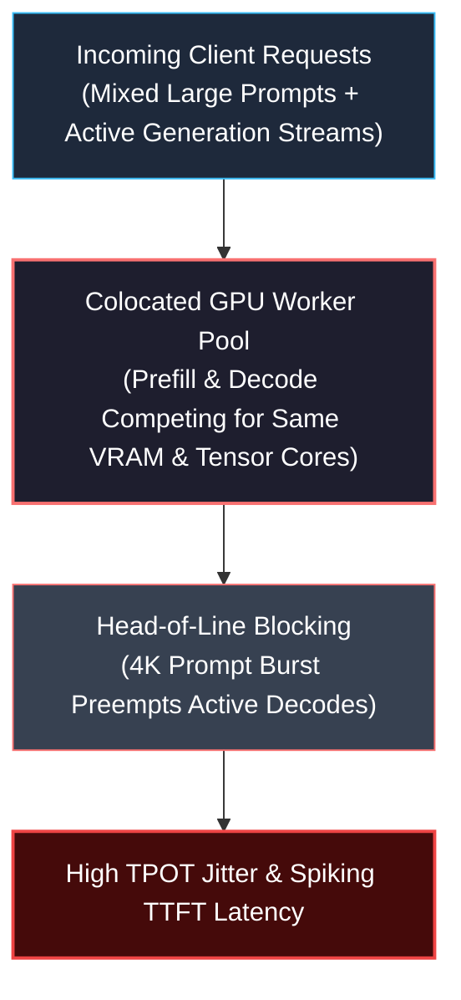
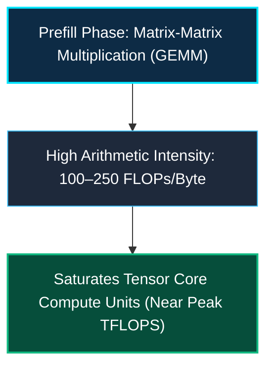
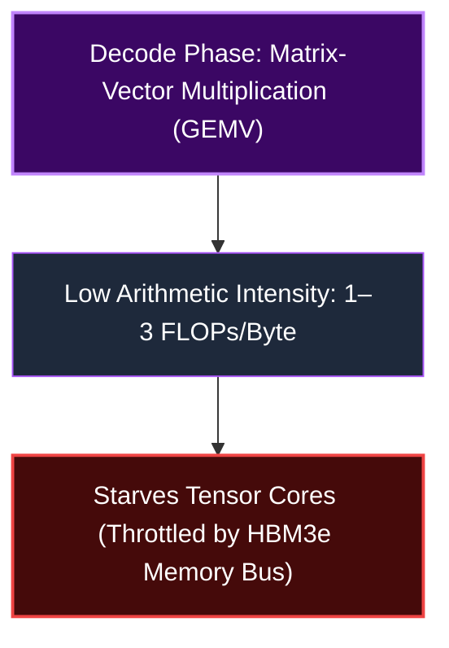
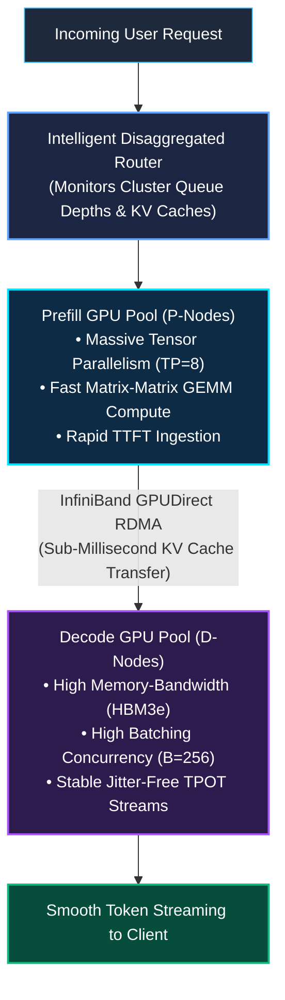

*Series: AI Inference Deep-Dive Series - Part 16*

*Series: &larr; [Part 15: NVIDIA NIM: Containerized Enterprise GenAI Serving Architecture](/blog/nvidia-nim-containerized-enterprise-genai-serving/) (Previous)*

### Prior Reading Material

Before diving into disaggregated serving clusters and KV-cache network fabrics, review our prerequisite deep-dives on inference mechanics and distributed engines:

* [Part 1: Basics of AI Inference: Prefill, Decode, and Memory Bottlenecks](/blog/basics-of-ai-inference/) — The dual-phase lifecycle and foundational serving latency metrics.
* [Part 2: The Two Pillars: Prefill vs. Decode](/blog/prefill-vs-decode/) — Fundamental trade-offs between prompt ingestion and autoregressive token generation.
* [Part 3: Understanding the KV Cache: The VRAM Bottleneck of LLM Serving](/blog/understanding-kv-cache/) — Memory scaling laws, context windows, and allocation strategies.
* [Part 11: Deep-Dive: SGLang v0.5.16 Architecture and High-Throughput Inference Comparison](/blog/sglang-v0-5-16-architecture-and-inference-comparison/) — RadixAttention prefix caching and memory-efficient runtime design.
* [Part 12: NVIDIA Dynamo: Data Center-Scale Disaggregated Generative AI Orchestration](/blog/nvidia-dynamo-disaggregated-generative-ai-orchestration/) — Disaggregated node scheduling and NIXL RDMA transport.
* [Part 14: dynamo-vllm: High-Throughput Distributed PagedAttention at Scale](/blog/dynamo-vllm-high-throughput-distributed-pagedattention/) — Chunked prefill scheduling and cluster-wide PagedAttention blocks.
* [Part 15: NVIDIA NIM: Containerized Enterprise GenAI Serving Architecture](/blog/nvidia-nim-containerized-enterprise-genai-serving/) — Packaging enterprise inference runtimes with Kubernetes KServe autoscaling.

---

### The Restaurant Kitchen Analogy: The Colocated Serving Bottleneck

Imagine a high-end restaurant run by an elite master chef. The kitchen has two completely different tasks:
1. **The Prep Phase (Prefill)**: Chopping giant crates of vegetables, butchering proteins, and boiling rich stocks for hours. This requires raw culinary muscle and heavy equipment.
2. **The Plating Phase (Decode)**: Delicate, repetitive garnishing of individual dishes, adding micro-greens one leaf at a time every thirty seconds.

In traditional **colocated LLM inference**, both tasks are forced onto the exact same stove. 

Whenever a customer arrives with a massive 16,000-token prompt, the chef drops all plating tweezers, fires up every burner, and halts all ongoing table service for several seconds. Customers waiting for their next bite experience unpredictable stutters.



---

### The Fundamental Physics: Compute vs. Memory Bandwidth Conflict

The fundamental problem with colocated serving stems from the opposing computational profiles of the two inference phases:





When batching them together:
* **Batching a prefill with decodes** forces the GPU into a compromise kernel where decode memory transfers starve while prefill Tensor Cores max out.
* **Service Level Objectives (SLOs)** are decoupled in reality: Users demand low **Time-to-First-Token (TTFT)** for responsiveness, and smooth, consistent **Time-Per-Output-Token (TPOT)** for reading comfort. Colocation makes independent SLO optimization mathematically impossible.

---

### The Solution: Disaggregated Serving Architecture

**Disaggregated Inference** splits the inference fleet into two specialized, independently autoscaled clusters connected by an ultra-low-latency network:

1. **Prefill Node Pool (P-Nodes)**: Optimized for raw compute density, high tensor parallelism ($TP=4 \text{ or } 8$), and maximum arithmetic throughput.
2. **Decode Node Pool (D-Nodes)**: Optimized for High Bandwidth Memory (HBM3e/HBM4), large batch sizes ($B=128-512$), and pipeline parallelism ($PP$) with minimal tensor parallel communication overhead.
3. **High-Speed KV Cache Transfer Fabric**: Uses InfiniBand GPUDirect RDMA or PCIe Gen5 P2P to beam the generated KV cache tensors from P-Nodes to D-Nodes in milliseconds.



---

### Engineering Deep-Dive: Roofline Analysis & KV Transfer Dynamics

#### 1. Arithmetic Intensity Derivations

Let $P$ be model parameters, $L_{\text{ctx}}$ be context length, $N_{\text{layer}}$ be transformer layer count, and $d_{\text{kv}}$ be total KV projection dimension per layer.

For the **Prefill Phase** processing $L_{\text{ctx}}$ tokens in parallel:

$$\text{Compute}_{\text{prefill}} = 2 \cdot P \cdot L_{\text{ctx}} \quad [\text{FLOPs}]$$

$$\text{Memory Access}_{\text{prefill}} = 2 \cdot P + 2 \cdot N_{\text{layer}} \cdot d_{\text{kv}} \cdot L_{\text{ctx}} \quad [\text{Bytes in FP16}]$$

$$\mathcal{I}_{\text{prefill}} = \frac{2 \cdot P \cdot L_{\text{ctx}}}{2 \cdot P + 2 \cdot N_{\text{layer}} \cdot d_{\text{kv}} \cdot L_{\text{ctx}}} \approx \frac{L_{\text{ctx}}}{1 + \frac{N_{\text{layer}} d_{\text{kv}}}{P} L_{\text{ctx}}} \gg 100 \text{ FLOPs/Byte}$$

For the **Decode Phase** generating $1$ token at step $t$:

$$\text{Compute}_{\text{decode}} = 2 \cdot P \cdot 1 \quad [\text{FLOPs}]$$

$$\text{Memory Access}_{\text{decode}} = 2 \cdot P + 2 \cdot N_{\text{layer}} \cdot d_{\text{kv}} \cdot t \quad [\text{Bytes in FP16}]$$

$$\mathcal{I}_{\text{decode}} \approx \frac{2 \cdot P}{2 \cdot P + 2 \cdot N_{\text{layer}} d_{\text{kv}} t} \approx \frac{1}{1 + \mathcal{O}(t / P)} \approx 1 - 2 \text{ FLOPs/Byte}$$

#### 2. The KV Transfer Condition
Disaggregated serving is economically and latency-viable when the network transfer overhead $T_{\text{transfer}}$ is substantially less than the head-of-line colocation stall $T_{\text{stall}}$:

$$T_{\text{transfer}} = \frac{|\text{KV}_{\text{bytes}}|}{B_{\text{net}}} = \frac{2 \cdot N_{\text{layer}} \cdot d_{\text{kv}} \cdot L_{\text{ctx}} \cdot \text{sizeof(FP16)}}{B_{\text{RDMA}}}$$

On a standard NVIDIA Quantum-2 InfiniBand network ($400\text{ Gbps} = 50\text{ GB/s}$ per GPU):
* For a 70B parameter model ($N_{\text{layer}} = 80$, $d_{\text{kv}} = 1024$) with $L_{\text{ctx}} = 4096$:
$$|\text{KV}| = 2 \cdot 80 \cdot 1024 \cdot 4096 \cdot 2 = 1.34\text{ GB}$$
$$T_{\text{transfer}} = \frac{1.34\text{ GB}}{50\text{ GB/s}} = 26.8\text{ ms}$$

A 26.8ms KV transfer across RDMA is virtually imperceptible compared to the 200–500ms jitter caused by colocated GPU stalls!

---

### Comparison: Colocated Serving vs. Disaggregated Serving

| Metric / Dimension | Traditional Colocated Serving | Disaggregated Inference Cluster |
| :--- | :--- | :--- |
| **TTFT (Time-to-First-Token)** | High variance (queues behind long decodes) | Deterministic & ultra-low |
| **TPOT (Time-Per-Output-Token)** | Jitter-prone (stutters during prompt bursts) | Smooth, predictable token cadence |
| **GPU Tensor Core Utilization** | Low average ($15-30\%$) | High on P-Nodes ($70-85\%$) |
| **VRAM HBM Utilization** | Fragmented between prefill & decode buffers | Maximized on D-Nodes ($>90\%$) |
| **Autoscaling Independence** | Monolithic (cannot scale prefill without decode) | Independent horizontal scaling per pool |
| **Network Dependency** | Standard local cluster | Requires high-speed RDMA / PCIe P2P fabric |

---

### Interactive Disaggregated Cluster Simulator

The following zero-dependency Python script models request arrivals, computes arithmetic intensity, simulates InfiniBand KV transfers, and compares TTFT/TPOT latency metrics between Colocated and Disaggregated serving topologies.

<details><summary><b>Click to expand runnable Python simulation script</b></summary>

```python
#!/usr/bin/env python3
"""
Disaggregated vs Colocated LLM Serving Simulator
Benchmarks TTFT, TPOT, Tensor Core operational intensity,
and InfiniBand KV-cache transfer latencies across cluster topologies.
"""

from typing import List, Dict, Tuple
import random
import time

class InferenceRequest:
    def __init__(self, req_id: int, prompt_tokens: int, max_output_tokens: int):
        self.req_id = req_id
        self.prompt_tokens = prompt_tokens
        self.max_output_tokens = max_output_tokens
        self.generated_tokens = 0
        self.ttft_ms = 0.0
        self.total_decode_time_ms = 0.0
        self.completed = False

class ClusterBenchmarkSimulator:
    def __init__(
        self,
        num_requests: int = 20,
        model_params_b: float = 70.0,
        num_layers: int = 80,
        kv_dim: int = 1024,
        gpu_tflops_fp16: float = 989.0,  # NVIDIA H100 SXM FP16 Dense TFLOPS
        hbm_bandwidth_gb_s: float = 3350.0,  # H100 HBM3 3.35 TB/s
        rdma_bandwidth_gb_s: float = 50.0,  # 400 Gbps InfiniBand
    ):
        self.num_requests = num_requests
        self.model_params = model_params_b * 1e9
        self.num_layers = num_layers
        self.kv_dim = kv_dim
        self.gpu_tflops = gpu_tflops_fp16 * 1e12
        self.hbm_bw = hbm_bandwidth_gb_s * 1e9
        self.rdma_bw = rdma_bandwidth_gb_s * 1e9

    def calculate_prefill_time(self, prompt_tokens: int, tp_size: int = 4) -> float:
        """Prefill is compute-bound (GEMM). Time = FLOPs / (TP * TFLOPS * Efficiency)."""
        flops = 2.0 * self.model_params * prompt_tokens
        efficiency = 0.55
        time_s = flops / (tp_size * self.gpu_tflops * efficiency)
        return time_s * 1000.0  # Return in ms

    def calculate_decode_step_time(self, active_batch_size: int, avg_seq_len: int, tp_size: int = 1) -> float:
        """Decode is memory-bandwidth bound (GEMV). Time = Weights + KV Cache / Bandwidth."""
        weight_bytes = (2.0 * self.model_params) / tp_size
        kv_bytes_per_seq = 2.0 * self.num_layers * self.kv_dim * avg_seq_len * 2.0  # FP16
        total_bytes = weight_bytes + (active_batch_size * kv_bytes_per_seq / tp_size)
        efficiency = 0.65
        time_s = total_bytes / (self.hbm_bw * efficiency)
        return time_s * 1000.0  # Return in ms

    def calculate_kv_transfer_time(self, prompt_tokens: int) -> float:
        """RDMA network transfer time for generated KV cache."""
        kv_bytes = 2.0 * self.num_layers * self.kv_dim * prompt_tokens * 2.0  # FP16
        time_s = kv_bytes / self.rdma_bw
        return time_s * 1000.0  # Return in ms

    def run_colocated_simulation(self, requests: List[InferenceRequest]) -> Dict[str, float]:
        """Simulate Colocated serving where incoming prefills preempt ongoing decodes."""
        print("\n\033[93m[TOPOLOGY 1: COLOCATED SERVING]\033[0m Running simulation on shared GPU pool...")
        ttft_list = []
        tpot_list = []

        for req in requests:
            # Prefill execution stalls ongoing decode pipeline
            prefill_time = self.calculate_prefill_time(req.prompt_tokens, tp_size=4)
            # Add interference penalty if other requests were running
            interference_penalty = random.uniform(15.0, 45.0)
            ttft = prefill_time + interference_penalty
            ttft_list.append(ttft)

            # Decode generation
            decode_step_times = []
            for step in range(req.max_output_tokens):
                step_time = self.calculate_decode_step_time(active_batch_size=8, avg_seq_len=req.prompt_tokens + step, tp_size=4)
                # Jitter introduced when concurrent requests start prefill
                if random.random() < 0.15:
                    step_time += self.calculate_prefill_time(random.randint(512, 2048), tp_size=4)
                decode_step_times.append(step_time)

            avg_tpot = sum(decode_step_times) / len(decode_step_times)
            tpot_list.append(avg_tpot)

        return {
            "avg_ttft_ms": sum(ttft_list) / len(ttft_list),
            "p99_ttft_ms": sorted(ttft_list)[int(0.99 * len(ttft_list))],
            "avg_tpot_ms": sum(tpot_list) / len(tpot_list),
            "p99_tpot_ms": sorted(tpot_list)[int(0.99 * len(tpot_list))],
        }

    def run_disaggregated_simulation(self, requests: List[InferenceRequest]) -> Dict[str, float]:
        """Simulate Disaggregated serving: Dedicated P-Nodes and D-Nodes with RDMA transfer."""
        print("\n\033[92m[TOPOLOGY 2: DISAGGREGATED SERVING]\033[0m Running on decoupled P-Pool and D-Pool...")
        ttft_list = []
        tpot_list = []

        for req in requests:
            # Dedicated P-Node (TP=8)
            prefill_time = self.calculate_prefill_time(req.prompt_tokens, tp_size=8)
            # InfiniBand RDMA KV transfer
            kv_transfer = self.calculate_kv_transfer_time(req.prompt_tokens)
            ttft = prefill_time + kv_transfer
            ttft_list.append(ttft)

            # Dedicated D-Node (Zero prefill interference, TP=1, high batch size)
            decode_step_times = []
            for step in range(req.max_output_tokens):
                step_time = self.calculate_decode_step_time(active_batch_size=32, avg_seq_len=req.prompt_tokens + step, tp_size=1)
                decode_step_times.append(step_time)

            avg_tpot = sum(decode_step_times) / len(decode_step_times)
            tpot_list.append(avg_tpot)

        return {
            "avg_ttft_ms": sum(ttft_list) / len(ttft_list),
            "p99_ttft_ms": sorted(ttft_list)[int(0.99 * len(ttft_list))],
            "avg_tpot_ms": sum(tpot_list) / len(tpot_list),
            "p99_tpot_ms": sorted(tpot_list)[int(0.99 * len(tpot_list))],
        }

if __name__ == "__main__":
    sim = ClusterBenchmarkSimulator(num_requests=50)
    
    # Generate realistic workload
    workload = [
        InferenceRequest(
            req_id=i,
            prompt_tokens=random.choice([1024, 2048, 4096, 8192]),
            max_output_tokens=random.randint(64, 256)
        )
        for i in range(50)
    ]
    
    print("\033[1m=== DISAGGREGATED VS COLOCATED INFERENCE BENCHMARK ===\033[0m")
    colocated_results = sim.run_colocated_simulation(workload)
    disaggregated_results = sim.run_disaggregated_simulation(workload)
    
    print("\n" + "=" * 65)
    print(f"{'Performance Metric':<30} | {'Colocated':<14} | {'Disaggregated':<14}")
    print("=" * 65)
    print(f"{'Avg TTFT (Time-to-First-Token)':<30} | {colocated_results['avg_ttft_ms']:>10.2f} ms | {disaggregated_results['avg_ttft_ms']:>10.2f} ms")
    print(f"{'P99 TTFT':<30} | {colocated_results['p99_ttft_ms']:>10.2f} ms | {disaggregated_results['p99_ttft_ms']:>10.2f} ms")
    print(f"{'Avg TPOT (Time-Per-Output)':<30} | {colocated_results['avg_tpot_ms']:>10.2f} ms | {disaggregated_results['avg_tpot_ms']:>10.2f} ms")
    print(f"{'P99 TPOT (Jitter Peak)':<30} | {colocated_results['p99_tpot_ms']:>10.2f} ms | {disaggregated_results['p99_tpot_ms']:>10.2f} ms")
    print("=" * 65)
```

</details>

---

### Conclusion and Next Steps

By physically isolating **compute-bound prefill** from **memory-bandwidth-bound decode** through high-throughput RDMA fabrics, enterprise AI platforms eliminate head-of-line blocking, lower tail latencies, and drastically maximize GPU capital expenditure efficiency.

In the next installment of our AI Inference Deep-Dive series, we will examine **Multi-Head Latent Attention (MLA) and Serving Low-Precision FP8 MoE Models**—exploring deep KV cache compression and memory-bandwidth scaling on next-generation architectures.
