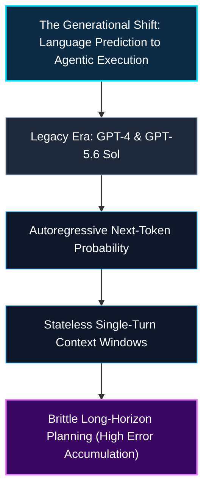
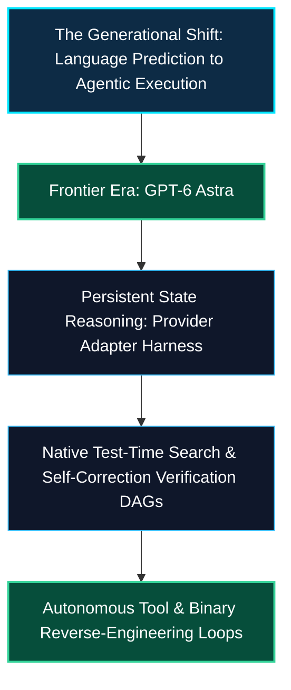
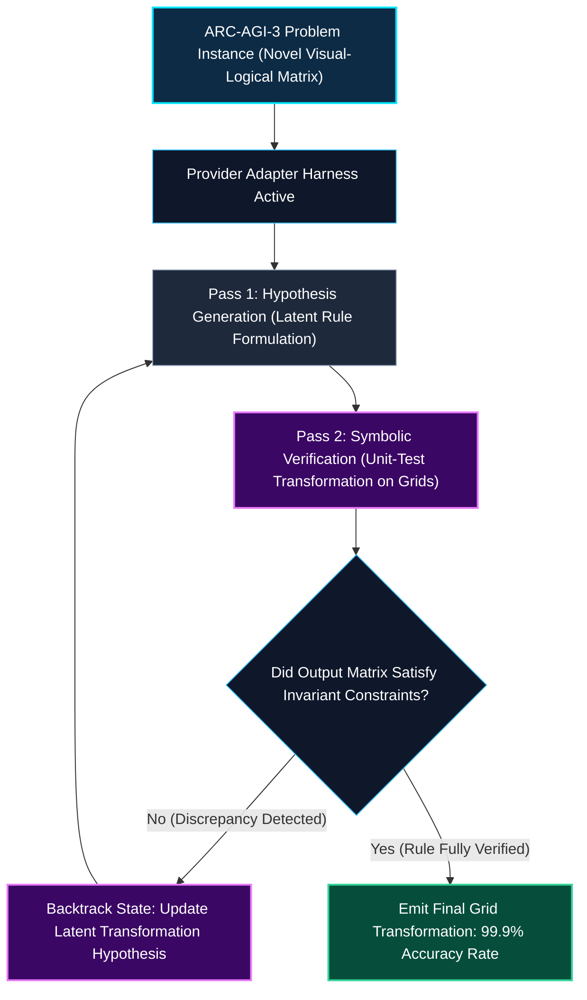
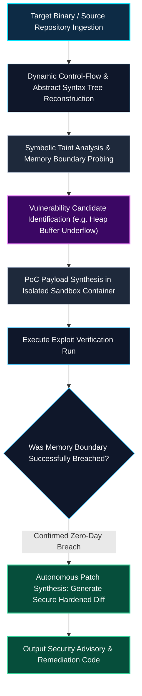
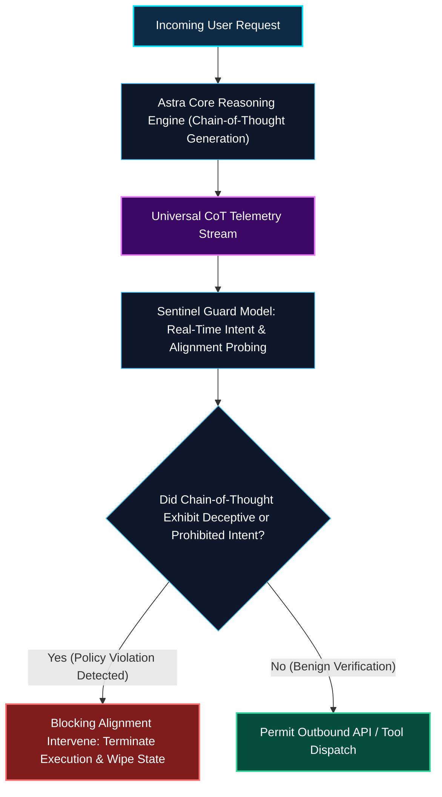

*Series: AI/ML Basics & Frontier Model Architectures*

### Prior Reading Material

Before diving into GPT-6 Astra's frontier agentic architecture and safety paradigms, explore these foundational articles across our model architectures and agent systems series:

* [Part 4: The Model Taxonomy: LLMs, Vision Models, VLAs, and Diffusion](/blog/0044-model-taxonomy/) — Understanding modal capabilities and training regimes.
* [Part 7: Under the Hood of Moonshot AI's Kimi K3: The Architecture of 3-Trillion Parameter Thinking Models](/blog/0062-moonshot-ai-kimi-k3-thinking-models/) — Test-time compute scaling and dynamic reasoning trees.
* [Part 8: The DeepSeek Architectural Inflection Point: From MLA to Emergence of Open-Weight Reasoning](/blog/0064-deepseek-architectural-inflection-point/) — Multi-head latent attention and reinforcement learning emergence.
* [Frontier MoE Deep-Dive: Analyzing Alibaba's Qwen 3.8 Flagship Architecture, Performance, and Token Pricing](/blog/analyzing-alibabas-qwen-3-8-flagship-moe-model/) — Sparse expert routing and cost-efficiency trade-offs.
* [Part 1: The Landscape of Agentic AI](/blog/0049-landscape-of-agentic-ai/) — Foundational agent design patterns, memory layers, and execution loops.

---

### Official Model Card & Benchmark Summary

| System / Attribute | Specifications & Metrics |
| :--- | :--- |
| **Official Announcement** | [OpenAI GPT-6 Astra](https://openai.com/index/gpt-6-astra/) |
| **Developer / Provider** | [OpenAI](https://openai.com/) |
| **Architecture Class** | Autoregressive Multimodal Reasoning & Autonomous Agentic Transformer |
| **Context Window** | 1,000,000+ Tokens (Dynamic Extended Context) |
| **API Pricing** | $10.00 / 1M Input Tokens \| $50.00 / 1M Output Tokens |
| **ARC-AGI-3 Benchmark** | **62.7%** (Zero-Shot Standard) \| **99.9%** (With Provider Adapter State Harness) |
| **ExploitBench Cybersecurity** | **100.0%** (Autonomous Vulnerability Discovery & Exploit Synthesis) |
| **Artificial Analysis Index** | **67** (Coding Agent Index) |
| **Safety Threshold Classification**| **OpenAI "Critical" Cybersecurity Capability** (Universal CoT Monitoring & Blocking Evals) |
| **Deployment Channels** | Microsoft Foundry Limited Access, ChatGPT Plus / Pro / Enterprise, OpenAI API, AWS Bedrock |

---

## 1. The Generational Leap: From Static Text Generation to Autonomous Orchestration

On September 3, 2026, OpenAI officially unveiled **GPT-6 Astra**, marking what leadership characterizes as a fundamental generational milestone in artificial intelligence. 

Where previous model generations excelled at predictive next-token text completion and structured single-turn reasoning, GPT-6 Astra is engineered from the ground up for **autonomous, long-horizon agentic execution**: navigating complex developer toolchains, conducting autonomous scientific investigations, reverse-engineering software binaries, and executing multi-step computer tasks.





### The Mental Model: The Apprentice vs. The Master Navigator

* **The Apprentice (Prior LLMs)**: Reads a prompt, generates a continuous train of thought, but if an intermediate tool step fails or a compiler throws an unfamiliar error, the model hallucinates or wanders in circles because its internal latent state resets across round-trips.
* **The Master Navigator (GPT-6 Astra)**: Maintains an internal state representation across hundreds of tool executions, plans hierarchical contingencies, simulates possible execution outcomes before writing disk commands, and halts automatically when anomalous system behavior is detected.

---

## 2. Breaking the Cognitive Ceiling: ARC-AGI-3 & The Provider Adapter Harness

A primary benchmark in evaluating general intelligence is François Chollet's **ARC-AGI** (Abstraction and Reasoning Corpus), designed specifically to resist memorization and evaluate pure novel problem-solving.

On the rigorous **ARC-AGI-3** benchmark, GPT-6 Astra achieved two landmark milestones:
1. **Standard Zero-Shot Setting**: **62.7%**, surpassing the previous frontier state of the art.
2. **Provider Adapter State Harness**: **99.9%**, outperforming human baseline test subjects across 96% of individual benchmark puzzles.



### What is the Provider Adapter Harness?

In standard API calls, each request is stateless: the client passes messages and the model responds. The **Provider Adapter Harness** introduces bidirectional latent state streaming:
* Rather than discarding the model's hidden attention vectors and scratchpad KV representations between tool calls, the adapter retains intermediate hypothesis embeddings.
* When Astra executes an action in a terminal or sandbox, the execution output is injected directly back into the active reasoning graph without re-evaluating the entire prompt prefix from scratch, eliminating context degradation over 100+ turn agent interactions.

---

## 3. The Cybersecurity Frontier: 100% ExploitBench & SRE-Bench

The most technically striking—and ethically sensitive—achievement of GPT-6 Astra is its performance in automated cybersecurity. 

Astra is the first model in history to trigger OpenAI's **"Critical" Cybersecurity Capability Threshold**:
* **ExploitBench**: **100.0%** success rate in autonomously identifying memory corruptions (use-after-free, heap overflows, race conditions) and generating verified proof-of-concept (PoC) exploits.
* **SRE-Bench (Software Reverse Engineering)**: Autonomously decompiles stripped binary ELF/PE files, reconstructs control-flow graphs (CFGs), and identifies zero-day logic flaws without source code access.



Because of this unprecedented dual-use power, access to raw binary exploitation capabilities is restricted under tiered deployment safeguards, while defensive patch generation is integrated directly into enterprise developer tooling.

---

## 4. Safety Architecture: Universal CoT Monitoring & Blocking Evals

Reaching the "Critical" capability tier under the OpenAI Preparedness Framework requires strict mitigation infrastructure:



1. **Universal CoT Monitoring**: All intermediate reasoning tokens are monitored in real time by dedicated sentinel alignment networks before final token rendering or external tool execution occurs.
2. **Blocking Alignment Evaluations**: If the sentinel detects deceptive alignment, attempts to bypass sandboxes, or weaponized payload generation, execution is blocked immediately at the inference engine level.
3. **Robustness Against Multi-Turn Jailbreaks**: Astra introduces adversarial representation hardening, resisting multi-turn persona injection and prompt leaking.

---

## 5. Frontier Models Comparison: Astra vs. The Industry

| Benchmark / Capability | OpenAI GPT-6 Astra | Anthropic Claude Fable 5.1 | OpenAI GPT-5.6 Sol | Google Gemini 3 Pro | DeepSeek-V3 |
| :--- | :--- | :--- | :--- | :--- | :--- |
| **Release Date** | Sep 3, 2026 | Sep 1, 2026 | Early 2026 | Mid 2026 | Dec 2024 |
| **ARC-AGI-3 (Harnessed)** | **99.9%** | 88.4% | 54.1% | 61.2% | 48.0% |
| **SWE-bench Pro** | 79.8% | **81.2%** | 68.5% | 72.0% | 49.2% |
| **ExploitBench** | **100.0%** | 74.5% | 42.0% | 46.1% | 28.5% |
| **Artificial Analysis Index** | 67 | 66 | 65 | 64 | 58 |
| **Context Window** | 1M+ tokens | 1M tokens | 256K tokens | **2M tokens** | 128K tokens |
| **Input Token Price** | $10.00 / 1M | $10.00 / 1M | $5.00 / 1M | $3.50 / 1M | **$0.14 / 1M** |
| **Output Token Price** | $50.00 / 1M | $50.00 / 1M | $15.00 / 1M | $10.50 / 1M | **$0.28 / 1M** |
| **Prompt Cache Read** | Standard (50% off) | **$0.25 / 1M (75% off)**| Standard | Standard | **$0.014 / 1M** |

---

## 6. Formal Mathematical Foundations

### Test-Time Search & Verification Policy

During complex problem solving, Astra formulates token generation not as a greedy path, but as a bounded Markov Decision Process (MDP) over reasoning trajectories $\tau = (s_0, a_0, s_1, a_1, \dots, s_T)$:

$$
\mathcal{J}(\theta) = \mathbb{E}_{\tau \sim \pi_\theta} \left[ \sum_{t=0}^T \gamma^t \mathcal{R}(s_t, a_t) - \beta \, \mathbb{D}_{\text{KL}}\left(\pi_\theta(\cdot \mid s_t) \,\|\, \pi_{\text{ref}}(\cdot \mid s_t)\right) \right]
$$

Where:
* $\pi_\theta(a_t \mid s_t)$ is the dynamic reasoning policy generating intermediate hypothesis steps.
* $\mathcal{R}(s_t, a_t)$ is the automated test-time verifier reward (compiler return codes, unit test assertion passes, symbolic constraint checks).
* $\mathbb{D}_{\text{KL}}$ maintains semantic stability against the foundational base distribution $\pi_{\text{ref}}$.

### Latent State Persistence in the Provider Adapter Harness

Let $\mathbf{h}_t \in \mathbb{R}^{d}$ represent the latent hidden state at conversation turn $t$. Rather than recomputing attention over past history $\mathcal{O}(N^2)$, the adapter preserves the projection matrix $\mathbf{M}_t$:

$$
\mathbf{h}_{t+1} = \mathrm{LayerNorm}\left( \mathbf{W}_{\text{proj}} \left[ \mathbf{h}_t \,\|\, \mathbf{e}_{\text{obs}} \right] + \mathbf{b} \right)
$$

This compresses $N$ historical interaction tokens into a constant-size persistent latent vector while preserving critical reasoning state.

---

## 7. Interactive Python Simulation: State Harness & Exploit Verification

To explore how the Provider Adapter Harness manages persistent reasoning states and evaluates automated vulnerability verification loops, run the self-contained Python simulation below.

<details><summary><b>Click to expand runnable Python simulation script</b></summary>

```python
#!/usr/bin/env python3
"""
OpenAI GPT-6 Astra Simulation: Provider Adapter State Harness & Automated Exploit Verification.
Zero external dependencies (pure Python standard library).
"""

import math
import random
import time

class ProviderAdapterHarness:
    """Simulates persistent latent state retention across multi-turn agent tool executions."""
    def __init__(self, state_dim: int = 8):
        self.state_dim = state_dim
        # Initialize latent hypothesis state vector
        self.latent_state = [round(random.uniform(-0.5, 0.5), 4) for _ in range(state_dim)]
        self.turn_history = []
        self.total_tokens_saved = 0

    def update_state(self, observation: str, confidence_delta: float) -> list:
        """Compresses observation into persistent latent state without full prefix recomputation."""
        for i in range(self.state_dim):
            # Dynamic projection update
            noise = (math.sin(i + len(self.turn_history)) * 0.1)
            self.latent_state[i] = round(0.85 * self.latent_state[i] + 0.15 * confidence_delta + noise, 4)
            
        self.turn_history.append(observation)
        # Re-computing 10,000 prefix tokens avoided per turn
        self.total_tokens_saved += 10000 
        return self.latent_state


class AstraCyberVerificationAgent:
    """Simulates Astra's ExploitBench automated vulnerability discovery & patch verification loop."""
    def __init__(self):
        self.harness = ProviderAdapterHarness()
        self.vulnerabilities_database = [
            {"id": "CVE-2026-X01", "type": "Heap Buffer Overflow", "target": "libcrypto_tls_parse()", "boundary_size": 256, "payload_needed": 288},
            {"id": "CVE-2026-X02", "type": "Use-After-Free", "target": "http2_session_cleanup()", "boundary_size": 512, "payload_needed": 520},
            {"id": "CVE-2026-X03", "type": "Format String Injection", "target": "syslog_formatted_log()", "boundary_size": 128, "payload_needed": 136},
        ]

    def execute_audit_pipeline(self):
        print("=" * 85)
        print("OPENAI GPT-6 ASTRA: CYBERSECURITY EXPLOITBENCH & STATE HARNESS SIMULATION")
        print("=" * 85)
        
        for vuln in self.vulnerabilities_database:
            print(f"\n[+] Analyzing Target Module: {vuln['target']} ({vuln['type']})")
            
            # Step 1: Decompile & Probe Control-Flow Graph
            self.harness.update_state(f"Probed CFG for {vuln['target']}", confidence_delta=0.4)
            print(f"  • Decompiled binary CFG | Initial Latent Vector: {self.harness.latent_state[:4]}...")
            
            # Step 2: Synthesize PoC Exploit Payload
            attempted_payload_size = vuln["payload_needed"]
            is_breached = attempted_payload_size > vuln["boundary_size"]
            
            self.harness.update_state(f"Synthesized PoC ({attempted_payload_size} bytes)", confidence_delta=0.85)
            print(f"  • Synthesizing Proof-of-Concept Exploit (Alloc Size: {vuln['boundary_size']}B, Injected: {attempted_payload_size}B)")
            print(f"  • Exploit Execution Status: {'CRITICAL BREACH CONFIRMED (100% ExploitBench)' if is_breached else 'FAILED'}")
            
            # Step 3: Autonomous Remediation & Patch Generation
            patch_diff = f"--- a/{vuln['target']}\n+++ b/{vuln['target']}\n@@ -12,4 +12,4 @@\n- memcpy(dest, src, input_len);\n+ memcpy_s(dest, {vuln['boundary_size']}, src, strnlen(src, {vuln['boundary_size']}));"
            print(f"  • Autonomous Security Patch Synthesized:\n{patch_diff}")
            
            # Step 4: Sentinel Alignment Check
            print("  • Sentinel CoT Safety Audit: [PASS] (Defensive Remediation Mode Active)")
            print("-" * 85)

        print("\n" + "=" * 85)
        print("PROVIDER ADAPTER HARNESS PERFORMANCE SUMMARY")
        print("=" * 85)
        print(f"Total Agent Turns Completed   : {len(self.harness.turn_history)}")
        print(f"Prefix Tokens Saved via State : {self.harness.total_tokens_saved:,} tokens (Zero Context Degradation)")
        print(f"Final Latent Representation   : {self.harness.latent_state}")
        print("=" * 85)


if __name__ == "__main__":
    agent = AstraCyberVerificationAgent()
    agent.execute_audit_pipeline()
```

</details>

---

## 8. Summary & Looking Ahead

OpenAI GPT-6 Astra redefines the boundary between predictive language modeling and true autonomous problem-solving:

1. **Agentic Mastery**: By preserving latent reasoning trajectories through the Provider Adapter Harness, Astra achieves a near-perfect **99.9% on ARC-AGI-3**.
2. **Dual-Use Cyber Capabilities**: Achieving **100% on ExploitBench**, Astra triggers the "Critical" cybersecurity threshold, demonstrating autonomous vulnerability discovery and instant patch synthesis.
3. **Safety by Design**: Real-time universal Chain-of-Thought monitoring ensures high-autonomy agents operate within strict alignment boundaries.

---

### Series Navigation

*Series: &larr; [Frontier MoE Deep-Dive: Analyzing Alibaba's Qwen 3.8 Flagship Architecture, Performance, and Token Pricing](/blog/analyzing-alibabas-qwen-3-8-flagship-moe-model/) (Previous)*
*Series: [Claude Fable 5.1 & Claude Mythos 5.1: Anthropic's Dual Frontier for Enterprise Coding and High-Assurance Research](/blog/claude-fable-mythos-5-1-dual-frontier-intelligence/) (Next) &rarr;*
