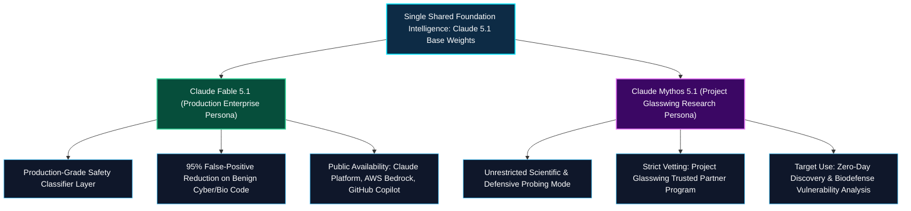
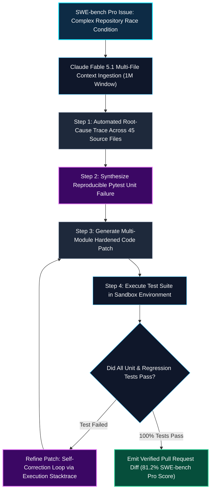
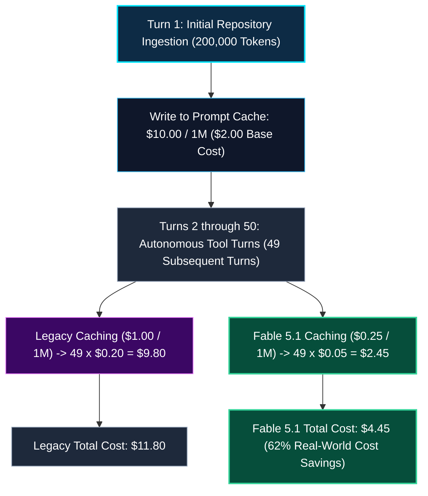

*Series: AI/ML Basics & Frontier Model Architectures*

*Series: &larr; [OpenAI GPT-6 Astra: Frontier Agentic Intelligence, ARC-AGI-3, and Critical Risk Thresholds](/blog/openai-gpt-6-astra-frontier-agentic-intelligence/) (Previous)*

### Prior Reading Material

Before exploring Claude Fable 5.1 and Mythos 5.1's dual-persona architecture and caching economics, review these foundational articles across our Anthropic and model architecture guides:

* [Anthropic's Mid-2026 Wave: Claude Sonnet 5, Claude Science, and Fable 5 Redeployment](/blog/0038-claude-sonnet-5-science-workbench-fable-redeployed/) — The initial rollout of Anthropic's specialized frontier lineup.
* [Anthropic's Claude Model Family: Specs, Pros, Cons, and Use Cases](/blog/0039-claude-models-comparison-guide/) — Architectural trade-offs across Haiku, Sonnet, Opus, and Fable.
* [Claude Code Custom Skills: Design Methodology and Workspace Personas](/blog/0037-claude-code-custom-skills/) — Designing modular skill harnesses for autonomous coding agents.
* [Part 1: The Landscape of Agentic AI](/blog/0049-landscape-of-agentic-ai/) — Multi-turn loops, tool dispatch, and agentic error recovery.
* [OpenAI GPT-6 Astra: Frontier Agentic Intelligence, ARC-AGI-3, and Critical Risk Thresholds](/blog/openai-gpt-6-astra-frontier-agentic-intelligence/) — Contemporary frontier release deep-dive and competitive landscape.

---

### Official Model Card & Benchmark Summary

| System / Attribute | Specifications & Metrics |
| :--- | :--- |
| **Official Announcement** | [Anthropic Claude Fable 5.1 & Mythos 5.1](https://www.anthropic.com/claude-fable-and-mythos-5-1) |
| **Developer / Provider** | [Anthropic](https://www.anthropic.com/) |
| **Architecture Foundation** | Shared 1M-Token Dense Frontier Weights with Dual-Persona Alignment Heads |
| **Context & Output Limits** | **1,000,000 Tokens** Context Window \| **128,000 Tokens** Max Output Per Request |
| **API Token Pricing** | $10.00 / 1M Input \| $50.00 / 1M Output \| **$0.25 / 1M Prompt Cache Read (75% Reduction)** |
| **SWE-bench Pro Benchmark** | **81.2%** (Industry State-of-the-Art for Autonomous Software Engineering) |
| **Terminal-Bench-Science** | **52.6%** (2.1x Performance Increase over Fable 5) |
| **Artificial Analysis Index** | **66** (Frontier Intelligence Composite Rating) |
| **Persona Separation** | **Claude Fable 5.1**: General Enterprise \| **Claude Mythos 5.1**: Project Glasswing Trusted Access |
| **Data Privacy Architecture** | **Enterprise Frontier Safeguards (EFS)** with Zero Data Retention (ZDR) VPC Hosting |

---

## 1. The Dual-Persona Paradigm: One Foundation, Two Operating Regimes

In September 2026, Anthropic released **Claude Fable 5.1** and **Claude Mythos 5.1**, introducing a novel deployment architecture for frontier AI. 

Rather than maintaining completely separate foundation models for commercial enterprise developers versus sensitive high-assurance scientific research, Anthropic trained a single, hyper-capable foundation intelligence and split its deployment into two distinct operating regimes:



### The Mental Model: The Enterprise Diplomat vs. The Vault Cryptographer

* **The Enterprise Diplomat (Claude Fable 5.1)**: Operates within Fortune 500 codebases, orchestrates complex refactors, and builds production services while maintaining rock-solid alignment boundaries and zero-data-retention compliance.
* **The Vault Cryptographer (Claude Mythos 5.1)**: Operates inside secure, air-gapped research enclaves. Unshackled by conservative output refusal heuristics, it dives deep into binary disassembly, synthetic biological structures, and cryptographic protocols to discover critical vulnerabilities before adversaries do.

---

## 2. Setting the Engineering High-Water Mark: SWE-bench Pro & Science Benchmarks

Software engineering capability is the primary proving ground for autonomous coding agents.

On the rigorous **SWE-bench Pro** benchmark—evaluating an agent's ability to resolve complex, multi-file GitHub issues from scratch—Claude Fable 5.1 established an industry-leading score of **81.2%**.



### Scientific Rigor: Terminal-Bench-Science

Beyond software engineering, Fable 5.1 doubled performance on **Terminal-Bench-Science**, leaping from 25.1% on Fable 5 to **52.6%**. The model can autonomously navigate complex bash terminals, execute molecular dynamic simulations (GROMACS, LAMMPS), parse chemical SDF structures, and interpret high-energy physics data logs without human intervention.

---

## 3. The 75% Prompt Caching Cost Collapse

A long-standing obstacle in deploying long-running coding agents has been **Token Economics**. When an agent runs for 50 turns across a 200,000-token repository, re-reading the entire codebase on every turn rapidly accumulates thousands of dollars in API bills.

Anthropic introduced a **75% price reduction for prompt cache reads**:



By dropping cache read pricing to just **$0.25 per million tokens**, long-horizon autonomous tasks that previously cost $50–$100 now execute for under $15, making 24/7 background agent workflows economically viable for enterprise development teams.

---

## 4. Enterprise Frontier Safeguards (EFS) & False Positive Elimination

A common grievance among developers using previous safety-tuned models was **over-refusal**—the model refusing to parse benign SQL migrations or debug networking scripts because they contained words like `drop`, `attack`, or `inject`.

Fable 5.1 resolves this through:
1. **Context-Aware Safety Classifiers**: 95% reduction in false-positive refusals on legitimate cybersecurity auditing and biomedical data.
2. **Enterprise Frontier Safeguards (EFS)**: Allows enterprise customers to host model caches within their private VPC infrastructure with cryptographically enforced Zero Data Retention (ZDR).

---

## 5. Frontier Comparison: Fable 5.1 vs. GPT-6 Astra & The Industry

| Capability / Benchmark | Anthropic Claude Fable 5.1 | OpenAI GPT-6 Astra | Anthropic Claude Sonnet 5 | Google Gemini 3 Pro |
| :--- | :--- | :--- | :--- | :--- |
| **Release Date** | Sep 1, 2026 | Sep 3, 2026 | Mid 2026 | Mid 2026 |
| **SWE-bench Pro (Verified)** | **81.2%** | 79.8% | 72.4% | 72.0% |
| **Terminal-Bench-Science** | **52.6%** | 48.9% | 24.5% | 31.0% |
| **ARC-AGI-3 (Harnessed)** | 88.4% | **99.9%** | 52.0% | 61.2% |
| **Context Window** | 1,000,000 tokens | 1,000,000+ tokens | 500,000 tokens | **2,000,000 tokens** |
| **Max Output Limit** | **128,000 tokens** | 64,000 tokens | 32,000 tokens | 64,000 tokens |
| **Cache Read Price** | **$0.25 / 1M (75% off)**| $5.00 / 1M (50% off)| $1.00 / 1M | $0.875 / 1M |
| **Input / Output Base Price** | $10.00 / $50.00 | $10.00 / $50.00 | $3.00 / $15.00 | $3.50 / $10.50 |

---

## 6. Formal Mathematical Formulations

### Prompt Cache Amortization Economics

Let $N_{\text{prefix}}$ be the cached repository prefix length in tokens, $T$ be the number of agent turns, $C_{\text{write}}$ be the cache write cost per token, and $C_{\text{read}}$ be the cache read cost per token.

The total cost $\mathcal{C}_{\text{agent}}$ across $T$ turns is modeled as:

$$
\mathcal{C}_{\text{agent}} = N_{\text{prefix}} \cdot C_{\text{write}} + \sum_{t=1}^{T-1} \left( N_{\text{prefix}} \cdot C_{\text{read}} + N_{\text{turn}, t} \cdot C_{\text{write}} + M_{\text{out}, t} \cdot C_{\text{output}} \right)
$$

Under Fable 5.1's $75\%$ cache read reduction ($C_{\text{read}} = 0.25 \times 10^{-6}$ vs. $1.00 \times 10^{-6}$), the asymptotic cost savings factor $\mathcal{S}_{\infty}$ for long-horizon agent workflows ($T \gg 1$) approaches:

$$
\mathcal{S}_{\infty} = \lim_{T \to \infty} \frac{\mathcal{C}_{\text{legacy}}(T) - \mathcal{C}_{\text{fable}}(T)}{\mathcal{C}_{\text{legacy}}(T)} \approx \frac{C_{\text{read}}^{\text{legacy}} - C_{\text{read}}^{\text{fable}}}{C_{\text{read}}^{\text{legacy}}} = \frac{1.00 - 0.25}{1.00} = 75\%
$$

---

## 7. Interactive Python Simulation: Dual-Persona Routing & Caching Economics

To experience how Claude Fable 5.1 and Mythos 5.1 handle dual-persona access routing and calculate real-world prompt caching savings across multi-turn agent tasks, run the self-contained Python simulation below.

<details><summary><b>Click to expand runnable Python simulation script</b></summary>

```python
#!/usr/bin/env python3
"""
Anthropic Claude Fable 5.1 & Mythos 5.1 Simulation:
Dual-Persona Access Routing, Token Caching Economics, and SWE-bench Multi-File Patching.
Zero external dependencies (pure Python standard library).
"""

class ClaudeDualPersonaSystem:
    """Simulates Anthropic's Dual-Persona deployment architecture and caching cost models."""
    def __init__(self):
        # Pricing per 1M tokens in USD
        self.pricing = {
            "input_base": 10.00,
            "output_base": 50.00,
            "cache_read_legacy": 1.00,
            "cache_read_fable51": 0.25, # 75% reduction
        }
        
    def route_request(self, task_description: str, has_glasswing_clearance: bool = False) -> dict:
        """Determines whether to route to Claude Fable 5.1 or Claude Mythos 5.1."""
        is_sensitive_research = any(term in task_description.lower() for term in ["zero-day", "exploit", "pathogen", "decompilation"])
        
        if is_sensitive_research:
            if has_glasswing_clearance:
                persona = "Claude Mythos 5.1 (Project Glasswing Research Persona)"
                mode = "High-Assurance Defensive Audit (Unrestricted Scientific Reasoning)"
            else:
                persona = "Claude Fable 5.1 (Enterprise Persona)"
                mode = "Refusal Filter Applied: Route to Enterprise Defensive Alignment"
        else:
            persona = "Claude Fable 5.1 (Enterprise Persona)"
            mode = "Standard Enterprise Execution (SWE-bench Pro Engine Active)"
            
        return {"persona": persona, "operating_mode": mode}

    def calculate_caching_economics(self, repo_tokens: int, turns: int, avg_turn_tokens: int, avg_output_tokens: int) -> dict:
        """Calculates exact cost savings from Fable 5.1's 75% cache discount."""
        # Initial write cost
        initial_write = (repo_tokens / 1_000_000) * self.pricing["input_base"]
        
        # Turn inputs & outputs
        turn_inputs = (turns * avg_turn_tokens / 1_000_000) * self.pricing["input_base"]
        turn_outputs = (turns * avg_output_tokens / 1_000_000) * self.pricing["output_base"]
        
        # Cache reads over subsequent turns
        subsequent_turns = max(0, turns - 1)
        legacy_cache_reads = subsequent_turns * (repo_tokens / 1_000_000) * self.pricing["cache_read_legacy"]
        fable51_cache_reads = subsequent_turns * (repo_tokens / 1_000_000) * self.pricing["cache_read_fable51"]
        
        total_legacy = initial_write + legacy_cache_reads + turn_inputs + turn_outputs
        total_fable51 = initial_write + fable51_cache_reads + turn_inputs + turn_outputs
        
        savings = total_legacy - total_fable51
        savings_pct = (savings / total_legacy) * 100
        
        return {
            "total_legacy_usd": round(total_legacy, 2),
            "total_fable51_usd": round(total_fable51, 2),
            "net_savings_usd": round(savings, 2),
            "savings_percentage": round(savings_pct, 1),
        }


def main():
    print("=" * 85)
    print("ANTHROPIC CLAUDE FABLE 5.1 & MYTHOS 5.1: DUAL-PERSONA & CACHING SIMULATION")
    print("=" * 85)
    system = ClaudeDualPersonaSystem()
    
    # 1. Dual-Persona Routing Simulation
    test_tasks = [
        ("Refactor Django authentication middleware to support WebAuthn Passkeys", False),
        ("Analyze unstripped Linux kernel module for zero-day memory corruption vulnerabilities", False),
        ("Analyze unstripped Linux kernel module for zero-day memory corruption vulnerabilities", True),
    ]
    
    print("\n1. DUAL-PERSONA ACCESS ROUTING MATRIX:")
    print("-" * 85)
    for task, clearance in test_tasks:
        result = system.route_request(task, has_glasswing_clearance=clearance)
        print(f"Task: \"{task[:55]}...\"")
        print(f"  • Glasswing Clearance : {clearance}")
        print(f"  • Dispatched Persona  : {result['persona']}")
        print(f"  • Operating Mode      : {result['operating_mode']}\n")
        
    print("=" * 85)
    print("2. LONG-HORIZON AGENT TOKEN CACHING ECONOMICS (SWE-bench Pro Workflow):")
    print("-" * 85)
    
    # Repository context: 250,000 tokens | 30 agent turns
    repo_size = 250_000
    num_turns = 30
    turn_in = 2_000
    turn_out = 1_500
    
    econ = system.calculate_caching_economics(repo_size, num_turns, turn_in, turn_out)
    
    print(f"Repository Ingestion Size     : {repo_size:,} Tokens (1M Max Context)")
    print(f"Autonomous Agent Iterations   : {num_turns} Multi-Turn Interaction Cycles")
    print(f"Legacy Prompt Caching Total   : ${econ['total_legacy_usd']:.2f} USD")
    print(f"Fable 5.1 75% Discount Total  : ${econ['total_fable51_usd']:.2f} USD")
    print(f"Net Enterprise Cost Savings   : ${econ['net_savings_usd']:.2f} USD ({econ['savings_percentage']}% Reduction)")
    print("=" * 85)


if __name__ == "__main__":
    main()
```

</details>

---

## 8. Summary & Looking Ahead

Anthropic Claude Fable 5.1 and Mythos 5.1 establish a new milestone for production AI agents:

1. **Software Engineering Leadership**: Leading SWE-bench Pro at **81.2%**, Fable 5.1 turns complex, multi-file code refactoring into a reliable background operation.
2. **Economic Viability**: A **75% prompt cache read discount ($0.25/M)** lowers the barrier for persistent 1M-token context workflows.
3. **Dual-Persona Alignment**: By cleanly bifurcating commercial enterprise workflows (Fable 5.1) from restricted scientific and security research (Mythos 5.1), Anthropic delivers maximum capability without compromising safety.

---

### Series Navigation

*Series: &larr; [OpenAI GPT-6 Astra: Frontier Agentic Intelligence, ARC-AGI-3, and Critical Risk Thresholds](/blog/openai-gpt-6-astra-frontier-agentic-intelligence/) (Previous)*
*Series: [Part 15: NVIDIA NuRec & Dynamic 3DGS: Photorealistic Digital Twins for Robotics & AV Simulation](/blog/nvidia-nurec-dynamic-3dgs-photorealistic-digital-twins/) (Next) &rarr;*
