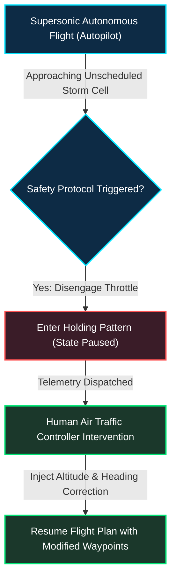
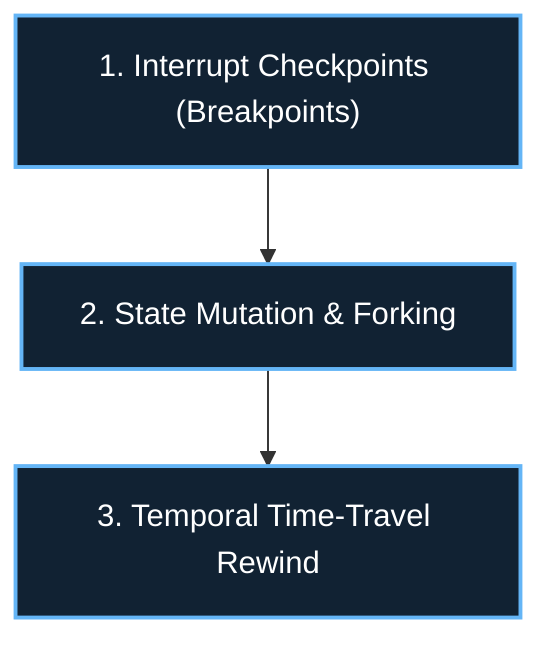
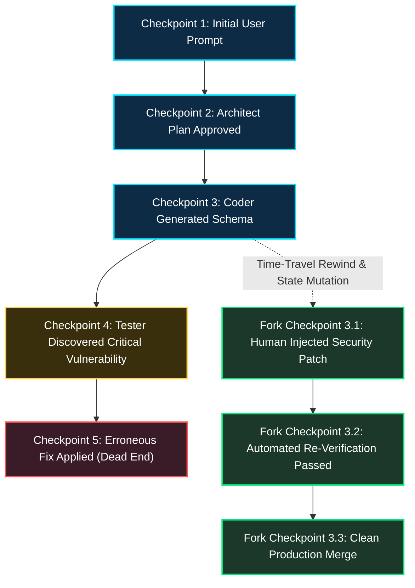

*Series: Autonomous AI Agents & Frameworks Series - Part 8*

*Series: &larr; [Part 7: Multi-Agent Choreography: Building Cooperative Graph Networks with LangGraph](/blog/multi-agent-choreography-langgraph-cooperative-networks/) (Previous)*

### Prior Reading Material

Before mastering interrupt mechanics and temporal state rewinding, review our foundational agent choreography and graph architecture deep-dives:

* [Part 1: The Landscape of Agentic AI: From Single-Agent Scripts to Multi-Agent Networks](/blog/landscape-of-agentic-ai/) — Foundational agent design patterns and autonomous decision cycles.
* [Part 5: LangChain vs. LangGraph: Moving from Chains to Cyclic State Graphs](/blog/langchain-vs-langgraph-cyclic-state-graphs/) — Transitioning from static acyclic pipelines to cyclic state machines.
* [Part 7: Multi-Agent Choreography: Building Cooperative Graph Networks with LangGraph](/blog/multi-agent-choreography-langgraph-cooperative-networks/) — Pod architectures, state reducers, and multi-agent contractive feedback loops.

---

### The Autonomous Flight Analogy: Why Autopilots Need Air Traffic Control

Imagine an advanced autonomous supersonic aircraft cruising at 40,000 feet. The aircraft's navigation computer continuously calculates airspeed, adjusts rudder trim, and routes around turbulence with sub-millisecond precision. For 99% of the journey, autonomous execution is orders of magnitude faster and more reliable than human reflexes.



Now imagine the aircraft encounters an unprecedented weather anomaly: a severe volcanic ash cloud undetected by radar. If the flight computer blindly proceeds using speculative extrapolation, catastrophe follows. 

Instead, modern avionics employ a **Human-in-the-Loop (HITL) protocol**:
1. The autopilot detects an ambiguous condition or approaches a safety-critical action threshold.
2. It transitions into a **stable holding pattern**, freezing its current velocity, fuel telemetry, and navigation state.
3. It pings **Air Traffic Control (ATC)**, presenting the operational dilemma with contextual diagnostics.
4. The human flight director evaluates the situation, modifies the waypoint vector, and issues clearance.
5. The autopilot unpauses and resumes smooth flight without rebooting the aircraft mid-air.

In production AI software engineering and enterprise automation, autonomous agent teams face identical challenges. When an agent pod prepares to execute an irreversible SQL database migration, dispatch a $50,000 financial wire, or refactor a production payment gateway, fully unmonitored autonomy is an existential business risk. We require deterministic mechanisms to pause graph execution, solicit human clearance, edit state mid-flight, and rewind the graph when things go sideways.

---

### The Three Pillars of Deterministic Agent Governance

To build enterprise-grade agentic systems, we must transcend rudimentary `input()` prompts blocking a console loop. We require three structural capabilities baked directly into the graph runtime:



#### 1. Interrupt Checkpoints (Breakpoints)
In LangGraph, an interrupt is not a blocking thread sleep; it is a **durable state persistence boundary**. When a graph execution reaches a node configured with an `interrupt_before` or `interrupt_after` rule (or invokes `interrupt()` dynamically), the runtime halts execution immediately before or after that node executes. 

The entire graph state—including message histories, scratchpad variables, tool call arguments, and step counters—is serialized into a persistent checkpointer (e.g., SQLite, PostgreSQL, or Redis). The server process can restart, scale down, or wait three days for an executive approval. The graph remains safely suspended in cold storage.

#### 2. State Mutation & Forking Mid-Flight
When human intervention occurs, the operator rarely provides a binary "yes" or "no". Often, the human provides a corrective steer:
- *"The proposed SQL query deletes the audit log table. Alter the SQL query to add a WHERE clause preserving the last 90 days, then proceed."*

With state mutation APIs (`update_state`), an external controller can inject updated variables or replace an erroneous tool call payload directly into the frozen checkpoint. When the graph resumes, downstream nodes consume the human-rectified state seamlessly.

#### 3. Temporal Time-Travel Rewind
What happens when an agent completes six steps of complex code refactoring, only to introduce a fatal architectural flaw on Step 7?

In naive agent loops, you must discard the entire trajectory, wipe the session, and restart from Step 1—wasting hundreds of thousands of input tokens and compounding model latency. 

**Time-Travel Debugging** allows engineers and human supervisors to:
1. Inspect the full chronological tree of persisted checkpoint snapshots.
2. Select an earlier checkpoint timestamp ($t = 3$) before the error occurred.
3. Fork execution from that historical checkpoint, modifying a prompt or replacing a tool response.
4. Execute the new branch forward while preserving the original historical branch for comparative auditing.

---

### Time-Travel Architecture: Checkpointers & State Trees

Under the hood, LangGraph's time-travel capability is powered by a directed acyclic version graph of checkpoints. 



Each checkpoint is uniquely identified by a tuple `(thread_id, checkpoint_id)`. When an agent transitions between nodes:
1. The reducer functions calculate the delta $\Delta S$ applied to the state $S_t$.
2. The checkpointer persists the new state $S_{t+1} = \text{reduce}(S_t, \Delta S)$ alongside metadata including parent checkpoint IDs and step counts.
3. If an engineer invokes `graph.invoke` passing config parameters with a selected thread identifier and historical checkpoint ID, the runtime does not overwrite history. It branches from $C_3$, assigning a new unique checkpoint identifier and creating an alternate trajectory.

---

### Engineering Deep-Dive: State Formulations & Invariant Guarantees

Let us formalize the mathematics of checkpointer state evolution and human state mutation.

#### 1. State Snapshot Functional Formulation
Let the global state space of the multi-agent graph be $\mathcal{S}$. At any discrete step $t \in \mathbb{N}$, the system state is represented by:

$$S_t \in \mathcal{S} = \langle \mathcal{M}_t, \mathcal{V}_t, \mathcal{E}_t \rangle$$

Where:
- $\mathcal{M}_t = [m_1, m_2, \dots, m_k]$ is the ordered sequence of conversation messages and tool call payloads.
- $\mathcal{V}_t = \{k_i: v_i\}$ is the dictionary of domain variables (such as source code, test results, and approval status).
- $\mathcal{E}_t$ is the execution environment state (current node identifier, next eligible transitions).

When node $N_j$ executes, it applies a state transformation function $\tau_j: \mathcal{S} \to \Delta \mathcal{S}$. The checkpointer applies channel reducer functions $\Phi$:

$$S_{t+1} = \Phi(S_t, \Delta \mathcal{S}) = \left\langle \mathcal{M}_t \oplus \Delta \mathcal{M}, \; \mathcal{V}_t \odot \Delta \mathcal{V}, \; \mathcal{E}_{t+1} \right\rangle$$

Where $\oplus$ denotes list append concatenation, and $\odot$ denotes dictionary key replacement or additive accumulation governed by channel schema types.

#### 2. Human Mutation & Branching Invariants
When an interrupt occurs at boundary $t_B$, the graph halts. The human intervention injects a mutation delta $\Delta S_H$.

The mutated state becomes:

$$S_{t_B}^{\prime} = \Phi(S_{t_B}, \Delta S_H)$$

The checkpointer creates a new version vertex in the version graph $G_C = (V_C, E_C)$:

$$V_C^{\prime} = V_C \cup \{c_{\text{fork}}\}, \quad E_C^{\prime} = E_C \cup \{(c_{t_B}, c_{\text{fork}})\}$$

This guarantees that:
1. **Historical Immutability**: For any past checkpoint $c_k \in V_C$, its stored state vector $S(c_k)$ remains byte-identical across all subsequent executions.
2. **Context Preservation**: The newly spawned trajectory inherits the complete upstream lineage $[c_1, \dots, c_{t_B}]$, preventing token re-computation.
3. **Deterministic Resumption**: Resuming execution from $c_{\text{fork}}$ is mathematically identical to an agent starting fresh from an identical state configuration.

---

### Interactive Simulation: HITL Breakpoints and Time-Travel Debugging

Below is a complete, zero-dependency Python simulation demonstrating:
- A multi-step autonomous code refactoring graph.
- Pre-execution breakpoint interrupts halting execution before a dangerous deployment node.
- In-memory state checkpoint tree inspection.
- Human state mutation modifying parameters mid-flight.
- Temporal time-travel rewinding to an earlier checkpoint to fork an alternate execution branch.

<details><summary><b>Click to expand runnable Python simulation script</b></summary>

```python
#!/usr/bin/env python3
"""
LangGraph Human-in-the-Loop & State Time-Travel Simulation
A zero-dependency Python simulation demonstrating durable checkpointers,
breakpoint interrupts, mid-flight state mutation, and temporal graph rewinding.
"""

import copy
import uuid
from typing import Any, Callable, Dict, List, Optional, Tuple


class StateSnapshot:
    """Represents an immutable snapshot of graph state at a specific point in time."""

    def __init__(
        self,
        checkpoint_id: str,
        parent_id: Optional[str],
        step: int,
        node_name: str,
        state_data: Dict[str, Any],
    ):
        self.checkpoint_id = checkpoint_id
        self.parent_id = parent_id
        self.step = step
        self.node_name = node_name
        self.state_data = copy.deepcopy(state_data)

    def __repr__(self) -> str:
        return f"<Snapshot {self.checkpoint_id[:8]} | Step {self.step} | Node: {self.node_name}>"


class InMemoryCheckpointer:
    """Durable checkpoint store tracking state history and timeline branches."""

    def __init__(self):
        self.checkpoints: Dict[str, StateSnapshot] = {}
        self.threads: Dict[str, List[str]] = {}

    def save(
        self,
        thread_id: str,
        parent_id: Optional[str],
        step: int,
        node_name: str,
        state: Dict[str, Any],
    ) -> str:
        cid = f"chk_{step:02d}_{uuid.uuid4().hex[:6]}"
        snapshot = StateSnapshot(cid, parent_id, step, node_name, state)
        self.checkpoints[cid] = snapshot
        if thread_id not in self.threads:
            self.threads[thread_id] = []
        self.threads[thread_id].append(cid)
        return cid

    def get(self, checkpoint_id: str) -> Optional[StateSnapshot]:
        return self.checkpoints.get(checkpoint_id)

    def get_thread_history(self, thread_id: str) -> List[StateSnapshot]:
        cids = self.threads.get(thread_id, [])
        return [self.checkpoints[cid] for cid in cids]


class InterruptSignal(Exception):
    """Raised when execution hits an interrupt boundary."""

    def __init__(self, node_name: str, checkpoint_id: str, reason: str):
        self.node_name = node_name
        self.checkpoint_id = checkpoint_id
        self.reason = reason
        super().__init__(f"Interrupt at '{node_name}': {reason}")


class SimulatedGraph:
    """Stateful execution graph with breakpoint checks, state mutation, and time travel."""

    def __init__(self, checkpointer: InMemoryCheckpointer):
        self.nodes: Dict[str, Callable[[Dict[str, Any]], Dict[str, Any]]] = {}
        self.transitions: Dict[str, str] = {}
        self.interrupt_before_nodes: set = set()
        self.checkpointer = checkpointer

    def add_node(
        self, name: str, fn: Callable[[Dict[str, Any]], Dict[str, Any]]
    ):
        self.nodes[name] = fn

    def add_edge(self, from_node: str, to_node: str):
        self.transitions[from_node] = to_node

    def set_interrupt_before(self, node_name: str):
        self.interrupt_before_nodes.add(node_name)

    def run(
        self,
        thread_id: str,
        initial_state: Optional[Dict[str, Any]] = None,
        from_checkpoint_id: Optional[str] = None,
        resume_from_interrupt: bool = False,
    ) -> Tuple[str, Dict[str, Any]]:
        """Executes the graph forward until completion or until interrupted."""
        if from_checkpoint_id:
            snap = self.checkpointer.get(from_checkpoint_id)
            if not snap:
                raise ValueError(f"Checkpoint {from_checkpoint_id} not found")
            current_state = copy.deepcopy(snap.state_data)
            current_node = snap.node_name
            step = snap.step
            parent_id = snap.checkpoint_id
            print(
                f"\n[Time-Travel] Rewound to checkpoint {parent_id} (Node: {current_node}, Step: {step})"
            )
            # If resuming after interrupt, advance to next target node
            if resume_from_interrupt:
                next_node = self.transitions.get(current_node)
                if not next_node:
                    return parent_id, current_state
                current_node = next_node
        else:
            current_state = copy.deepcopy(initial_state or {})
            current_node = "plan"
            step = 0
            parent_id = None

        while current_node:
            # Check for pre-node interrupt condition
            if current_node in self.interrupt_before_nodes and not resume_from_interrupt:
                # Save current state before node executes
                cid = self.checkpointer.save(
                    thread_id,
                    parent_id,
                    step,
                    current_node,
                    current_state,
                )
                raise InterruptSignal(
                    node_name=current_node,
                    checkpoint_id=cid,
                    reason=f"Human clearance required before executing safety-critical node '{current_node}'",
                )

            resume_from_interrupt = False
            step += 1

            # Execute node logic
            node_fn = self.nodes[current_node]
            state_delta = node_fn(current_state)
            current_state.update(state_delta)

            # Persist checkpoint
            parent_id = self.checkpointer.save(
                thread_id,
                parent_id,
                step,
                current_node,
                current_state,
            )

            # Route to next node
            current_node = self.transitions.get(current_node)

        return parent_id, current_state


# --- Node Definitions for an Enterprise Database Migration Agent ---


def plan_migration(state: Dict[str, Any]) -> Dict[str, Any]:
    print("  -> [Plan Node] Analyzing target PostgreSQL schema and workload...")
    return {
        "status": "planned",
        "sql_script": "DROP TABLE legacy_users; CREATE TABLE users_v2 (id SERIAL, email TEXT);",
        "affected_rows_estimate": 450000,
        "risk_level": "CRITICAL",
    }


def validate_syntax(state: Dict[str, Any]) -> Dict[str, Any]:
    print("  -> [Validate Node] Checking SQL grammar and foreign key constraints...")
    return {
        "status": "validated",
        "syntax_ok": True,
    }


def execute_migration(state: Dict[str, Any]) -> Dict[str, Any]:
    print(f"  -> [Execute Node] EXECUTING SQL ON PRODUCTION: {state.get('sql_script')}")
    if "DROP TABLE legacy_users" in state.get("sql_script", "") and not state.get(
        "human_override", False
    ):
        print("  -> [Execute Node] WARNING: Irreversible drop executed!")
    return {
        "status": "completed",
        "execution_result": "Success: 450,000 records partitioned into users_v2.",
    }


def run_demo():
    print("=" * 70)
    print("LANGGRAPH HUMAN-IN-THE-LOOP & STATE TIME-TRAVEL SIMULATION")
    print("=" * 70)

    checkpointer = InMemoryCheckpointer()
    graph = SimulatedGraph(checkpointer)

    # Register workflow nodes
    graph.add_node("plan", plan_migration)
    graph.add_node("validate", validate_syntax)
    graph.add_node("execute_migration", execute_migration)

    # Wire graph edges: plan -> validate -> execute_migration
    graph.add_edge("plan", "validate")
    graph.add_edge("validate", "execute_migration")

    # Set breakpoint before safety-critical node
    graph.set_interrupt_before("execute_migration")

    thread_id = "session_finance_migration"
    print("\n--- PHASE 1: Autonomous Run Until Safety Breakpoint ---")
    try:
        graph.run(thread_id, initial_state={"initiator": "Engineering Lead"})
    except InterruptSignal as err:
        print(f"\n[INTERRUPT CAUGHT] {err.reason}")
        print(f"Paused Checkpoint ID: {err.checkpoint_id}")
        interrupted_cid = err.checkpoint_id

    # Inspect the saved checkpoint state
    snap = checkpointer.get(interrupted_cid)
    print("\n--- PHASE 2: Human Operator Inspects Paused State ---")
    print(f"Current Node Pending: {snap.node_name}")
    print(f"Target SQL Script:    {snap.state_data.get('sql_script')}")
    print(f"Risk Assessment:      {snap.state_data.get('risk_level')}")

    # Human intervention: Rejecting the destructive query and mutating state
    print("\n--- PHASE 3: Human State Mutation & Safe Resumption ---")
    print("Human Operator Feedback: 'Do NOT drop legacy table immediately! Rename it to legacy_users_archive first.'")
    snap.state_data["sql_script"] = (
        "ALTER TABLE legacy_users RENAME TO legacy_users_archive; CREATE TABLE users_v2 (id SERIAL, email TEXT);"
    )
    snap.state_data["human_override"] = True
    snap.state_data["operator_notes"] = "Approved by SecOps on 2026-09-09"

    # Resuming execution with mutated state
    final_cid, final_state = graph.run(
        thread_id,
        from_checkpoint_id=interrupted_cid,
        resume_from_interrupt=True,
    )
    print("\n[Execution Finished]")
    print(f"Final Status: {final_state.get('status')}")
    print(f"Final SQL Script Executed: {final_state.get('sql_script')}")

    # Phase 4: Time-Travel History Audit
    print("\n--- PHASE 4: Checkpoint History & Time-Travel Tree ---")
    history = checkpointer.get_thread_history(thread_id)
    for h in history:
        print(f"  [{h.checkpoint_id}] Step {h.step:02d} | Node: {h.node_name:<18} | Status: {h.state_data.get('status', 'N/A')}")

    print("\nSimulation complete: Deterministic governance and time-travel verified.")


if __name__ == "__main__":
    run_demo()
```

</details>

---

### Key Takeaways & Summary

1. **Breakpoints as Durable State Boundaries**: Interrupts in LangGraph are not volatile thread blockers; they persist the complete serialized state graph to durable storage, allowing systems to pause indefinitely across processes.
2. **Safe Mid-Flight State Mutation**: Operators can inspect ambiguous decisions, edit parameters, and inject human guidance (`update_state`) directly into suspended checkpoints without invalidating prior agent reasoning.
3. **Temporal Time-Travel**: By treating execution history as an immutable versioned tree of checkpoint snapshots, engineers can rewind the graph to any prior node timestamp, fork execution, and debug failures with zero token waste.
