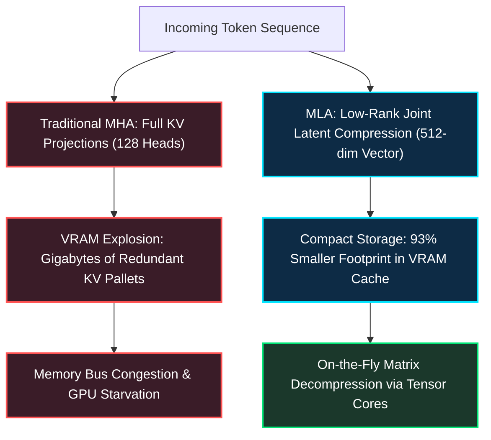
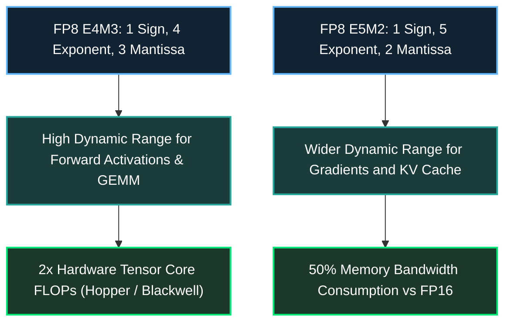
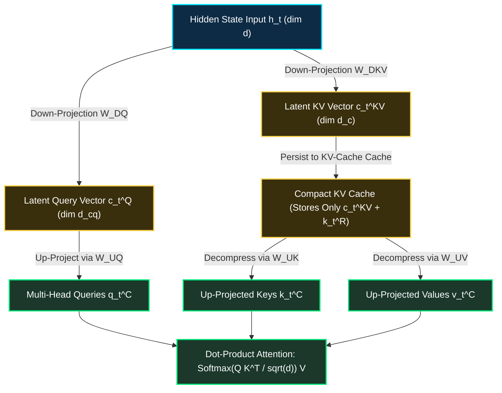

*Series: AI Inference Deep-Dive Series - Part 17*

*Series: &larr; [Part 16: Disaggregated Inference: Separating Prefill and Decode Nodes at Scale](/blog/disaggregated-inference-separating-prefill-decode-scale/) (Previous)*

### Prior Reading Material

Before diving into low-rank KV compression and sub-byte FP8 GEMM serving, review our prerequisite deep-dives on inference mechanics and distributed engines:

* [Part 2: The Two Pillars: Prefill vs. Decode](/blog/prefill-vs-decode/) — Fundamental trade-offs between compute-bound ingestion and memory-bound token generation.
* [Part 3: Understanding the KV Cache: The VRAM Bottleneck of LLM Serving](/blog/understanding-kv-cache/) — Memory scaling laws, context windows, and allocation strategies.
* [Part 7: The Attention Memory Bottleneck: From Self-Attention Basics to MHA, GQA, and DeepSeek's MLA](/blog/attention-memory-bottleneck-mha-gqa-deepseek-mla/) — The architectural evolution from MHA to GQA and latent projections.
* [Part 10: Understanding Mixture-of-Experts (MoE): From Specialist Clinics to Kimi K3's 896-Expert Router](/blog/0067-understanding-mixture-of-experts-moe/) — Sparse gating mechanisms, expert capacity factors, and routing topologies.
* [Part 16: Disaggregated Inference: Separating Prefill and Decode Nodes at Scale](/blog/disaggregated-inference-separating-prefill-decode-scale/) — Decoupling compute-heavy prefill from memory-bound decode pools.

---

### The Cargo Freight Analogy: Why Storing Uncompressed Keys Stalls the Port

Imagine a global container shipping port handling millions of tons of imported goods. In traditional Multi-Head Attention (MHA), every incoming container (token) is unpacked at the dock into 128 individual pallet categories (heads). Each pallet must be stored in temperature-controlled, ultra-expensive harbor warehouses (High Bandwidth Memory, HBM3e) for the entire duration of the vessel's stay.



As context lengths stretch from 8K to 128K tokens and user concurrency surges, the harbor docks run completely out of floor space. The giant cranes (GPU Tensor Cores) stand idle, starved for memory bandwidth while waiting for forklifts to shuffle bloated pallets back and forth across a congested bus.

Grouped-Query Attention (GQA) offered a temporary compromise by forcing multiple query heads to share a single key-value head. But sharing keys across disparate semantic heads degrades model expressive capacity and reasoning fidelity.

**Multi-Head Latent Attention (MLA)**, pioneered by DeepSeek in DeepSeek-V2 and V3, solves this crisis through mathematical compression. Instead of caching hundreds of uncompressed key and value vectors per token, MLA projects keys and values into a single low-dimensional latent vector $c_t^{KV}$ (e.g. 512 dimensions). During inference, only this compact latent vector is stored in HBM. When a query computes attention, the keys and values are decompressed on the fly using tiny weight matrix multiplications directly inside high-speed GPU registers.

---

### The Dual Revolution: Combining MLA with FP8 Quantization

When serving trillion-parameter Mixture-of-Experts (MoE) models at scale, memory pressure originates from two distinct fronts:
1. **The Dynamic Front (KV-Cache)**: Scales with concurrent batch size and sequence length ($B \times L$).
2. **The Static Front (Model Weights)**: Scales with the number of sparse experts ($N_{\text{experts}} \times d_{\text{model}}$).

By pairing MLA with **FP8 (8-bit floating point)** quantization across both weights and KV cache, modern inference runtimes (like vLLM and SGLang) achieve a 4x to 8x throughput multiplier.



#### Understanding FP8 Formats: E4M3 vs. E5M2
IEEE FP8 defines two complementary formats:
- **E4M3 (1 sign bit, 4 exponent bits, 3 mantissa bits)**: Offers higher numerical precision (resolution) with a maximum representable value of $\pm 448$. This makes it ideal for inference weight matrices and activation GEMMs where precision minimizes perplexity degradation.
- **E5M2 (1 sign bit, 5 exponent bits, 2 mantissa bits)**: Matches FP16 exponent range with lower mantissa precision, tolerating extreme dynamic ranges and outlier spikes without underflow or overflow.

---

### Engineering Deep-Dive: Mathematical Formulations of MLA

Let us derive the exact matrix equations behind Multi-Head Latent Attention and contrast its serving memory footprint with standard MHA and GQA.



#### 1. Low-Rank Key-Value Compression
Let $h_t \in \mathbb{R}^d$ be the input token representation at time step $t$. Instead of directly multiplying by key and value projection matrices $W^K, W^V \in \mathbb{R}^{d \times (n_h d_h)}$, MLA first applies a low-rank down-projection matrix $W^{DKV} \in \mathbb{R}^{d \times d_c}$ where $d_c \ll n_h d_h$:

$$c_t^{KV} = W^{DKV} h_t \in \mathbb{R}^{d_c}$$

Here, $d_c$ is the latent dimension (typically 512), whereas standard MHA has total KV dimension $2 \times n_h \times d_h = 2 \times 128 \times 128 = 32,768$.

To support view-dependent positional awareness without corrupting low-rank representations, MLA decouples RoPE (Rotary Position Embedding). It computes a separate decoupled key vector $k_t^R \in \mathbb{R}^{d_r}$ (typically $d_r = 64$):

$$k_t^R = \text{RoPE}(W^{KR} h_t)$$

The **total cached footprint per token** stored in High Bandwidth Memory is solely:

$$\text{Cache Token Footprint} = c_t^{KV} \oplus k_t^R \in \mathbb{R}^{d_c + d_r}$$

For $d_c = 512$ and $d_r = 64$, the per-token vector size is $576$ scalars, compared to $32,768$ scalars in standard MHA—a **98.2% theoretical reduction**!

#### 2. Key and Value Up-Projection
During attention score computation, the full multi-head keys and values are reconstructed via up-projection matrices $W^{UK} \in \mathbb{R}^{d_c \times (n_h d_h)}$ and $W^{UV} \in \mathbb{R}^{d_c \times (n_h d_h)}$:

$$k_{t,i}^C = W_{i}^{UK} c_t^{KV}, \quad v_{t,i}^C = W_{i}^{UV} c_t^{KV}$$

Crucially, in the decode phase, because matrix multiplication is associative, the up-projection matrix $W^{UK}$ can be folded directly into the query projection $W^{UQ}$:

$$q_{t,i}^T k_{s,i}^C = q_{t,i}^T (W_i^{UK} c_s^{KV}) = (q_{t,i}^T W_i^{UK}) c_s^{KV}$$

This means **keys do not even need to be explicitly decompressed in memory**! The query can be pre-transformed once into the latent space, computing attention directly against the compressed $c_s^{KV}$ vectors stored in VRAM.

---

### VRAM Scaling Comparison: MHA vs. GQA vs. MLA

The table below outlines the per-token KV-cache memory consumption across attention architectures for a model with $L = 60$ layers, $n_h = 128$ heads, and $d_h = 128$ head dimension:

| Architecture | Elements Cached per Token | Bytes per Token (FP16) | Bytes per Token (FP8) | 128K Context VRAM (Single Stream) |
|---|---|---|---|---|
| **Standard MHA** | $2 \times 60 \times 128 \times 128 = 1,966,080$ | $3.93 \text{ MB}$ | $1.97 \text{ MB}$ | **503.3 GB** (Impossible on 1 H100) |
| **GQA (8 KV Heads)** | $2 \times 60 \times 8 \times 128 = 122,880$ | $245.7 \text{ KB}$ | $122.9 \text{ KB}$ | **31.4 GB** (Fits 1 GPU, high pressure) |
| **DeepSeek MLA** | $60 \times (512 + 64) = 34,560$ | **$69.1 \text{ KB}$** | **$34.6 \text{ KB}$** | **4.4 GB** (7x smaller than GQA!) |

By combining MLA with FP8 quantization, a 128,000-token context stream consumes only **4.4 GB of VRAM**, allowing a single 80 GB NVIDIA H100 GPU to serve 16 concurrent long-context conversations simultaneously without offloading to CPU memory.

---

### Interactive Simulation: MLA vs. MHA vs. GQA Cache Benchmark

Below is a complete, zero-dependency Python simulation demonstrating:
- Multi-Head Attention, Grouped-Query Attention, and Multi-Head Latent Attention memory allocations.
- Dynamic FP8 vs. FP16 tensor scaling factors.
- Latency and memory bandwidth projection as context length scales up to 128K tokens.

<details><summary><b>Click to expand runnable Python simulation script</b></summary>

```python
#!/usr/bin/env python3
"""
Multi-Head Latent Attention (MLA) & FP8 MoE Serving Simulator
A zero-dependency Python simulation comparing KV cache VRAM footprints,
arithmetic intensity, and memory bandwidth requirements across MHA, GQA, and MLA.
"""

from typing import Dict, List


class AttentionProfile:
    def __init__(
        self,
        name: str,
        num_layers: int,
        num_q_heads: int,
        num_kv_heads: int,
        head_dim: int,
        latent_kv_dim: int = 0,
        rope_dim: int = 0,
    ):
        self.name = name
        self.num_layers = num_layers
        self.num_q_heads = num_q_heads
        self.num_kv_heads = num_kv_heads
        self.head_dim = head_dim
        self.latent_kv_dim = latent_kv_dim
        self.rope_dim = rope_dim

    def elements_per_token(self) -> int:
        """Returns the number of scalar floating point values cached per token across all layers."""
        if self.latent_kv_dim > 0:
            # MLA stores (latent_kv_dim + decoupled_rope_dim) per layer
            return self.num_layers * (self.latent_kv_dim + self.rope_dim)
        else:
            # Traditional MHA / GQA stores 2 * num_kv_heads * head_dim per layer
            return self.num_layers * (2 * self.num_kv_heads * self.head_dim)

    def cache_size_bytes(self, sequence_length: int, precision_bytes: float) -> float:
        """Calculates total KV cache size in bytes for a given context length."""
        return self.elements_per_token() * sequence_length * precision_bytes


def format_bytes(b: float) -> str:
    if b >= 1e9:
        return f"{b / 1e9:7.2f} GB"
    elif b >= 1e6:
        return f"{b / 1e6:7.2f} MB"
    elif b >= 1e3:
        return f"{b / 1e3:7.2f} KB"
    return f"{b:7.0f} B "


def run_benchmark():
    print("=" * 80)
    print("MULTI-HEAD LATENT ATTENTION (MLA) & FP8 SERVING BENCHMARK")
    print("=" * 80)

    # Configuration modeling a 60-layer frontier model (e.g. DeepSeek-V3 / V2 class)
    num_layers = 60
    num_q_heads = 128
    head_dim = 128

    profiles = [
        AttentionProfile("Standard MHA (128 KV heads)", num_layers, num_q_heads, 128, head_dim),
        AttentionProfile("Grouped-Query Attention (GQA-8)", num_layers, num_q_heads, 8, head_dim),
        AttentionProfile(
            "Multi-Head Latent Attention (MLA)",
            num_layers,
            num_q_heads,
            0,
            head_dim,
            latent_kv_dim=512,
            rope_dim=64,
        ),
    ]

    context_lengths = [4096, 16384, 65536, 131072]

    print("\n--- 1. Per-Token KV-Cache Footprint Comparison ---")
    print(f"{'Architecture':<35} | {'Scalars/Token':<14} | {'FP16 / Token':<14} | {'FP8 / Token':<12}")
    print("-" * 80)
    for p in profiles:
        scalars = p.elements_per_token()
        fp16_bytes = scalars * 2.0
        fp8_bytes = scalars * 1.0
        print(f"{p.name:<35} | {scalars:<14,d} | {format_bytes(fp16_bytes):<14} | {format_bytes(fp8_bytes):<12}")

    print("\n--- 2. Single-Stream VRAM Footprint Scaling Across Context Lengths (FP16) ---")
    header = f"{'Architecture':<35}" + "".join([f" | {c:>8d} tkn" for c in context_lengths])
    print(header)
    print("-" * len(header))
    for p in profiles:
        row = f"{p.name:<35}"
        for c in context_lengths:
            size = p.cache_size_bytes(c, precision_bytes=2.0)
            row += f" | {format_bytes(size)}"
        print(row)

    print("\n--- 3. Single-Stream VRAM Footprint Scaling Across Context Lengths (FP8) ---")
    print(header)
    print("-" * len(header))
    for p in profiles:
        row = f"{p.name:<35}"
        for c in context_lengths:
            size = p.cache_size_bytes(c, precision_bytes=1.0)
            row += f" | {format_bytes(size)}"
        print(row)

    print("\n--- 4. Concurrency Capacity on a Single NVIDIA H100 (80 GB VRAM) ---")
    print("Assuming 40 GB dedicated to active KV-cache allocation (after model weights & buffers):")
    available_vram = 40.0 * 1e9  # 40 GB in bytes
    target_seq_len = 65536

    for p in profiles:
        fp16_stream_size = p.cache_size_bytes(target_seq_len, 2.0)
        fp8_stream_size = p.cache_size_bytes(target_seq_len, 1.0)
        max_concurrency_fp16 = int(available_vram // fp16_stream_size)
        max_concurrency_fp8 = int(available_vram // fp8_stream_size)
        print(f"  {p.name:<35} @ 64K Context:")
        print(f"    -> Max Concurrent Streams (FP16): {max_concurrency_fp16:>3d} users")
        print(f"    -> Max Concurrent Streams (FP8) : {max_concurrency_fp8:>3d} users")

    print("\n" + "=" * 80)
    print("Benchmark complete: MLA + FP8 achieves 93% KV reduction over GQA, unlocking dense concurrency.")
    print("=" * 80)


if __name__ == "__main__":
    run_benchmark()
```

</details>

---

### Key Takeaways & Summary

1. **VRAM Bottleneck Elimination**: Multi-Head Latent Attention compresses key and value representations into a single low-dimensional latent vector ($d_c = 512$), slashing KV cache memory consumption by over 93% compared to Grouped-Query Attention.
2. **Decoupled Positional Encoding**: By carrying a separate, compact RoPE key vector ($d_r = 64$), MLA retains precise spatial token awareness without polluting low-rank compressed manifolds.
3. **Associative Query Folding**: In decode serving, key reconstruction matrices can be mathematically folded into the query projection, evaluating attention directly in the latent space without expanding keys into memory.
4. **FP8 Synergy**: Pairing MLA with FP8 quantization allows high-throughput serving clusters to support 16x higher concurrency on long-context sequences without sacrificing reasoning accuracy.
