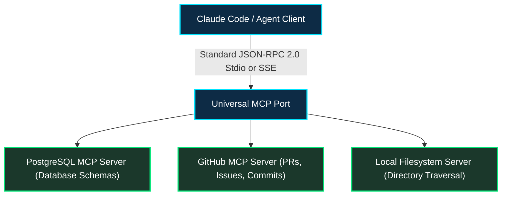
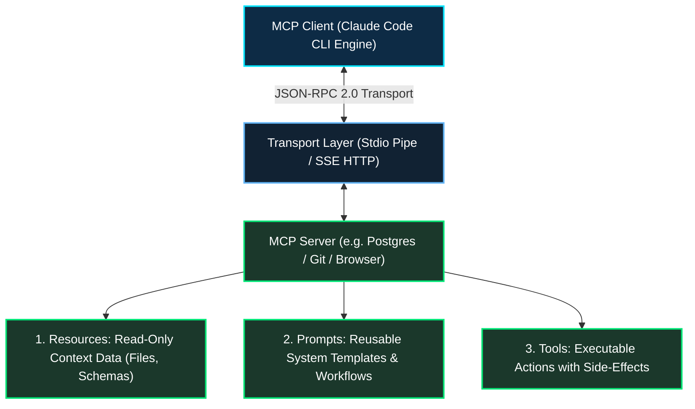
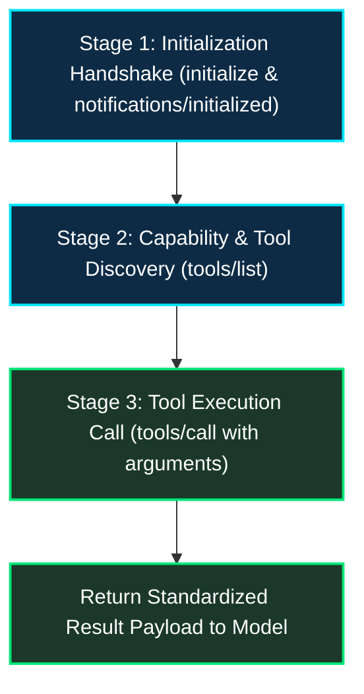
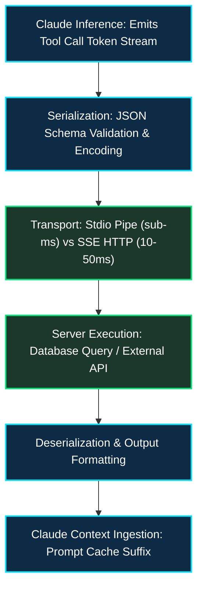

*Series: Claude Code Deep-Dive Series - Part 9*

*Series: &larr; [Part 8: Claude Code Custom Plugins: Build and Host Your Own Marketplace](/blog/0041-claude-code-custom-plugin-marketplace/) (Previous)*

### Prior Reading Material

Before mastering JSON-RPC transport layers and building custom MCP servers, review our foundational Claude Code architecture and customization deep-dives:

* [Part 1: LLMs, Agents, and Harnesses: Demystifying Claude Code](/blog/0033-intro-to-claude-code/) — The core anatomy of CLI agent harnesses, system loops, and subagent isolation.
* [Part 2: Setting up Claude Code: The Ultimate Terminal AI Pair Programmer](/blog/0034-setting-up-claude-code/) — Terminal configurations, execution models, and development environment best practices.
* [Part 3: Claude Code Customization: CLAUDE.md, AGENTS.md, and SKILLS.md](/blog/0035-claude-code-special-files/) — Steering agent personality, procedural skills, and repository rules.
* [Part 4: Claude Code Basics: Commands, Subagents, and Memory Layers](/blog/0036-claude-code-commands-agents-memory/) — Slash commands, memory tiers, and task distribution.
* [Part 8: Claude Code Custom Plugins: Build and Host Your Own Marketplace](/blog/0041-claude-code-custom-plugin-marketplace/) — Packaging extensions, community registries, and custom plugin distribution.

---

### The USB-C Analogy: Why AI Agents Need a Universal Hardware Bus

Remember the chaotic early 2000s when every consumer electronic device demanded its own proprietary cable? Digital cameras used Mini-USB, printers used USB-B, smartphones cycled through Micro-USB and proprietary 30-pin connectors, and laptops required massive barrel-jack power bricks. Every peripheral required a custom hardware adapter and bespoke driver software.



The consumer hardware industry broke this logjam by standardizing on **USB-C**: a single reversible connector and standard communication protocol that delivers high-speed data, 4K video, and 240W electrical power across any brand or peripheral.

Until recently, AI agent tool integration was trapped in that same fragmented era. If you wanted your coding agent to interact with a PostgreSQL database, an engineer had to write custom Python function definitions, manually serialize JSON schemas into system prompts, and handle bespoke execution loops. If you switched from Claude Code to another harness, you had to throw away your code and rewrite the tool wrappers from scratch.

Anthropic solved this fragmentation by open-sourcing the **Model Context Protocol (MCP)** ([anthropic.com/news/model-context-protocol](https://www.anthropic.com/news/model-context-protocol)). MCP is the USB-C standard for AI applications. It establishes an open, cross-vendor protocol using standard JSON-RPC 2.0 messages over standard I/O (`stdio`) or Server-Sent Events (`SSE`), allowing any AI client to discover, query, and invoke tools across any local or remote data source without custom code glue.

---

### The Core Architectural Primitives of MCP

MCP defines a clean client-server architecture where the AI agent harness acts as the **Host/Client** and external tools operate as isolated, self-describing **MCP Servers**:



An MCP server exposes three foundational capabilities to the model:

#### 1. Resources (Read-Only Data)
Resources represent passive context that the model can inspect, analogous to a `GET` request in REST. Examples include reading file contents, inspecting database schemas, or reading system metrics. Resources are identified by standardized URI schemes (e.g. `postgres://production/schema` or `file:///workspace/config.json`).

#### 2. Prompts (Guided Agent Templates)
Prompts are pre-packaged prompt engineering templates parameterized by variables. Instead of users writing long instructions, an MCP server can expose interactive slash commands (e.g. `/review-pr` or `/debug-incident`) that automatically pull relevant context into the model prompt.

#### 3. Tools (Executable Functions)
Tools are functions that the model can execute to affect the outside world, analogous to a `POST` or `PUT` request. Each tool publishes an exact JSON Schema describing required parameters, parameter types, and descriptions.

---

### Under the Hood: The JSON-RPC 2.0 Lifecycle

Communication between Claude Code and an MCP server follows a deterministic 3-stage protocol handshake:



#### 1. Handshake Request
```json
{
  "jsonrpc": "2.0",
  "id": 1,
  "method": "initialize",
  "params": {
    "protocolVersion": "2024-11-05",
    "capabilities": {
      "roots": { "listChanged": true },
      "sampling": {}
    },
    "clientInfo": {
      "name": "claude-code",
      "version": "1.0.0"
    }
  }
}
```

#### 2. Tool Discovery (`tools/list`)
The server responds with its catalog of executable tools and JSON Schema parameter constraints:
```json
{
  "jsonrpc": "2.0",
  "id": 2,
  "result": {
    "tools": [
      {
        "name": "query_database",
        "description": "Execute a read-only SQL query against the SQLite repository database.",
        "inputSchema": {
          "type": "object",
          "properties": {
            "query": { "type": "string", "description": "SQL query statement" }
          },
          "required": ["query"]
        }
      }
    ]
  }
}
```

#### 3. Tool Execution (`tools/call`)
When Claude Code decides to invoke the tool, it sends:
```json
{
  "jsonrpc": "2.0",
  "id": 3,
  "method": "tools/call",
  "params": {
    "name": "query_database",
    "arguments": {
      "query": "SELECT count(*) FROM users WHERE status = 'active';"
    }
  }
}
```

---

### Configuring MCP Servers in Claude Code

In Claude Code, local and remote MCP servers are registered inside the project root configuration (`claude.json` or `.mcp.json`):

```json
{
  "mcpServers": {
    "sqlite-service": {
      "command": "python3",
      "args": ["-m", "mcp_server_sqlite", "--db-path", "./production.db"],
      "env": {}
    },
    "github-tools": {
      "command": "npx",
      "args": ["-y", "@modelcontextprotocol/server-github"],
      "env": {
        "GITHUB_PERSONAL_ACCESS_TOKEN": "ghp_xxxxxxxxxxxx"
      }
    }
  }
}
```

Once defined, Claude Code automatically initializes the child process via `stdio`, ingests the discovered schemas, and equips the conversational engine with live tool-calling capabilities.

---

### Engineering Deep-Dive: Protocol Latency and Overhead Models

Let us formalize the communication latency of MCP tool invocation across IPC and network boundaries.



#### 1. End-to-End Latency Formulation
The total wall-clock latency $T_{\text{call}}$ of executing an action through an MCP server is given by:

$$T_{\text{call}} = T_{\text{infer-call}} + T_{\text{transport}} + T_{\text{exec}} + T_{\text{transport}} + T_{\text{infer-resume}}$$

Where:
- $T_{\text{infer-call}}$ is the model generation time to emit the tool call arguments.
- $T_{\text{transport}}$ is the transport pipe delay. For local `stdio` pipes, $T_{\text{transport}} \le 0.4 \text{ ms}$; for remote `SSE` transports over WAN, $T_{\text{transport}} = \frac{1}{2} \text{RTT} + \frac{\text{Payload}}{\text{Bandwidth}}$.
- $T_{\text{exec}}$ is the actual database query or script execution time.
- $T_{\text{infer-resume}}$ is the subsequent generation step where the model consumes the tool output.

#### 2. Context Window Cost Formulation
Because tool schemas must be presented to the model during the prefill phase, each active MCP server imposes a static prompt token footprint:

$$\text{Tokens}_{\text{static}} = \sum_{k=1}^{N_{\text{tools}}} \left( |\text{Name}_k| + |\text{Desc}_k| + |\text{JSONSchema}_k| \right)$$

For a server exposing 20 database tools, $\text{Tokens}_{\text{static}}$ typically consumes between 1,200 and 2,500 prompt tokens. Thanks to Anthropic's prompt caching architecture (which discounts prompt cache reads by up to 75% to 90%), this static overhead is loaded once and cached across subsequent conversational turns.

---

### Interactive Simulation: Pure Python Stdio MCP Server and Client

Below is a complete, zero-dependency Python script demonstrating:
- A compliant JSON-RPC 2.0 MCP server implementation exposing system tools (system telemetry, database querying).
- An asynchronous client simulating Claude Code's handshake, capability discovery (`tools/list`), and execution (`tools/call`).

<details><summary><b>Click to expand runnable Python simulation script</b></summary>

```python
#!/usr/bin/env python3
"""
Model Context Protocol (MCP) Client-Server Simulator
A zero-dependency Python simulation demonstrating JSON-RPC 2.0 handshake,
dynamic tool discovery (tools/list), and tool execution (tools/call).
"""

import json
import os
import platform
import sys
from typing import Any, Dict, List, Optional


class MockMCPServer:
    """Simulated MCP server exposing local developer tools via JSON-RPC 2.0."""

    def __init__(self, name: str, version: str):
        self.name = name
        self.version = version
        self.tools = {
            "get_system_telemetry": {
                "description": "Returns host OS architecture, CPU platform, and Python runtime version.",
                "inputSchema": {
                    "type": "object",
                    "properties": {},
                    "required": [],
                },
                "handler": self._tool_system_telemetry,
            },
            "calculate_checksum": {
                "description": "Calculates simple cryptographic checksum for arbitrary input text.",
                "inputSchema": {
                    "type": "object",
                    "properties": {
                        "text": {"type": "string", "description": "Text payload to hash"}
                    },
                    "required": ["text"],
                },
                "handler": self._tool_checksum,
            },
        }

    def _tool_system_telemetry(self, args: Dict[str, Any]) -> Dict[str, Any]:
        return {
            "system": platform.system(),
            "release": platform.release(),
            "machine": platform.machine(),
            "python_version": sys.version.split()[0],
        }

    def _tool_checksum(self, args: Dict[str, Any]) -> Dict[str, Any]:
        text = args.get("text", "")
        # Simulated simple polynomial hash
        checksum = hex(abs(hash(text)))[2:]
        return {"input_length": len(text), "hash": checksum}

    def handle_request(self, raw_json_str: str) -> str:
        """Processes an incoming JSON-RPC 2.0 request and returns a serialized response."""
        try:
            req = json.loads(raw_json_str)
        except Exception as e:
            return json.dumps({"jsonrpc": "2.0", "id": None, "error": {"code": -32700, "message": "Parse error"}})

        req_id = req.get("id")
        method = req.get("method")
        params = req.get("params", {})

        if method == "initialize":
            return json.dumps({
                "jsonrpc": "2.0",
                "id": req_id,
                "result": {
                    "protocolVersion": "2024-11-05",
                    "serverInfo": {"name": self.name, "version": self.version},
                    "capabilities": {"tools": {"listChanged": False}, "resources": {}},
                },
            })

        elif method == "tools/list":
            tools_list = []
            for name, meta in self.tools.items():
                tools_list.append({
                    "name": name,
                    "description": meta["description"],
                    "inputSchema": meta["inputSchema"],
                })
            return json.dumps({"jsonrpc": "2.0", "id": req_id, "result": {"tools": tools_list}})

        elif method == "tools/call":
            tool_name = params.get("name")
            tool_args = params.get("arguments", {})
            if tool_name not in self.tools:
                return json.dumps({
                    "jsonrpc": "2.0",
                    "id": req_id,
                    "error": {"code": -32601, "message": f"Tool '{tool_name}' not found"},
                })
            handler = self.tools[tool_name]["handler"]
            output = handler(tool_args)
            return json.dumps({
                "jsonrpc": "2.0",
                "id": req_id,
                "result": {
                    "content": [{"type": "text", "text": json.dumps(output, indent=2)}],
                    "isError": False,
                },
            })

        return json.dumps({
            "jsonrpc": "2.0",
            "id": req_id,
            "error": {"code": -32601, "message": f"Method '{method}' not implemented"},
        })


class MockClaudeCodeClient:
    """Simulates Claude Code communicating with an MCP server."""

    def __init__(self, server: MockMCPServer):
        self.server = server
        self.msg_counter = 0

    def send(self, method: str, params: Optional[Dict[str, Any]] = None) -> Dict[str, Any]:
        self.msg_counter += 1
        req = {"jsonrpc": "2.0", "id": self.msg_counter, "method": method}
        if params is not None:
            req["params"] = params
        req_str = json.dumps(req)
        resp_str = self.server.handle_request(req_str)
        return json.loads(resp_str)


def run_demo():
    print("=" * 75)
    print("MODEL CONTEXT PROTOCOL (MCP) CLIENT-SERVER SIMULATION")
    print("=" * 75)

    server = MockMCPServer(name="system-diagnostics-server", version="1.2.0")
    client = MockClaudeCodeClient(server)

    # 1. Handshake
    print("\n--- 1. Protocol Handshake (method: 'initialize') ---")
    handshake_resp = client.send("initialize", {"protocolVersion": "2024-11-05", "clientInfo": {"name": "claude-code"}})
    print(json.dumps(handshake_resp, indent=2))

    # 2. Tool Discovery
    print("\n--- 2. Tool Discovery (method: 'tools/list') ---")
    tools_resp = client.send("tools/list")
    tools = tools_resp["result"]["tools"]
    for t in tools:
        print(f"  * Discovered Tool: '{t['name']}' -> {t['description']}")

    # 3. Tool Execution 1: System Telemetry
    print("\n--- 3. Executing Tool 1: 'get_system_telemetry' ---")
    telemetry_call = client.send("tools/call", {"name": "get_system_telemetry", "arguments": {}})
    print("Tool Return Payload:")
    print(telemetry_call["result"]["content"][0]["text"])

    # 4. Tool Execution 2: Checksum Calculation
    print("\n--- 4. Executing Tool 2: 'calculate_checksum' ---")
    checksum_call = client.send("tools/call", {
        "name": "calculate_checksum",
        "arguments": {"text": "Model Context Protocol eliminates tool integration fragmentation."},
    })
    print("Tool Return Payload:")
    print(checksum_call["result"]["content"][0]["text"])

    print("\n" + "=" * 75)
    print("Simulation complete: JSON-RPC 2.0 MCP lifecycle verified.")
    print("=" * 75)


if __name__ == "__main__":
    run_demo()
```

</details>

---

### Key Takeaways & Summary

1. **The Universal USB-C for AI**: Model Context Protocol replaces brittle point-to-point tool glue with an open, standard JSON-RPC 2.0 client-server protocol supported across models and agent runtimes.
2. **Triad of Capabilities**: MCP standardizes access across Resources (read-only data), Prompts (guided templates), and Tools (executable functions with side effects).
3. **Seamless CLI Integration**: In Claude Code, adding external enterprise tools or databases requires only a declarative configuration entry in `claude.json`, unlocking instant autonomous tool discovery.
