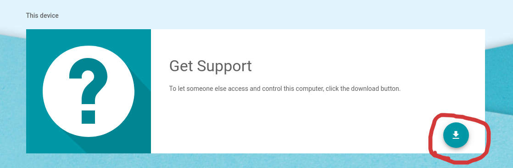

### Problem Statement

_Reference_: [Reddit thread](https://www.reddit.com/r/Fedora/comments/ah6d0w/how_do_you_install_chrome_remote_desktop_on_fedora/)

Google chrome only gives `.deb` as the installable while trying to install the browser extension. `deb` is only for Debian based systems and doesn't work on Fedora which uses `rpm` as the installables

### Steps

#### Install perl-ExtUtils-MakeMaker-7.44-2.fc32

This is a requirement for installing [`alien`](http://joeyh.name/code/alien/) package on the fedora system.

-   Download the `rpm` file from [here](https://kojipkgs.fedoraproject.org//packages/perl-ExtUtils-MakeMaker/7.44/2.fc32/noarch/perl-ExtUtils-MakeMaker-7.44-2.fc32.noarch.rpm)
-   Install using `yum` by running the following command (_replace the rpm name with teh version downloaded, if its different_)

```
sudo yum install perl-ExtUtils-MakeMaker-7.44-2.fc32.noarch.rpm -y
```

#### Install rpm build package

```
sudo yum install rpm-build -y
```

#### Install [`alien`](http://joeyh.name/code/alien/) package

_Reference_: [how-to-install-deb-packages-on-fedora/](https://www.systutorials.com/how-to-install-deb-packages-on-fedora/)

-   Download the `tar.gz` from [here](http://ftp.de.debian.org/debian/pool/main/a/alien/alien_8.92.tar.gz)

-   Run the following commands (_assumption is that `perl` is already installed_) and `alien` will be installed

```
tar xf alien-VERSION.tar.gz
cd alien
perl Makefile.PL; make; sudo make install
```

#### Download google chrome browser extension

-   Install Google chrome Remote Desktop extension from [here](https://chrome.google.com/webstore/detail/chrome-remote-desktop/gbchcmhmhahfdphkhkmpfmihenigjmpp)
-   Download the `deb` installable by clicking on the Remote Desktop Chrome Extension and hitting the following ic
    

#### Convert `deb` to `rpm`

-   Run `alien` command to convert the `deb` to `rpm` (_this uses `rpmbuild` command internally_)

```
sudo alien -r chrome-remote-desktop_current_amd64.deb
```

**Succesful Run will look like the following**

```
$ sudo alien -r chrome-remote-desktop_current_amd64.deb
Warning: Skipping conversion of scripts in package chrome-remote-desktop: postinst postrm preinst prerm
Warning: Use the --scripts parameter to include the scripts.
chrome-remote-desktop-81.0.4044.60-2.x86_64.rpm generated
```

#### Hitting Errors during installation of `rpm`

```
$ sudo yum install chrome-remote-desktop-81.0.4044.60-2.x86_64.rpm
Last metadata expiration check: 1:52:52 ago on Fri 27 Mar 2020 09:58:57 AM PDT.
Dependencies resolved.
================================================================================================================================================================================================================================================================================
 Package                                                                   Architecture                                               Version                                                            Repository                                                        Size
================================================================================================================================================================================================================================================================================
Upgrading:
 chrome-remote-desktop                                                     x86_64                                                     81.0.4044.60-2                                                     @commandline                                                      28 M

Transaction Summary
================================================================================================================================================================================================================================================================================
Upgrade  1 Package

Total size: 28 M
Is this ok [y/N]: y
Downloading Packages:
Running transaction check
Transaction check succeeded.
Running transaction test
Error: Transaction test error:
  file / from install of chrome-remote-desktop-81.0.4044.60-2.x86_64 conflicts with file from package filesystem-3.12-2.fc31.x86_64
  file /usr/lib from install of chrome-remote-desktop-81.0.4044.60-2.x86_64 conflicts with file from package filesystem-3.12-2.fc31.x86_64
  file /etc/init.d from install of chrome-remote-desktop-81.0.4044.60-2.x86_64 conflicts with file from package initscripts-10.02-2.fc31.x86_64
  file /etc/init.d from install of chrome-remote-desktop-81.0.4044.60-2.x86_64 conflicts with file from package chkconfig-1.11-5.fc31.x86_64

```
