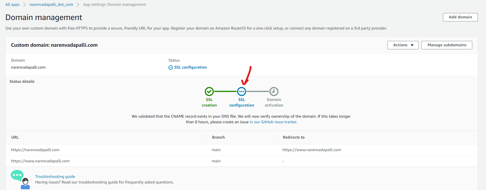

## AWS Amplify Console

You Need to sign in to AWS account by clicking on on https://aws.amazon.com/amplify/. Once the credentials are provided, should see welcome screen like the following


## Connecting Github (source code)

Since the code for my website is already hosted on [github](https://github.com/narenandu/narenvadapalli_dot_com), we choose `From your existing code` option as shown and `Github`


### Choose the repo


### Choose the branch


## Adding in the custom environment variables

Once we hit the `Next` button, there will be App Settings and under `Advanced Settings`, there is a provision to add the custom env vars that we want to secure from exposing them in source code. I have `Google Analytics` connected to my website to track the insights in to the audience. More details here: [Adding Google Analytics to personal website](https://www.narenvadapalli.com/blog/google-analytics-to-personal-website/)


## Connecting the deployment to custom domain

As per https://docs.aws.amazon.com/amplify/latest/userguide/custom-domains.html, by default the deployment happens at the custom url in the following format

```
https://branch-name.d1m7bkiki6tdw1.amplifyapp.com
```

This step enables us to connect any custom domain to the deployment process. This step will take time as it has to issue SSL certificates and then verify the ownership, finally propagates the DNS records


## Domain Activation

If the SSL certificate issued successfully and the ownership is verified, Domain will be activated


## Potential Issue

SSL Configuration step could just be not moving forward and stuck for more than 1 hour



### Fix

Just delete the custom domain and restart the process


