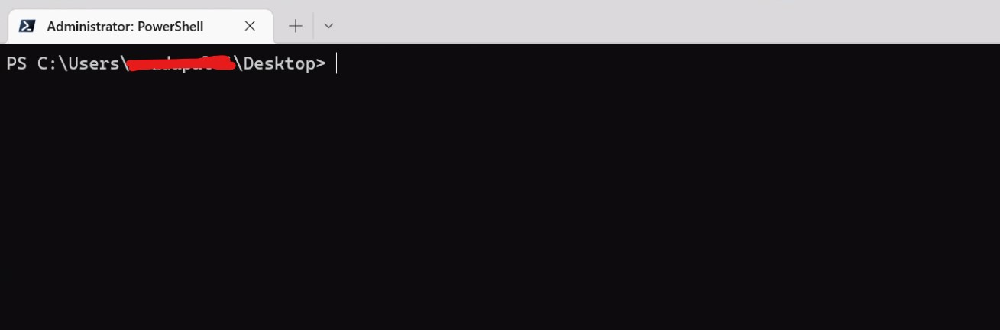
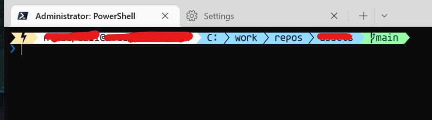
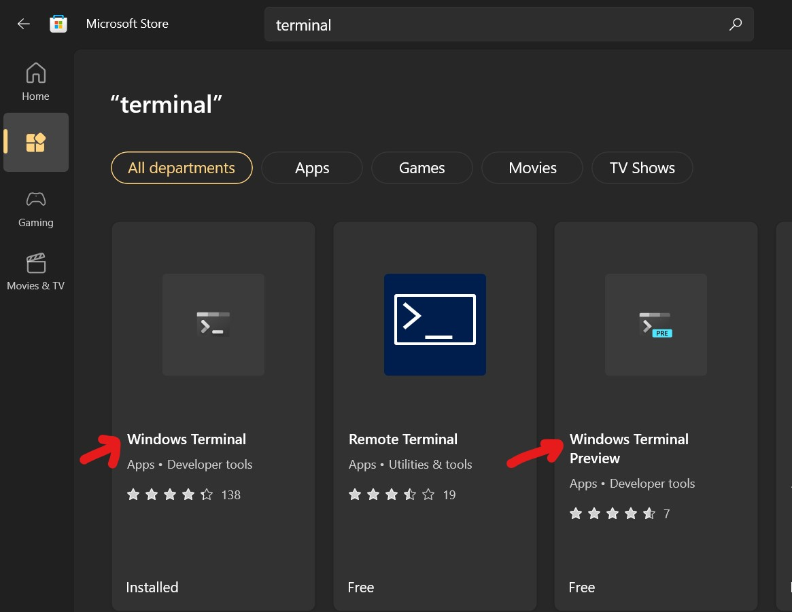
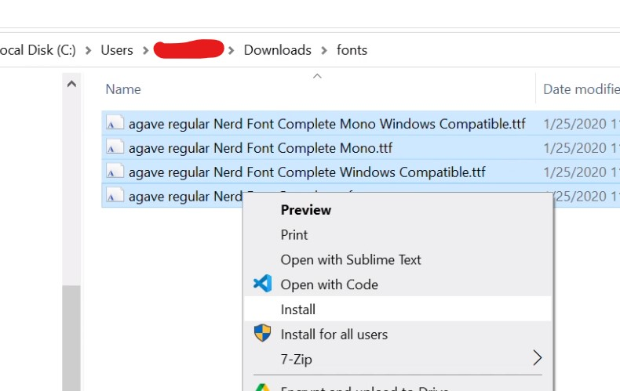
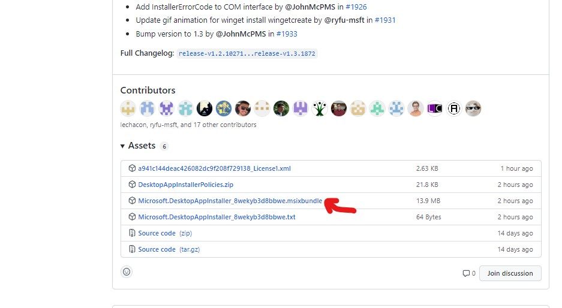
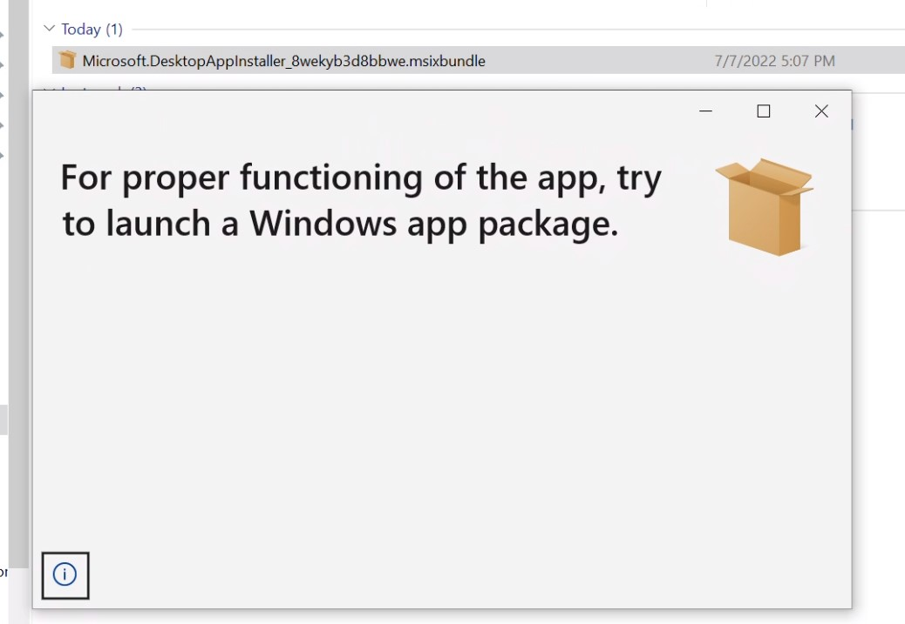
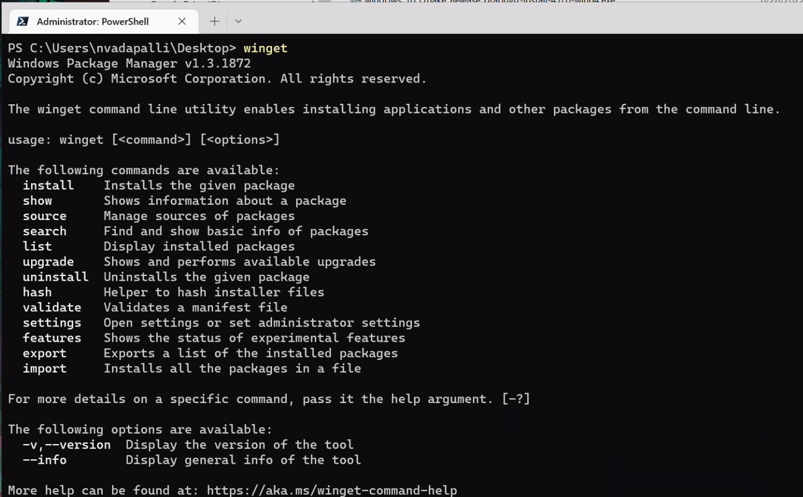
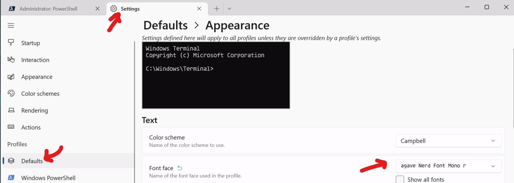

## Motivation
Default terminal in a powershell looks like the following and this blog helps in making the terminal look fancy with features

### Before



### After


# Nice to have
Good to have the Windows Terminal (or Preview) app installed from Windows app store for customizing the font


# Steps

### Install Nerdfonts
Fonts can be previewed using https://www.programmingfonts.org/#agave

- Pick any font available here and install it on the Windows machine by downloading it
  - https://www.nerdfonts.com/font-downloads
- Download the zip file and extract the ttf files
- Right click and hit `install` as shown below




### Install `winget` on the machine

There are multiple ways of installing `winget`on a given windows machine. One easier thing would be to look for `winget` in the Windows Appstore and shows up as `App Installer`.


Sometimes this doesn't go through and a reliable way to install `winget` would be, via the github releases of official git repository: https://github.com/microsoft/winget-cli/releases


Double click on the `.msixbundle` file and go through the prompts and `Winget` will be installed



### Install `oh-my-posh`
Run the following command
```
winget install JanDeDobbeleer.OhMyPosh
```
Expected output should look similar to the Following
```
Found Oh My Posh [JanDeDobbeleer.OhMyPosh] Version 8.13.1
This application is licensed to you by its owner.
Microsoft is not responsible for, nor does it grant any licenses to, third-party packages.
Downloading https://github.com/JanDeDobbeleer/oh-my-posh/releases/download/v8.13.1/install-amd64.exe
  ██████████████████████████████  6.55 MB / 6.55 MB
Successfully verified installer hash
Starting package install...
Successfully installed
```

### Add the `oh-my-posh` command to Powershell profile file
- Use your favorite text editor and open `$PROFILE` file, which gets run before the powershell launches, using [VSCode](https://code.visualstudio.com/download#) (`code`) here to launch the profile file
```
 code $PROFILE
```
- Add the following linked
```
oh-my-posh init pwsh --config "$env:POSH_THEMES_PATH\paradox.omp.json" | Invoke-Expression
```
Restart Windows Terminal App

### Update the font in the Windows terminal settings app
- Set the font to the downloaded nerd font type face



## Result


## References
- https://phoenixnap.com/kb/install-winget
- https://docs.microsoft.com/en-us/windows/terminal/tutorials/custom-prompt-setup
