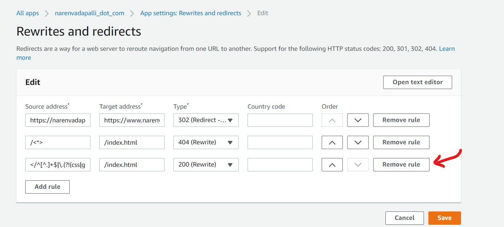

## Problem Statement

After connecting the app for continuous deployment by attaching the branch on my github repository (For those interested, details here: [Connecting to AWS Amplify for deployment](https://www.narenvadapalli.com/blog/connecting-aws-amplify-for-deployment/)), any specific url provided was always getting redirected to my home page (`./index.html`)

## Rewrites and Redirects

You Need to sign in to AWS account by clicking on on https://aws.amazon.com/amplify/. Once the credentials are provided. Click on `Rewrites and redirects`

### Default entries

There were 3 default entries and was suspecting one of them was causing this issue, but wasn't certain.


```
[
    {
        "source": "https://narenvadapalli.com",
        "target": "https://www.narenvadapalli.com",
        "status": "302",
        "condition": null
    },
    {
        "source": "/<*>",
        "target": "/index.html",
        "status": "404-200",
        "condition": null
    },
    {
        "source": "</^[^.]+$|\\.(?!(css|gif|ico|jpg|js|png|txt|svg|woff|ttf|map|json)$)([^.]+$)/>",
        "target": "/index.html",
        "status": "200",
        "condition": null
    }
]
```

### Approach

I could have spent time and understood the redirects by studying the regex closely, but even simpler was to remove one by one (starting with the most suspected) and trying.

#### Attempt 1

First removed the second entry which felt like it was grabbing all the entries after my website's url.

```
    {
        "source": "/<*>",
        "target": "/index.html",
        "status": "404-200",
        "condition": null
    },
```

which didn't help and pages were still getting redirected

#### Attempt 2

Removed the last entry



```
    {
        "source": "</^[^.]+$|\\.(?!(css|gif|ico|jpg|js|png|txt|svg|woff|ttf|map|json)$)([^.]+$)/>",
        "target": "/index.html",
        "status": "200",
        "condition": null
    }
```

and saved the updated entries


and suddenly the specific urls were sticking without redirection to my homepage ( `./index.html`)

> **So found the culprit**

---

## Bonus research

-   As per https://moz.com/learn/seo/redirection, seems like `301` redirection is preferred in terms for Search Engine Optimization (`SEO`) rather than `302` for the redirection of URL with and without `www`
-   The second rule there was to catch any urls that point to an invalid/non-existing page. So I had a `404.html` in my static website and was to redirect to that page, rather than my homepage ( ./index.html`)


So finally the working combination of `Rewrites and Redirects` is

```
[
    {
        "source": "https://narenvadapalli.com",
        "target": "https://www.narenvadapalli.com",
        "status": "301",
        "condition": null
    },
    {
        "source": "/<*>",
        "target": "/index.html",
        "status": "404-200",
        "condition": null
    }
]
```

---

## Steps to open the bulk edit text editor

Follow the steps to get to the bulk edits text editor

#### Edit button


#### Open Text Editor button


#### Text editor


