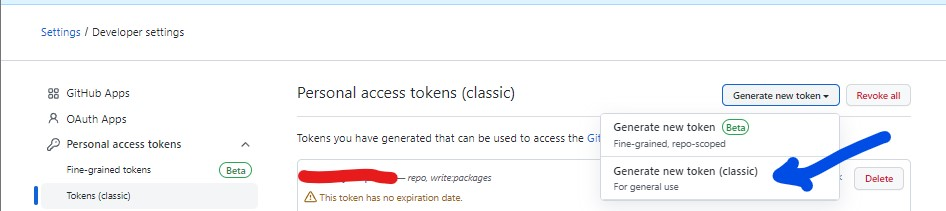
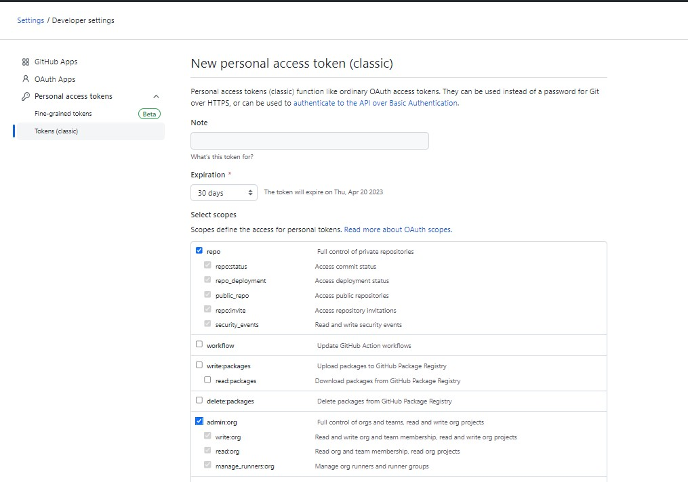
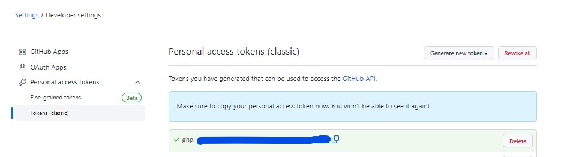

## Motivation

w.r.t https://www.narenvadapalli.com/blog/self-hosted-github-runner-registration-process/, while registering a windows host as github self hosted runner, you need to generate a Token for registration.

This blog will take you through the process of generating the token, using Github REST API

## Github Personal Access token (Classic) Generation

You Need to sign in to Github org account by clicking on https://github.com/settings/tokens.

The token that was used with `config.cmd` (REF: self-hosted-github-runner-registration-process) is a one time registration token and we would have to generate a new token for each new self hosted github runner. But fortunately, there seems to be the required API calls with github to generate the token, that would be valid for an hour

REF: https://docs.github.com/en/rest/actions/self-hosted-runners?apiVersion=2022-11-28#create-a-registration-token-for-an-organization





Copy/backup the token for it to be used in the next step




## Token Generation using Github's REST API for registering self hosted runner

Following would capture the Token in to a variable called $token when run in a Powershell.

Remember to replace the following in the command below with a Github Personal Access Token that has both `repo` and `admin:org` permissions
- `<<GITHUB_ACCESS_TOKEN_REDACTED>>`
- `<<GITHUB_ORG>>`

```
$token=$(Invoke-RestMethod -Method Post `
  -Uri https://api.github.com/orgs/<<GITHUB_ORG>>/actions/runners/registration-token `
  -Headers @{
    "Accept" = "application/vnd.github+json"
    "Authorization" = "Bearer <<GITHUB_ACCESS_TOKEN_REDACTED"
    "X-GitHub-Api-Version" = "2022-11-28"
  }).token
```

Print the token to check it
```
$token
```
