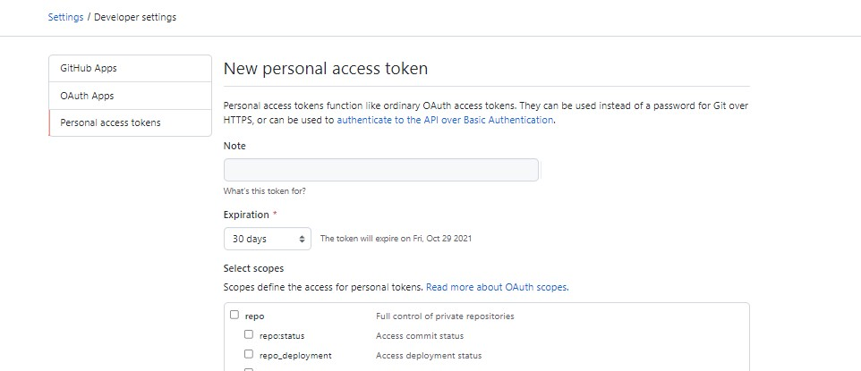

## Motivation
- There was an existing github repo that was cloned from before the github passwords were obselete (Ref: [deprecation notice in github blog](https://github.blog/2020-12-15-token-authentication-requirements-for-git-operations/))
- `git pull` was failing

## Solution
Run the following sequence of steps to figure out the solution
- First Go to [Github Tokens for your account](https://github.com/settings/tokens/new)
- Then hit on `Generate new token`
    - Give appropriate `Note` for identifying it at a later date
    - Select proper Expiration time => You will need to regenerate your token after expiration
    - Select OAuth scopes as per requirement
    - Hit `Generate Token` at the end


**Note down the generated token as it won't be shown again, in a secure place**

Now get back to command line (in my case PowerShell)
- Make sure to check the email/username configured with git commandline global settings
```
git config --global user.name
git config --global user.email
```
- Set the values accordingly, if they are not as intended
```
git config --global user.name "your_github_username"
git config --global user.email "your_github_email"
```
- One can check all the config values by running the following
```
git config -l
git config -l --global  # shows only global config values
```
- Set credential helper timeout to probably few hours or a day, so as to avoid the prompt for login on every `git push`/`git pull` command
```
git config --global credential.helper "cache --timeout=86400"
```
- Run `git pull` while at the root of the existing cloned repository
```
Username for 'https://github.com' : username
Password for 'https://github.com' : paste your personal token from earlier step here
```

You should all be setup until the timeout happens and the prompt appears again
