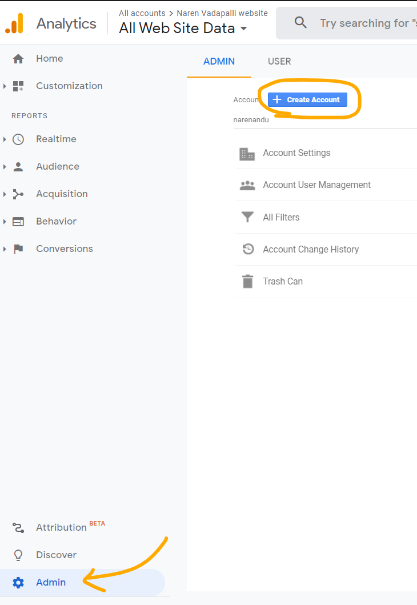
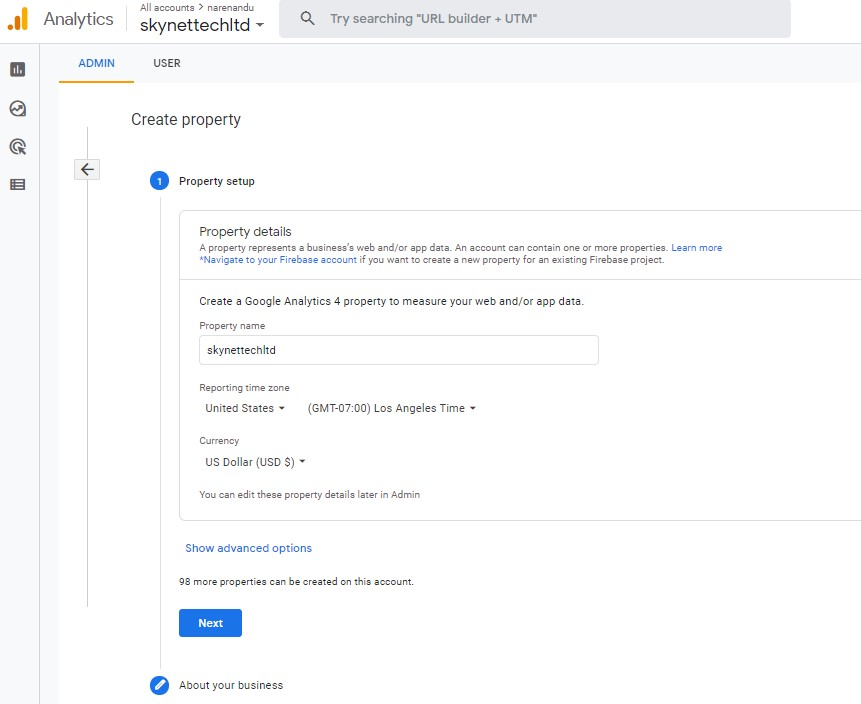
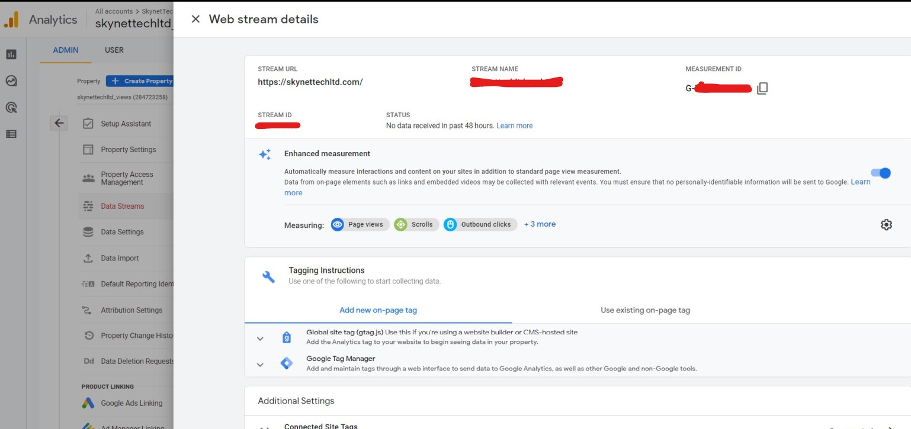
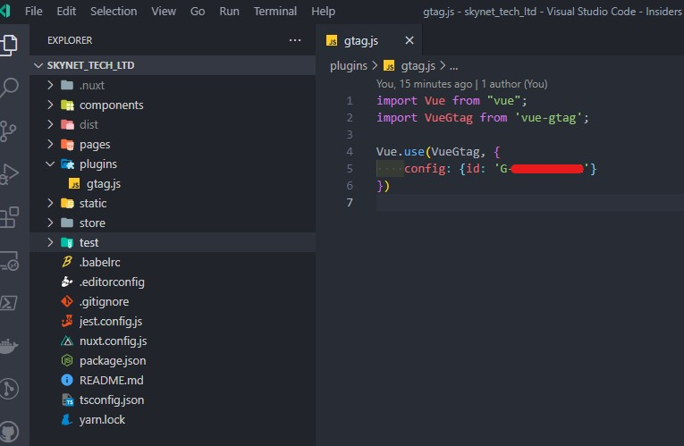
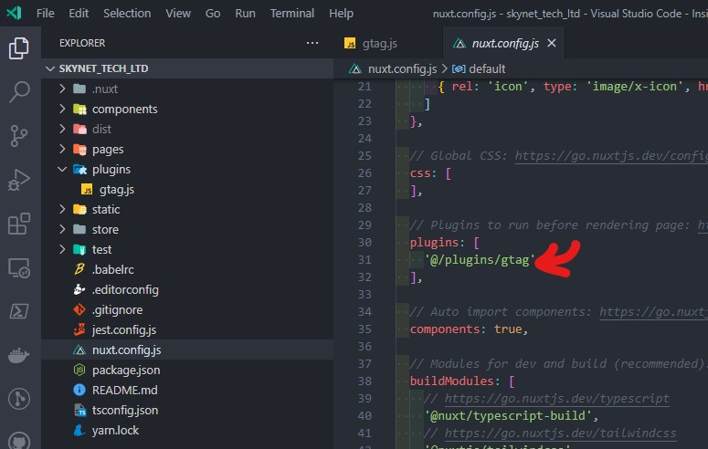
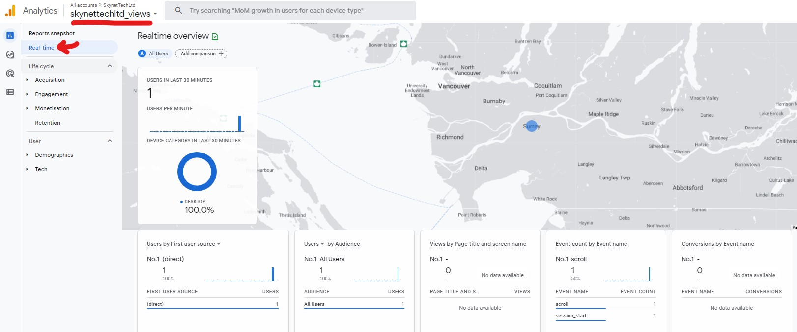

### Setting up Google Analytics Account
- Go to [Google Analytics home page](https://www.google.com/analytics/)
- Sign in with your google account (otherwise `Sign Up`)
- Click on the `Admin` icon on the left pane


- Create an account for the website by providing the details for the property to measure, which in this my business website: [Skynet Technology Ltd](https://www.skynettechltd.com/)

  - Provide the details about the business

- Click `DataStreams` under the property column and create a new `Web Stream`


- Finally something like the following should appear on the screen with a `Measurement ID` that is of the format `G-XXXXXXX`. **Make a note of this**


- Now go in the Source code of the NuxtJS app and create a folder called `plugins` at the root with a file called `gtag.js`


- Install the `vue-gtag` package using `yarn` (or `npm` if you use it). Please note `"vue-gtag": "^1.16.1"` is the working version with this setup.

```
yarn add vue-gtag
```

- Add the following to the `plugins/gtag.js` file. Replace the value against `id` by providing the Measurement ID shown in the earlier step

```
import Vue from "vue";
import VueGtag from 'vue-gtag';

Vue.use(VueGtag, {
    config: {id: 'G-XXXXXXXXXX'}
})
```

- Add the path to the created plugin in `nuxt.config.js` file at the root
```
  plugins: [
    '@/plugins/gtag'
  ],
```


That's mostly it. Just follow through your deployment process and should see the real time stats as a method of verification



## References
- https://github.com/MatteoGabriele/vue-gtag
- https://stackoverflow.com/a/64613134
