### Setting up Google Analytics Account
- Go to [Google Analytics home page](https://www.google.com/analytics/)
- Sign in with your google account (otherwise `Sign Up`)
- Click on the `Admin` icon on the left pane
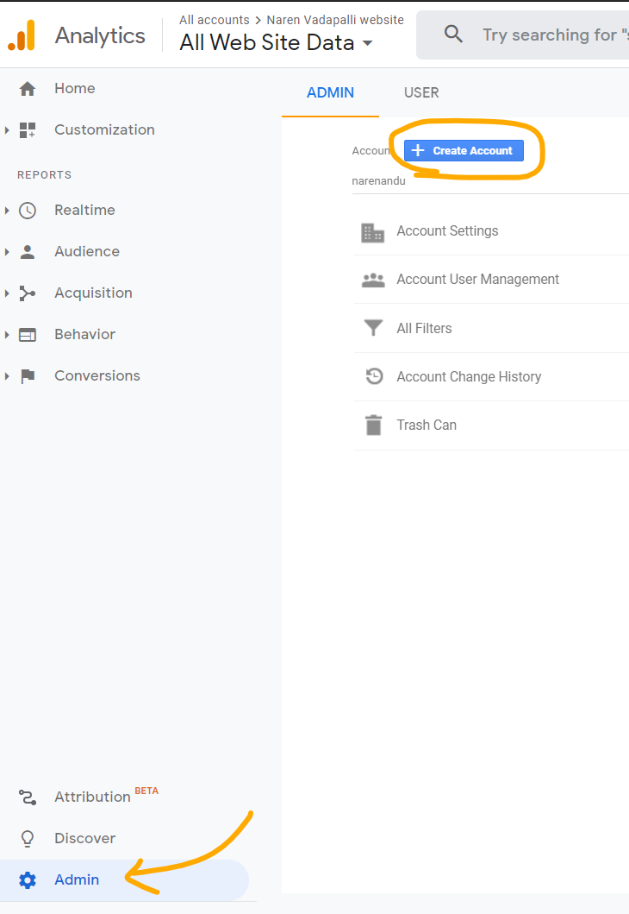
- Create an account for the website by providing the details for the property to measure, which in this case is my personal website
#### step 1
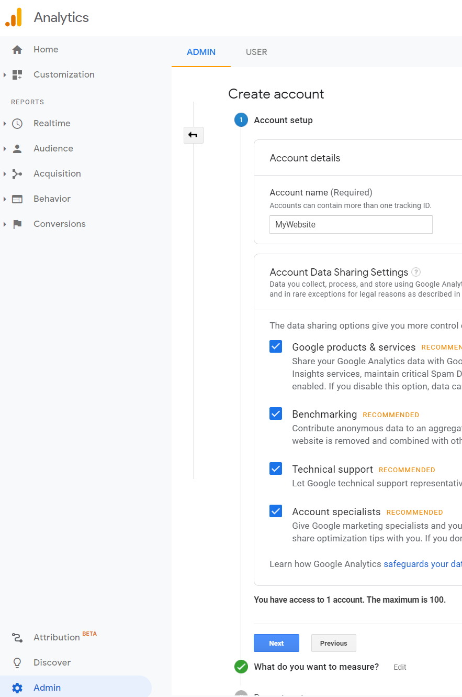

#### step 2
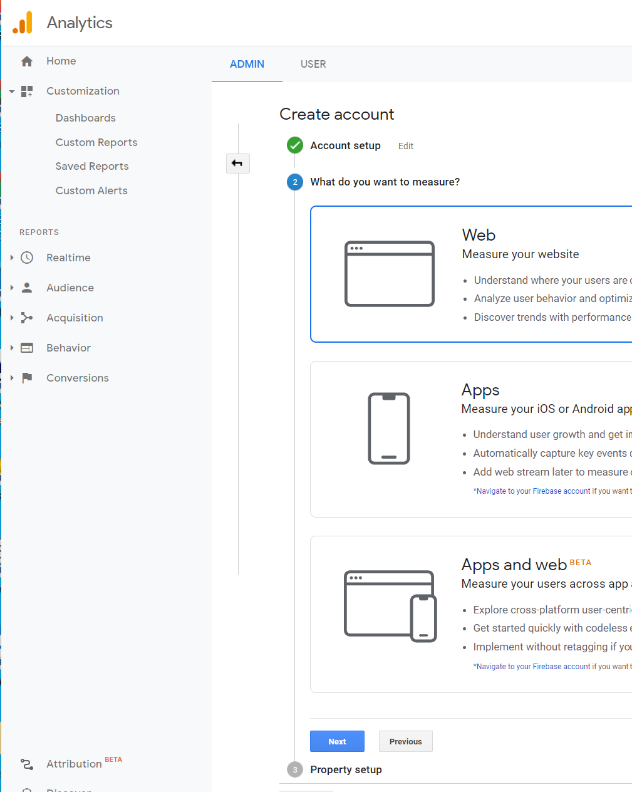

#### step 3
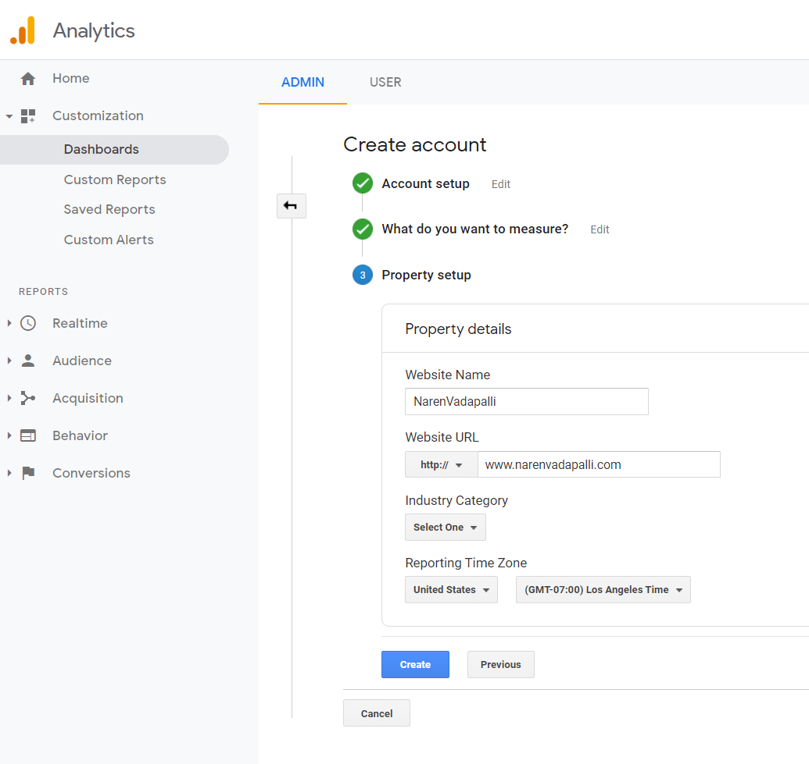

### Getting the Tracking ID for the property to Measure
- `Tracking ID` is the identifier that will be given in the `gatsby` config of my personal website under the gatsby google analytics plugin
- Following will help you find the same
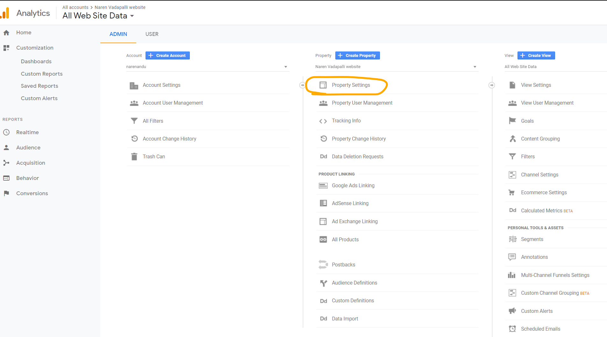
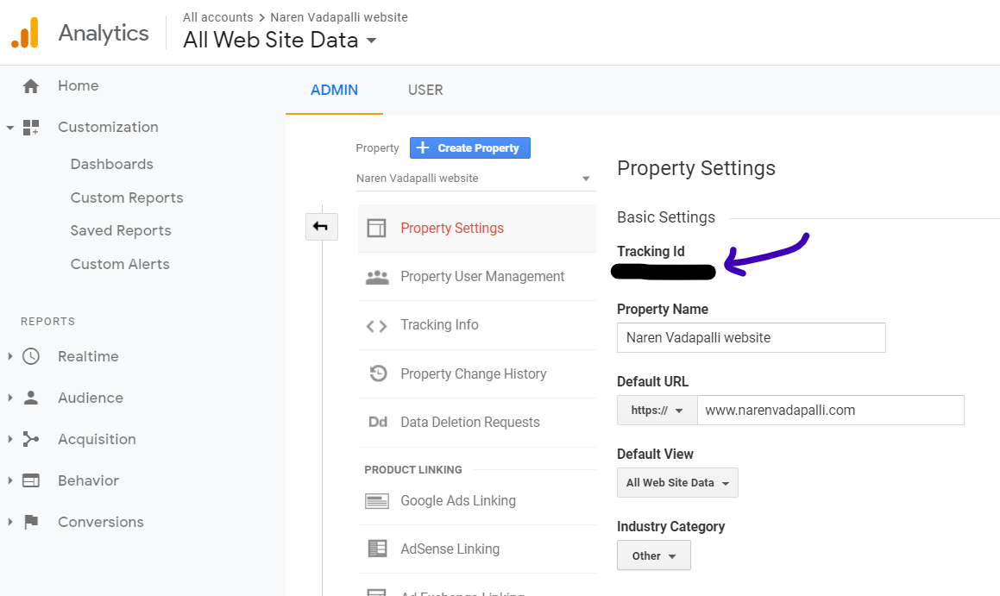
- Take a note of the `Tracking ID`


### Adding the gatsby plugin
- Need to install the plugin `gatsby-plugin-google-analytics` (Ref: https://www.gatsbyjs.com/plugins/gatsby-plugin-google-analytics/)
- Run the command in your local dev environemtn `npm install gatsby-plugin-google-analytics`
- Add the following block to `gatsby-config.js`
```
        {
            resolve: `gatsby-plugin-google-analytics`,
            options: {
                trackingId: process.env.GATSBY_GOOGLE_ANALYTICS_TRACKING_ID || "none"
            }
        }
```
- `GATSBY_GOOGLE_ANALYTICS_TRACKING_ID` is an enviornment variable that needs to be added to the deployment environment, to not expose the Tracking ID to public


### Setting Env Variable in AWS Amplify

#### Deployment environment
- My personal website has been setup to be hosted and deployed via A[AWS Amplify](https://aws.amazon.com/amplify/)
  - Has the advantage of automatic provisioning of the AWS resources
  - CI/CD built in
  - Automatic Depoloyment when code is merged to `master` branch on a connected github repository

#### Amplify Console - Environment Variables
- Login in to Amplify Console: https://console.aws.amazon.com/console/home with AWS credentials
- Select the app (website deployment) and under `App Settings` check for `Environment Variables`
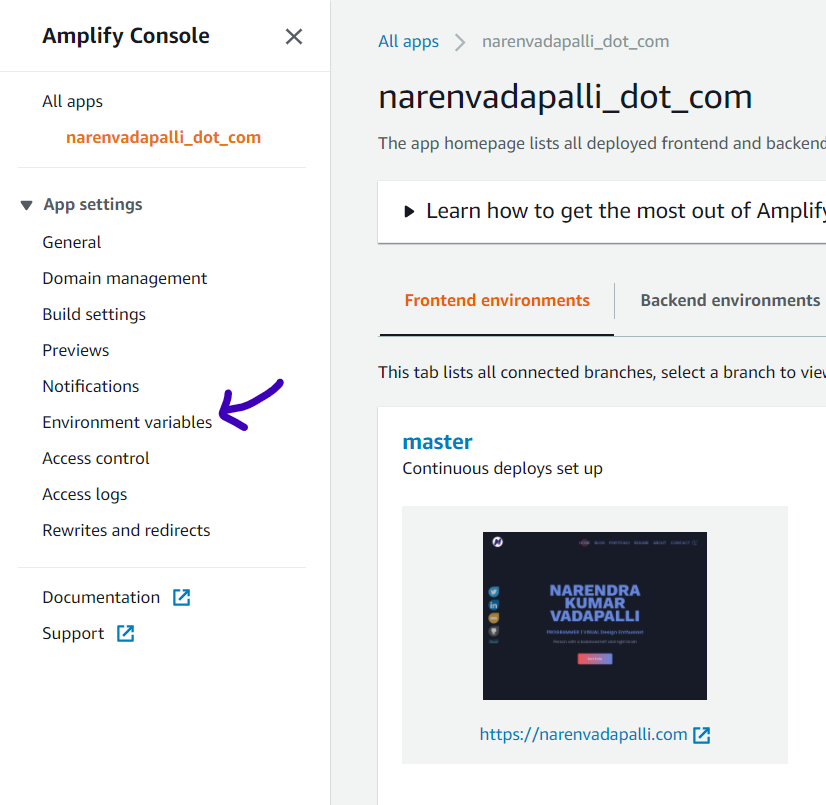
- Click on `Manage Variables`
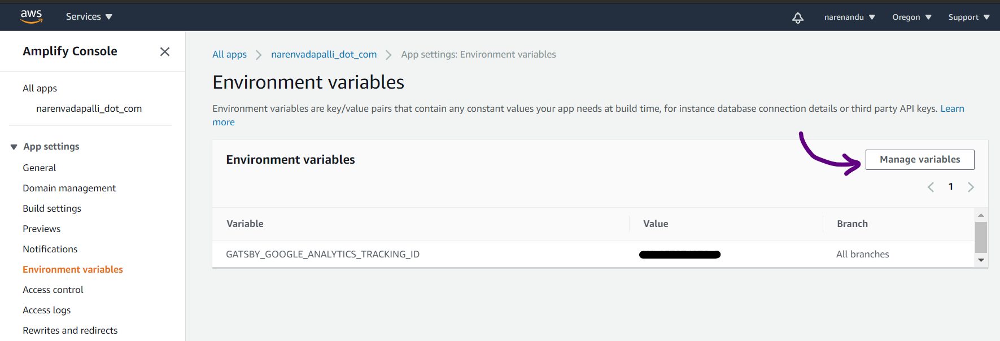
- Click on `Add Variable`. Add `GATSBY_GOOGLE_ANALYTICS_TRACKING_ID` as the `Variable` and under `Value` paste the `Tracking ID` copied from Google Analytics
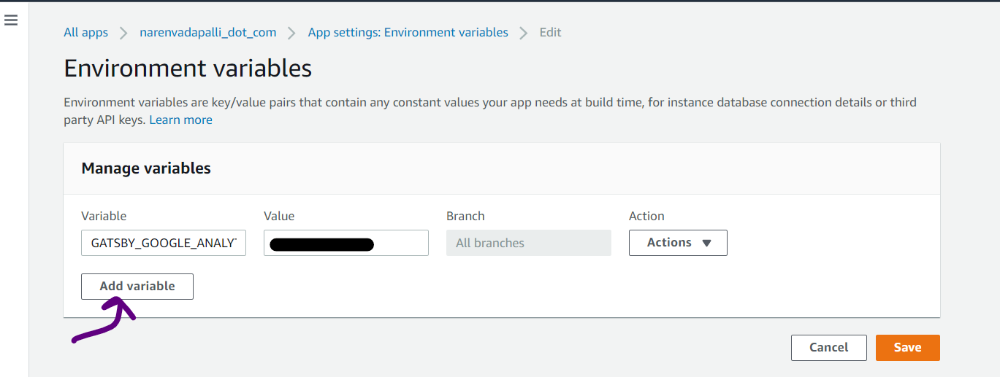
- Once Saved, environment variables list should show the value
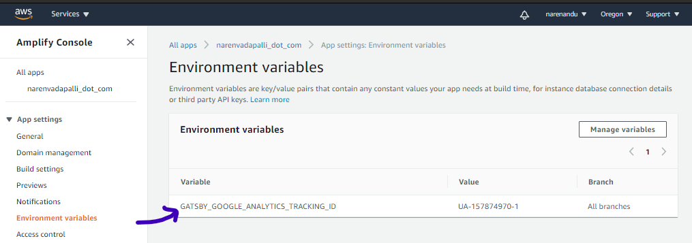

> That's it !

Once Setup, Google Analytics will now start tracking the metrics in Real Time (eg: Active Users). Analytics has a lot of potential in tailoring the content to the target audience

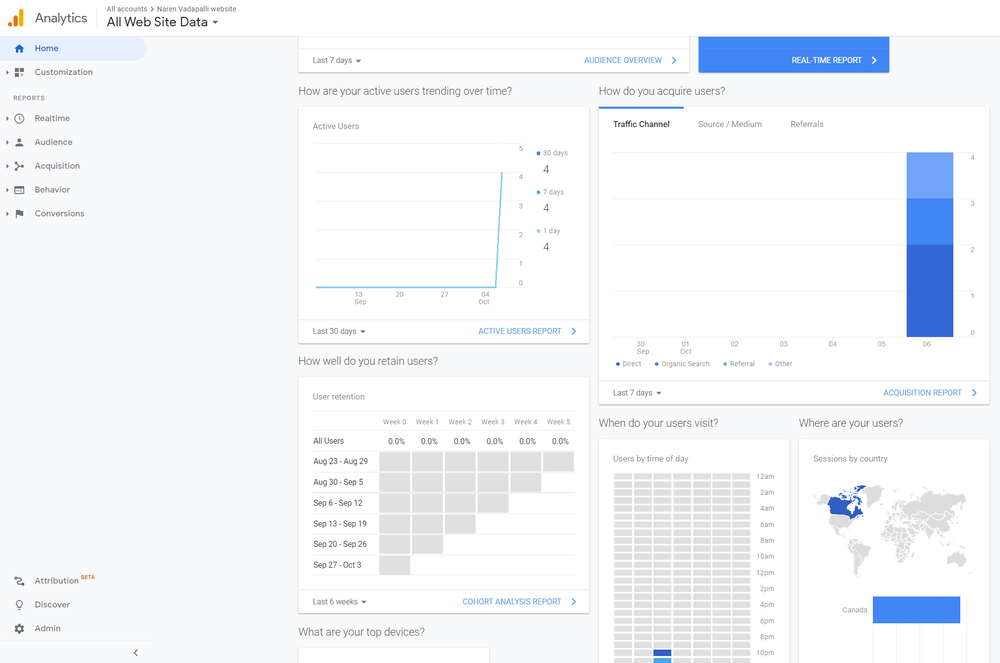
