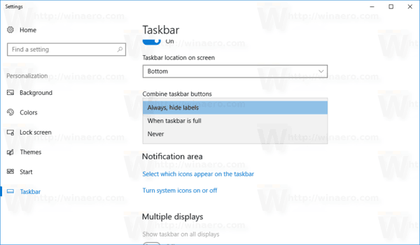
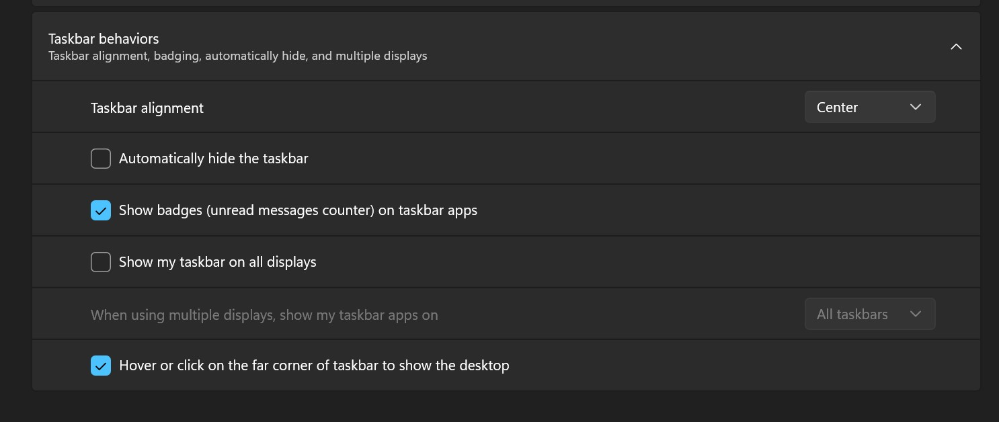
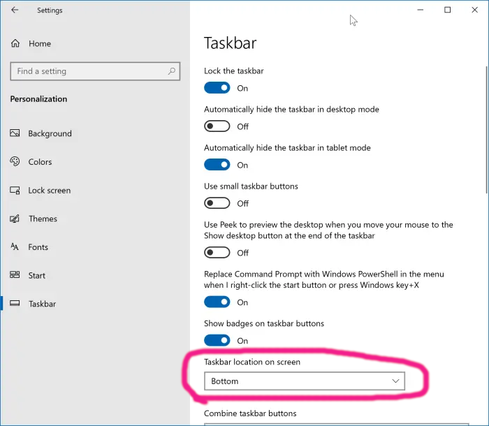

## Ungroup the Icons in Taskbar

If you are a person who likes to see all your open windows in the taskbar, with their titles for one click navigation, you would relate to my pain.

There used to be the option called `Combine Taskbar Buttons`

Now in Windows 11, its gone !

This makes it super hard to navigate directly to your inteded window with a glance and click :(

## Position the Taskbar

Also there used to be the option of `Taskbar Location on Screen` which goes missing

This is a real productivity tool for many developers who rely on the left/right positioning to get more real estate for individual window titles, again for quicker navigation.

---

Not sure what the logic behind this is, but please bring these settings back Microsoft !
