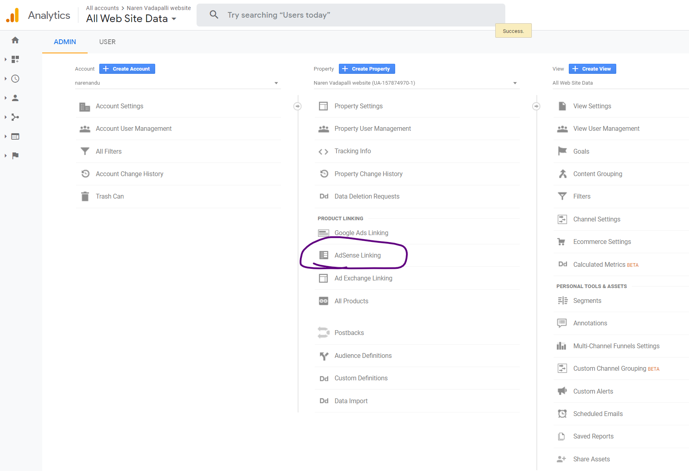
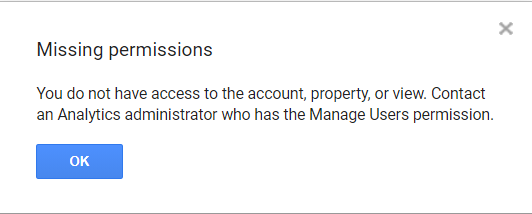

## Problem
- I signed in to the my Google account and on Chrome browser and opened up my Google Analytics and Google Adsense accounts in two tabs.
- I was trying to connect the `AdSense` account to `Analytics` to get better visualization of metrics

- Even after trying multiple times I still see the following error

## Solution
Surprisingly, the solution was to use another Browser, in my case, I have used Mozilla Firefox and logged in to my Google account.

Repeated the same steps and now the Adsense Account is linked !

## Reason (Speculating)

If I have to guess, it might be due to some kind of cookie caching happening with in the chrome browser and might need to logout as well from the Google account (which is kind of inconvenient) !
