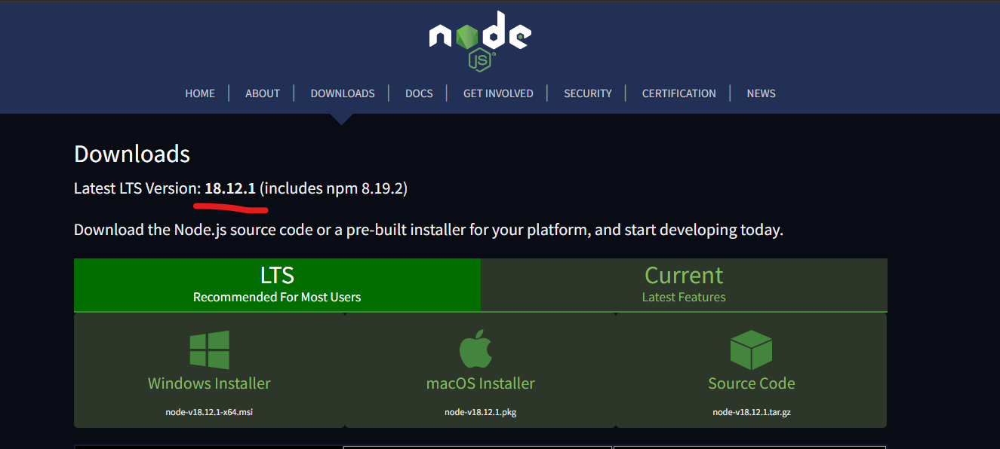

## Node Version Manager (nvm)

Straight from the intro of [nvm github repository](https://github.com/nvm-sh/nvm)
> _nvm allows you to quickly install and use different versions of node via the command line_


## `nvm` for Windows

There is a nvm developed for windows at https://github.com/coreybutler/nvm-windows. Download the installer from [github releases](https://github.com/coreybutler/nvm-windows/releases)
- Example: [1.1.10 ver](https://github.com/coreybutler/nvm-windows/releases/download/1.1.10/nvm-setup.exe)
- Just choose all the default options and go through the installation

Test the installation  by running `nvm` command in a powershell or windows terminal

```
❯nvm                                                                                                       ❮  

Running version 1.1.10.

Usage:

  nvm arch                     : Show if node is running in 32 or 64 bit mode.
  nvm current                  : Display active version.
  nvm install <version> [arch] : The version can be a specific version, "latest" for the latest current version, or "lts" for the
                                 most recent LTS version. Optionally specify whether to install the 32 or 64 bit version (defaults
                                 to system arch). Set [arch] to "all" to install 32 AND 64 bit versions.
                                 Add --insecure to the end of this command to bypass SSL validation of the remote download server.
  nvm list [available]         : List the node.js installations. Type "available" at the end to see what can be installed. Aliased as ls.
  nvm on                       : Enable node.js version management.
  nvm off                      : Disable node.js version management.
  nvm proxy [url]              : Set a proxy to use for downloads. Leave [url] blank to see the current proxy.
                                 Set [url] to "none" to remove the proxy.
  nvm node_mirror [url]        : Set the node mirror. Defaults to https://nodejs.org/dist/. Leave [url] blank to use default url.
  nvm npm_mirror [url]         : Set the npm mirror. Defaults to https://github.com/npm/cli/archive/. Leave [url] blank to default url.
  nvm uninstall <version>      : The version must be a specific version.
  nvm use [version] [arch]     : Switch to use the specified version. Optionally use "latest", "lts", or "newest".
                                 "newest" is the latest installed version. Optionally specify 32/64bit architecture.
                                 nvm use <arch> will continue using the selected version, but switch to 32/64 bit mode.
  nvm root [path]              : Set the directory where nvm should store different versions of node.js.
                                 If <path> is not set, the current root will be displayed.
  nvm [--]version              : Displays the current running version of nvm for Windows. Aliased as v.
```

## Install nodeJS Version

- Check the latest version of NodeJS to be installed using `nvm` command


- Run the installation command

```
❯  nvm install 18.12.

Downloading node.js version 18.12.1 (64-bit)...
Extracting node and npm...
Complete
npm v8.19.2 installed successfully.


Installation complete. If you want to use this version, type

nvm use 18.12.1
```

## Set the installed nodeJS Version

```
❯  nvm use 18.12.1
Now using node v18.12.1 (64-bit)
```

## Test the nodejs version
Test the current version of nodejs set by `nvm`

```
❯  node
Welcome to Node.js v18.12.1.
Type ".help" for more information.
>
```

## Listing the available versions on the machine
Following command will list all the installed versions on the machine using `nvm`

```
❯  nvm list

  * 18.12.1 (Currently using 64-bit executable)
```

## Switching the node version
s
Switching to any other version of nodejs version installed on the machine
```
nvm use <node_version_number>
```
Example:
```
nvm use 18.12.1
```
