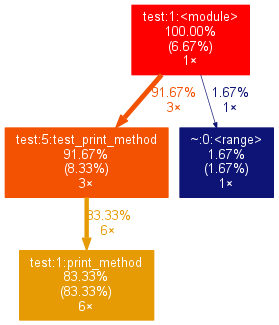
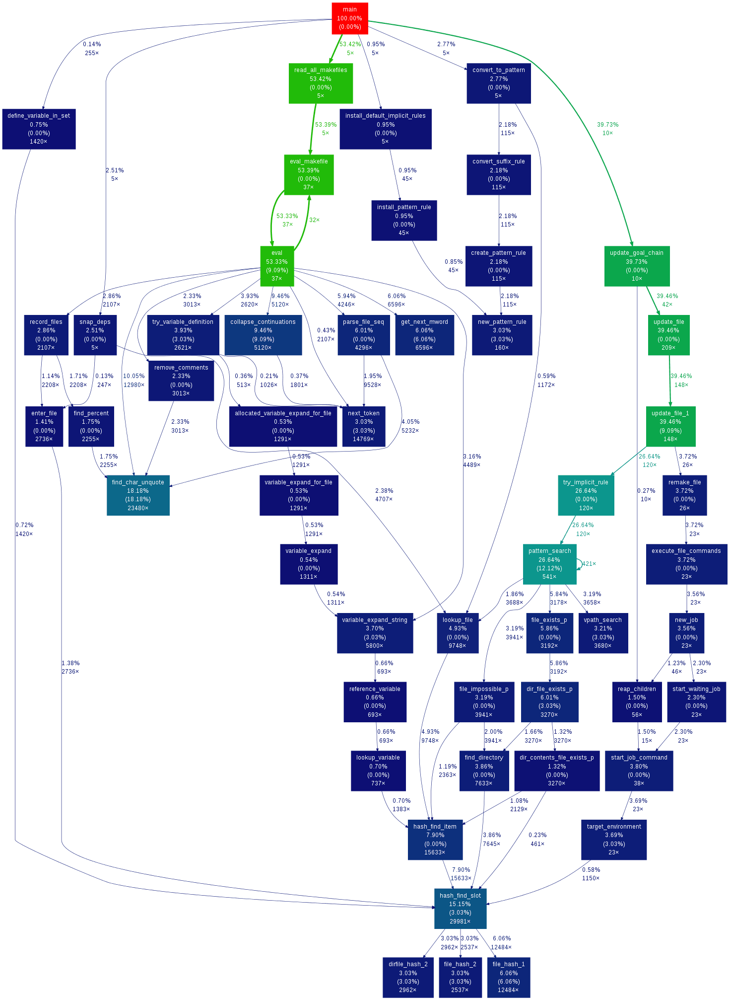
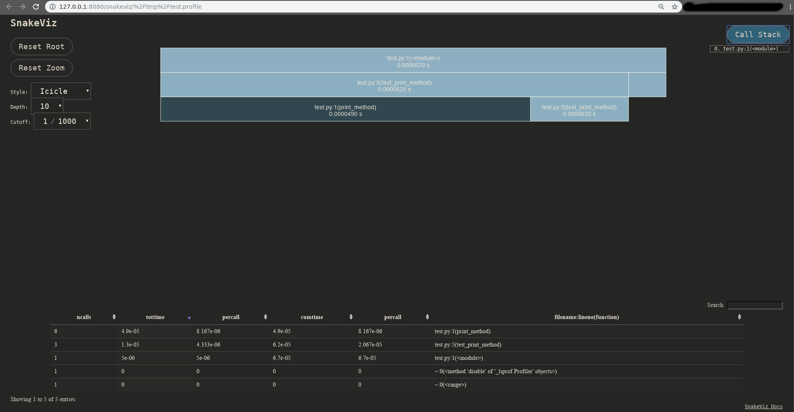
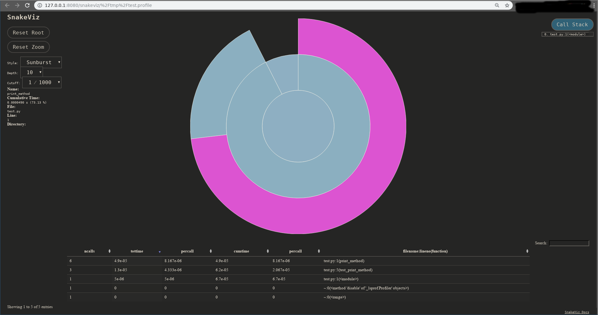
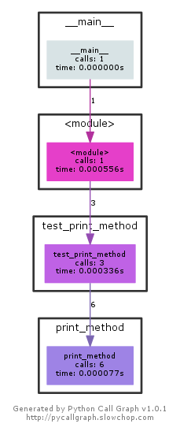

_Original post_: [on medium](https://medium.com/@narenandu/profiling-and-visualization-tools-in-python-89a46f578989)
_Also posted_: [on dev.to](https://dev.to/narenandu/profiling-and-visualization-tools-in-python-376h)

## What in my python code is taking time ?

Sounds like a familiar question asked!

Well, I have that question pop up quite often, especially when dealing with legacy code bases and unfamiliar code. This is my effort in helping shed light on exploring an answer to the question

---

### Setup

Consider the following simple piece of code in a file called `test.py`

```python
def print_method():
    print("hello world")

def test_print_method():
    for i in xrange(2):
        print_method()

for i in range(3):
    test_print_method()
```

When you execute the code using `python` executable, following output of `hello world` is printed 6 times

```bash
$ python test.py
hello world
hello world
hello world
hello world
hello world
hello world
```

---

### Probing Parameters

Let’s look in to different tools which we could use to determine

-   Code path
-   Number of calls and
-   Which method took the most time !

_Disclaimer_

> This blog has been created after executing the commands on a Linux distro. If on a different platform, I assume one knows how to get to the required (or similar) software packages

---

### Basis for profiling

We basically rely on `profile` module, more specifically `cProfile` module to generate the data needed for different visualization tools. (https://docs.python.org/2/library/profile.html#module-profile)
Easiest way to run `cProfile` on a python code is to run it as a module with `python` executable by passing the actual script as an argument to `cProfile`

_Example_

```bash
python -m cProfile test.py
```

Along with the expected output of `hello world` lines ,we see additional information about the time it took to execute each method.

```bash
$ python -m cProfile test.py
hello world
hello world
hello world
hello world
hello world
hello world
         12 function calls in 0.000 seconds
Ordered by: standard name
ncalls  tottime  percall  cumtime  percall filename:lineno(function)
        1    0.000    0.000    0.000    0.000 test.py:1(<module>)
        6    0.000    0.000    0.000    0.000 test.py:1(print_method)
        3    0.000    0.000    0.000    0.000 test.py:5(test_print_method)
        1    0.000    0.000    0.000    0.000 {method 'disable' of '_lsprof.Profiler' objects}
        1    0.000    0.000    0.000    0.000 {range}
```

Output might not be super digestible instantly at the first glance. Lets dive into different visualization tools available which can make the timing information more perceivable.

> A picture is worth a thousand words

---

### [gprof2dot](https://github.com/jrfonseca/gprof2dot)

My favorite one among all the available tools is [gprof2dot](https://github.com/jrfonseca/gprof2dot)https://github.com/jrfonseca/gprof2dot

#### Install `gprof2dot`

```bash
pip install gprof2dot --user
```

#### Generate .pstats file

Execute the `test.py` script this time with the timing information being directed to an external output file, rather than standard console output. Observe the `-o` flag with the output filename being `test.pstats`

```bash
python -m cProfile -o test.pstats test.py
```

#### Visualize profiling information

Assuming you have `dot` and `eog` installed, run the following command in the terminal where the profiling output file `test.pstats` is located

```bash
gprof2dot -f pstats test.pstats | dot -Tpng -o output.png && eog output.png
```

Bingo, you get a window which shows something like the following

_gprof2dot output_


#### Analysis

Above graph shows you that `91.67%` was spent in `test_print_method` and the same method was called 3 times (`3x`) , which in turn calls `print_method` (overall _6_ times).

Other method calls like `range` is a tiny amount of total execution time, but it is also visible in the graph

This was a simple python code. This method works equally well with complex code. Pasting a sample image from gprof2dot’s [github repo](https://github.com/jrfonseca/gprof2dot/blob/master/sample.png)

_gprof2dot sample output_


---

### [SnakeViz](https://jiffyclub.github.io/snakeviz/#snakeviz)

[SnakeViz](https://jiffyclub.github.io/snakeviz/#snakeviz) is a browser based visualization tool. It needs the output in a `.profile` format, rather than `.pstats` when the profiling output is generated using `cProfile` module

#### Install `snakeviz`

```bash
pip install snakeviz --user
```

#### Generate .profile file

Execute the `test.py` script this time with the timing information being redirected using `-o` flag to output file named `test.profile`

```bash
python -m cProfile -o test.profile test.py
```

#### Visualize profiling information

Run the following command in the terminal where the profiling output file `test.profile` is located

```bash
snakeviz test.profile
```

#### Analysis

There will be some information printed in the console when the command is run _and_ a new window which pops in a browser session

```bash
$ snakeviz test.profile
snakeviz web server started on 127.0.0.1:8080; enter Ctrl-C to exit
http://127.0.0.1:8080/snakeviz/%2Ftmp%2Ftest.profile
START /usr/bin/google-chrome-stable "http://127.0.0.1:8080/snakeviz/%2Ftmp%2Ftest.profile"
Opening in existing browser session.
WARNING:tornado.access:404 GET /images/sort_both.png (127.0.0.1) 1.04ms
WARNING:tornado.access:404 GET /images/sort_desc.png (127.0.0.1) 0.49ms
```

_Snakeviz icicle visulaization_


_Snakeviz suburst visulaization_


---

### [PyCallGraph](http://pycallgraph.slowchop.com/en/master/)

> This seems to be an abandoned project, but hey ! still works.

#### Install `pycallgraph`

```bash
pip install pycallgraph --user
```

#### Generate png visualization file

Execute the script using `pycallgraph` executable, rather than going via python executable.

_Disclaimer_

> [The following examples specify graphviz as the outputter, so it’s required to be installed](http://pycallgraph.slowchop.com/en/master/)

```bash
pycallgraph graphviz -- ./test.py
```

#### Visualize profiling information

Above command generates a `pycallgraph.png` image. Open the image using any image viewer. Using `eog` as an example on my host

```bash
$ eog pycallgraph.png
```

_pycallgraph png_


Shows the timing and number of calls information.

---

### Conclusion

I still believe [gprof2dot](https://github.com/jrfonseca/gprof2dot) does a better job at giving `%` and eye tracks naturally the flow in the graph much easier than other visualization methods.
