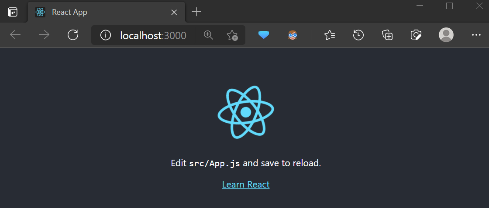
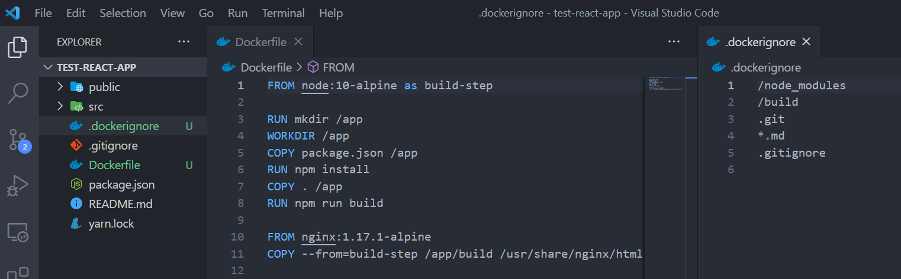
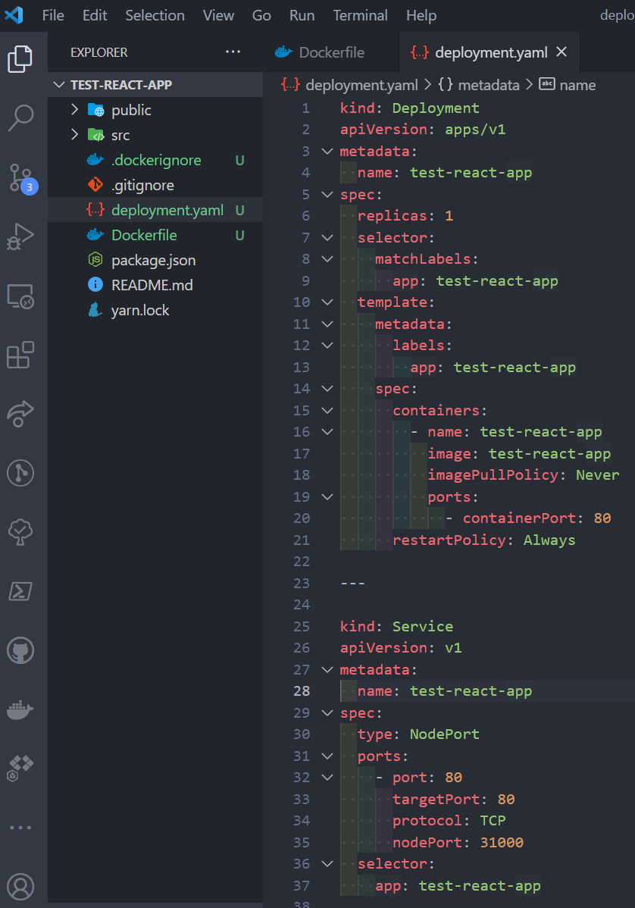
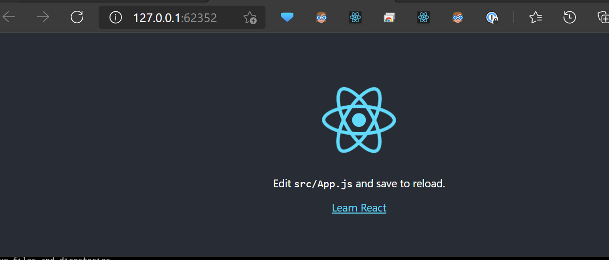
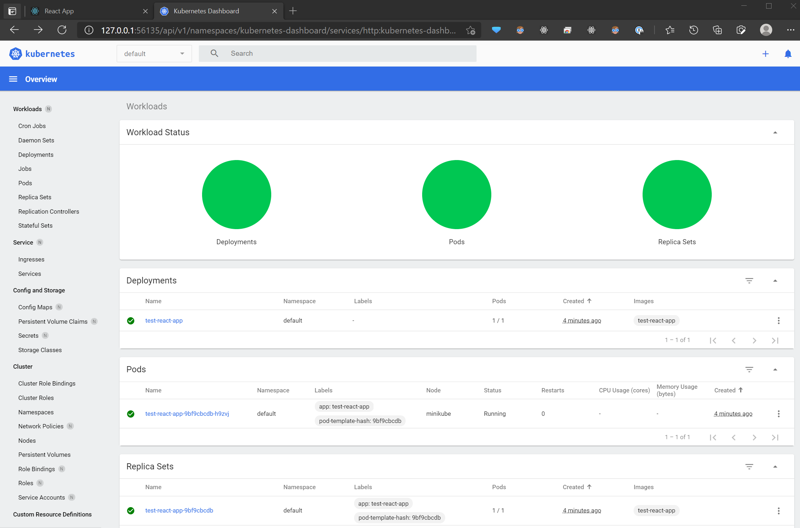

#### Prerequisites

-   [Docker Desktop](https://desktop.docker.com/win/stable/Docker%20Desktop%20Installer.exe)
-   [WSL2 backend](https://docs.docker.com/docker-for-windows/wsl/#develop-with-docker-and-wsl-2)

Won't be covering the installation process of [Docker Desktop](https://desktop.docker.com/win/stable/Docker%20Desktop%20Installer.exe) and enabling the [WSL2 backend](https://docs.docker.com/docker-for-windows/wsl/#develop-with-docker-and-wsl-2) here in this blog. Assumption is that readers can figure out the process from the given resources on their own. I might cover those topics in detail if there is enough demand in future blogs.

Make sure you are running `Linux Containers Backend` in Docker Desktop after installing it.

#### minikube start

[minikube](https://minikube.sigs.k8s.io/docs/) setups up a local kubernetes cluster for development on local host (in this case windows).

Since we will be using a local docker image and bypassing the need to push to a docker registry and then specifying the same during deployment on kubernetes, `--insecure-registry=10.0.0.0/24` is used.

Why `10.0.0.0/24`? Checkout

-   [CIDR notation and subnets](https://www.freecodecamp.org/news/production-fullstack-react-express/)
-   [Minikube enabling insecure registries](https://minikube.sigs.k8s.io/docs/handbook/registry/#enabling-insecure-registries)

Run the following command to start the local kubernetes cluster in a powershell (preferably admin powershell)

```
minikube start --insecure-registry="10.0.0.0/24"
```

Sample Output

```
❯ minikube start --insecure-registry="10.0.0.0/24"

* minikube v1.18.1 on Microsoft Windows 10 Pro 10.0.21332 Build 21332
* Using the docker driver based on existing profile
* Starting control plane node minikube in cluster minikube
* Restarting existing docker container for "minikube" ...
* Preparing Kubernetes v1.20.2 on Docker 20.10.3 ...
* Verifying Kubernetes components...
  - Using image kubernetesui/dashboard:v2.1.0
  - Using image kubernetesui/metrics-scraper:v1.0.4
  - Using image gcr.io/k8s-minikube/storage-provisioner:v4
* Enabled addons: storage-provisioner, dashboard, default-storageclass
* Done! kubectl is now configured to use "minikube" cluster and "default" namespace by default
```

#### Create React app

Make sure that `node` and `npm` are installed in the windows environment

```
❯ node -v
v15.11.0

❯ npm -v
7.6.3
```

Then use `npx create-react-app test-react-app` to create a test react application

```
❯ npx create-react-app test-react-app
Need to install the following packages:
  create-react-app
Ok to proceed? (y) y

Creating a new React app in D:\work\test-react-app.

Installing packages. This might take a couple of minutes.
Installing react, react-dom, and react-scripts with cra-template...

yarn add v1.22.4
[1/4] Resolving packages...
[2/4] Fetching packages...
```

**Finally check to see that app is running as expected**


#### Configure minikube docker local environment

Run the following commadn to set hte local configuration for making the development iteration easier by using the local docker images.

**NOTE**
This stays local to your powershell terminal in which we run the following command

```
& minikube -p minikube docker-env | Invoke-Expression
```

For anyone curious, Run `minikube docker-env` to see the actual commands that are getting run

```
❯ minikube docker-env
$Env:DOCKER_TLS_VERIFY = "1"
$Env:DOCKER_HOST = "tcp://127.0.0.1:52175"
$Env:DOCKER_CERT_PATH = "C:\Users\Naren\.minikube\certs"
$Env:MINIKUBE_ACTIVE_DOCKERD = "minikube"
# To point your shell to minikube's docker-daemon, run:
# & minikube -p minikube docker-env | Invoke-Expression
```

#### Dockerize the react application

Simplest way to create a docker image of a react app is to add the following files to the root of the application folder (repository in case of git)



_Dockerfile_

```
FROM node:10-alpine as build-step

RUN mkdir /app
WORKDIR /app
COPY package.json /app
RUN npm install
COPY . /app
RUN npm run build

FROM nginx:1.17.1-alpine
COPY --from=build-step /app/build /usr/share/nginx/html
```

_.dockerignore_

```
/node_modules
/build
.git
*.md
.gitignore
```

##### Docker Build the image

```
docker build -t test-react-app .
```

##### Check for the built image

```
❯ docker images test-react-app
REPOSITORY       TAG       IMAGE ID       CREATED              SIZE
test-react-app   latest    e81a494ead2b   About a minute ago   21.1MB
```

#### Kubernetes deployment

A `deployment` and `service` resources are required for deploying the react app on to the kubernetes cluster. We can combine both specifications in to single `yaml` file by separating them with `---`

-   Observe the imagePullPolicy attribute marked as Never indicating that don’t look at docker registry for pulling the image called pd-dashboard

-   Also we will be using the simplest service called NodePort to map the node’s port in k8s cluster to applications port



_deployment.yaml_

```
kind: Deployment
apiVersion: apps/v1
metadata:
  name: test-react-app
spec:
  replicas: 1
  selector:
    matchLabels:
      app: test-react-app
  template:
    metadata:
      labels:
        app: test-react-app
    spec:
      containers:
        - name: test-react-app
          image: test-react-app
          imagePullPolicy: Never
          ports:
            - containerPort: 80
      restartPolicy: Always

---

kind: Service
apiVersion: v1
metadata:
  name: test-react-app
spec:
  type: NodePort
  ports:
    - port: 80
      targetPort: 80
      protocol: TCP
      nodePort: 32000
  selector:
    app: test-react-app

```

##### Deploy

We use `kubectl apply -f <yaml>` to deploy both the _deployment_ and _service_

```
kubectl apply -f .\deployment.yaml
```

Sample Output

```
❯ kubectl apply -f .\deployment.yaml
deployment.apps/pd-dashboard created
service/pd-dashboard created
```

##### Check the pods running

Verify that there are pods running using `kubectl get pods`

```
❯ kubectl get pods
NAME                             READY   STATUS    RESTARTS   AGE
test-react-app-9bf9cbcdb-h9zvj   1/1     Running   0          12s
```

#### Access the react app

##### Finding the Service URL

We use `minikube` to find out the service URL for the deployed react application

```
minikube service test-react-app --url
```

Sample Output

```
❯ minikube service test-react-app --url
🏃  Starting tunnel for service test-react-app.
|-----------|----------------|-------------|------------------------|
| NAMESPACE |      NAME      | TARGET PORT |          URL           |
|-----------|----------------|-------------|------------------------|
| default   | test-react-app |             | http://127.0.0.1:62352 |
|-----------|----------------|-------------|------------------------|
http://127.0.0.1:62352
❗  Because you are using a Docker driver on windows, the terminal needs to be open to run it.
```

##### Open the app in Browser



---

#### Local Kubernetes Dashboard

All the while we can see the effects of running any `kubectl` commands in the kubernetes local dashboard

```
minikube dashboard
```

Sample Output

```
❯ minikube dashboard
🔌  Enabling dashboard ...
    ▪ Using image kubernetesui/dashboard:v2.1.0
    ▪ Using image kubernetesui/metrics-scraper:v1.0.4
🤔  Verifying dashboard health ...
🚀  Launching proxy ...
🤔  Verifying proxy health ...
🎉  Opening http://127.0.0.1:56135/api/v1/namespaces/kubernetes-dashboard/services/http:kubernetes-dashboard:/proxy/ in your default browser...
```

will open the dashboard in a new tab


---

#### Cleanup

Cleanup the `deployment` and `service` using the following command

```
kubectl delete -f .\deployment.yaml
```

Close down `minikube` (local k8s cluster) and delete

```
minikube stop
minikube delete
```
