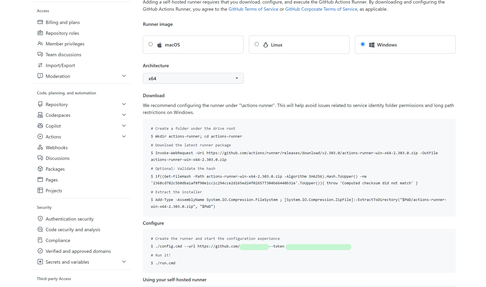

## Adding a Windows Self hosted Github Runner

Replace `<<ORG_NAME>>` in the following URL and paste it in the browser
```
https://github.com/organizations/<<ORG_NAME>>/settings/actions/runners/new
```
You Need to sign in to Github org account.




## Downloading the Github Actions Runner on Windows and Extract it

Note that the suggested location for downloading the github runner on Windows is the Root Drive `C:`
```
# Create folders
New-Item -Path "C:\actions-runner" -ItemType Directory
Set-Location "C:\actions-runner"

# Download the zip file
Invoke-WebRequest -Uri https://github.com/actions/runner/releases/download/v2.303.0/actions-runner-win-x64-2.303.0.zip -OutFile actions-runner-win-x64-2.303.0.zip

# Check hash
if((Get-FileHash -Path actions-runner-win-x64-2.303.0.zip -Algorithm SHA256).Hash.ToUpper() -ne '2368cd782c5b0dba1af8f90e1cc1c294cce2d165ed24f026577304b66440b31e'.ToUpper()){ throw 'Computed checksum did not match' }

# Extract the zip file
Add-Type -AssemblyName System.IO.Compression.FileSystem ; [System.IO.Compression.ZipFile]::ExtractToDirectory("$PWD/actions-runner-win-x64-2.303.0.zip", "$PWD")
```

## Registering the Host as Self hosted github runner

### Pre-requisite
Generate the `<<TOKEN>>` using Github REST API and replace it in the command shown below

Checkout https://www.narenvadapalli.com/blog/generating-token-for-github-runner-registration/ for a way to use Github's REST API to generate the token

Otherway would be to pick it up from the webpage as explained the first section under **`Configure`** section after the `--token` argument to `config.cmd`


### Single Command

Following is a single command that will

- Register as self-hosted github runner
- Actions runner, running as a Windows Service => Automatically starts on reboots

You can run the following command with appropriate values replaced for the host to automatically
```
C:/actions-runner/config.cmd --url https://github.com/<<ORG_NAME>> --token <<TOKEN>> --unattended --runasservice --runnergroup <<RUNNER_GROUP>> --labels '<<COMMA_SEPARATED_ADDITIONAL_LABELS>>'' --windowslogonaccount <<WINDOWS_LOGIN_USERNAME>> --windowslogonpassword <<WINDOWS_LOGIN_PWD>> --work _work
```
