Following are the Media and Entertainment projects in which I was credited for my work

## [IMDB Profile](https://www.imdb.com/name/nm4511578)

#### Feature Films

[row][col]
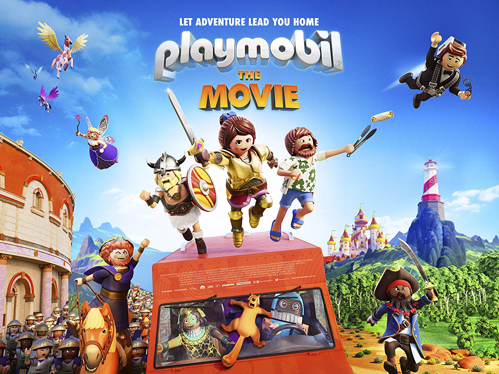

Playmobil The Movie, ON Animation Studios

[/col][col]

[/col][/row]

[row][col]
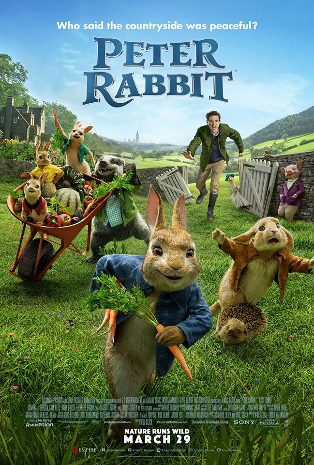

Peter Rabbit, Animal Logic Studios

[/col][col]
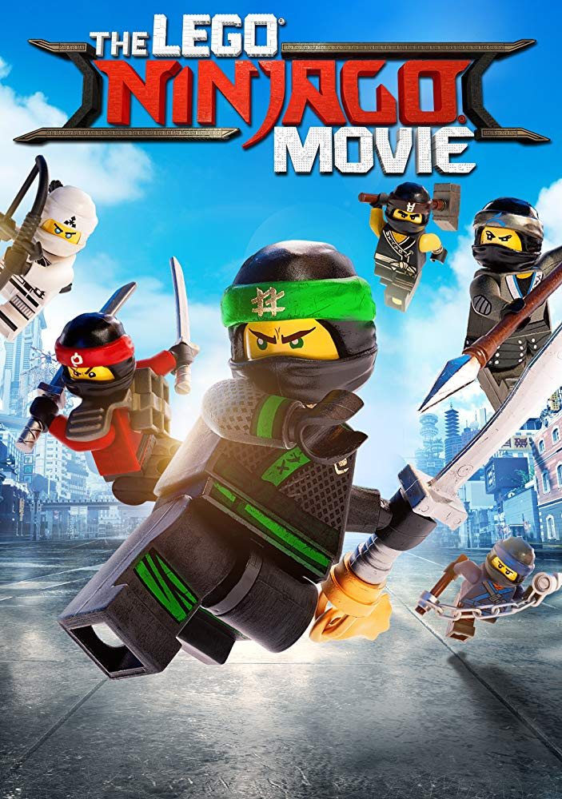

Lego Ninjago, Animal Logic Studios

[/col][col]
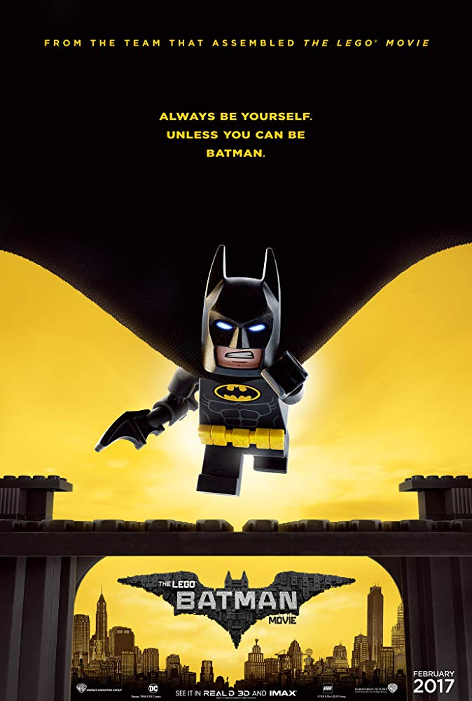

Lego Batman, Animal Logic Studios

[/col][/row]

[row][col]
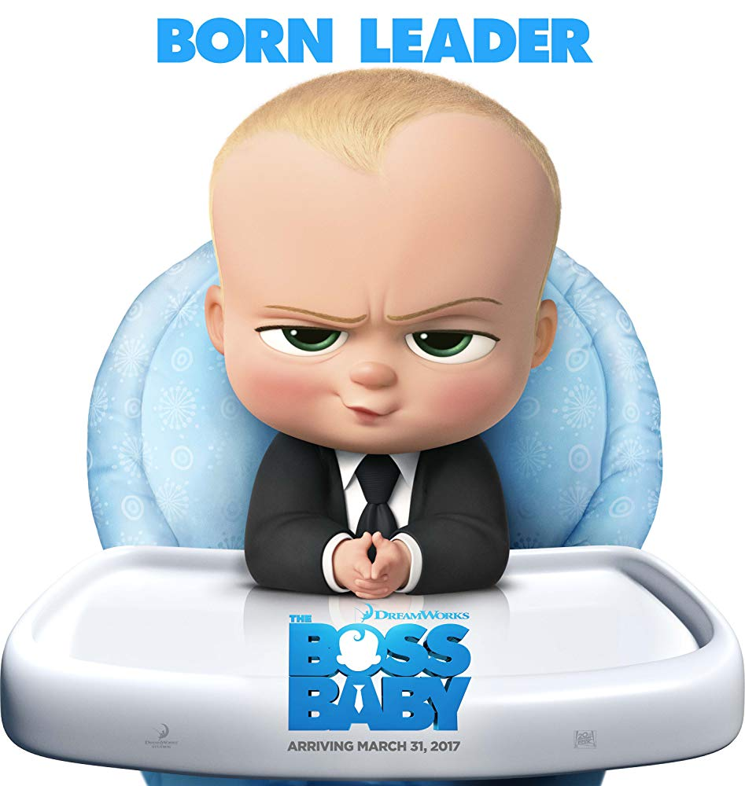

Boss Baby, DreamWorks Animations

[/col][col]

Kung Fu Panda 3, DreamWorks Animations

[/col][col]
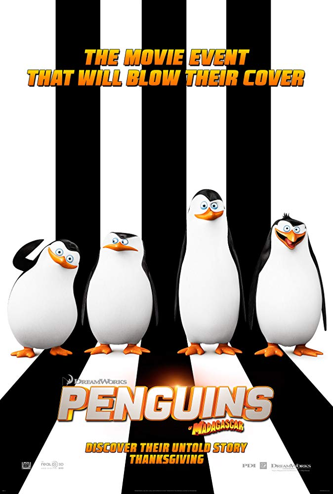

Penguins of Madagascar, DreamWorks Animations

[/col][col]
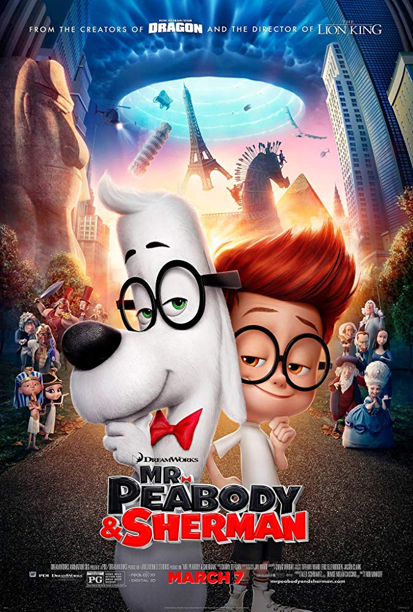

Mr Peabody & Sherman, DreamWorks Animations

[/col][/row]

---

#### Animated Shorts

[row][col]
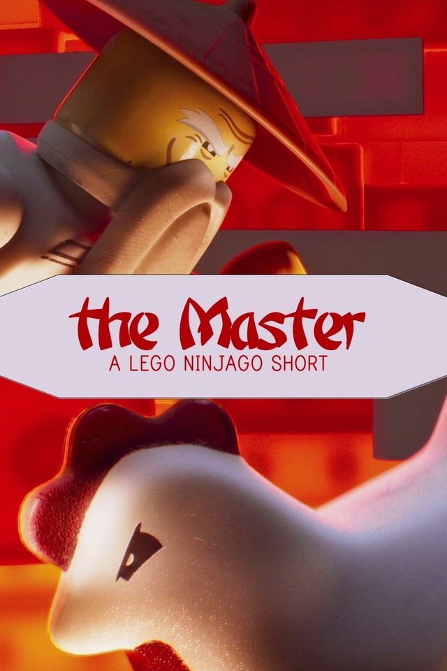

The Master (short), Animal Logic Studios

[/col][col]
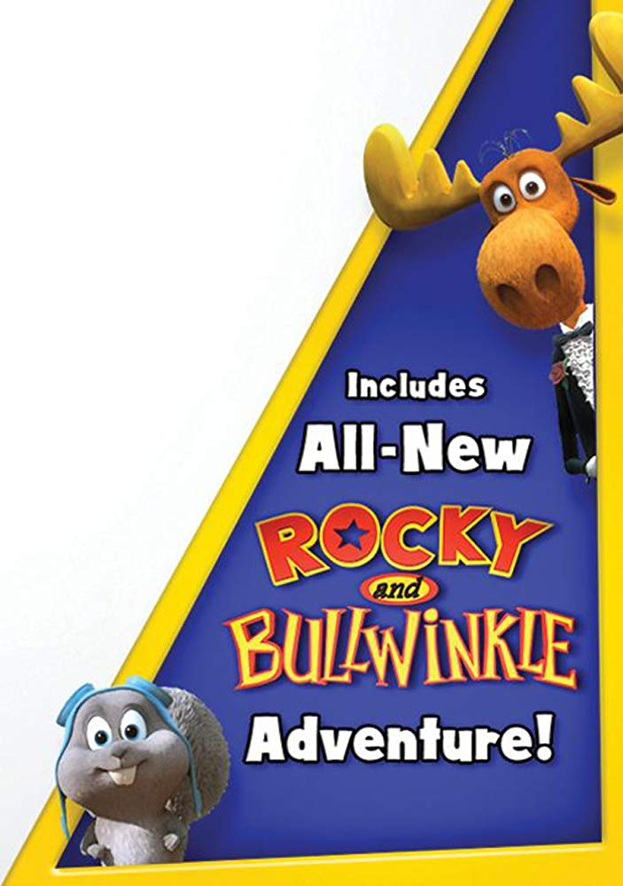

Rocky & Bullwinkle Short, DreamWorks Animations

[/col][col]

[/col][col]

[/col][/row]

---

#### Episodic Content

[row][col]
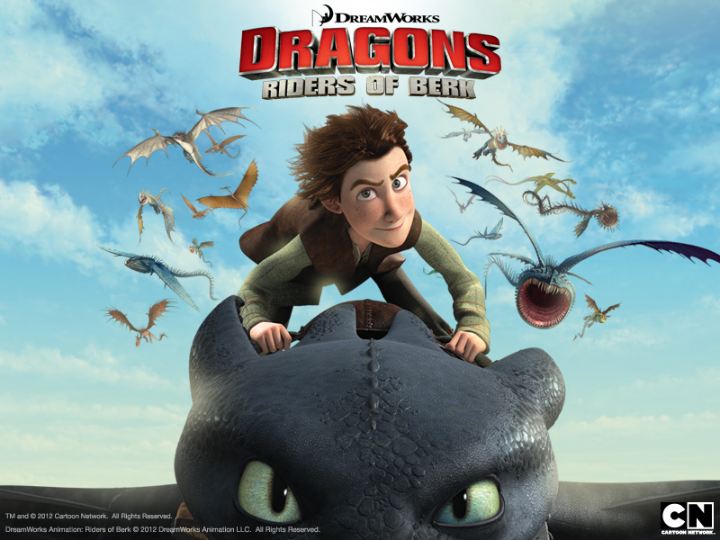

Dragons - Riders of Berk, DreamWorks Animations

[/col][col]

[/col][/row]

---

#### Uncredited

[row][col]
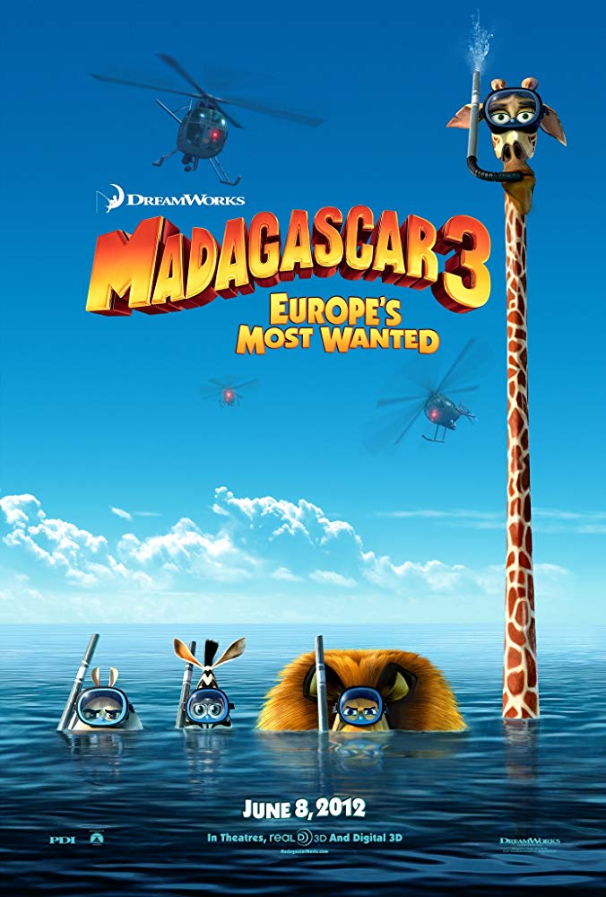

Madagascar 3, DreamWorks Animations
_because of the time spent on the project was too short_

[/col][col]

[/col][col]

[/col][/row]
